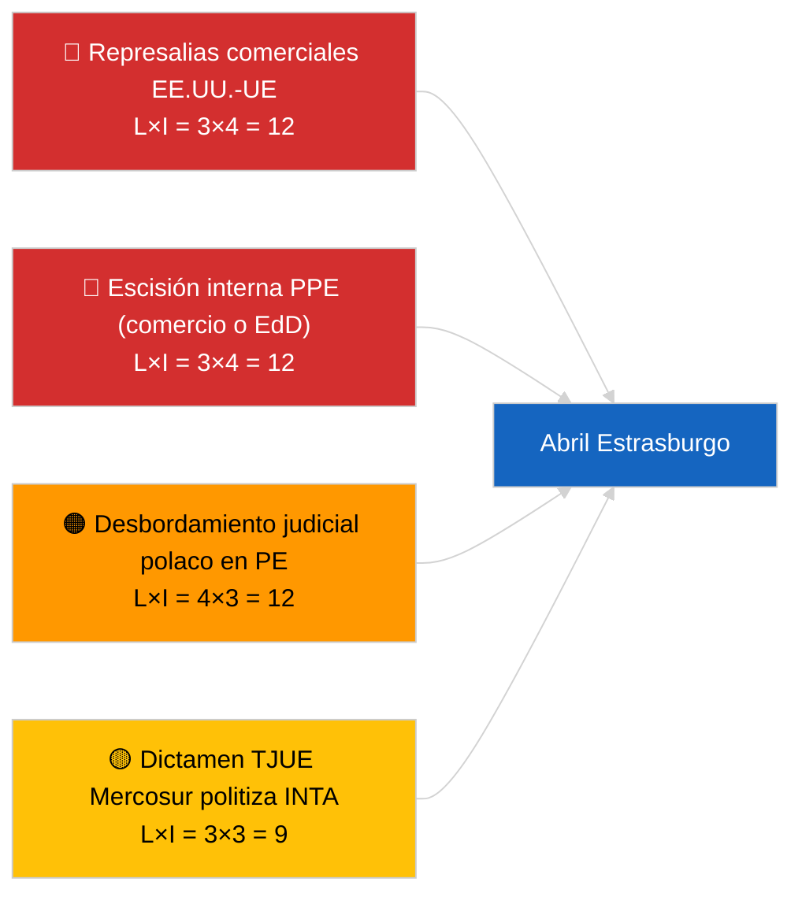

<!-- SPDX-FileCopyrightText: 2026 Hack23 AB -->
<!-- SPDX-License-Identifier: Apache-2.0 -->

# Executive Brief — Mes Próximo | 2026-04-01

**Clasificación:** OSINT | Registro parlamentario público
**Nivel de confianza:** 🟡 Medio (prospectivo; la salida de clasificación vacía limita la profundidad)
**Generado:** 2026-04-01T00:00:00Z (nota retrospectiva)
**Tipo de artículo:** Mes Próximo
**ID de ejecución:** `7f928e7c-85fd-4f76-890b-f362622c3f42`
**Fuente:** Portal de datos abiertos del Parlamento Europeo

---

## 🎯 BLUF

**Las perspectivas de abril de 2026 están ancladas en el pleno de Estrasburgo del 27 al 30 de abril y la semana preparatoria de comisiones del 13 al 17 de abril.** La ejecución del pronóstico mensual devolvió **0 actores clasificados** y puntuaciones de dimensiones **RUTINARIAS**, reflejando el primer día del Parlamento Europeo tras el receso de marzo en lugar de un pronóstico sustancial de escenarios para abril. Prioridades trasladadas a abril: ajuste del arancel aduanero de EE.UU. (TA-10-2026-0096), dictamen del TJUE sobre UE-Mercosur (pendiente), transposición de créditos de emisión HDV (TA-10-2026-0084), implementación relativa a presos políticos georgianos (TA-10-2026-0083) y repercusiones jurídicas polacas en curso del precedente de inmunidad Braun (TA-10-2026-0088). Tres escenarios de trabajo: **Escenario A — agenda con peso comercial (55%)**, **Escenario B — enfoque en el Estado de derecho (25%)**, **Escenario C — enfoque económico/industrial (20%)**. **🟡 Confianza MEDIA** — agenda de abril aún no publicada.

---

## 🧭 3 Decisiones que este informe respalda

| # | Decisión | Quién decide | Plazo | Evidencia |
|:-:|----------|------------|:-----:|-----------|
| 1 | **Editorial:** publicar como pronóstico mensual basado en escenarios con la advertencia explícita de «agenda pendiente» | Editor | +24h | Inventario trasladado; tres escenarios |
| 2 | **Seguimiento:** ciclo de inteligencia previo al pleno 13-17 de abril (semana de comisiones) | Analista | 2026-04-13 | Primeras señales sustanciales de abril |
| 3 | **Seguimiento prospectivo:** volver a ejecutar el pronóstico mensual T-7 antes del pleno (~20 de abril) con la agenda publicada | Responsable de análisis | 2026-04-20 | Confirmar la selección del escenario |

---

## 📰 Lectura de 60 Segundos

- 🔴 **No hay nuevos procedimientos ni puntos de agenda específicos de abril en el feed de hoy** — la agenda de Estrasburgo se publica típicamente T-7 días. (🟢 Alta)
- 🟠 **Tres escenarios de trabajo** para el pleno de abril, dominados por la variante con peso comercial (55%): ajuste arancelario de EE.UU., dictamen Mercosur, soberanía digital. (🟡 Media)
- 🟢 **Pista del Estado de derecho trasladada:** repercusiones del precedente Braun, implementación en Georgia, potenciales procedimientos de inmunidad adicionales (impulsados por LIBE). (🟡 Media)
- 🟡 **Variante económica/industrial:** seguimiento del informe anual del BCE (TA-10-2026-0034), resistencia de los Estados miembros a la transposición HDV. (🟡 Media)
- 🔵 **Contexto económico:** la ventana de publicación del IMF WEO de abril coincide con el pleno — las previsiones de estrés fiscal pueden colorear el debate temprano sobre el MFP. (🟢 Alta — alineación de calendarios)
- 🟣 **Referencia cruzada:** la ejecución hermana 2026-04-01/breaking documenta el patrón 6/8 de 404 en el feed consultivo que impidió que esta ejecución de pronóstico mensual produjera una nueva clasificación de actores. (🟢 Alta)
- 🩷 **Vector de perturbación:** abuso del grupo dominante (PPE 38%) marcado como ALTO por el sistema de alerta temprana — el vector más probable para una sorpresa en abril es una escisión interna del PPE sobre comercio o Estado de derecho. (🟡 Media)
- ⚪ **Traslado:** el informe «Mejor legislación» TA-10-2026-0063 establece la línea de base para el debate sobre reforma institucional para el resto de EP10.

---

## 🗂️ Principales Documentos / Procedimientos — Lista de vigilancia de abril

| Rango | Referencia PE | Título (corto) | Importancia | Confianza | Estado |
|:-----:|---------------|----------------|:-----------:|:---------:|--------|
| 1 | TA-10-2026-0096 | Ajuste del arancel aduanero de EE.UU. | 7,5 | 🟢 ALTA | Adoptado el 26 de marzo; seguimiento en abril esperado |
| 2 | TA-10-2026-0008 | Remisión UE-Mercosur al TJUE (dictamen pendiente) | 7,0 | 🟡 MEDIA | Dictamen judicial esperado antes del pleno de abril |
| 3 | TA-10-2026-0083 | Presos políticos georgianos | 6,5 | 🟢 ALTA | Informe de implementación vence |
| 4 | TA-10-2026-0088 | Inmunidad Braun (precedente para casos posteriores) | 6,5 | 🟢 ALTA | Seguimiento de vigilancia LIBE |
| 5 | TA-10-2026-0084 | Créditos de emisión HDV 2025–2029 | 6,0 | 🟢 ALTA | Transposición nacional |

---

## ⚠️ Panorama de Riesgos y Amenazas — Perspectiva de abril

| Riesgo | L | I | Puntos | Desencadenante | Fuente | Almirante |
|--------|:-:|:-:|:------:|---------------|--------|:---------:|
| Represalias comerciales EE.UU.-UE | 3 | 4 | 12 | Contraanuncio de EE.UU. | TA-10-2026-0096 | A1 |
| Escisión interna PPE | 3 | 4 | 12 | División visible en la votación | Aritmética de coalición | A2 |
| Desbordamiento judicial polaco en PE | 4 | 3 | 12 | Nuevo caso de inmunidad | TA-10-2026-0088 | A1 |
| Politización del dictamen Mercosur | 3 | 3 | 9 | Tribunal publica antes del pleno | TA-10-2026-0008 | A2 |
| Clasificación vacía del pronóstico mensual | 3 | 2 | 6 | Re-ejecución también vacía 2026-04-20 | Esta ejecución | B3 |

---

## 🔮 Principal Detonante Prospectivo

**Publicación de la agenda de Estrasburgo ~20 de abril de 2026 (T-7).** La composición de la agenda resolverá la incertidumbre de los tres escenarios: la ponderación con peso comercial (Escenario A) confirma la narrativa dominante trasladada; la ponderación del Estado de derecho (Escenario B) señala el impulso de LIBE desde el precedente Braun; la ponderación económica/industrial (Escenario C) eleva los archivos de ECON y ENVI.

---

## 🛡️ Evaluación de la Calidad de las Fuentes

- **Fuentes primarias:** Portal de datos abiertos del Parlamento Europeo — ejecución de análisis `7f928e7c-85fd-4f76-890b-f362622c3f42`; inventario de textos adoptados de marzo 2026 (trasladado).
- **Limitaciones de datos:** La ejecución de hoy produjo 0 actores y significación RUTINARIA; la inferencia prospectiva está anclada en artículos del día anterior y el calendario del PE, no en modelización de escenarios regenerada.
- **Confianza en las probabilidades de escenarios:** 🟡 Media (ponderación cualitativa).
- **Confianza en la lista de prioridades trasladada:** 🟢 Alta.

---

## 📎 Enlaces

| Enlace | Ruta |
|--------|------|
| Artículo | `./article.md` |
| Clasificación (vacío) | `./classification/` |
| Ejecuciones hermanas | `analysis/daily/2026-04-01/breaking/`, `committee-reports/`, `motions/`, `propositions/` |
| Fuente — inventario legislativo de marzo | `analysis/daily/2026-03-10/` → `2026-03-26/` |
| Manifiesto | `./manifest.json` |

---

## 🔄 Referencia Cruzada

**Ejecuciones anteriores:** Estrasburgo 9–12 de marzo y la mini-sesión plenaria de Bruselas 25–26 de marzo proporcionan la base trasladada sustancial utilizada por este pronóstico mensual.

**Verificación posterior:** Comparar con la revisión mensual posterior al pleno de abril (esperada a principios de mayo de 2026) para calificar la precisión del pronóstico de escenarios.

---

**Control del documento**
- **Plantilla:** `/analysis/templates/executive-brief.md`
- **Ruta de artefacto:** `analysis/daily/2026-04-01/month-ahead/executive-brief.md`
- **Clasificación:** Público
- **Generación retrospectiva:** Sesión de relleno.
