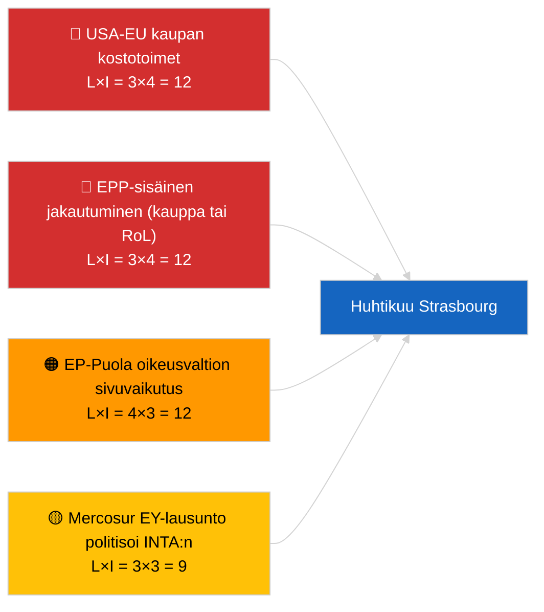

<!-- SPDX-FileCopyrightText: 2026 Hack23 AB -->
<!-- SPDX-License-Identifier: Apache-2.0 -->

# Executive Brief — Tuleva Kuukausi | 2026-04-01

**Luokittelu:** OSINT | Julkinen parlamentaarinen asiakirja
**Luottamustaso:** 🟡 Keskitaso (tulevaisuuteen suuntautuva; tyhjä luokittelutuloste rajoittaa syvyyttä)
**Luotu:** 2026-04-01T00:00:00Z (retrospektiivinen tiivis yhteenveto)
**Artikkelityyppi:** Tuleva Kuukausi
**Ajon ID:** `7f928e7c-85fd-4f76-890b-f362622c3f42`
**Lähde:** Euroopan parlamentin avoin dataportti

---

## 🎯 BLUF

**Huhtikuun 2026 näkymät perustuvat Strasbourgin täysistuntoon 27.–30. huhtikuuta ja valmistavaan valiokuntaviikkoon 13.–17. huhtikuuta.** Kuukauden eteenpäin -ajo palautti **0 luokiteltua toimijaa** ja **RUTIINITASON** ulottuvuuspisteytykset, mikä heijastaa Euroopan parlamentin ensimmäistä päivää maaliskuun tauon jälkeen eikä tarjoa merkittävää huhtikuun skenaarioennustetta. Huhtikuulle siirtyvät prioriteetit: Yhdysvaltojen tullitariffin sopeuttaminen (TA-10-2026-0096), EU–Mercosur EY-tuomioistuimen lausunto (odottaa), HDV-päästökredittien täytäntöönpano (TA-10-2026-0084), Georgian poliittisten vankien täytäntöönpano (TA-10-2026-0083) ja Braun-immuniteettipresedenttiin liittyvät Puola-oikeudelliset jälkivaikutukset (TA-10-2026-0088). Kolme työskentelyskenaariota: **Skenaario A — kauppapainotteinen ohjelma (55%)**, **Skenaario B — oikeusvaltiofokus (25%)**, **Skenaario C — taloudellinen/teollinen fokus (20%)**. **🟡 KESKITASON luottamus** — huhtikuun ohjelma ei vielä julkaistu.

---

## 🧭 3 Päätöstä, joita tämä tiiviistelmä tukee

| # | Päätös | Kuka päättää | Määräaika | Näyttö |
|:-:|--------|-------------|:---------:|--------|
| 1 | **Toimituksellinen:** julkaise skenaariovetoinen kuukauden eteenpäin -katsaus, jossa on nimenomainen "ohjelma odottaa"-varauma | Päätoimittaja | +24h | Siirtyvä inventaari; kolme skenaariota |
| 2 | **Seuranta:** täysistuntoa edeltävä tiedustelusykli 13.–17. huhtikuuta (valiokuntaviikko) | Analyytikko | 2026-04-13 | Ensimmäiset merkittävät huhtikuun signaalit |
| 3 | **Eteenpäin katsova seuranta:** aja kuukauden eteenpäin uudelleen T-7 täysistuntoon (~20. huhtikuuta) julkaistun ohjelman kanssa | Analyysipäällikkö | 2026-04-20 | Vahvista skenaarion valinta |

---

## 📰 60 Sekunnin Katsaus

- 🔴 **Ei uusia huhtikuuspesifisiä menettelyjä tai esityslistapisteitä tämän päivän syötteessä** — Strasbourgin ohjelma julkaistaan tyypillisesti T-7 päivää. (🟢 Korkea)
- 🟠 **Kolme työskentelyskenaariota** huhtikuun täysistunnolle, johon kauppapainotteinen variantti (55%) dominoi: Yhdysvaltojen tullisopeuttaminen, Mercosur-lausunto, digitaalinen suvereniteetti. (🟡 Keskitaso)
- 🟢 **Siirtyvä oikeusvaltiospori:** Braun-presedenttien jälkivaikutukset, Georgian täytäntöönpano, mahdolliset lisäimmuniteettimenettelyt (LIBE-vetoinen). (🟡 Keskitaso)
- 🟡 **Taloudellinen/teollinen variantti:** EKP:n vuosiraportin seuranta (TA-10-2026-0034), HDV-täytäntöönpanomuutosvastarinta jäsenvaltioilta. (🟡 Keskitaso)
- 🔵 **Taloudellinen konteksti:** IMF huhtikuun WEO-julkaisuikkuna osuu yhteen täysistunnon kanssa — julkisen talouden stressiennusteet voivat värittää varhaista MFF-keskustelua. (🟢 Korkea — kalenterijohdonmukaisuus)
- 🟣 **Ristiviite:** sisarajo 2026-04-01/breaking dokumentoi 6/8 404-virhemallin neuvontasyötteessä, joka esti tätä kuukauden eteenpäin -ajoa tuottamasta uutta toimijaluokittelua. (🟢 Korkea)
- 🩷 **Häiriövektori:** hallitsevan ryhmän ylivalta (PPE 38%) merkitty KORKEAKSI varhaisvaroitusjärjestelmässä — todennäköisin vektori huhtikuun yllätykselle on EPP-sisäinen jakautuminen kaupasta tai oikeusvaltiosta. (🟡 Keskitaso)
- ⚪ **Siirtäminen eteenpäin:** Parempi lainsäädäntö -raportti TA-10-2026-0063 asettaa institutionaalisen uudistuskeskustelun peruslinjat loppuun EP10.

---

## 🗂️ Tärkeimmät Asiakirjat / Menettelyt — Huhtikuun Seurantalista

| Sija | EP-viite | Otsikko (lyhyt) | Merkittävyys | Luottamustaso | Tila |
|:----:|----------|-----------------|:------------:|:-------------:|------|
| 1 | TA-10-2026-0096 | Yhdysvaltojen tullitariffin sopeuttaminen | 7,5 | 🟢 KORKEA | Hyväksytty 26. maaliskuuta; huhtikuun seuranta odotettavissa |
| 2 | TA-10-2026-0008 | EU–Mercosur EY-tuomioistuimen lähettäminen (odottaa lausuntoa) | 7,0 | 🟡 KESKITASO | Tuomioistuinlausunto odotettavissa ennen huhtikuun täysistuntoa |
| 3 | TA-10-2026-0083 | Georgian poliittiset vangit | 6,5 | 🟢 KORKEA | Täytäntöönpanoraportointi erääntyy |
| 4 | TA-10-2026-0088 | Braun-immuniteetti (ennakkotapaus myöhemmille asioille) | 6,5 | 🟢 KORKEA | LIBE-jatkoseuranta |
| 5 | TA-10-2026-0084 | HDV-päästökreditit 2025–2029 | 6,0 | 🟢 KORKEA | Kansallinen täytäntöönpano |

---

## ⚠️ Riski- ja Uhka-analyysi — Huhtikuun Näkymä

| Riski | L | I | Pisteet | Laukaisin | Lähde | Admiraliteetti |
|-------|:-:|:-:|:-------:|-----------|-------|:--------------:|
| USA-EU kaupan kostotoimet | 3 | 4 | 12 | Yhdysvaltojen vastainen ilmoitus | TA-10-2026-0096 | A1 |
| EPP-sisäinen jakautuminen | 3 | 4 | 12 | Näkyvä äänestysjako | Koalitioaritmetiikka | A2 |
| EP-Puola oikeusvaltion sivuvaikutus | 4 | 3 | 12 | Lisäimmuniteettitapaus | TA-10-2026-0088 | A1 |
| Mercosur-lausunnon politisoituminen | 3 | 3 | 9 | Tuomioistuin julkaisee ennen täysistuntoa | TA-10-2026-0008 | A2 |
| Tyhjä kuukauden eteenpäin -luokittelu | 3 | 2 | 6 | Uusinta myös tyhjä 2026-04-20 | Tämä ajo | B3 |

---

## 🔮 Tärkein Ennakoiva Laukaisin

**Strasbourgin ohjelmanjulkaisu ~20. huhtikuuta 2026 (T-7).** Ohjelman kokoonpano ratkaisee kolmen skenaarion epävarmuuden: kauppapainotteinen painotus (Skenaario A) vahvistaa hallitsevan siirtyvän narratiivin; oikeusvaltion painotus (Skenaario B) signaloi LIBE-momentumia Braun-presedenttistä; taloudellinen/teollinen painotus (Skenaario C) nostaa ECON- ja ENVI-tiedostoja.

---

## 🛡️ Lähteen Laadun Arviointi

- **Ensisijaiset lähteet:** Euroopan parlamentin avoin dataportti — analyysiajoajo `7f928e7c-85fd-4f76-890b-f362622c3f42`; maaliskuun 2026 hyväksyttyjen tekstien inventaario (siirretty).
- **Tietorajoitukset:** Tämän päivän ajo tuotti 0 toimijaa ja RUTIINITASON merkittävyyden; eteenpäin katsova päättely perustuu edellisen päivän artikkeleihin ja EP:n kalenteriin, ei uudelleen luotuun skenaariomallinnukseen.
- **Luottamus skenaarioprobabiiliteetteihin:** 🟡 Keskitaso (laadullinen painotus).
- **Luottamus siirrettyyn prioriteettilistaan:** 🟢 Korkea.

---

## 📎 Linkit

| Linkki | Polku |
|--------|-------|
| Artikkeli | `./article.md` |
| Luokittelu (tyhjä) | `./classification/` |
| Sisa-ajot | `analysis/daily/2026-04-01/breaking/`, `committee-reports/`, `motions/`, `propositions/` |
| Lähde — maaliskuun lainsäädäntöinventaario | `analysis/daily/2026-03-10/` → `2026-03-26/` |
| Manifesti | `./manifest.json` |

---

## 🔄 Ristiviite

**Aiemmat ajot:** Strasbourg 9.–12. maaliskuuta ja Bryssel mini-täysistunto 25.–26. maaliskuuta tarjoavat tämän kuukauden eteenpäin -katsauksen käyttämän merkittävän siirtyvän perustan.

**Myöhempi vahvistus:** Vertaa post-huhtikuun täysistunnon kuukausikatsaukseen (odotetaan toukokuun alussa 2026) arvioidaksesi skenaarion ennusteen tarkkuuden.

---

**Asiakirjavalvonta**
- **Malli:** `/analysis/templates/executive-brief.md`
- **Artefaktipolku:** `analysis/daily/2026-04-01/month-ahead/executive-brief.md`
- **Luokittelu:** Julkinen
- **Retrospektiivinen luominen:** Täyttö-sessio.
