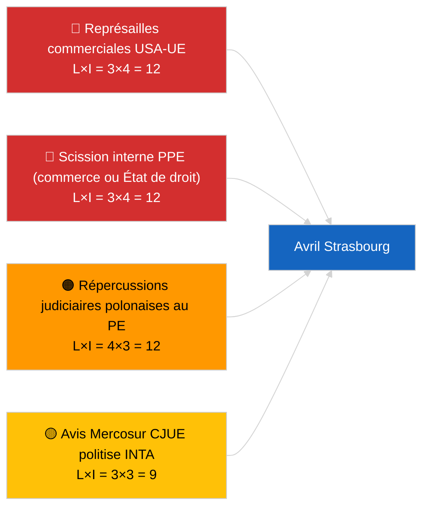

<!-- SPDX-FileCopyrightText: 2026 Hack23 AB -->
<!-- SPDX-License-Identifier: Apache-2.0 -->

# Executive Brief — Mois à Venir | 2026-04-01

**Classification :** OSINT | Document parlementaire public
**Niveau de confiance :** 🟡 Moyen (prospectif ; sortie de classification vide limite la profondeur)
**Généré :** 2026-04-01T00:00:00Z (note rétrospective)
**Type d'article :** Mois à Venir
**ID d'exécution :** `7f928e7c-85fd-4f76-890b-f362622c3f42`
**Source :** Portail de données ouvertes du Parlement européen

---

## 🎯 BLUF

**Les perspectives d'avril 2026 sont ancrées sur la session plénière de Strasbourg du 27 au 30 avril et la semaine préparatoire des commissions du 13 au 17 avril.** L'exécution des prévisions mensuelles a renvoyé **0 acteur classifié** et des scores de dimensions **ROUTINIÈRES**, reflétant le premier jour du Parlement européen après la pause de mars plutôt qu'une prévision substantielle de scénario pour avril. Priorités reportées en avril : ajustement du tarif douanier américain (TA-10-2026-0096), avis de la CJUE sur EU-Mercosur (en attente), transposition des crédits d'émission HDV (TA-10-2026-0084), mise en œuvre relative aux prisonniers politiques géorgiens (TA-10-2026-0083) et répercussions juridiques polonaises en cours du précédent d'immunité Braun (TA-10-2026-0088). Trois scénarios de travail : **Scénario A — programme axé sur le commerce (55%)**, **Scénario B — accent sur l'État de droit (25%)**, **Scénario C — accent économique/industriel (20%)**. **🟡 Confiance MOYENNE** — programme d'avril pas encore publié.

---

## 🧭 3 Décisions que cette note soutient

| # | Décision | Qui décide | Échéance | Preuves |
|:-:|----------|-----------|:--------:|---------|
| 1 | **Éditorial :** publier comme prévision mensuelle axée sur des scénarios avec une mise en garde explicite « programme en attente » | Rédacteur | +24h | Inventaire reporté ; trois scénarios |
| 2 | **Surveillance :** cycle de renseignement pré-plénier 13–17 avril (semaine de commission) | Analyste | 2026-04-13 | Premiers signaux substantiels d'avril |
| 3 | **Surveillance prospective :** relancer les prévisions mensuelles à T-7 avant le plénier (~20 avril) avec le programme publié | Responsable analyse | 2026-04-20 | Confirmer la sélection du scénario |

---

## 📰 Lecture en 60 Secondes

- 🔴 **Aucune nouvelle procédure ou point d'ordre du jour spécifique à avril dans le flux d'aujourd'hui** — le programme de Strasbourg est généralement publié à T-7 jours. (🟢 Élevée)
- 🟠 **Trois scénarios de travail** pour la session plénière d'avril, dominés par la variante axée sur le commerce (55%) : ajustement douanier américain, avis Mercosur, souveraineté numérique. (🟡 Moyen)
- 🟢 **Piste État de droit reportée :** répercussions du précédent Braun, mise en œuvre Géorgie, procédures d'immunité supplémentaires potentielles (axées sur LIBE). (🟡 Moyen)
- 🟡 **Variante économique/industrielle :** suivi du rapport annuel de la BCE (TA-10-2026-0034), résistance des États membres à la transposition HDV. (🟡 Moyen)
- 🔵 **Contexte économique :** la fenêtre de publication du IMF WEO d'avril coïncide avec la session plénière — les prévisions de stress budgétaire pourraient teinter le début du débat sur le CFP. (🟢 Élevée — alignement calendaire)
- 🟣 **Référence croisée :** l'exécution sœur 2026-04-01/breaking documente le schéma 6/8 404 dans le flux consultatif qui a empêché cette exécution de prévision mensuelle de produire une nouvelle classification d'acteurs. (🟢 Élevée)
- 🩷 **Vecteur de perturbation :** abus du groupe dominant (PPE 38%) signalé comme ÉLEVÉ par le système d'alerte précoce — le vecteur le plus probable pour une surprise en avril est une scission interne au PPE sur le commerce ou l'État de droit. (🟡 Moyen)
- ⚪ **Report :** le rapport « Mieux légiférer » TA-10-2026-0063 établit la base du débat sur la réforme institutionnelle pour le reste d'EP10.

---

## 🗂️ Top Documents / Procédures — Liste de surveillance d'avril

| Rang | Référence PE | Titre (court) | Importance | Confiance | Statut |
|:----:|--------------|---------------|:----------:|:---------:|--------|
| 1 | TA-10-2026-0096 | Ajustement du tarif douanier américain | 7,5 | 🟢 ÉLEVÉE | Adopté le 26 mars ; suivi en avril attendu |
| 2 | TA-10-2026-0008 | Renvoi UE-Mercosur à la CJUE (avis en attente) | 7,0 | 🟡 MOYEN | Avis judiciaire attendu avant le plénier d'avril |
| 3 | TA-10-2026-0083 | Prisonniers politiques géorgiens | 6,5 | 🟢 ÉLEVÉE | Rapport de mise en œuvre à remettre |
| 4 | TA-10-2026-0088 | Immunité Braun (précédent pour les affaires ultérieures) | 6,5 | 🟢 ÉLEVÉE | Surveillance de suivi LIBE |
| 5 | TA-10-2026-0084 | Crédits d'émission HDV 2025–2029 | 6,0 | 🟢 ÉLEVÉE | Transposition nationale |

---

## ⚠️ Aperçu des Risques et Menaces — Perspectives d'avril

| Risque | L | I | Score | Déclencheur | Source | Admirauté |
|--------|:-:|:-:|:-----:|-------------|--------|:---------:|
| Représailles commerciales USA-UE | 3 | 4 | 12 | Contre-annonce américaine | TA-10-2026-0096 | A1 |
| Scission interne PPE | 3 | 4 | 12 | Division visible lors du vote | Arithmétique de coalition | A2 |
| Répercussions judiciaires polonaises au PE | 4 | 3 | 12 | Nouvelle affaire d'immunité | TA-10-2026-0088 | A1 |
| Politisation de l'avis Mercosur | 3 | 3 | 9 | Tribunal publie avant le plénier | TA-10-2026-0008 | A2 |
| Classification vide des prévisions mensuelles | 3 | 2 | 6 | Nouvelle exécution également vide 2026-04-20 | Cette exécution | B3 |

---

## 🔮 Principal Déclencheur Prospectif

**Publication du programme de Strasbourg ~20 avril 2026 (T-7).** La composition du programme résoudra l'incertitude des trois scénarios : une pondération axée sur le commerce (Scénario A) confirme le récit dominant reporté ; une pondération axée sur l'État de droit (Scénario B) signale l'élan du LIBE depuis le précédent Braun ; une pondération économique/industrielle (Scénario C) met en avant les dossiers ECON et ENVI.

---

## 🛡️ Évaluation de la Qualité des Sources

- **Sources primaires :** Portail de données ouvertes du Parlement européen — exécution d'analyse `7f928e7c-85fd-4f76-890b-f362622c3f42` ; inventaire des textes adoptés de mars 2026 (reporté).
- **Limites des données :** L'exécution d'aujourd'hui a produit 0 acteur et une signification ROUTINIÈRE ; l'inférence prospective est ancrée sur les articles du jour précédent et le calendrier du PE, et non sur une modélisation de scénarios régénérée.
- **Confiance dans les probabilités de scénarios :** 🟡 Moyen (pondération qualitative).
- **Confiance dans la liste de priorités reportée :** 🟢 Élevée.

---

## 📎 Liens

| Lien | Chemin |
|------|--------|
| Article | `./article.md` |
| Classification (vide) | `./classification/` |
| Exécutions sœurs | `analysis/daily/2026-04-01/breaking/`, `committee-reports/`, `motions/`, `propositions/` |
| Source — inventaire législatif de mars | `analysis/daily/2026-03-10/` → `2026-03-26/` |
| Manifeste | `./manifest.json` |

---

## 🔄 Référence Croisée

**Exécutions précédentes :** Strasbourg 9–12 mars et la mini-session plénière de Bruxelles 25–26 mars fournissent la base reportée substantielle utilisée par cette prévision mensuelle.

**Vérification ultérieure :** Comparer avec la revue mensuelle post-session plénière d'avril (attendue début mai 2026) pour évaluer la précision des prévisions de scénarios.

---

**Contrôle du document**
- **Modèle :** `/analysis/templates/executive-brief.md`
- **Chemin d'artefact :** `analysis/daily/2026-04-01/month-ahead/executive-brief.md`
- **Classification :** Public
- **Génération rétrospective :** Session de remplissage.
