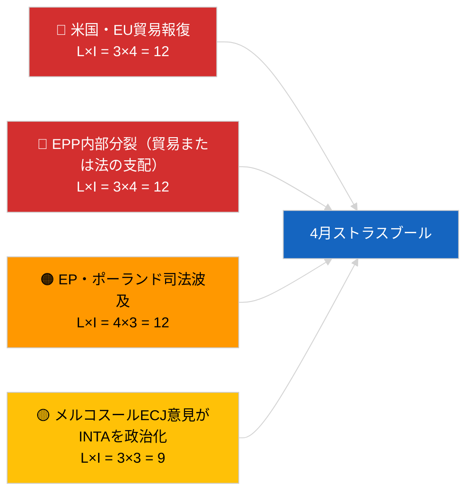

<!-- SPDX-FileCopyrightText: 2026 Hack23 AB -->
<!-- SPDX-License-Identifier: Apache-2.0 -->

# Executive Brief — 来月展望 | 2026-04-01

**分類：** OSINT | 公開議会記録
**信頼度：** 🟡 中程度（将来予測；分類出力が空のため深度が制限される）
**生成日：** 2026-04-01T00:00:00Z（遡及的ブリーフ）
**記事タイプ：** 来月展望
**実行ID：** `7f928e7c-85fd-4f76-890b-f362622c3f42`
**出典：** 欧州議会オープンデータポータル

---

## 🎯 BLUF

**2026年4月の見通しは、4月27〜30日のストラスブール本会議および4月13〜17日の準備委員会週を中心に据えられている。** 月間先行実行では**分類済み行為者0名**と**ルーティン**の次元スコアが返り、3月休会明けの欧州議会初日を反映するに留まり、実質的な4月シナリオ予測は提供されていない。4月への引き継ぎ優先事項：米国関税調整（TA-10-2026-0096）、EU・メルコスールECJ意見（保留中）、HDV排出クレジット移行（TA-10-2026-0084）、グルジア政治犯の実施（TA-10-2026-0083）、ブラウン免責先例（TA-10-2026-0088）に起因するポーランド司法の余波。3つの作業シナリオ：**シナリオA — 貿易重視の議題（55%）**、**シナリオB — 法の支配重視（25%）**、**シナリオC — 経済・産業重視（20%）**。**🟡 中程度の信頼度** — 4月議題未公表。

---

## 🧭 このブリーフが支援する3つの意思決定

| # | 意思決定 | 決定者 | 期限 | 根拠 |
|:-:|---------|--------|:----:|------|
| 1 | **編集：**「議題保留」の明示的注記付きでシナリオ主導の月間先行予測として発行する | 編集長 | +24時間 | 引き継ぎ台帳；3シナリオ |
| 2 | **モニタリング：** 4月13〜17日（委員会週）の本会議前情報サイクル | アナリスト | 2026-04-13 | 最初の実質的4月シグナル |
| 3 | **将来監視：** 公表済み議題を用いてT-7（〜4月20日）頃に月間先行実行を再実行する | 分析責任者 | 2026-04-20 | シナリオ選択の確認 |

---

## 📰 60秒読み

- 🔴 **本日のフィードに4月固有の新しい手続きや議題はなし** — ストラスブール議題は通常T-7日に公表される。（🟢 高）
- 🟠 **3つの作業シナリオ**：4月本会議は貿易重視型（55%）が支配。米国関税調整、メルコスール意見、デジタル主権。（🟡 中程度）
- 🟢 **引き継ぎ法の支配トラック：** ブラウン先例の余波、グルジア実施、追加免責手続きの可能性（LIBE主導）。（🟡 中程度）
- 🟡 **経済・産業型：** ECB年次報告フォローアップ（TA-10-2026-0034）、HDV移行に対する加盟国の抵抗。（🟡 中程度）
- 🔵 **経済文脈：** IMF 4月 WEO公表ウィンドウが本会議と重なる — 財政ストレス予測がMFF初期議論に影響する可能性。（🟢 高 — カレンダー整合）
- 🟣 **相互参照：** 2026-04-01/breakingの兄弟実行が助言フィードの6/8件の404パターンを文書化しており、この月間先行実行が新規行為者分類を生成できなかった原因となっている。（🟢 高）
- 🩷 **混乱ベクター：** 支配グループの独走（PPE 38%）が早期警告システムにより高と判定 — 4月の予想外展開で最も可能性が高いのはEPP内部における貿易または法の支配を巡る分裂。（🟡 中程度）
- ⚪ **繰り越し：** 「よりよい立法」報告書 TA-10-2026-0063 がEP10残り期間の制度改革議論のベースラインを設定。

---

## 🗂️ 主要文書・手続き — 4月ウォッチリスト

| 順位 | EP参照 | タイトル（短縮） | 重要度 | 信頼度 | 状態 |
|:----:|--------|----------------|:------:|:------:|------|
| 1 | TA-10-2026-0096 | 米国関税調整 | 7.5 | 🟢 高 | 3月26日採択済；4月フォローアップ見込み |
| 2 | TA-10-2026-0008 | EU・メルコスールECJ付託（意見保留中） | 7.0 | 🟡 中程度 | 4月本会議前に司法意見見込み |
| 3 | TA-10-2026-0083 | グルジア政治犯 | 6.5 | 🟢 高 | 実施報告期限到来 |
| 4 | TA-10-2026-0088 | ブラウン免責（後続案件の先例） | 6.5 | 🟢 高 | LIBEフォローアップ監視 |
| 5 | TA-10-2026-0084 | HDV排出クレジット2025〜2029 | 6.0 | 🟢 高 | 各国移行 |

---

## ⚠️ リスク・脅威スナップショット — 4月見通し

| リスク | L | I | スコア | トリガー | 出典 | 信憑性評価 |
|--------|:-:|:-:|:------:|---------|------|:----------:|
| 米国・EU貿易報復 | 3 | 4 | 12 | 米国の反対発表 | TA-10-2026-0096 | A1 |
| EPP内部分裂 | 3 | 4 | 12 | 可視化された投票分裂 | 連立算術 | A2 |
| EP・ポーランド司法波及 | 4 | 3 | 12 | 追加免責案件 | TA-10-2026-0088 | A1 |
| メルコスール意見の政治化 | 3 | 3 | 9 | 裁判所が本会議前に公表 | TA-10-2026-0008 | A2 |
| 月間先行分類が空 | 3 | 2 | 6 | 再実行も2026-04-20に空 | この実行 | B3 |

---

## 🔮 最重要先行トリガー

**ストラスブール議題公表〜2026年4月20日（T-7）。** 議題の構成が3シナリオの不確実性を解消する：貿易重視（シナリオA）は支配的な引き継ぎ物語を確認；法の支配重視（シナリオB）はブラウン先例からのLIBEモメンタムを示唆；経済・産業重視（シナリオC）はECONおよびENVIファイルを押し上げる。

---

## 🛡️ 情報源品質評価

- **一次情報源：** 欧州議会オープンデータポータル — 分析実行 `7f928e7c-85fd-4f76-890b-f362622c3f42`；2026年3月採択テキスト台帳（引き継ぎ）。
- **データの制限：** 本日の実行では行為者0名とルーティン重要度が生成された；将来推論は前日の記事とEPカレンダーに基づいており、再生成されたシナリオモデリングではない。
- **シナリオ確率の信頼度：** 🟡 中程度（定性的加重）。
- **引き継ぎ優先リストの信頼度：** 🟢 高。

---

## 📎 リンク

| リンク | パス |
|--------|------|
| 記事 | `./article.md` |
| 分類（空） | `./classification/` |
| 兄弟実行 | `analysis/daily/2026-04-01/breaking/`, `committee-reports/`, `motions/`, `propositions/` |
| 出典 — 3月立法台帳 | `analysis/daily/2026-03-10/` → `2026-03-26/` |
| マニフェスト | `./manifest.json` |

---

## 🔄 相互参照

**過去の実行：** ストラスブール3月9〜12日およびブリュッセルミニ本会議3月25〜26日が、この月間先行展望が使用する実質的な引き継ぎ基盤を提供している。

**事後検証：** 4月本会議後の月次レビュー（2026年5月初旬見込み）と照合してシナリオ予測精度を評価する。

---

**文書管理**
- **テンプレート：** `/analysis/templates/executive-brief.md`
- **成果物パス：** `analysis/daily/2026-04-01/month-ahead/executive-brief.md`
- **分類：** 公開
- **遡及生成：** バックフィルセッション。
