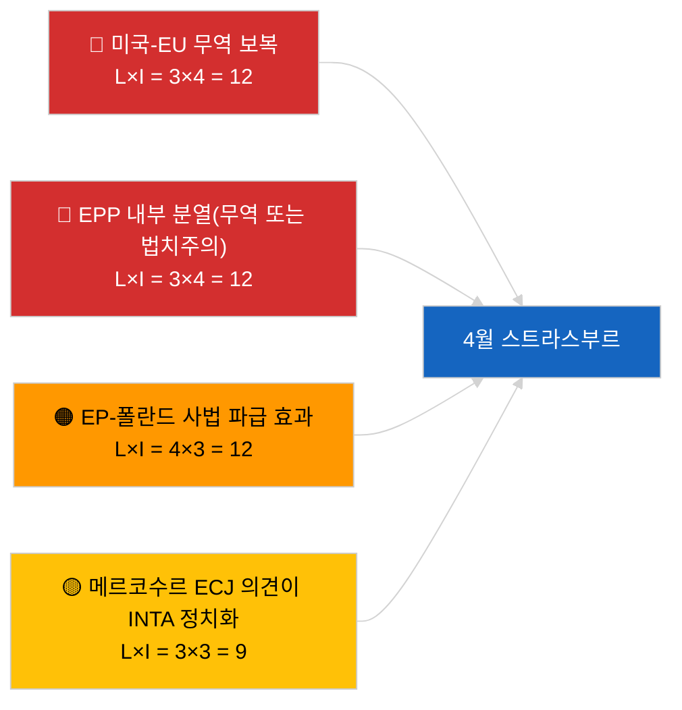

<!-- SPDX-FileCopyrightText: 2026 Hack23 AB -->
<!-- SPDX-License-Identifier: Apache-2.0 -->

# Executive Brief — 다음 달 전망 | 2026-04-01

**분류:** OSINT | 공개 의회 기록
**신뢰 수준:** 🟡 중간 (미래 지향적; 빈 분류 출력이 깊이를 제한함)
**생성일:** 2026-04-01T00:00:00Z (소급 브리프)
**기사 유형:** 다음 달 전망
**실행 ID:** `7f928e7c-85fd-4f76-890b-f362622c3f42`
**출처:** 유럽의회 공개 데이터 포털

---

## 🎯 BLUF

**2026년 4월 전망은 4월 27~30일 스트라스부르 본회의 및 4월 13~17일 준비 위원회 주를 중심으로 한다.** 월간 선행 실행에서 **분류된 행위자 0명**과 **일상적인** 차원 점수가 반환되어, 3월 휴회 이후 유럽의회의 첫날을 반영하며 실질적인 4월 시나리오 예측은 제공되지 않았다. 4월로 이월된 우선순위: 미국 관세 조정(TA-10-2026-0096), EU-메르코수르 ECJ 의견(보류 중), HDV 배출 크레딧 전환(TA-10-2026-0084), 조지아 정치범 이행(TA-10-2026-0083), 브라운 면책 선례(TA-10-2026-0088)에서 비롯된 폴란드 사법 파급 효과. 세 가지 작업 시나리오: **시나리오 A — 무역 중심 의제(55%)**, **시나리오 B — 법치주의 집중(25%)**, **시나리오 C — 경제/산업 집중(20%)**. **🟡 중간 신뢰도** — 4월 의제 미공개.

---

## 🧭 이 브리프가 지원하는 3가지 결정

| # | 결정 | 결정자 | 기한 | 근거 |
|:-:|------|--------|:----:|------|
| 1 | **편집:** '의제 보류' 명시적 주의사항과 함께 시나리오 주도 월간 선행 예측으로 발행 | 편집장 | +24시간 | 이월 목록; 세 가지 시나리오 |
| 2 | **모니터링:** 4월 13~17일(위원회 주) 본회의 전 정보 사이클 | 분석가 | 2026-04-13 | 첫 번째 실질적 4월 신호 |
| 3 | **미래 지향 모니터링:** 공개된 의제로 T-7(~4월 20일)에 월간 선행 재실행 | 분석 책임자 | 2026-04-20 | 시나리오 선택 확인 |

---

## 📰 60초 요약

- 🔴 **오늘 피드에 4월 특정 새 절차나 의제 항목 없음** — 스트라스부르 의제는 일반적으로 T-7일에 공개됨. (🟢 높음)
- 🟠 **세 가지 작업 시나리오** — 4월 본회의는 무역 중심 변형(55%)이 지배: 미국 관세 조정, 메르코수르 의견, 디지털 주권. (🟡 중간)
- 🟢 **이월된 법치주의 트랙:** 브라운 선례의 파급 효과, 조지아 이행, 잠재적 추가 면책 절차(LIBE 주도). (🟡 중간)
- 🟡 **경제/산업 변형:** ECB 연례 보고서 후속 조치(TA-10-2026-0034), HDV 전환에 대한 회원국 저항. (🟡 중간)
- 🔵 **경제 맥락:** IMF 4월 WEO 공개 창이 본회의와 겹침 — 재정 압박 예측이 초기 MFF 논의에 영향을 줄 수 있음. (🟢 높음 — 일정 정렬)
- 🟣 **교차 참조:** 2026-04-01/breaking 형제 실행이 이 월간 선행 실행의 새로운 행위자 분류 생성을 방해한 자문 피드의 6/8 404 패턴을 문서화함. (🟢 높음)
- 🩷 **혼란 벡터:** 지배 그룹의 독주(PPE 38%)가 조기 경고 시스템에 의해 높음으로 표시 — 4월 놀라운 결과의 가장 가능성 있는 벡터는 무역 또는 법치주의에 관한 EPP 내부 분열. (🟡 중간)
- ⚪ **이월:** '더 나은 입법' 보고서 TA-10-2026-0063이 EP10 나머지 기간의 제도 개혁 논의 기준선 설정.

---

## 🗂️ 주요 문서/절차 — 4월 감시 목록

| 순위 | EP 참조 | 제목(약칭) | 중요도 | 신뢰도 | 상태 |
|:----:|---------|-----------|:------:|:------:|------|
| 1 | TA-10-2026-0096 | 미국 관세 조정 | 7.5 | 🟢 높음 | 3월 26일 채택; 4월 후속 조치 예상 |
| 2 | TA-10-2026-0008 | EU-메르코수르 ECJ 부탁(의견 보류 중) | 7.0 | 🟡 중간 | 4월 본회의 전 사법 의견 예상 |
| 3 | TA-10-2026-0083 | 조지아 정치범 | 6.5 | 🟢 높음 | 이행 보고 기한 도래 |
| 4 | TA-10-2026-0088 | 브라운 면책(후속 사례 선례) | 6.5 | 🟢 높음 | LIBE 후속 모니터링 |
| 5 | TA-10-2026-0084 | HDV 배출 크레딧 2025~2029 | 6.0 | 🟢 높음 | 국가별 전환 |

---

## ⚠️ 위험 및 위협 스냅숏 — 4월 전망

| 위험 | L | I | 점수 | 트리거 | 출처 | 신뢰도 |
|------|:-:|:-:|:----:|-------|------|:------:|
| 미국-EU 무역 보복 | 3 | 4 | 12 | 미국의 반대 발표 | TA-10-2026-0096 | A1 |
| EPP 내부 분열 | 3 | 4 | 12 | 가시적 투표 분열 | 연립 산술 | A2 |
| EP-폴란드 사법 파급 효과 | 4 | 3 | 12 | 추가 면책 사례 | TA-10-2026-0088 | A1 |
| 메르코수르 의견 정치화 | 3 | 3 | 9 | 법원이 본회의 전 공개 | TA-10-2026-0008 | A2 |
| 빈 월간 선행 분류 | 3 | 2 | 6 | 재실행도 2026-04-20 비어있음 | 이 실행 | B3 |

---

## 🔮 최우선 선행 트리거

**스트라스부르 의제 공개 ~2026년 4월 20일(T-7).** 의제 구성이 세 가지 시나리오 불확실성을 해소할 것이다: 무역 중심 가중치(시나리오 A)는 지배적인 이월 서사를 확인; 법치주의 가중치(시나리오 B)는 브라운 선례에서 비롯된 LIBE 모멘텀 신호; 경제/산업 가중치(시나리오 C)는 ECON 및 ENVI 파일을 끌어올림.

---

## 🛡️ 출처 품질 평가

- **1차 출처:** 유럽의회 공개 데이터 포털 — 분석 실행 `7f928e7c-85fd-4f76-890b-f362622c3f42`; 2026년 3월 채택 텍스트 목록(이월).
- **데이터 제한:** 오늘 실행에서 행위자 0명과 일상적 중요도가 생성됨; 미래 지향적 추론은 전날 기사 및 EP 일정에 기반하며 재생성된 시나리오 모델링이 아님.
- **시나리오 확률 신뢰도:** 🟡 중간 (정성적 가중치).
- **이월 우선순위 목록 신뢰도:** 🟢 높음.

---

## 📎 링크

| 링크 | 경로 |
|------|------|
| 기사 | `./article.md` |
| 분류(비어 있음) | `./classification/` |
| 형제 실행 | `analysis/daily/2026-04-01/breaking/`, `committee-reports/`, `motions/`, `propositions/` |
| 출처 — 3월 입법 목록 | `analysis/daily/2026-03-10/` → `2026-03-26/` |
| 매니페스트 | `./manifest.json` |

---

## 🔄 교차 참조

**이전 실행:** 3월 9~12일 스트라스부르 및 3월 25~26일 브뤼셀 미니 본회의가 이 월간 선행 전망에서 사용하는 실질적인 이월 기반을 제공한다.

**사후 검증:** 4월 본회의 이후 월간 검토(2026년 5월 초 예상)와 비교하여 시나리오 예측 정확도를 평가한다.

---

**문서 관리**
- **템플릿:** `/analysis/templates/executive-brief.md`
- **결과물 경로:** `analysis/daily/2026-04-01/month-ahead/executive-brief.md`
- **분류:** 공개
- **소급 생성:** 백필 세션.
