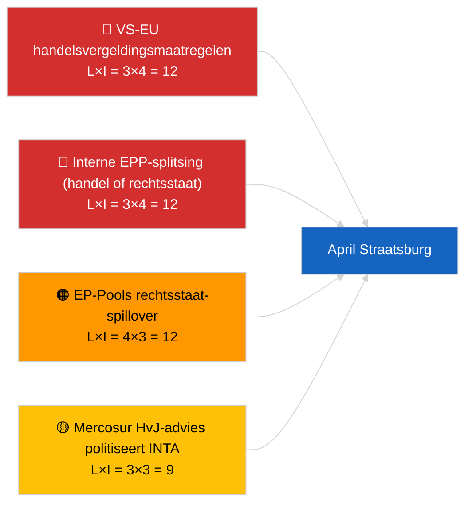

<!-- SPDX-FileCopyrightText: 2026 Hack23 AB -->
<!-- SPDX-License-Identifier: Apache-2.0 -->

# Executive Brief — Volgende Maand | 2026-04-01

**Classificatie:** OSINT | Openbaar parlementair protocol
**Betrouwbaarheidsniveau:** 🟡 Gemiddeld (toekomstgericht; lege classificatie-uitvoer beperkt de diepte)
**Gegenereerd:** 2026-04-01T00:00:00Z (retrospectieve nota)
**Artikeltype:** Volgende Maand
**Uitvoerings-ID:** `7f928e7c-85fd-4f76-890b-f362622c3f42`
**Bron:** Open dataportal van het Europees Parlement

---

## 🎯 BLUF

**De vooruitzichten voor april 2026 zijn verankerd in de plenaire vergadering van Straatsburg van 27–30 april en de voorbereidende commissieweek van 13–17 april.** De maandelijkse vooruitblik-uitvoering leverde **0 geclassificeerde actoren** en **ROUTINE**-dimensiescores op, wat de eerste dag van het Europees Parlement na het maart-reces weerspiegelt in plaats van een substantiële aprilscenario-prognose. Doorlopende prioriteiten naar april: aanpassing van de Amerikaanse douanetarieven (TA-10-2026-0096), EU-Mercosur HvJ-advies (in afwachting), omzetting van HDV-emissiekrediet (TA-10-2026-0084), implementatie betreffende Georgische politieke gevangenen (TA-10-2026-0083) en voortdurende Pools-juridische nawerkingen van het Braun-immuniteitsprecedent (TA-10-2026-0088). Drie werkscenario's: **Scenario A — handelszwaar programma (55%)**, **Scenario B — focus op rechtsstaat (25%)**, **Scenario C — economische/industriële focus (20%)**. **🟡 GEMIDDELD betrouwbaarheidsniveau** — april-agenda nog niet gepubliceerd.

---

## 🧭 3 Beslissingen die deze nota ondersteunt

| # | Beslissing | Wie beslist | Deadline | Bewijs |
|:-:|-----------|------------|:--------:|--------|
| 1 | **Redactioneel:** publiceer als scenariogestuurde maandelijkse vooruitblik met expliciete 'agenda in afwachting'-kanttekening | Redacteur | +24u | Doorlopende inventarisatie; drie scenario's |
| 2 | **Monitoring:** pre-plenaire inlichtingencyclus 13–17 april (commissieweek) | Analist | 2026-04-13 | Eerste substantiële aprilsignalen |
| 3 | **Vooruitkijkende monitoring:** maandelijkse vooruitblik opnieuw uitvoeren op T-7 voor plenaire vergadering (~20 april) met gepubliceerde agenda | Analysemanager | 2026-04-20 | Scenarioselectie bevestigen |

---

## 📰 60-Seconden Lezing

- 🔴 **Geen nieuwe april-specifieke procedures of agendapunten in de feed van vandaag** — de Straatsburg-agenda wordt doorgaans T-7 dagen gepubliceerd. (🟢 Hoog)
- 🟠 **Drie werkscenario's** voor de aprilplenaire vergadering, gedomineerd door de handelszware variant (55%): aanpassing van de Amerikaanse douanetarieven, Mercosur-advies, digitale soevereiniteit. (🟡 Gemiddeld)
- 🟢 **Doorlopend rechtsstaat-spoor:** nawerkingen van het Braun-precedent, implementatie Georgië, potentiële aanvullende immuniteitsprocedures (LIBE-gedreven). (🟡 Gemiddeld)
- 🟡 **Economische/industriële variant:** opvolging van het jaarverslag van de ECB (TA-10-2026-0034), weerstand van lidstaten bij omzetting HDV. (🟡 Gemiddeld)
- 🔵 **Economische context:** het publicatievenster van IMF april WEO valt samen met de plenaire vergadering — prognoses voor begrotingsstress kunnen het vroege debat over het MFK kleuren. (🟢 Hoog — kalenderafstemming)
- 🟣 **Kruisverwijzing:** de zusteruitvoering 2026-04-01/breaking documenteert het 6/8 404-patroon in de adviserende feed dat verhinderde dat deze maandelijkse vooruitblik-uitvoering een nieuwe actorclassificatie produceerde. (🟢 Hoog)
- 🩷 **Verstoringsvektor:** overheersende-groep-inmenging (PPE 38%) als HOOG gemarkeerd door het vroegwaarschuwingssysteem — de meest waarschijnlijke vector voor een aprilverrassing is een interne EPP-splitsing over handel of rechtsstaat. (🟡 Gemiddeld)
- ⚪ **Doorsturen:** het rapport 'Betere wetgeving' TA-10-2026-0063 stelt de basislijn vast voor het debat over institutionele hervorming voor de rest van EP10.

---

## 🗂️ Topdocumenten / Procedures — April-bewakingslijst

| Rang | EP-referentie | Titel (kort) | Belang | Betrouwbaarheid | Status |
|:----:|---------------|--------------|:------:|:---------------:|--------|
| 1 | TA-10-2026-0096 | Aanpassing van de Amerikaanse douanetarieven | 7,5 | 🟢 HOOG | Aangenomen 26 maart; opvolging in april verwacht |
| 2 | TA-10-2026-0008 | EU-Mercosur HvJ-doorverwijzing (advies in afwachting) | 7,0 | 🟡 GEMIDDELD | Rechterlijk advies verwacht vóór de aprilplenaire vergadering |
| 3 | TA-10-2026-0083 | Georgische politieke gevangenen | 6,5 | 🟢 HOOG | Implementatierapportage vervalt |
| 4 | TA-10-2026-0088 | Braun-immuniteit (precedent voor vervolgzaken) | 6,5 | 🟢 HOOG | LIBE-vervolgmonitoring |
| 5 | TA-10-2026-0084 | HDV-emissiekrediet 2025–2029 | 6,0 | 🟢 HOOG | Nationale omzetting |

---

## ⚠️ Risico- en Dreigingsoverzicht — Aprilvooruitzicht

| Risico | L | I | Score | Trigger | Bron | Admiraliteit |
|--------|:-:|:-:|:-----:|---------|------|:------------:|
| VS-EU handelsvergeldingsmaatregelen | 3 | 4 | 12 | Tegenmelding VS | TA-10-2026-0096 | A1 |
| Interne EPP-splitsing | 3 | 4 | 12 | Zichtbare stemverdeling | Coalitie-arithmetiek | A2 |
| EP-Pools rechtsstaat-spillover | 4 | 3 | 12 | Verdere immuniteitszaak | TA-10-2026-0088 | A1 |
| Politisering van Mercosur-advies | 3 | 3 | 9 | Rechtbank publiceert voor plenaire vergadering | TA-10-2026-0008 | A2 |
| Lege maandelijkse vooruitblik-classificatie | 3 | 2 | 6 | Heruitvoering ook leeg 2026-04-20 | Deze uitvoering | B3 |

---

## 🔮 Voornaamste Vooruitblikkende Trigger

**Publicatie van de Straatsburg-agenda ~20 april 2026 (T-7).** De samenstelling van de agenda zal de drie-scenario-onzekerheid oplossen: handelszware weging (Scenario A) bevestigt de dominante doorlopende narratief; rechtsstaatsweging (Scenario B) signaleert LIBE-momentum vanuit het Braun-precedent; economische/industriële weging (Scenario C) verhoogt de ECON- en ENVI-dossiers.

---

## 🛡️ Beoordeling van Bronkwaliteit

- **Primaire bronnen:** Open dataportal van het Europees Parlement — analyse-uitvoering `7f928e7c-85fd-4f76-890b-f362622c3f42`; inventarisatie van aangenomen teksten van maart 2026 (doorlopend).
- **Databeperkingen:** De uitvoering van vandaag produceerde 0 actoren en ROUTINE-significantie; prospectieve inferentie is verankerd aan artikelen van de vorige dag en de EP-kalender, niet aan geregenereerde scenariomodellering.
- **Betrouwbaarheid van scenariokansen:** 🟡 Gemiddeld (kwalitatieve weging).
- **Betrouwbaarheid van doorlopende prioriteitenlijst:** 🟢 Hoog.

---

## 📎 Links

| Link | Pad |
|------|-----|
| Artikel | `./article.md` |
| Classificatie (leeg) | `./classification/` |
| Zusteruitvoeringen | `analysis/daily/2026-04-01/breaking/`, `committee-reports/`, `motions/`, `propositions/` |
| Bron — wetgevingsinventarisatie maart | `analysis/daily/2026-03-10/` → `2026-03-26/` |
| Manifest | `./manifest.json` |

---

## 🔄 Kruisverwijzing

**Eerdere uitvoeringen:** Straatsburg 9–12 maart en de mini-plenaire vergadering in Brussel 25–26 maart leveren de substantiële doorlopende basis die wordt gebruikt door deze maandelijkse vooruitblik.

**Volgende verificatie:** Vergelijk met de maandelijkse overzicht na de aprilplenaire vergadering (verwacht begin mei 2026) om de nauwkeurigheid van de scenariovoorspelling te beoordelen.

---

**Documentcontrole**
- **Sjabloon:** `/analysis/templates/executive-brief.md`
- **Artefactpad:** `analysis/daily/2026-04-01/month-ahead/executive-brief.md`
- **Classificatie:** Openbaar
- **Retrospectieve generering:** Backfill-sessie.
