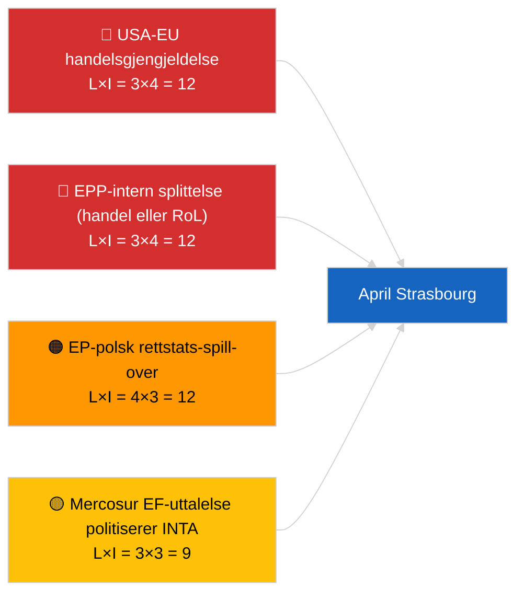

<!-- SPDX-FileCopyrightText: 2026 Hack23 AB -->
<!-- SPDX-License-Identifier: Apache-2.0 -->

# Executive Brief — Kommende Måned | 2026-04-01

**Klassifisering:** OSINT | Offentlig parlamentarisk protokoll
**Konfidensnivå:** 🟡 Middels (fremoverrettet; tom klassifiseringsoutput begrenser dybden)
**Generert:** 2026-04-01T00:00:00Z (retrospektivt notat)
**Artikkeltype:** Kommende Måned
**Kjøre-ID:** `7f928e7c-85fd-4f76-890b-f362622c3f42`
**Kilde:** Europaparlamentets åpne dataportal

---

## 🎯 BLUF

**Aprilutsiktene for 2026 er forankret i Strasbourg-plenumssamlingen 27.–30. april og den forberedende utvalgsuka 13.–17. april.** Måneds-fremtids-kjøringen returnerte **0 klassifiserte aktører** og **RUTINEMESSIGE** dimensjonsskårer, noe som gjenspeiler Europaparlamentets første dag etter mars-pausen heller enn en substansiell aprilscenario-prognose. Overførte prioriteringer inn i april: USAs tolltariff-justering (TA-10-2026-0096), EU–Mercosur EF-domstolsuttalelse (avventer), HDV-utslippskreditter transponering (TA-10-2026-0084), implementering av georgiske politiske fanger (TA-10-2026-0083), og pågående polsk-rettslige ettervirkninger fra Braun-immunitets-presedensen (TA-10-2026-0088). Tre arbeidsscenarier: **Scenario A — handelstungt program (55%)**, **Scenario B — rettsstats-fokus (25%)**, **Scenario C — økonomisk/industrielt fokus (20%)**. **🟡 MIDDELS konfidensnivå** — aprilprogrammet er ennå ikke publisert.

---

## 🧭 3 Beslutninger Dette Notatet Støtter

| # | Beslutning | Hvem bestemmer | Frist | Dokumentasjon |
|:-:|-----------|---------------|:-----:|---------------|
| 1 | **Redaksjonell:** publiser som scenariodrevet måneds-fremtid med eksplisitt "program avventes"-forbehold | Redaktør | +24h | Overført inventar; tre scenarier |
| 2 | **Overvåking:** for-plenum etterretningssyklus 13.–17. april (utvalgsuke) | Analytiker | 2026-04-13 | Første substansielle aprilsignaler |
| 3 | **Fremoverrettet overvåking:** kjør måneds-fremtid på nytt T-7 til plenum (~20. april) med publisert program | Analyseansvarlig | 2026-04-20 | Bekreft scenarievalg |

---

## 📰 60-Sekunders Lesning

- 🔴 **Ingen nye aprilspesifikke prosedyrer eller dagsordenspunkter i dagens feed** — Strasbourg-programmet publiseres typisk T-7 dager. (🟢 Høy)
- 🟠 **Tre arbeidsscenarier** for aprilplenumsmøtet, dominert av handelstung variant (55%): USAs tolljustering, Mercosur-uttalelse, digital suverenitet. (🟡 Middels)
- 🟢 **Overført rettsstats-spor:** Braun-presedens ettervirkninger, Georgien-implementering, potensielle ytterligere immunitetsforhandlinger (LIBE-drevet). (🟡 Middels)
- 🟡 **Økonomisk/industriell variant:** ECBs årsrapport-oppfølging (TA-10-2026-0034), HDV-transponeringmotstand fra medlemsstater. (🟡 Middels)
- 🔵 **Økonomisk kontekst:** IMF april WEO-publiseringsvinduet sammenfaller med plenumsmøtet — skattemessige stressutsikter kan farge den tidlige MFF-debatten. (🟢 Høy — kalenderoverlapning)
- 🟣 **Kryssreferanse:** søsken-kjøringen 2026-04-01/breaking dokumenterer 6/8 404-feilmønstret i rådgivningsfeedet som hindret denne måneds-fremtids-kjøringen fra å produsere ny aktørklassifisering. (🟢 Høy)
- 🩷 **Forstyrelsesvektor:** dominerende-gruppe-overgrep (PPE 38%) flagget HØY av det tidlige varslingssystemet — mest sannsynlig vektor for en apriloverraskelse er en EPP-intern splittelse om handel eller rettsstat. (🟡 Middels)
- ⚪ **Fremoverføring:** Bedre lovgivning-rapporten TA-10-2026-0063 fastlegger grunnlinjen for den institusjonelle reformdebatten for resten av EP10.

---

## 🗂️ Topdokumenter / Prosedyrer — Aprilovervåkningsliste

| Rang | EP-referanse | Tittel (kort) | Betydning | Konfidensnivå | Status |
|:----:|--------------|---------------|:---------:|:-------------:|--------|
| 1 | TA-10-2026-0096 | USAs tolltariffjustering | 7,5 | 🟢 HØY | Vedtatt 26. mars; apriloppfølging forventet |
| 2 | TA-10-2026-0008 | EU–Mercosur EF-domstolshenvising (avventer uttalelse) | 7,0 | 🟡 MIDDELS | Domstolsuttalelse forventes innen aprilplenumsmøtet |
| 3 | TA-10-2026-0083 | Georgiske politiske fanger | 6,5 | 🟢 HØY | Implementeringsrapportering forfaller |
| 4 | TA-10-2026-0088 | Braun-immunitet (presedens for etterfølgende saker) | 6,5 | 🟢 HØY | LIBE-oppfølgingsovervåking |
| 5 | TA-10-2026-0084 | HDV-utslippskreditter 2025–2029 | 6,0 | 🟢 HØY | Nasjonal transponering |

---

## ⚠️ Risiko- og Trusselbilde — Aprilutsikt

| Risiko | L | I | Skår | Utløser | Kilde | Admiralitet |
|--------|:-:|:-:|:----:|---------|-------|:-----------:|
| USA-EU handelsgjengjeldelse | 3 | 4 | 12 | USAs motmelding | TA-10-2026-0096 | A1 |
| EPP-intern splittelse | 3 | 4 | 12 | Synlig avstemningsdivisjon | Koalisjonsaritmetikk | A2 |
| EP-polsk rettstats-spill-over | 4 | 3 | 12 | Ytterligere immunitetsak | TA-10-2026-0088 | A1 |
| Mercosur-uttalelse politisering | 3 | 3 | 9 | Domstol publiserer før plenum | TA-10-2026-0008 | A2 |
| Tom måneds-fremtids-klassifisering | 3 | 2 | 6 | Gjen-kjøring også tom 2026-04-20 | Denne kjøringen | B3 |

---

## 🔮 Viktigste Fremtidige Utløser

**Strasbourgs programpublisering ~20. april 2026 (T-7).** Programmets sammensetning vil løse den tre-scenarios-usikkerheten: handelstung vekting (Scenario A) bekrefter den dominerende overførte fortellingen; rettsstats-vekting (Scenario B) signaliserer LIBE-momentum fra Braun-presedensen; økonomisk/industriell vekting (Scenario C) løfter ECON- og ENVI-filer.

---

## 🛡️ Vurdering av Kildekvalitet

- **Primærkilder:** Europaparlamentets åpne dataportal — analysekjøring `7f928e7c-85fd-4f76-890b-f362622c3f42`; mars 2026 vedtatte-tekster-inventar (overført).
- **Databegrensninger:** Dagens kjøring produserte 0 aktører og RUTINEMESSIG signifikans; fremoverrettet inferens er forankret til foregående dags artikler og EPs kalender, ikke regenerert scenariomodellering.
- **Konfidensnivå for scenarieprobabiliteter:** 🟡 Middels (kvalitativ vekting).
- **Konfidensnivå for overført prioriteringsliste:** 🟢 Høy.

---

## 📎 Lenker

| Lenke | Sti |
|-------|-----|
| Artikkel | `./article.md` |
| Klassifisering (tom) | `./classification/` |
| Søsken-kjøringer | `analysis/daily/2026-04-01/breaking/`, `committee-reports/`, `motions/`, `propositions/` |
| Kilde — mars lovgivningsinventar | `analysis/daily/2026-03-10/` → `2026-03-26/` |
| Manifest | `./manifest.json` |

---

## 🔄 Kryssreferanse

**Tidligere kjøringer:** Strasbourg 9.–12. mars og Brussel mini-plenumsmøte 25.–26. mars gir den substansielle overførte basen som brukes av dette måneds-fremtidsnotat.

**Etterfølgende verifikasjon:** Sammenlign med post-april-plenum månedsoversikten (forventes tidlig mai 2026) for å vurdere scenariespådommens nøyaktighet.

---

**Dokumentkontroll**
- **Mal:** `/analysis/templates/executive-brief.md`
- **Artefaktsti:** `analysis/daily/2026-04-01/month-ahead/executive-brief.md`
- **Klassifisering:** Offentlig
- **Retrospektiv generering:** Tilbakefyllings-sesjon.
