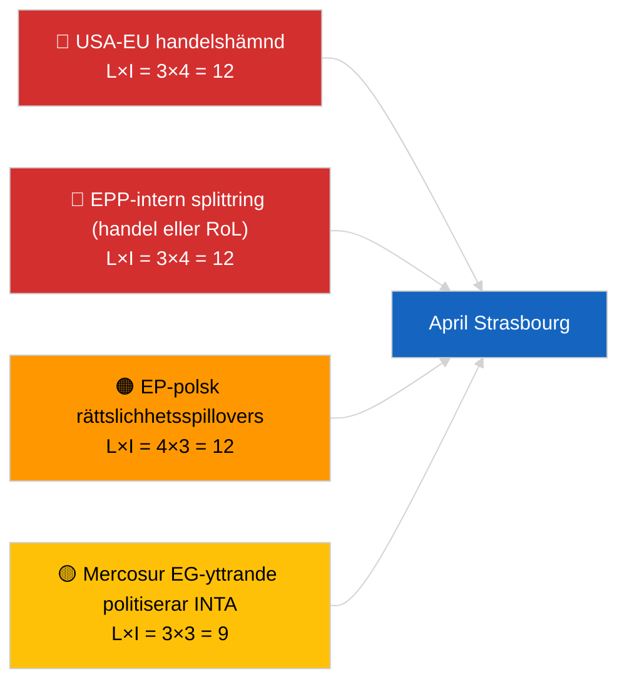

<!-- SPDX-FileCopyrightText: 2026 Hack23 AB -->
<!-- SPDX-License-Identifier: Apache-2.0 -->

# Executive Brief — Kommande Månad | 2026-04-01

**Klassificering:** OSINT | Offentligt parlamentariskt protokoll
**Konfidensgrad:** 🟡 Medel (framåtblickande; tom klassificeringsutdata begränsar djupet)
**Genererad:** 2026-04-01T00:00:00Z (retrospektiv sammanfattning)
**Artikeltyp:** Kommande Månad
**Kör-ID:** `7f928e7c-85fd-4f76-890b-f362622c3f42`
**Källa:** Europaparlamentets öppna dataportal

---

## 🎯 BLUF

**Aprilutsikterna 2026 är förankrade i Strasbourgplenarsessionen 27–30 april och den förberedande utskottsveckan 13–17 april.** Månadsöversiktskörningen returnerade **0 klassificerade aktörer** och **RUTINMÄSSIGA** dimensionspoäng, vilket återspeglar Europaparlamentets första dag efter mars-uppehållet snarare än en substantiell aprilscenarioprognos. Prioriteringar som förs vidare in i april: USA:s tullanpassning (TA-10-2026-0096), EU–Mercosur EG-domstolsyttrande (avvaktar), HDV-utsläppskrediter transponering (TA-10-2026-0084), implementering avseende georgiska politiska fångar (TA-10-2026-0083), och pågående polsk-rättsliga efterverkningar från Braun-immunitetsprecedentet (TA-10-2026-0088). Tre arbetsscenarier: **Scenario A — handelstung dagordning (55%)**, **Scenario B — rättsstatsfokus (25%)**, **Scenario C — ekonomiskt/industriellt fokus (20%)**. **🟡 MEDEL konfidensgrad** — aprilagenda ännu ej publicerad.

---

## 🧭 3 Beslut som detta underlag stöder

| # | Beslut | Vem beslutar | Deadline | Evidens |
|:-:|--------|-------------|:--------:|---------|
| 1 | **Redaktionell:** publicera som scenarioledd månadsöversikt med uttrycklig "agenda avvaktas"-varning | Redaktör | +24h | Vidareförd inventering; tre scenarier |
| 2 | **Bevakning:** förplenär underrättelsecykel 13–17 april (utskottsvecka) | Analytiker | 2026-04-13 | Första substantiella aprilsignaler |
| 3 | **Framåtbevakning:** kör om månadsöversikten T-7 till plenarsession (~20 april) med publicerad agenda | Analysansvarig | 2026-04-20 | Bekräfta scenarioval |

---

## 📰 60-Sekunders Läsning

- 🔴 **Inga nya aprilspecifika procedurer eller dagordningspunkter i dagens flöde** — Strasbourgagendan publiceras vanligtvis T-7 dagar. (🟢 Hög)
- 🟠 **Tre arbetsscenarier** för aprilplenarsessionen, dominerat av handelstung variant (55%): USA:s tullanpassning, Mercosur-yttrande, digital suveränitet. (🟡 Medel)
- 🟢 **Vidareförd rättsstatsspår:** Braun-precedentets efterverkningar, Georgienimplementering, potentiella ytterligare immunitetsförfaranden (LIBE-drivet). (🟡 Medel)
- 🟡 **Ekonomisk/industriell variant:** ECB:s årsrapportuppföljning (TA-10-2026-0034), HDV-transponeringsmotstånd från medlemsstater. (🟡 Medel)
- 🔵 **Ekonomisk kontext:** IMF april WEO-publiceringsfönstret sammanfaller med plenarsessionen — skattemässiga stressutsikter kan färga den tidiga MFF-debatten. (🟢 Hög — kalenderjustering)
- 🟣 **Korsreferens:** syskonkörningen 2026-04-01/breaking dokumenterar 6/8-mönstret med 404-fel i rådgivningsflödet som hindrade denna månadsöversiktskörning från att producera ny aktörsklassificering. (🟢 Hög)
- 🩷 **Störningsfaktor:** dominant-gruppövergrepp (PPE 38%) flaggat HÖG av det tidiga varningssystemet — mest sannolika vektorn för en aprilöverraskning är en EPP-intern splittring om handel eller rättsstat. (🟡 Medel)
- ⚪ **Vidareföring:** Bättre lagstiftning-rapporten TA-10-2026-0063 sätter baslinjen för den institutionella reformdebatten för resten av EP10.

---

## 🗂️ Toppidokument / Procedurer — Aprilbevakningslista

| Rang | EP-referens | Titel (kort) | Betydelse | Konfidensgrad | Status |
|:----:|-------------|--------------|:---------:|:-------------:|--------|
| 1 | TA-10-2026-0096 | USA:s tulltariffjustering | 7,5 | 🟢 HÖG | Antagen 26 mars; apriluppföljning förväntas |
| 2 | TA-10-2026-0008 | EU–Mercosur EG-domstolshänvisning (avvaktar yttrande) | 7,0 | 🟡 MEDEL | Domstolsyttrande förväntas före aprilplenarsessionen |
| 3 | TA-10-2026-0083 | Georgiska politiska fångar | 6,5 | 🟢 HÖG | Implementeringsrapportering förfaller |
| 4 | TA-10-2026-0088 | Braun-immunitet (precedent för följdärenden) | 6,5 | 🟢 HÖG | LIBE-uppföljningsbevakning |
| 5 | TA-10-2026-0084 | HDV-utsläppskrediter 2025–2029 | 6,0 | 🟢 HÖG | Nationell transponering |

---

## ⚠️ Risk- och Hotöversikt — Aprilutsikt

| Risk | L | I | Poäng | Utlösare | Källa | Admiralitet |
|------|:-:|:-:|:-----:|---------|-------|:-----------:|
| USA-EU handelshämnd | 3 | 4 | 12 | USA:s motmeddelande | TA-10-2026-0096 | A1 |
| EPP-intern splittring | 3 | 4 | 12 | Synlig omröstningsdivision | Koalitionsaritmetik | A2 |
| EP-polsk rättsstatsspillovers | 4 | 3 | 12 | Ytterligare immunitetsärende | TA-10-2026-0088 | A1 |
| Mercosur-yttrande politisering | 3 | 3 | 9 | Domstol publicerar före plenum | TA-10-2026-0008 | A2 |
| Tom månadsöversiktsklassificering | 3 | 2 | 6 | Omsköring också tom 2026-04-20 | Denna körning | B3 |

---

## 🔮 Viktigaste Framtida Utlösare

**Strasbourgs agendapublicering ~20 april 2026 (T-7).** Agendans sammansättning kommer att lösa den trescenariomässiga osäkerheten: handelstung viktning (Scenario A) bekräftar den dominerande vidareförda narrativen; rättsstatsviktning (Scenario B) signalerar LIBE-momentum från Braun-precedentet; ekonomisk/industriell viktning (Scenario C) lyfter ECON- och ENVI-filer.

---

## 🛡️ Källkvalitetsbedömning

- **Primärkällor:** Europaparlamentets öppna dataportal — analyskörning `7f928e7c-85fd-4f76-890b-f362622c3f42`; mars 2026 antagna-texter-inventering (vidareförd).
- **Databegränsningar:** Dagens körning producerade 0 aktörer och RUTINMÄSSIG signifikans; framåtinferens är förankrad till föregående dags artiklar och EP:s kalender, inte regenererad scenariomodellering.
- **Konfidensgrad för scenarieprobabiliteter:** 🟡 Medel (kvalitativ viktning).
- **Konfidensgrad för vidareförd prioriteringslista:** 🟢 Hög.

---

## 📎 Länkar

| Länk | Sökväg |
|------|--------|
| Artikel | `./article.md` |
| Klassificering (tom) | `./classification/` |
| Syskonkörningar | `analysis/daily/2026-04-01/breaking/`, `committee-reports/`, `motions/`, `propositions/` |
| Källa — mars lagstiftningsinventering | `analysis/daily/2026-03-10/` → `2026-03-26/` |
| Manifest | `./manifest.json` |

---

## 🔄 Korsreferens

**Tidigare körningar:** Strasbourg 9–12 mars och Bryssel miniplenarsession 25–26 mars ger den substantiella vidareförda basen som används av denna månadsöversikt.

**Efterföljande verifiering:** Jämför med den efterapril-plenara månadsöversikten (förväntas tidigt maj 2026) för att betygsätta scenarioprognosprecisionen.

---

**Dokumentkontroll**
- **Mall:** `/analysis/templates/executive-brief.md`
- **Artefaktsökväg:** `analysis/daily/2026-04-01/month-ahead/executive-brief.md`
- **Klassificering:** Offentlig
- **Retrospektiv generering:** Återfyllningssession.
