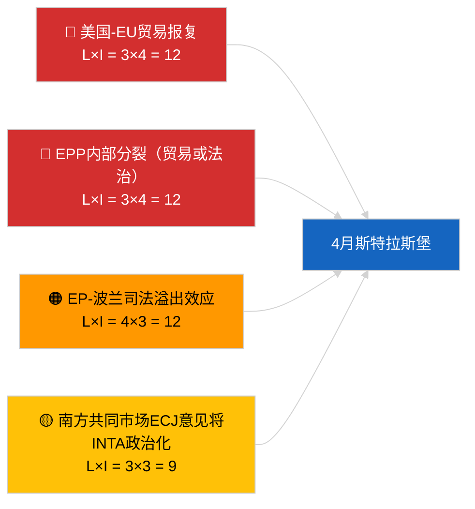

<!-- SPDX-FileCopyrightText: 2026 Hack23 AB -->
<!-- SPDX-License-Identifier: Apache-2.0 -->

# Executive Brief — 下月展望 | 2026-04-01

**分类：** OSINT | 公开议会记录
**置信度：** 🟡 中等（前瞻性；空分类输出限制深度）
**生成时间：** 2026-04-01T00:00:00Z（回溯简报）
**文章类型：** 下月展望
**运行ID：** `7f928e7c-85fd-4f76-890b-f362622c3f42`
**来源：** 欧洲议会开放数据门户

---

## 🎯 BLUF

**2026年4月展望以4月27日至30日斯特拉斯堡全会和4月13日至17日筹备委员会周为核心。** 月度前瞻运行返回**0名分类行为者**和**常规**维度得分，反映了欧洲议会在3月休会后首日状态，而非提供实质性的4月情景预测。延续至4月的优先事项：美国关税调整（TA-10-2026-0096）、欧盟-南方共同市场欧盟法院意见（待定）、HDV排放信用额度移植（TA-10-2026-0084）、格鲁吉亚政治犯实施（TA-10-2026-0083）以及由布劳恩豁免先例（TA-10-2026-0088）引发的波兰司法后续效应。三个工作情景：**情景A — 贸易为重议程（55%）**、**情景B — 法治聚焦（25%）**、**情景C — 经济/工业聚焦（20%）**。**🟡 中等置信度** — 4月议程尚未公布。

---

## 🧭 本简报支持的3项决策

| # | 决策 | 决策者 | 截止日期 | 依据 |
|:-:|------|--------|:--------:|------|
| 1 | **编辑：** 以情景驱动的月度前瞻发布，明确注明"议程待定"说明 | 编辑 | +24小时 | 延续库存；三种情景 |
| 2 | **监测：** 4月13日至17日（委员会周）全会前情报周期 | 分析师 | 2026-04-13 | 首批实质性4月信号 |
| 3 | **前瞻监测：** 在T-7（约4月20日）以已公布议程重新运行月度前瞻 | 分析负责人 | 2026-04-20 | 确认情景选择 |

---

## 📰 60秒阅读

- 🔴 **今日数据流中无新的4月特定程序或议程项目** — 斯特拉斯堡议程通常在T-7天公布。（🟢 高）
- 🟠 **三个工作情景**：4月全会以贸易为重变体（55%）为主导：美国关税调整、南方共同市场意见、数字主权。（🟡 中等）
- 🟢 **延续法治轨道：** 布劳恩先例后续影响、格鲁吉亚实施、LIBE主导的潜在额外豁免程序。（🟡 中等）
- 🟡 **经济/工业变体：** 欧洲央行年度报告跟进（TA-10-2026-0034）、成员国对HDV移植的抵制。（🟡 中等）
- 🔵 **经济背景：** IMF四月 WEO 发布窗口与全会重叠 — 财政压力预测可能渲染MFF早期辩论色彩。（🟢 高 — 日历对齐）
- 🟣 **交叉参考：** 兄弟运行2026-04-01/breaking记录了咨询信息流中6/8件的404模式，导致本月度前瞻运行无法生成新的行为者分类。（🟢 高）
- 🩷 **颠覆向量：** 主导群体独大（PPE 38%）被早期预警系统标记为高风险 — 4月意外事件最可能的向量是EPP在贸易或法治问题上的内部分裂。（🟡 中等）
- ⚪ **延续：** "更好立法"报告 TA-10-2026-0063 为EP10剩余任期的制度改革辩论设定基准。

---

## 🗂️ 重要文件/程序 — 4月监视列表

| 排名 | 欧洲议会参考 | 标题（简称） | 重要性 | 置信度 | 状态 |
|:----:|------------|------------|:------:|:------:|------|
| 1 | TA-10-2026-0096 | 美国关税调整 | 7.5 | 🟢 高 | 3月26日通过；4月跟进预期 |
| 2 | TA-10-2026-0008 | 欧盟-南方共同市场欧盟法院提交（意见待定） | 7.0 | 🟡 中等 | 法院意见预计于4月全会前 |
| 3 | TA-10-2026-0083 | 格鲁吉亚政治犯 | 6.5 | 🟢 高 | 实施报告到期 |
| 4 | TA-10-2026-0088 | 布劳恩豁免（后续案例先例） | 6.5 | 🟢 高 | LIBE后续监测 |
| 5 | TA-10-2026-0084 | HDV排放信用额度2025-2029 | 6.0 | 🟢 高 | 国家移植 |

---

## ⚠️ 风险与威胁快照 — 4月展望

| 风险 | L | I | 分数 | 触发因素 | 来源 | 信息评级 |
|------|:-:|:-:|:----:|---------|------|:--------:|
| 美国-EU贸易报复 | 3 | 4 | 12 | 美国反向声明 | TA-10-2026-0096 | A1 |
| EPP内部分裂 | 3 | 4 | 12 | 可见投票分歧 | 联盟算术 | A2 |
| EP-波兰司法溢出效应 | 4 | 3 | 12 | 额外豁免案件 | TA-10-2026-0088 | A1 |
| 南方共同市场意见政治化 | 3 | 3 | 9 | 法院在全会前公布 | TA-10-2026-0008 | A2 |
| 空月度前瞻分类 | 3 | 2 | 6 | 重新运行亦为空 2026-04-20 | 本次运行 | B3 |

---

## 🔮 最重要前瞻触发因素

**斯特拉斯堡议程公布 ~2026年4月20日（T-7）。** 议程构成将解决三情景不确定性：贸易为重权重（情景A）确认主导延续叙事；法治权重（情景B）表明LIBE从布劳恩先例获得动力；经济/工业权重（情景C）提升ECON和ENVI文件。

---

## 🛡️ 信息来源质量评估

- **主要来源：** 欧洲议会开放数据门户 — 分析运行 `7f928e7c-85fd-4f76-890b-f362622c3f42`；2026年3月通过文本库存（延续）。
- **数据局限性：** 今日运行产生0名行为者和常规重要性；前瞻性推断基于前一天的文章和欧洲议会日历，非重新生成的情景建模。
- **情景概率置信度：** 🟡 中等（定性加权）。
- **延续优先事项列表置信度：** 🟢 高。

---

## 📎 链接

| 链接 | 路径 |
|------|------|
| 文章 | `./article.md` |
| 分类（空） | `./classification/` |
| 兄弟运行 | `analysis/daily/2026-04-01/breaking/`, `committee-reports/`, `motions/`, `propositions/` |
| 来源 — 3月立法库存 | `analysis/daily/2026-03-10/` → `2026-03-26/` |
| 清单 | `./manifest.json` |

---

## 🔄 交叉参考

**往期运行：** 3月9日至12日斯特拉斯堡和3月25日至26日布鲁塞尔小型全会提供了本月度前瞻所使用的实质性延续基础。

**后续核实：** 与4月全会后月度回顾（预计2026年5月初）进行比较，以评估情景预测准确性。

---

**文件管理**
- **模板：** `/analysis/templates/executive-brief.md`
- **制品路径：** `analysis/daily/2026-04-01/month-ahead/executive-brief.md`
- **分类：** 公开
- **回溯生成：** 补档会话。
