# Motions — 2026-04-01

<h2 id="section-executive-brief">Executive Brief</h2>

### 🎯 BLUF

**No new motions for a resolution recorded on 2026-04-01.** Analysis run `6ab9ff5b-5062-4c7c-8625-af376a01eb16` returned **0 classified actors** and **ROUTINE** significance — consistent with the EP being in inter-sessional recess (27 March → 26 April). Motions for a resolution are typically tabled in the working week immediately preceding a plenary; no such tabling is expected before mid-April. The substantive motions baseline therefore remains the carry-over from the 9-12 March Strasbourg week (Georgia political prisoners TA-10-2026-0083, HDV emission credits TA-10-2026-0084, ECB Vice-President TA-10-2026-0060) and the 25-26 March Brussels mini-plenary (US customs tariff TA-10-2026-0096, Braun immunity TA-10-2026-0088). **🟢 HIGH confidence** the empty state is calendar-driven.

---

### 🧭 3 Decisions This Brief Supports

| # | Decision | Who Decides | Deadline | Evidence |
|:-:|----------|-------------|:--------:|----------|
| 1 | **Editorial:** SKIP motions daily; produce week-recap | Editor | +24h | Empty run output |
| 2 | **Monitoring:** flag first wave of April motions for ~17-20 April (T-7 to T-10) | Analyst | 2026-04-17 | EP tabling pattern |
| 3 | **Forward-watch:** scenario-A trade-heavy weighting predicts US-tariff- and Mercosur-themed motions | Analysis lead | 2026-04-20 | Carry-over priorities |

---

### 📰 60-Second Read

- 🔴 **No new motions tabled** on 2026-04-01; recess week, no tabling activity expected. (🟢 High)
- 🟠 **0 actors classified** in this motions-focused run; no rapporteurs or co-signatories identified. (🟢 High)
- 🟢 **Carry-over motions baseline:** five high-significance March texts remain the active reference points for April-plenary motion-stage activity. (🟢 High)
- 🟡 **Risk dimensions all "none"** — no acute motions-stage risk flagged today. (🟢 High)
- 🔵 **Economic context:** US customs tariff (TA-10-2026-0096) and ECB Vice-President (TA-10-2026-0060) are the dominant economic motion-baseline files. (🟢 High)
- 🟣 **Cross-reference:** sibling 2026-04-01/breaking documents 6/8 advisory-feed 404 pattern that explains today's data void. (🟢 High)
- 🩷 **Disruption vector:** none acute; structural PPE-dominance and external US-trade pressure inherited. (🟡 Medium)
- ⚪ **Carry-forward:** Mercosur ECJ-referral (TA-10-2026-0008) likely to spawn motion(s) once Court opinion lands.

---

### 🗂️ Top Documents / Procedures — Motions Watch

| Rank | EP reference | Title (short) | Significance | Confidence | Status |
|:----:|--------------|---------------|:------------:|:----------:|--------|
| 1 | — | No new motions on 2026-04-01 | 0.0 | 🟢 HIGH | Recess — no tabling |
| 2 | TA-10-2026-0083 | Georgia political prisoners (carry-over) | 7.0 | 🟢 HIGH | Implementation reporting due |
| 3 | TA-10-2026-0096 | US customs tariff (carry-over) | 7.0 | 🟢 HIGH | Follow-up motion likely in April |

---

### ⚠️ Risk & Threat Snapshot

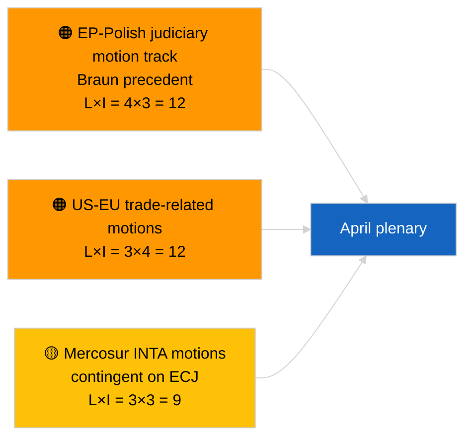
```mermaid
%%{init: {"theme":"dark"}}%%
graph LR
    R1["🟠 EP-Polish judiciary motion track<br/>Braun precedent<br/>L×I = 4×3 = 12"] --> CONS["April plenary"]
    R2["🟠 US-EU trade-related motions<br/>L×I = 3×4 = 12"] --> CONS
    R3["🟡 Mercosur INTA motions<br/>contingent on ECJ<br/>L×I = 3×3 = 9"] --> CONS
    style R1 fill:#FF9800,color:#000000
    style R2 fill:#FF9800,color:#000000
    style R3 fill:#FFC107,color:#000000
    style CONS fill:#1565C0,color:#FFFFFF
```

| Risk | L | I | Score | Trigger | Source | Admiralty |
|------|:-:|:-:|:-----:|---------|--------|:---------:|
| EP-Polish judiciary motion track | 4 | 3 | 12 | New immunity case | TA-10-2026-0088 | A1 |
| US-EU trade-related motions | 3 | 4 | 12 | US action triggers motion | TA-10-2026-0096 | A1 |
| Mercosur motions (contingent) | 3 | 3 | 9 | Court opinion lands | TA-10-2026-0008 | A2 |
| PPE structural dominance | 4 | 3 | 12 | Asymmetric motion-tabling | Coalition arithmetic | A2 |

---

### 🔮 Top Forward Trigger

**First wave of April-plenary motions tabled ~17-20 April 2026.** Topic mix will indicate whether trade-heavy (Scenario A), rule-of-law (Scenario B), or economic/industrial (Scenario C) framing dominates the 27-30 April Strasbourg session.

---

### 🛡️ Source Quality Assessment

- **Primary sources:** EP Open Data Portal — analysis run `6ab9ff5b-5062-4c7c-8625-af376a01eb16` and March 2026 motions/resolutions inventory.
- **Data limitations:** `get_parliamentary_questions_feed` and related feeds returned 404 in concurrent breaking run; confidence on absence-of-tabling activity is anchored to the EP calendar.
- **Confidence on calendar-driven inactivity:** 🟢 HIGH.

---

### 📎 Links

| Link | Path |
|------|------|
| Article | `./article.md` |
| Classification (empty) | `./classification/` |
| Sibling runs | `analysis/daily/2026-04-01/breaking/`, `committee-reports/`, `month-ahead/`, `propositions/` |
| Manifest | `./manifest.json` |

---

### 🔄 Cross-Reference

**Concurrent empty-template runs:** committee-reports, month-ahead, propositions on 2026-04-01 all show identical 0-actor / ROUTINE output, confirming the system-wide recess-period state.

---

**Document Control**
- **Template:** `/analysis/templates/executive-brief.md`
- **Artifact path:** `analysis/daily/2026-04-01/motions/executive-brief.md`
- **Classification:** Public
- **Retrospective generation:** Back-fill session.

<h2 id="reader-intelligence-guide">Reader Intelligence Guide</h2>

Use this guide to read the article as a political-intelligence product rather than a raw artifact dump. High-value reader lenses appear first; technical provenance remains available in the audit appendices.

| Reader need | What you'll get | Source artifact |
|---|---|---|
| [BLUF and editorial decisions](#section-executive-brief) | fast answer to what happened, why it matters, who is accountable, and the next dated trigger | `executive-brief.md` |
| [Actors and forces](#section-actors-forces) | who is driving the story, what political forces line up behind them, and which institutional levers they can pull | `classification/actor-mapping.md` |
| [Coalitions and voting](#section-coalitions-voting) | political group alignment, voting evidence, and coalition pressure points | `existing/voting-patterns.md` |
| [Risk assessment](#section-risk) | policy, institutional, coalition, communications, and implementation risk register | `risk-scoring/risk-matrix.md` |
| [Threat landscape](#section-threat) | hostile actors, attack vectors, consequence trees, and legislative-disruption pathways | `threat-assessment/actor-threat-profiles.md` |
| [Cross-run continuity](#section-continuity) | what changed since prior sessions and how confidence shifted between runs | `existing/cross-session-intelligence.md` |
| [Deep analysis](#section-deep-analysis) | long-form Economist-style explanation for readers who want the full argument | `existing/deep-analysis.md` |
| [Supplementary intelligence](#section-supplementary-intelligence) | additional markdown discovered in the run that has not yet been assigned to a canonical section | `executive-brief_ar.md` |

<h2 id="section-actors-forces">Actors & Forces</h2>

### Actor Mapping

### Actors Identified: 0

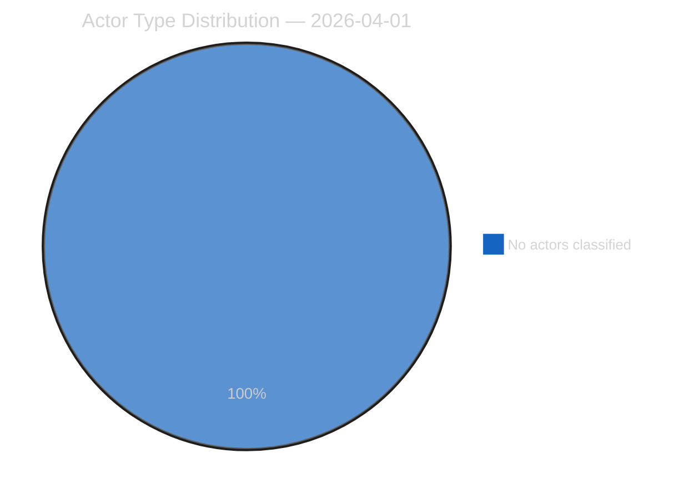
```mermaid
%%{init: {"theme":"dark","themeVariables":{"primaryColor":"#1565C0","primaryTextColor":"#ffffff","primaryBorderColor":"#0A3F7F","lineColor":"#90CAF9","secondaryColor":"#2E7D32","secondaryTextColor":"#ffffff","secondaryBorderColor":"#0F3F00","tertiaryColor":"#FF9800","tertiaryTextColor":"#000000","tertiaryBorderColor":"#7F4F00","mainBkg":"#1565C0","secondBkg":"#2E7D32","tertiaryBkg":"#FF9800","noteBkgColor":"#FFC107","noteTextColor":"#000000","noteBorderColor":"#7F6000","errorBkgColor":"#D32F2F","errorTextColor":"#ffffff","fontFamily":"Inter, Helvetica, Arial, sans-serif","pie1":"#1565C0","pie2":"#2E7D32","pie3":"#FF9800","pie4":"#D32F2F","pie5":"#FFC107","pie6":"#7B1FA2","pie7":"#9E9E9E","pie8":"#0288D1","pie9":"#388E3C","pie10":"#F57C00","pie11":"#C62828","pie12":"#FBC02D","pieTitleTextSize":"18px","pieSectionTextSize":"14px","pieLegendTextSize":"13px","pieStrokeColor":"#1e1e1e","pieOuterStrokeColor":"#1e1e1e","git0":"#1565C0","git1":"#2E7D32","git2":"#FF9800","git3":"#D32F2F","gitBranchLabel0":"#ffffff","gitBranchLabel1":"#ffffff","gitBranchLabel2":"#000000","gitBranchLabel3":"#ffffff","cScale0":"#1565C0","cScale1":"#2E7D32","cScale2":"#FF9800","cScale3":"#D32F2F","cScale4":"#FFC107","cScale5":"#7B1FA2","cScale6":"#9E9E9E","cScale7":"#0288D1","xyChart":{"backgroundColor":"#1e1e1e","plotColorPalette":"#1565C0,#2E7D32,#FF9800,#D32F2F,#FFC107,#7B1FA2,#9E9E9E"}}}}%%
pie title Actor Type Distribution — 2026-04-01
    "No actors classified" : 1
```

### Actor Classification

| Actor | Type | Influence | Position | Role |
|-------|------|-----------|----------|------|
| — | — | — | — | — |

### Type Counts

| Type | Count |
|------|-------|
| — | 0 |

### Date: 2026-04-01

### Forces Analysis

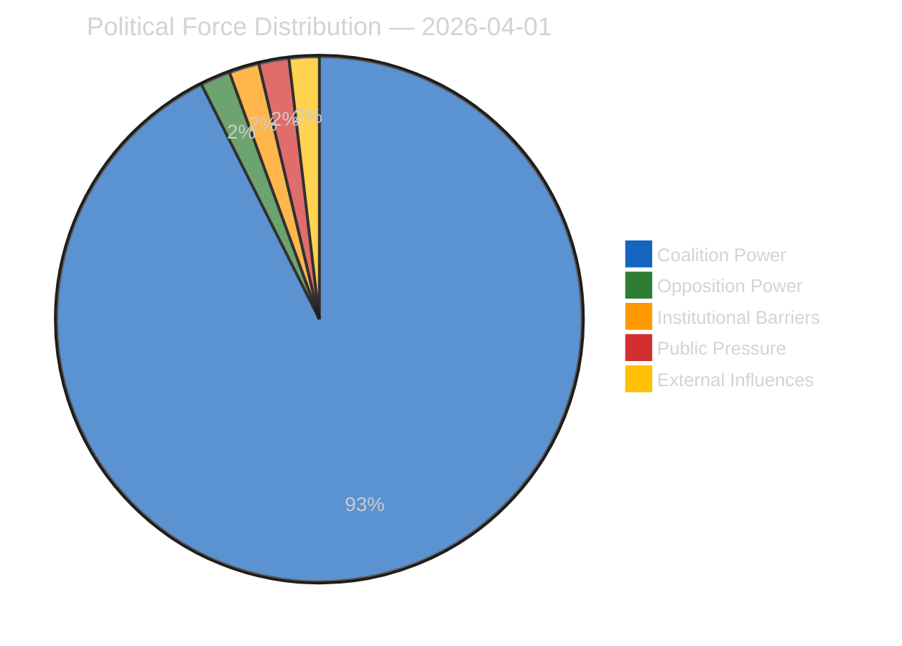
```mermaid
%%{init: {"theme":"dark","themeVariables":{"primaryColor":"#1565C0","primaryTextColor":"#ffffff","primaryBorderColor":"#0A3F7F","lineColor":"#90CAF9","secondaryColor":"#2E7D32","secondaryTextColor":"#ffffff","secondaryBorderColor":"#0F3F00","tertiaryColor":"#FF9800","tertiaryTextColor":"#000000","tertiaryBorderColor":"#7F4F00","mainBkg":"#1565C0","secondBkg":"#2E7D32","tertiaryBkg":"#FF9800","noteBkgColor":"#FFC107","noteTextColor":"#000000","noteBorderColor":"#7F6000","errorBkgColor":"#D32F2F","errorTextColor":"#ffffff","fontFamily":"Inter, Helvetica, Arial, sans-serif","pie1":"#1565C0","pie2":"#2E7D32","pie3":"#FF9800","pie4":"#D32F2F","pie5":"#FFC107","pie6":"#7B1FA2","pie7":"#9E9E9E","pie8":"#0288D1","pie9":"#388E3C","pie10":"#F57C00","pie11":"#C62828","pie12":"#FBC02D","pieTitleTextSize":"18px","pieSectionTextSize":"14px","pieLegendTextSize":"13px","pieStrokeColor":"#1e1e1e","pieOuterStrokeColor":"#1e1e1e","git0":"#1565C0","git1":"#2E7D32","git2":"#FF9800","git3":"#D32F2F","gitBranchLabel0":"#ffffff","gitBranchLabel1":"#ffffff","gitBranchLabel2":"#000000","gitBranchLabel3":"#ffffff","cScale0":"#1565C0","cScale1":"#2E7D32","cScale2":"#FF9800","cScale3":"#D32F2F","cScale4":"#FFC107","cScale5":"#7B1FA2","cScale6":"#9E9E9E","cScale7":"#0288D1","xyChart":{"backgroundColor":"#1e1e1e","plotColorPalette":"#1565C0,#2E7D32,#FF9800,#D32F2F,#FFC107,#7B1FA2,#9E9E9E"}}}}%%
pie title Political Force Distribution — 2026-04-01
    "Coalition Power" : 50
    "Opposition Power" : 1
    "Institutional Barriers" : 1
    "Public Pressure" : 1
    "External Influences" : 1
```

### Forces Data

| Force | Trend | Strength | Key Actors | Confidence |
|-------|-------|----------|------------|------------|
| Coalition Power | stable | 50% | — | low |
| Opposition Power | stable | 0% | — | low |
| Institutional Barriers | stable | 0% | — | low |
| Public Pressure | stable | 0% | — | low |
| External Influences | stable | 0% | — | low |

### Balance

| Metric | Value |
|--------|-------|
| Coalition vs Opposition | 50% vs 1% |
| Dominant force | Coalition |
| Date | 2026-04-01 |

### Date: 2026-04-01

### Impact Matrix

### Overall Significance: **ROUTINE**

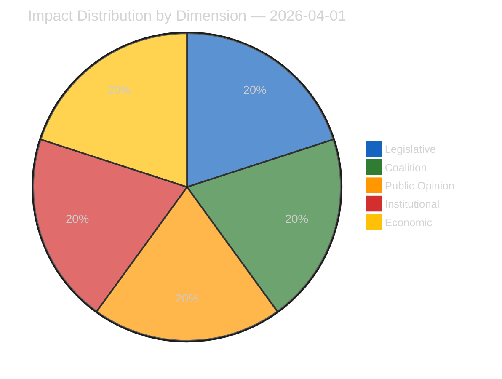
```mermaid
%%{init: {"theme":"dark","themeVariables":{"primaryColor":"#1565C0","primaryTextColor":"#ffffff","primaryBorderColor":"#0A3F7F","lineColor":"#90CAF9","secondaryColor":"#2E7D32","secondaryTextColor":"#ffffff","secondaryBorderColor":"#0F3F00","tertiaryColor":"#FF9800","tertiaryTextColor":"#000000","tertiaryBorderColor":"#7F4F00","mainBkg":"#1565C0","secondBkg":"#2E7D32","tertiaryBkg":"#FF9800","noteBkgColor":"#FFC107","noteTextColor":"#000000","noteBorderColor":"#7F6000","errorBkgColor":"#D32F2F","errorTextColor":"#ffffff","fontFamily":"Inter, Helvetica, Arial, sans-serif","pie1":"#1565C0","pie2":"#2E7D32","pie3":"#FF9800","pie4":"#D32F2F","pie5":"#FFC107","pie6":"#7B1FA2","pie7":"#9E9E9E","pie8":"#0288D1","pie9":"#388E3C","pie10":"#F57C00","pie11":"#C62828","pie12":"#FBC02D","pieTitleTextSize":"18px","pieSectionTextSize":"14px","pieLegendTextSize":"13px","pieStrokeColor":"#1e1e1e","pieOuterStrokeColor":"#1e1e1e","git0":"#1565C0","git1":"#2E7D32","git2":"#FF9800","git3":"#D32F2F","gitBranchLabel0":"#ffffff","gitBranchLabel1":"#ffffff","gitBranchLabel2":"#000000","gitBranchLabel3":"#ffffff","cScale0":"#1565C0","cScale1":"#2E7D32","cScale2":"#FF9800","cScale3":"#D32F2F","cScale4":"#FFC107","cScale5":"#7B1FA2","cScale6":"#9E9E9E","cScale7":"#0288D1","xyChart":{"backgroundColor":"#1e1e1e","plotColorPalette":"#1565C0,#2E7D32,#FF9800,#D32F2F,#FFC107,#7B1FA2,#9E9E9E"}}}}%%
pie title Impact Distribution by Dimension — 2026-04-01
    "Legislative" : 5
    "Coalition" : 5
    "Public Opinion" : 5
    "Institutional" : 5
    "Economic" : 5
```

### Impact Dimensions

| Dimension | Level | Indicator | Numeric |
|-----------|-------|-----------|---------|
| Legislative | none | 🟢 | 5 |
| Coalition | none | 🟢 | 5 |
| Public Opinion | none | 🟢 | 5 |
| Institutional | none | 🟢 | 5 |
| Economic | none | 🟢 | 5 |

### Summary

| Metric | Value |
|--------|-------|
| Overall significance | ROUTINE |
| Highest impact | Legislative |
| Date | 2026-04-01 |

### Date: 2026-04-01

### Significance Assessment

### Overall Significance: **ROUTINE**

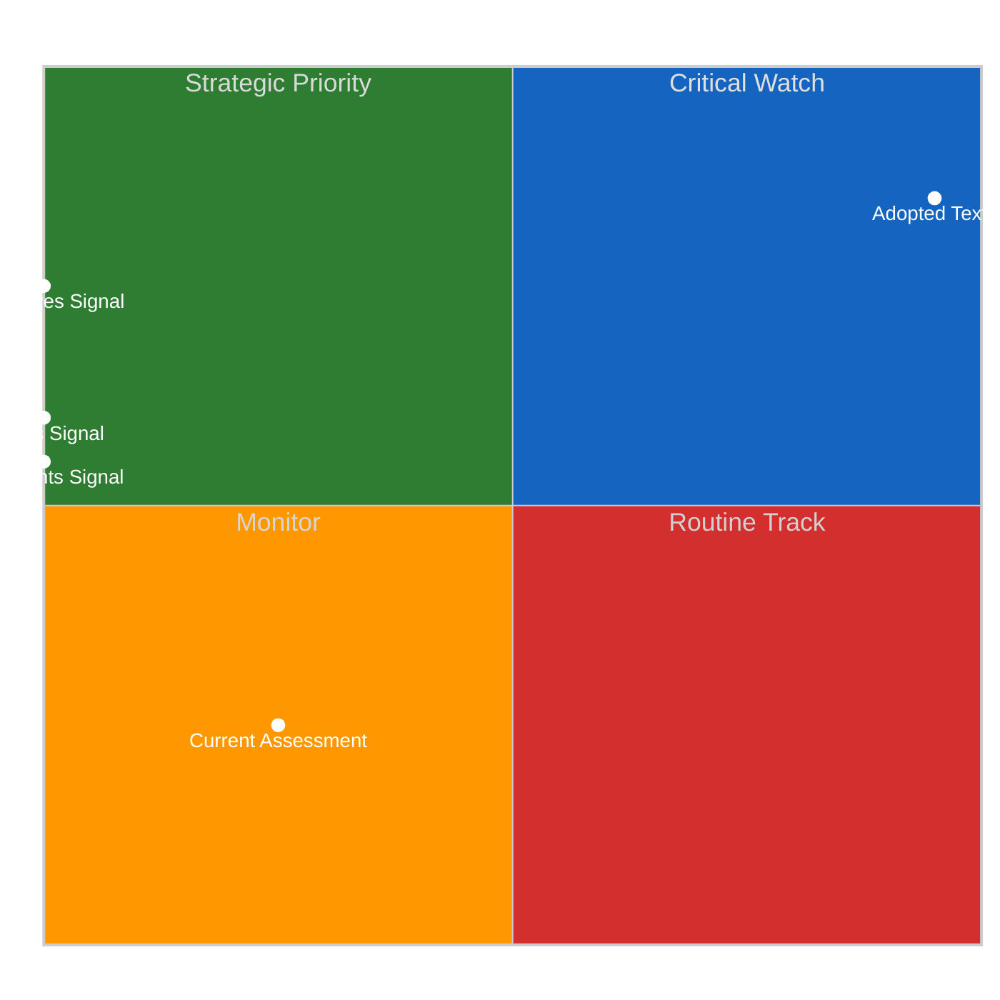
```mermaid
%%{init: {
  "theme": "dark",
  "themeVariables": {
    "quadrant1Fill": "#1565C0",
    "quadrant2Fill": "#2E7D32",
    "quadrant3Fill": "#FF9800",
    "quadrant4Fill": "#D32F2F",
    "quadrantTitleFill": "#ffffff",
    "quadrantPointFill": "#ffffff",
    "quadrantPointTextFill": "#ffffff",
    "quadrantXAxisTextFill": "#ffffff",
    "quadrantYAxisTextFill": "#ffffff"
  },
  "quadrantChart": {
    "chartWidth": 700,
    "chartHeight": 700,
    "pointLabelFontSize": 14,
    "titleFontSize": 22,
    "quadrantLabelFontSize": 18,
    "xAxisLabelFontSize": 16,
    "yAxisLabelFontSize": 16
  }
}}%%
quadrantChart
    title Political Significance Assessment — 2026-04-01
    x-axis Low Volume --> High Volume
    y-axis Low Impact --> High Impact
    quadrant-1 Critical Watch
    quadrant-2 Strategic Priority
    quadrant-3 Monitor
    quadrant-4 Routine Track
    Current Assessment: [0.25, 0.25]
    Events Signal: [0.00, 0.60]
    Documents Signal: [0.00, 0.55]
    Procedures Signal: [0.00, 0.75]
    Adopted Texts: [0.95, 0.85]
```

### 5-Signal Model Scores

| Signal | Raw Data | Score |
|--------|----------|-------|
| Volume | 0 events, 0 documents | 0.0/5 |
| Pipeline | 0 procedures | 0.0/5 |
| Output | 242 adopted texts | 5.0/5 |
| Anomalies | Pattern deviation detection | — |
| Coalition | Group alignment analysis | — |

### Data Summary

| Metric | Value |
|--------|-------|
| Computed significance | ROUTINE |
| Total data points | 242 |
| Events | 0 |
| Documents | 0 |
| Procedures | 0 |
| Adopted texts | 242 |
| Date | 2026-04-01 |

### Date: 2026-04-01

<h2 id="section-coalitions-voting">Coalitions & Voting</h2>

### Voting Patterns

### Overview
Detection and analysis of voting trends across European Parliament proceedings.

### Detected Trends
| Trend ID | Direction | Confidence | Data Points |
|----------|-----------|------------|-------------|
| No trend data available | — | — | — |

### Summary
- **Trends identified**: 0
- **Records analysed**: 0
- **Date**: 2026-04-01

<h2 id="section-risk">Risk Assessment</h2>

### Risk Matrix

### Overview

Quantitative risk scoring across 0 identified political dimensions.
This matrix uses a standardized likelihood × impact framework to quantify and
prioritize political risks affecting the European Parliament legislative process.

### Risk Heat Map

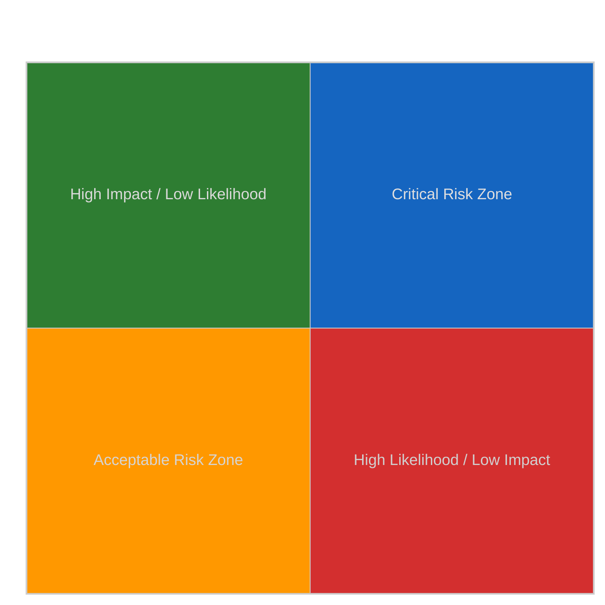
```mermaid
%%{init: {
  "theme": "dark",
  "themeVariables": {
    "quadrant1Fill": "#1565C0",
    "quadrant2Fill": "#2E7D32",
    "quadrant3Fill": "#FF9800",
    "quadrant4Fill": "#D32F2F",
    "quadrantTitleFill": "#ffffff",
    "quadrantPointFill": "#ffffff",
    "quadrantPointTextFill": "#ffffff",
    "quadrantXAxisTextFill": "#ffffff",
    "quadrantYAxisTextFill": "#ffffff"
  },
  "quadrantChart": {
    "chartWidth": 700,
    "chartHeight": 700,
    "pointLabelFontSize": 14,
    "titleFontSize": 22,
    "quadrantLabelFontSize": 18,
    "xAxisLabelFontSize": 16,
    "yAxisLabelFontSize": 16
  }
}}%%
quadrantChart
    title Political Risk Heat Map — 2026-04-01
    x-axis Low Likelihood --> High Likelihood
    y-axis Low Impact --> High Impact
    quadrant-1 Critical Risk Zone
    quadrant-2 High Impact / Low Likelihood
    quadrant-3 Acceptable Risk Zone
    quadrant-4 High Likelihood / Low Impact

```

### Risk Matrix

| Risk ID | Description | Likelihood | Impact | Score | Level |
|---------|-------------|------------|--------|-------|-------|
| — | — | — | — | — | — |

> **Risk Score** = Likelihood × Impact. **Levels**: 🟢 LOW (≤1.0), 🟡 MEDIUM (≤2.0), 🟠 HIGH (≤3.5), 🔴 CRITICAL (>3.5)

### Risk Assessment Details

| — | — | — | — | — | — |

### Risk Mitigation Framework

| Risk Level | Count | Tolerance | Action Required |
|------------|-------|-----------|-----------------|
| 🔴 CRITICAL | 0 | Zero tolerance | Immediate escalation |
| 🟠 HIGH | 0 | Low tolerance | Active mitigation |
| 🟡 MEDIUM | 0 | Moderate | Enhanced monitoring |
| 🟢 LOW | 0 | Acceptable | Routine tracking |

### Date: 2026-04-01

### Quantitative Swot

### Executive Summary

**Strategic Position Score**: 3.4/10
**Overall Assessment**: Weak strategic position: weaknesses and threats dominate — urgent mitigation needed.
**Analysis Date**: 2026-04-01

> This SWOT analysis is derived from 0 procedures, 0 events, 242 adopted texts, 0 documents, 0 voting records, and 0 coalition data points fetched from the European Parliament.

### SWOT Quadrant Chart

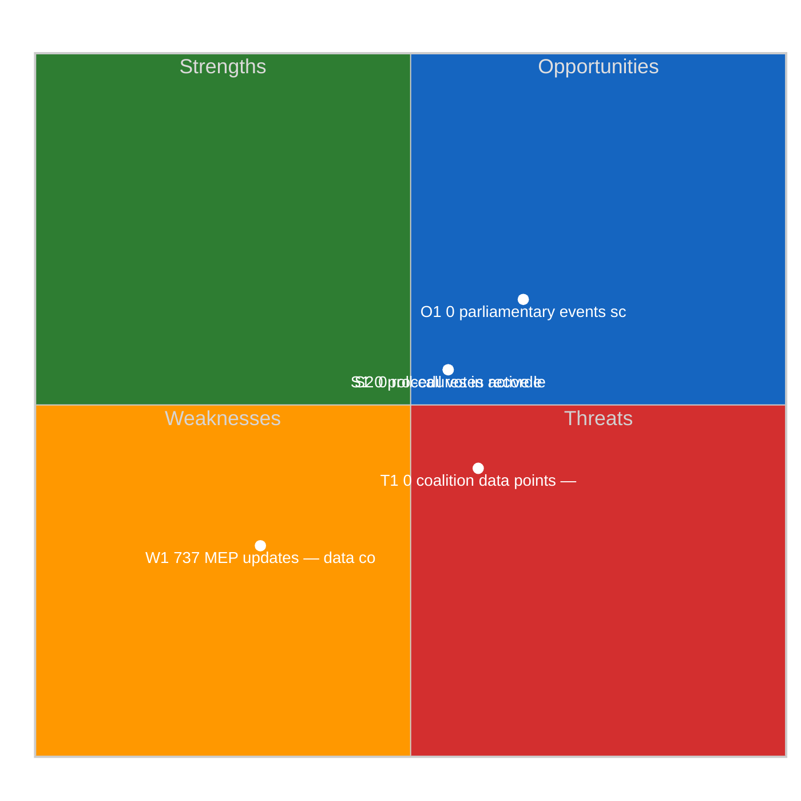
```mermaid
%%{init: {
  "theme": "dark",
  "themeVariables": {
    "quadrant1Fill": "#1565C0",
    "quadrant2Fill": "#2E7D32",
    "quadrant3Fill": "#FF9800",
    "quadrant4Fill": "#D32F2F",
    "quadrantTitleFill": "#ffffff",
    "quadrantPointFill": "#ffffff",
    "quadrantPointTextFill": "#ffffff",
    "quadrantXAxisTextFill": "#ffffff",
    "quadrantYAxisTextFill": "#ffffff"
  },
  "quadrantChart": {
    "chartWidth": 700,
    "chartHeight": 700,
    "pointLabelFontSize": 14,
    "titleFontSize": 22,
    "quadrantLabelFontSize": 18,
    "xAxisLabelFontSize": 16,
    "yAxisLabelFontSize": 16
  }
}}%%
quadrantChart
    title Political SWOT — Strategic Position (2026-04-01)
    x-axis Low Impact --> High Impact
    y-axis Low Priority --> High Priority
    quadrant-1 Opportunities
    quadrant-2 Strengths
    quadrant-3 Weaknesses
    quadrant-4 Threats
    S1 0 procedures in active le: [0.55, 0.55]
    S2 0 roll-call votes recorde: [0.55, 0.55]
    W1 737 MEP updates — data co: [0.30, 0.30]
    O1 0 parliamentary events sc: [0.65, 0.65]
    T1 0 coalition data points —: [0.59, 0.41]
```

### SWOT Overview

| Category | Items | Avg Score | Trend |
|----------|-------|-----------|-------|
| 🟢 Strengths | 2 | 0.0 | stable |
| 🔴 Weaknesses | 1 | 2.0 | stable |
| 🔵 Opportunities | 1 | 1.5 | stable |
| 🟠 Threats | 1 | 0.9 | stable |

### 🟢 Strengths

#### S1: 0 procedures in active legislative pipeline
- **Score**: 0.0/5
- **Confidence**: low
- **Trend**: stable
- **Evidence**:
  - 0 procedures tracked in current period
  - 242 texts adopted
  - 0 documents published

#### S2: 0 roll-call votes recorded with 0 questions
- **Score**: 0.0/5
- **Confidence**: low
- **Trend**: stable
- **Evidence**:
  - 0 voting records available
  - 0 parliamentary questions filed
  - 737 MEP activity updates

### 🔴 Weaknesses

#### W1: 737 MEP updates — data coverage gap assessment
- **Score**: 2.0/5
- **Confidence**: medium
- **Trend**: stable
- **Evidence**:
  - 737 MEP updates in current period
  - 0 documents vs 0 procedures ratio
  - Data freshness depends on EP feed update frequency

### 🔵 Opportunities

#### O1: 0 parliamentary events scheduled
- **Score**: 1.5/5
- **Confidence**: medium
- **Trend**: stable
- **Evidence**:
  - 0 events in analysis period
  - 242 texts adopted indicates legislative throughput
  - 0 procedures in various stages

### 🟠 Threats

#### T1: 0 coalition data points — cohesion monitoring
- **Score**: 0.9/5
- **Confidence**: low
- **Trend**: stable
- **Evidence**:
  - 0 coalition observations recorded
  - Cross-reference with 0 voting records
  - 0 procedures may be affected by coalition shifts

### Cross-Impact Matrix

| Interaction | Net Effect | Rationale |
|-------------|-----------|----------|
| strength #1 × threat #1 | 0.00 | Strength "0 procedures in active legislative pipeline" partially mitigates threat "0 coalition data points — cohesion monitoring" |
| strength #2 × threat #1 | 0.00 | Strength "0 roll-call votes recorded with 0 questions" partially mitigates threat "0 coalition data points — cohesion monitoring" |
| weakness #1 × threat #1 | 0.30 | Weakness "737 MEP updates — data coverage gap assessment" amplifies threat "0 coalition data points — cohesion monitoring" |

### Strategic Priorities Matrix

### Data Summary

| Data Source | Count |
|-------------|-------|
| Procedures | 0 |
| Events | 0 |
| Documents | 0 |
| Voting Records | 0 |
| Adopted Texts | 242 |
| Coalitions | 0 |
| Questions | 0 |
| MEP Updates | 737 |
| **Total Data Points** | **242** |

### Date: 2026-04-01

### Political Capital Risk

### Data Inventory for Capital Risk Assessment
| Data Source | Count | Relevance |
|-------------|-------|-----------|
| Coalition data points | 0 | Group cohesion indicators |
| Voting records | 0 | Voting alignment metrics |
| Voting patterns | 0 | Trend and anomaly data |
| Active procedures | 0 | Legislative engagement |

### Date: 2026-04-01

### Legislative Velocity Risk

### Overview
Risk assessment based on legislative processing speed for 0 procedures.

### Top Velocity Risks
| Procedure | Title | Stage | Days (actual/expected) | Risk Score | Level |
|-----------|-------|-------|----------------------|------------|-------|
| — | — | — | — | — | — |

### Summary
- **Procedures analysed**: 0
- **High/Critical risks**: 0
- **Date**: 2026-04-01

### Agent Risk Workflow

### Risk Heat Map

| Impact ↓ / Likelihood → | Rare | Unlikely | Possible | Likely | Almost Certain |
|--------------------------|------|----------|----------|--------|----------------|
| **Severe** | 🟢 | 🟡 | 🟠 | 🟠 | 🔴 |
| **Major** | 🟢 | 🟡 | 🟡 | 🟠 | 🔴 |
| **Moderate** | 🟢 | 🟢 | 🟡 | 🟠 | 🟠 |
| **Minor** | 🟢 | 🟢 | 🟢 | 🟡 | 🟡 |
| **Negligible** | 🟢 | 🟢 | 🟢 | 🟢 | 🟢 |

### Identified Risks

#### RISK-W00: Baseline political risk
- **Likelihood**: rare (0.1) | **Impact**: minor (2) | **Score**: 0.2 (LOW) | **Confidence**: low
- **Evidence**: Routine parliamentary activity
- **Mitigating Factors**: Stable institutional framework

### Risk Evaluation Matrix

| Rank | Risk ID | Description | Score | Level | Confidence |
|------|---------|-------------|-------|-------|------------|
| 1 | RISK-W00 | Baseline political risk | 0.2 | LOW | low |

### Risk Treatment Plan

- Monitor legislative velocity indicators
- Track coalition voting patterns

### Recommendations

- Monitor legislative velocity indicators
- Track coalition voting patterns

<h2 id="section-threat">Threat Landscape</h2>

### Actor Threat Profiles

### Overview
Individual threat profiles for 0 political actors.

### Actor Threat Matrix
| Actor | Type | Capability | Motivation | Opportunity | Threat Level |
|-------|------|------------|------------|-------------|--------------|
| — | — | — | — | — | — |

### Date: 2026-04-01

### Consequence Trees

### Overview
Structured analysis of action-consequence chains for 0 legislative procedures.

### No procedures available for consequence analysis

### Date: 2026-04-01

### Legislative Disruption

### Overview
Identification of factors disrupting the normal legislative process.

### Disruption Assessment
| Procedure ID | Title | Stage | Resilience | Disruption Points |
|-------------|-------|-------|-----------|-------------------|
| — | — | — | — | — |

### Date: 2026-04-01

### Political Threat Landscape

### Political Threat Landscape Analysis

#### Coalition Shifts
**Threat Level**: 🟢 Low

Coalition stability appears maintained. No significant realignment signals.

**Evidence:**
- No coalition shift signals detected in available data

#### Transparency Deficit
**Threat Level**: ⚠️ Moderate

Transparency concerns at moderate level. Review committee meeting records and public documentation.

**Evidence:**
- No committee activity data available — potential information gap

#### Policy Reversal
**Threat Level**: 🟢 Low

Legislative trajectory appears stable. No major reversal signals.

**Evidence:**
- No significant policy reversal signals detected

#### Institutional Pressure
**Threat Level**: 🟢 Low

Institutional balance appears maintained. Power distribution within normal parameters.

**Evidence:**
- No institutional threat signals detected

#### Legislative Obstruction
**Threat Level**: 🟢 Low

Legislative pace within normal parameters. No obstruction signals.

**Evidence:**
- No significant legislative delay signals detected

#### Democratic Erosion
**Threat Level**: 🟢 Low

Democratic norms appear stable. Institutional processes functioning within expected parameters.

**Evidence:**
- Democratic norms appear stable. No systematic erosion signals.

### Actor Threat Profiles

*No actor threat profiles generated from available data.*

### Consequence Trees

#### Consequence Tree: Standard legislative activity assessment

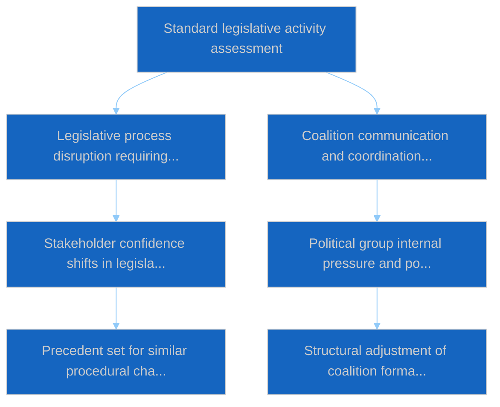
```mermaid
%%{init: {"theme":"dark","themeVariables":{"primaryColor":"#1565C0","primaryTextColor":"#ffffff","primaryBorderColor":"#0A3F7F","lineColor":"#90CAF9","secondaryColor":"#2E7D32","secondaryTextColor":"#ffffff","secondaryBorderColor":"#0F3F00","tertiaryColor":"#FF9800","tertiaryTextColor":"#000000","tertiaryBorderColor":"#7F4F00","mainBkg":"#1565C0","secondBkg":"#2E7D32","tertiaryBkg":"#FF9800","noteBkgColor":"#FFC107","noteTextColor":"#000000","noteBorderColor":"#7F6000","errorBkgColor":"#D32F2F","errorTextColor":"#ffffff","fontFamily":"Inter, Helvetica, Arial, sans-serif","pie1":"#1565C0","pie2":"#2E7D32","pie3":"#FF9800","pie4":"#D32F2F","pie5":"#FFC107","pie6":"#7B1FA2","pie7":"#9E9E9E","pie8":"#0288D1","pie9":"#388E3C","pie10":"#F57C00","pie11":"#C62828","pie12":"#FBC02D","pieTitleTextSize":"18px","pieSectionTextSize":"14px","pieLegendTextSize":"13px","pieStrokeColor":"#1e1e1e","pieOuterStrokeColor":"#1e1e1e","git0":"#1565C0","git1":"#2E7D32","git2":"#FF9800","git3":"#D32F2F","gitBranchLabel0":"#ffffff","gitBranchLabel1":"#ffffff","gitBranchLabel2":"#000000","gitBranchLabel3":"#ffffff","cScale0":"#1565C0","cScale1":"#2E7D32","cScale2":"#FF9800","cScale3":"#D32F2F","cScale4":"#FFC107","cScale5":"#7B1FA2","cScale6":"#9E9E9E","cScale7":"#0288D1","xyChart":{"backgroundColor":"#1e1e1e","plotColorPalette":"#1565C0,#2E7D32,#FF9800,#D32F2F,#FFC107,#7B1FA2,#9E9E9E"}}}}%%
graph TD
    A["Standard legislative activity assessment"]
    B0["Legislative process disruption requiring..."]
    A --> B0
    B1["Coalition communication and coordination..."]
    A --> B1
    C0["Stakeholder confidence shifts in legisla..."]
    B0 --> C0
    C1["Political group internal pressure and po..."]
    B1 --> C1
    D0["Precedent set for similar procedural cha..."]
    C0 --> D0
    D1["Structural adjustment of coalition forma..."]
    C1 --> D1
```

**Mitigating Factors:**
- Institutional resilience mechanisms
- Cross-party dialogue channels

**Amplifying Factors:**
- No significant amplifying factors identified

### Legislative Disruption Analysis

#### Procedure: General legislative pipeline

**Current Stage**: proposal | **Resilience**: high

| Stage | Threat Category | Likelihood | Risk Level |
|-------|----------------|------------|------------|
| proposal | delay | 8% | 🟢 Low |
| committee | transparency | 18% | 🟢 Low |
| plenary first reading | shift | 22% | 🟢 Low |
| council position | delay | 12% | 🟢 Low |
| plenary second reading | shift | 21% | 🟢 Low |
| conciliation | reversal | 17% | 🟢 Low |
| adoption | delay | 5% | 🟢 Low |

**Alternative Pathways:**
- Commission resubmission with revised proposal
- Enhanced informal trilogue engagement
- Interim resolution as procedural bridge

### Key Findings

- No high-priority threats detected across threat landscape dimensions

### Recommendations

- Continue routine monitoring of parliamentary activity

---
*Assessment generated by EU Parliament Monitor Political Threat Assessment Pipeline.*  
*Based on public European Parliament data. GDPR-compliant.*

<h2 id="section-continuity">Cross-Run Continuity</h2>

### Cross Session Intelligence

### Overview
Analysis of coalition stability patterns across multiple plenary sessions.

### Stability Report
- **Overall Stability**: 0.0%
- **Forecast**: volatile
- **Patterns Analysed**: 0

### Group Analysis
- **Stable Groups**: None identified
- **Declining Groups**: None identified

### Date: 2026-04-01

<h2 id="section-deep-analysis">Deep Analysis</h2>

### Raw Data Inventory
| Data Source | Count |
|-------------|-------|
| Events | 0 |
| Procedures | 0 |
| Documents | 0 |
| Adopted Texts | 242 |
| Questions | 0 |
| MEP Updates | 737 |
| **Total** | **979** |

### Stakeholder Groups for AI Analysis
| Stakeholder Group | Data Points Available |
|-------------------|---------------------|
| Political Groups | 242 (procedures + adopted texts) |
| Civil Society | 0 (documents + questions) |
| Industry | 0 (procedures) |
| National Governments | 242 (adopted texts) |
| Citizens | 737 (questions + MEP updates) |
| EU Institutions | 0 (events + procedures) |

### Date: 2026-04-01

<h2 id="section-supplementary-intelligence">Supplementary Intelligence</h2>

### Executive Brief Ar

**التصنيف:** OSINT | سجل برلماني عام
**مستوى الثقة:** 🟢 مرتفع (تقييم هيكلي بين الدورات)
**تاريخ الإنشاء:** 2026-04-01T00:00:00Z (ملاحظة استرجاعية)
**نوع المقال:** مقترحات القرارات
**معرّف التشغيل:** `6ab9ff5b-5062-4c7c-8625-af376a01eb16`
**المصدر:** بوابة البيانات المفتوحة للبرلمان الأوروبي

---

### 🎯 الخلاصة التنفيذية (BLUF)

**لم يُسجَّل أي مقترح قرار جديد بتاريخ 2026-04-01.** أسفرت عملية التحليل `6ab9ff5b-5062-4c7c-8625-af376a01eb16` عن **0 جهة فاعلة مصنَّفة** وأهمية من مستوى **روتيني** — وهو ما يتسق مع توقف البرلمان الأوروبي خلال الفترة بين الدورات (27 مارس → 26 أبريل). تُقدَّم مقترحات القرارات عادةً في أسبوع العمل السابق مباشرةً لجلسة عامة؛ ولا يُتوقع تقديم مثل هذه المقترحات قبل منتصف أبريل. وعليه، تظل القاعدة الجوهرية لمقترحات القرارات هي تلك المنقولة من أسبوع ستراسبورغ (9-12 مارس) المتعلقة بالمعتقلين السياسيين الجورجيين TA-10-2026-0083، وائتمانات انبعاثات المركبات الثقيلة TA-10-2026-0084، ونائب رئيس البنك المركزي الأوروبي TA-10-2026-0060، إضافةً إلى الجلسة المصغرة في بروكسل (25-26 مارس) بشأن التعريفات الجمركية الأمريكية TA-10-2026-0096، وحصانة براون TA-10-2026-0088. **🟢 ثقة مرتفعة** بأن الفراغ ناجم عن التقويم البرلماني.

---

### 🧭 3 قرارات يدعمها هذا الملخص

| # | القرار | صاحب القرار | الموعد النهائي | الأدلة |
|:-:|--------|------------|:-------------:|--------|
| 1 | **تحريري:** تجاهل مقترحات القرارات اليومية؛ إنتاج ملخص أسبوعي | المحرر | +24 ساعة | إخراج تشغيل فارغ |
| 2 | **مراقبة:** تحديد الموجة الأولى من مقترحات أبريل للفترة 17-20 أبريل (T-7 إلى T-10) | المحلل | 2026-04-17 | نمط تقديم البرلمان الأوروبي |
| 3 | **رصد استباقي:** يتنبأ السيناريو أ بمقترحات ذات طابع تجاري وثيق الصلة بالتعريفات الأمريكية وميركوسور | مسؤول التحليل | 2026-04-20 | الأولويات المنقولة |

---

### 📰 قراءة في 60 ثانية

- 🔴 **لم تُقدَّم أي مقترحات جديدة** بتاريخ 2026-04-01؛ أسبوع عطلة، لا تقديمات متوقعة. (🟢 مرتفع)
- 🟠 **0 جهة فاعلة مصنَّفة** في هذا التشغيل المركّز على مقترحات القرارات؛ لم تُحدَّد أي مقررين أو شركاء في التوقيع. (🟢 مرتفع)
- 🟢 **القاعدة المنقولة لمقترحات القرارات:** خمسة نصوص عالية الأهمية من مارس لا تزال نقاط مرجعية نشطة لمرحلة مقترحات دورة أبريل العامة. (🟢 مرتفع)
- 🟡 **جميع أبعاد المخاطر «لا شيء»** — لم تُرفع أي إنذارات مخاطر عاجلة اليوم. (🟢 مرتفع)
- 🔵 **السياق الاقتصادي:** التعريفات الجمركية الأمريكية (TA-10-2026-0096) ونائب رئيس البنك المركزي الأوروبي (TA-10-2026-0060) هما الملفان الأساسيان السائدان في السياق الاقتصادي لمقترحات القرارات. (🟢 مرتفع)
- 🟣 **المرجع المتقاطع:** الجلسة الشقيقة 2026-04-01/breaking توثّق النمط 6/8 لخطأ 404 في تغذية الاستشارات الذي يفسر فراغ البيانات الحالي. (🟢 مرتفع)
- 🩷 **متجه الاضطراب:** لا إنذارات عاجلة؛ هيمنة PPE الهيكلية والضغط التجاري الأمريكي الخارجي موروثان. (🟡 متوسط)
- ⚪ **نقل الأولويات:** إحالة ميركوسور إلى محكمة العدل الأوروبية (TA-10-2026-0008) يُرجَّح أن تُفضي إلى مقترحات عند صدور رأي المحكمة.

---

### 🗂️ أبرز الوثائق / الإجراءات — قائمة رصد المقترحات

| الترتيب | مرجع البرلمان الأوروبي | العنوان (مختصر) | الأهمية | مستوى الثقة | الحالة |
|:-------:|----------------------|----------------|:-------:|:-----------:|--------|
| 1 | — | لا مقترحات جديدة 2026-04-01 | 0.0 | 🟢 مرتفع | عطلة — لا تقديمات |
| 2 | TA-10-2026-0083 | المعتقلون السياسيون الجورجيون (منقول) | 7.0 | 🟢 مرتفع | تقرير تنفيذ مستحق |
| 3 | TA-10-2026-0096 | التعريفات الجمركية الأمريكية (منقول) | 7.0 | 🟢 مرتفع | مقترح متابعة مرجَّح في أبريل |

---

### ⚠️ لمحة عن المخاطر والتهديدات

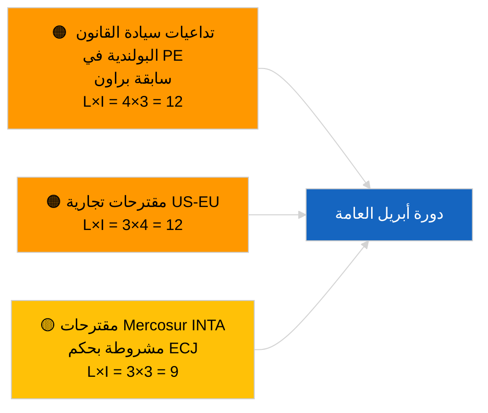
```mermaid
%%{init: {"theme":"dark"}}%%
graph LR
    R1["🟠 تداعيات سيادة القانون البولندية في PE<br/>سابقة براون<br/>L×I = 4×3 = 12"] --> CONS["دورة أبريل العامة"]
    R2["🟠 مقترحات تجارية US-EU<br/>L×I = 3×4 = 12"] --> CONS
    R3["🟡 مقترحات Mercosur INTA<br/>مشروطة بحكم ECJ<br/>L×I = 3×3 = 9"] --> CONS
    style R1 fill:#FF9800,color:#000000
    style R2 fill:#FF9800,color:#000000
    style R3 fill:#FFC107,color:#000000
    style CONS fill:#1565C0,color:#FFFFFF
```

| المخاطرة | ل | أ | الدرجة | المحفّز | المصدر | الأميرالية |
|---------|:-:|:-:|:------:|---------|--------|:----------:|
| تداعيات سيادة القانون البولندية | 4 | 3 | 12 | قضية حصانة جديدة | TA-10-2026-0088 | A1 |
| مقترحات تجارية US-EU | 3 | 4 | 12 | إجراء أمريكي يُطلق مقترحاً | TA-10-2026-0096 | A1 |
| مقترحات ميركوسور (مشروطة) | 3 | 3 | 9 | صدور رأي المحكمة | TA-10-2026-0008 | A2 |
| هيمنة PPE الهيكلية | 4 | 3 | 12 | تقديم غير متماثل للمقترحات | حسابات التحالف | A2 |

---

### 🔮 أهم محفّز مستقبلي

**الموجة الأولى من مقترحات دورة أبريل العامة مُقدَّمة نحو 17-20 أبريل 2026.** يشير مزيج الموضوعات إلى ما إذا كان الإطار الثقيل تجارياً (السيناريو أ)، أو سيادة القانون (السيناريو ب)، أو الاقتصادي/الصناعي (السيناريو ج) هو المهيمن على دورة ستراسبورغ 27-30 أبريل.

---

### 🛡️ تقييم جودة المصادر

- **المصادر الأولية:** بوابة البيانات المفتوحة للبرلمان الأوروبي — عملية التحليل `6ab9ff5b-5062-4c7c-8625-af376a01eb16` وجرد مارس 2026 للمقترحات والقرارات.
- **قيود البيانات:** أعاد `get_parliamentary_questions_feed` والتغذيات ذات الصلة خطأ 404 في تشغيل breaking المتزامن؛ ثقة غياب نشاط التقديم مرتكزة على تقويم البرلمان الأوروبي.
- **مستوى الثقة للتوقف المشروط بالتقويم:** 🟢 مرتفع.

---

### 📎 روابط

| الرابط | المسار |
|--------|--------|
| المقال | `./article.md` |
| التصنيف (فارغ) | `./classification/` |
| الجلسات الشقيقة | `analysis/daily/2026-04-01/breaking/`, `committee-reports/`, `month-ahead/`, `propositions/` |
| البيان | `./manifest.json` |

---

### 🔄 مراجع متقاطعة

**تشغيلات القوالب الفارغة المتزامنة:** committee-reports وmonth-ahead وpropositions بتاريخ 2026-04-01 تُظهر جميعها إخراجاً متطابقاً من 0 جهة فاعلة/روتيني، مما يُؤكد حالة التوقف على مستوى النظام بأكمله.

---

**ضبط الوثيقة**
- **النموذج:** `/analysis/templates/executive-brief.md`
- **مسار الوثيقة:** `analysis/daily/2026-04-01/motions/executive-brief.md`
- **التصنيف:** عام
- **الإنشاء الاسترجاعي:** جلسة استيفاء البيانات.

### Executive Brief Da

### 🎯 BLUF

**Ingen nye beslutningsforslag registreret den 2026-04-01.** Analysekørsel `6ab9ff5b-5062-4c7c-8625-af376a01eb16` returnerede **0 klassificerede aktører** og **RUTINE**-signifikans — konsistent med at EP er i intersessionelt reces (27. marts → 26. april). Beslutningsforslag fremsættes typisk i den arbejdsuge der går umiddelbart forud for en plenarsamling; sådanne fremsættelser forventes ikke inden midten af april. Den substantielle baseline for beslutningsforslag er derfor fortsat de overførte fra Strasbourg-ugen 9-12 marts (georgiske politiske fanger TA-10-2026-0083, HDV-emissionskreditter TA-10-2026-0084, ECB-næstformand TA-10-2026-0060) og Bruxelles-miniplenary 25-26 marts (US toldtarif TA-10-2026-0096, Braun-immunitet TA-10-2026-0088). **🟢 HØJ konfidensgrad** om at den tomme tilstand er kalender-betinget.

---

### 🧭 3 Beslutninger Dette Notat Understøtter

| # | Beslutning | Hvem beslutter | Deadline | Dokumentation |
|:-:|-----------|---------------|:--------:|---------------|
| 1 | **Redaktionel:** SPRING beslutningsforslag over dagligt; udarbejd uge-opsummering | Redaktør | +24h | Tom kørselsoutput |
| 2 | **Overvågning:** flag den første bølge af aprilforslag for ~17-20 april (T-7 til T-10) | Analytiker | 2026-04-17 | EP-fremsættelses-mønster |
| 3 | **Fremadrettet bevakning:** scenarie-A handelstung vægtning forudsiger US-told- og Mercosur-tematiske forslag | Analyseansvarlig | 2026-04-20 | Overførte prioriteter |

---

### 📰 60-Sekunders Læsning

- 🔴 **Ingen nye forslag fremsat** den 2026-04-01; recesuge, ingen fremsættelsesaktivitet forventet. (🟢 Høj)
- 🟠 **0 aktører klassificeret** i denne beslutningsforslag-fokuserede kørsel; ingen ordførere eller medforslagsstillere identificeret. (🟢 Høj)
- 🟢 **Overført baseline for beslutningsforslag:** fem høj-signifikante marts-tekster er fortsat de aktive referencepunkter for aprilplenar-forslagsfaseaktivitet. (🟢 Høj)
- 🟡 **Risiko-dimensioner alle "ingen"** — ingen akut forslagsfaserisiko markeret i dag. (🟢 Høj)
- 🔵 **Økonomisk kontekst:** US toldtarif (TA-10-2026-0096) og ECB-næstformand (TA-10-2026-0060) er de dominerende økonomi-baseline-filer for beslutningsforslag. (🟢 Høj)
- 🟣 **Krydsreference:** søskende 2026-04-01/breaking dokumenterer 6/8 rådgivningsfeed 404-mønsteret der forklarer det aktuelle datavakuum. (🟢 Høj)
- 🩷 **Forstyrrelsesvektor:** ingen akut; strukturel PPE-dominans og ekstern US-handelspres er nedarvet. (🟡 Middel)
- ⚪ **Fremadrettet overførsel:** Mercosur EF-domstolshenskydning (TA-10-2026-0008) forventes at give anledning til forslag, når domstolsudtalelse foreligger.

---

### 🗂️ Topdokumenter / Procedurer — Beslutningsforslag-overvågning

| Rang | EP-reference | Titel (kort) | Betydning | Konfidensgrad | Status |
|:----:|--------------|--------------|:---------:|:-------------:|--------|
| 1 | — | Ingen nye forslag 2026-04-01 | 0,0 | 🟢 HØJ | Reces — ingen fremsættelse |
| 2 | TA-10-2026-0083 | Georgiske politiske fanger (overført) | 7,0 | 🟢 HØJ | Implementeringsrapportering forfalder |
| 3 | TA-10-2026-0096 | US toldtarif (overført) | 7,0 | 🟢 HØJ | Opfølgningsforslag sandsynligvis i april |

---

### ⚠️ Risiko- og Trusselbillede

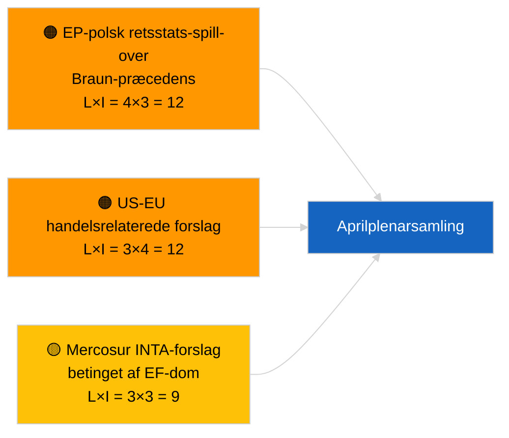
```mermaid
%%{init: {"theme":"dark"}}%%
graph LR
    R1["🟠 EP-polsk retsstats-spill-over<br/>Braun-præcedens<br/>L×I = 4×3 = 12"] --> CONS["Aprilplenarsamling"]
    R2["🟠 US-EU handelsrelaterede forslag<br/>L×I = 3×4 = 12"] --> CONS
    R3["🟡 Mercosur INTA-forslag<br/>betinget af EF-dom<br/>L×I = 3×3 = 9"] --> CONS
    style R1 fill:#FF9800,color:#000000
    style R2 fill:#FF9800,color:#000000
    style R3 fill:#FFC107,color:#000000
    style CONS fill:#1565C0,color:#FFFFFF
```

| Risiko | L | I | Score | Udløser | Kilde | Admiralitet |
|--------|:-:|:-:|:-----:|---------|-------|:-----------:|
| EP-polsk retsstats-spill-over | 4 | 3 | 12 | Ny immunitetsssag | TA-10-2026-0088 | A1 |
| US-EU handelsrelaterede forslag | 3 | 4 | 12 | US-handling udløser forslag | TA-10-2026-0096 | A1 |
| Mercosur-forslag (betingede) | 3 | 3 | 9 | Domstolsudtalelse foreligger | TA-10-2026-0008 | A2 |
| PPE strukturel dominans | 4 | 3 | 12 | Asymmetrisk forslagsfremsættelse | Koalitionsaritmetik | A2 |

---

### 🔮 Vigtigste Fremtidige Udløser

**Første bølge af aprilplenarforslag fremsat ~17-20. april 2026.** Emnemixen angiver om handelstung (Scenarie A), retsstat (Scenarie B) eller økonomisk/industriel (Scenarie C) framing dominerer Strasbourg-sessionen 27-30 april.

---

### 🛡️ Vurdering af Kildekvalitet

- **Primære kilder:** Europa-Parlamentets åbne dataportal — analysekørsel `6ab9ff5b-5062-4c7c-8625-af376a01eb16` og marts 2026 beslutningsforslag/resolutionsinventar.
- **Databegrænsninger:** `get_parliamentary_questions_feed` og relaterede feeds returnerede 404 i concurrent breaking-kørsel; konfidensen om fravær af fremsættelsesaktivitet er forankret til EP-kalenderen.
- **Konfidensgrad for kalender-betinget inaktivitet:** 🟢 HØJ.

---

### 📎 Links

| Link | Sti |
|------|-----|
| Artikel | `./article.md` |
| Klassificering (tom) | `./classification/` |
| Søskende-kørsler | `analysis/daily/2026-04-01/breaking/`, `committee-reports/`, `month-ahead/`, `propositions/` |
| Manifest | `./manifest.json` |

---

### 🔄 Krydsreference

**Samtidige tomme skabelon-kørsler:** committee-reports, month-ahead, propositions den 2026-04-01 viser alle identisk 0-aktør/RUTINE-output, der bekræfter den systemdækkende recestilstand.

---

**Dokumentkontrol**
- **Skabelon:** `/analysis/templates/executive-brief.md`
- **Artefaktsti:** `analysis/daily/2026-04-01/motions/executive-brief.md`
- **Klassifikation:** Offentlig
- **Retrospektiv generering:** Tilbagedateret session.

### Executive Brief De

### 🎯 BLUF

**Keine neuen Entschließungsanträge für den 2026-04-01 registriert.** Die Analyseausführung `6ab9ff5b-5062-4c7c-8625-af376a01eb16` ergab **0 klassifizierte Akteure** und **ROUTINE**-Bedeutung — konsistent mit dem intersessionellen Rückzug des EP (27. März → 26. April). Entschließungsanträge werden typischerweise in der Arbeitswoche unmittelbar vor einer Plenartagung eingebracht; solche Einreichungen sind bis Mitte April nicht zu erwarten. Die substantielle Baseline der Entschließungsanträge bleibt daher die der Straßburg-Woche 9.-12. März (georgische politische Gefangene TA-10-2026-0083, HDV-Emissionsgutschriften TA-10-2026-0084, EZB-Vizepräsident TA-10-2026-0060) und der Brüsseler Mini-Plenarsitzung 25.-26. März (US-Zolltarife TA-10-2026-0096, Braun-Immunität TA-10-2026-0088) übernommenen Texte. **🟢 HOHES Konfidenzniveau**, dass der leere Zustand kalenderbedingt ist.

---

### 🧭 3 Entscheidungen, die dieser Brief unterstützt

| # | Entscheidung | Wer entscheidet | Frist | Evidenz |
|:-:|-------------|----------------|:-----:|---------|
| 1 | **Redaktionell:** ÜBERSPRINGEN Sie tägliche Entschließungsanträge; erstellen Sie Wochenzusammenfassung | Redakteur | +24h | Leere Ausführungsausgabe |
| 2 | **Beobachtung:** Kennzeichnung der ersten Welle von April-Anträgen für ~17.-20. April (T-7 bis T-10) | Analytiker | 2026-04-17 | EP-Einreichungsmuster |
| 3 | **Vorausschauende Überwachung:** Szenario-A handelsgewichtete Gewichtung sagt US-Zoll- und Mercosur-thematische Anträge voraus | Analysebeauftragter | 2026-04-20 | Übernommene Prioritäten |

---

### 📰 60-Sekunden-Lektüre

- 🔴 **Keine neuen Anträge eingebracht** am 2026-04-01; Sitzungspause, keine Einreichungsaktivität erwartet. (🟢 Hoch)
- 🟠 **0 Akteure klassifiziert** in dieser auf Entschließungsanträge fokussierten Ausführung; keine Berichterstatter oder Mitunterzeichner identifiziert. (🟢 Hoch)
- 🟢 **Übernommene Entschließungsantrags-Baseline:** Fünf hochwichtige März-Texte bleiben die aktiven Referenzpunkte für die Entschließungsantragsphase der April-Plenarsitzung. (🟢 Hoch)
- 🟡 **Risikodimensionen alle „keine"** — kein akutes Antragsrisiko heute markiert. (🟢 Hoch)
- 🔵 **Wirtschaftlicher Kontext:** US-Zolltarife (TA-10-2026-0096) und EZB-Vizepräsident (TA-10-2026-0060) sind die dominierenden wirtschaftlichen Basisdateien für Entschließungsanträge. (🟢 Hoch)
- 🟣 **Querverweise:** Geschwister 2026-04-01/breaking dokumentiert das 6/8-Beratungsfeed-404-Muster, das das heutige Datenvakuum erklärt. (🟢 Hoch)
- 🩷 **Störungsvektor:** kein akuter; strukturelle PPE-Dominanz und externer US-Handelsdruck sind geerbt. (🟡 Mittel)
- ⚪ **Weitergabe:** Mercosur-EuGH-Vorlage (TA-10-2026-0008) wird voraussichtlich Anträge auslösen, sobald das Gerichtsgutachten vorliegt.

---

### 🗂️ Top-Dokumente / -Verfahren — Entschließungsantrags-Watchlist

| Rang | EP-Referenz | Titel (kurz) | Bedeutung | Konfidenzniveau | Status |
|:----:|-------------|--------------|:---------:|:---------------:|--------|
| 1 | — | Keine neuen Anträge 2026-04-01 | 0,0 | 🟢 HOCH | Pause — keine Einreichung |
| 2 | TA-10-2026-0083 | Georgische politische Gefangene (übernommen) | 7,0 | 🟢 HOCH | Umsetzungsberichterstattung fällig |
| 3 | TA-10-2026-0096 | US-Zolltarife (übernommen) | 7,0 | 🟢 HOCH | Folgantrag wahrscheinlich im April |

---

### ⚠️ Risiko- und Bedrohungsübersicht

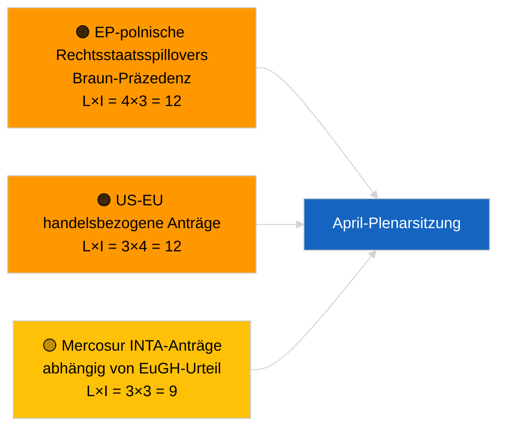
```mermaid
%%{init: {"theme":"dark"}}%%
graph LR
    R1["🟠 EP-polnische Rechtsstaatsspillovers<br/>Braun-Präzedenz<br/>L×I = 4×3 = 12"] --> CONS["April-Plenarsitzung"]
    R2["🟠 US-EU handelsbezogene Anträge<br/>L×I = 3×4 = 12"] --> CONS
    R3["🟡 Mercosur INTA-Anträge<br/>abhängig von EuGH-Urteil<br/>L×I = 3×3 = 9"] --> CONS
    style R1 fill:#FF9800,color:#000000
    style R2 fill:#FF9800,color:#000000
    style R3 fill:#FFC107,color:#000000
    style CONS fill:#1565C0,color:#FFFFFF
```

| Risiko | L | I | Punktzahl | Auslöser | Quelle | Admiralität |
|--------|:-:|:-:|:---------:|---------|--------|:-----------:|
| EP-polnische Rechtsstaatsspillovers | 4 | 3 | 12 | Neuer Immunitätsfall | TA-10-2026-0088 | A1 |
| US-EU handelsbezogene Anträge | 3 | 4 | 12 | US-Aktion löst Antrag aus | TA-10-2026-0096 | A1 |
| Mercosur-Anträge (bedingt) | 3 | 3 | 9 | EuGH-Stellungnahme liegt vor | TA-10-2026-0008 | A2 |
| PPE strukturelle Dominanz | 4 | 3 | 12 | Asymmetrische Antragseinreichung | Koalitionsarithmetik | A2 |

---

### 🔮 Wichtigster Künftiger Auslöser

**Erste Welle der April-Plenarsitzungsanträge eingebracht ~17.-20. April 2026.** Die Themenkomposition zeigt an, ob handelsschwere (Szenario A), Rechtsstaats- (Szenario B) oder wirtschaftliche/industrielle (Szenario C) Rahmung die Straßburger Sitzung vom 27.-30. April dominiert.

---

### 🛡️ Bewertung der Quellenqualität

- **Primärquellen:** Offenes Datenportal des Europäischen Parlaments — Analyseausführung `6ab9ff5b-5062-4c7c-8625-af376a01eb16` und März 2026 Anträge/Resolutionsinventar.
- **Datenbeschränkungen:** `get_parliamentary_questions_feed` und verwandte Feeds gaben in concurrent Breaking-Ausführung 404 zurück; das Konfidenzniveau für die Abwesenheit von Einreichungsaktivität ist am EP-Kalender verankert.
- **Konfidenzniveau für kalenderbedingte Inaktivität:** 🟢 HOCH.

---

### 📎 Links

| Link | Pfad |
|------|------|
| Artikel | `./article.md` |
| Klassifizierung (leer) | `./classification/` |
| Geschwister-Ausführungen | `analysis/daily/2026-04-01/breaking/`, `committee-reports/`, `month-ahead/`, `propositions/` |
| Manifest | `./manifest.json` |

---

### 🔄 Querverweise

**Gleichzeitige leere Vorlageausführungen:** committee-reports, month-ahead, propositions am 2026-04-01 zeigen alle identische 0-Akteur/ROUTINE-Ausgaben und bestätigen den systemweiten Rückzugszustand.

---

**Dokumentenkontrolle**
- **Vorlage:** `/analysis/templates/executive-brief.md`
- **Artefaktpfad:** `analysis/daily/2026-04-01/motions/executive-brief.md`
- **Klassifizierung:** Öffentlich
- **Retrospektive Generierung:** Nachfüllsitzung.

### Executive Brief Es

### 🎯 BLUF

**No se han registrado nuevas propuestas de resolución el 2026-04-01.** La ejecución de análisis `6ab9ff5b-5062-4c7c-8625-af376a01eb16` devolvió **0 actores clasificados** y significación de nivel **RUTINA** — coherente con que el PE se encuentra en receso intersesional (27 de marzo → 26 de abril). Las propuestas de resolución se presentan típicamente en la semana laboral inmediatamente anterior a un período de sesiones plenarias; no se esperan presentaciones antes de mediados de abril. La base sustancial de propuestas de resolución sigue siendo la de los textos trasladados de la semana de Estrasburgo del 9-12 de marzo (presos políticos georgianos TA-10-2026-0083, créditos de emisiones de VCH TA-10-2026-0084, vicepresidente del BCE TA-10-2026-0060) y del minipleno de Bruselas del 25-26 de marzo (aranceles aduaneros de EE.UU. TA-10-2026-0096, inmunidad Braun TA-10-2026-0088). **🟢 ALTO nivel de confianza** en que el estado vacío está condicionado por el calendario.

---

### 🧭 3 Decisiones que Este Brief Apoya

| # | Decisión | Quién decide | Plazo | Evidencia |
|:-:|---------|-------------|:-----:|-----------|
| 1 | **Editorial:** OMITIR propuestas de resolución diarias; producir resumen semanal | Editor | +24h | Salida de ejecución vacía |
| 2 | **Vigilancia:** señalar la primera oleada de propuestas de abril para ~17-20 de abril (T-7 a T-10) | Analista | 2026-04-17 | Patrón de presentación del PE |
| 3 | **Vigilancia prospectiva:** la ponderación de escenario A con carga comercial predice propuestas temáticas sobre aranceles de EE.UU. y Mercosur | Responsable de análisis | 2026-04-20 | Prioridades trasladadas |

---

### 📰 Lectura en 60 Segundos

- 🔴 **Sin nuevas propuestas presentadas** el 2026-04-01; semana de receso, no se espera actividad de presentación. (🟢 Alto)
- 🟠 **0 actores clasificados** en esta ejecución centrada en propuestas de resolución; no se han identificado ponentes ni cofirmantes. (🟢 Alto)
- 🟢 **Base trasladada de propuestas de resolución:** cinco textos de alta significación de marzo siguen siendo los puntos de referencia activos para la actividad de la fase de propuestas del pleno de abril. (🟢 Alto)
- 🟡 **Todas las dimensiones de riesgo a «ninguno»** — ningún riesgo agudo de fase de propuesta marcado hoy. (🟢 Alto)
- 🔵 **Contexto económico:** los aranceles aduaneros de EE.UU. (TA-10-2026-0096) y el vicepresidente del BCE (TA-10-2026-0060) son los archivos de base económica dominantes para las propuestas de resolución. (🟢 Alto)
- 🟣 **Referencia cruzada:** la ejecución hermana 2026-04-01/breaking documenta el patrón 404 del flujo de asesoramiento 6/8 que explica el vacío de datos actual. (🟢 Alto)
- 🩷 **Vector de perturbación:** ninguno agudo; dominancia estructural del PPE y presión comercial externa de EE.UU. heredadas. (🟡 Medio)
- ⚪ **Traslado prospectivo:** la remisión al TJUE de Mercosur (TA-10-2026-0008) previsiblemente dará lugar a propuesta(s) una vez emitido el dictamen judicial.

---

### 🗂️ Principales Documentos / Procedimientos — Lista de Vigilancia de Propuestas

| Rango | Referencia PE | Título (corto) | Significación | Confianza | Estado |
|:-----:|--------------|----------------|:------------:|:---------:|--------|
| 1 | — | Sin nuevas propuestas 2026-04-01 | 0,0 | 🟢 ALTO | Receso — sin presentación |
| 2 | TA-10-2026-0083 | Presos políticos georgianos (trasladado) | 7,0 | 🟢 ALTO | Informe de implementación pendiente |
| 3 | TA-10-2026-0096 | Aranceles aduaneros de EE.UU. (trasladado) | 7,0 | 🟢 ALTO | Propuesta de seguimiento probable en abril |

---

### ⚠️ Panorama de Riesgos y Amenazas

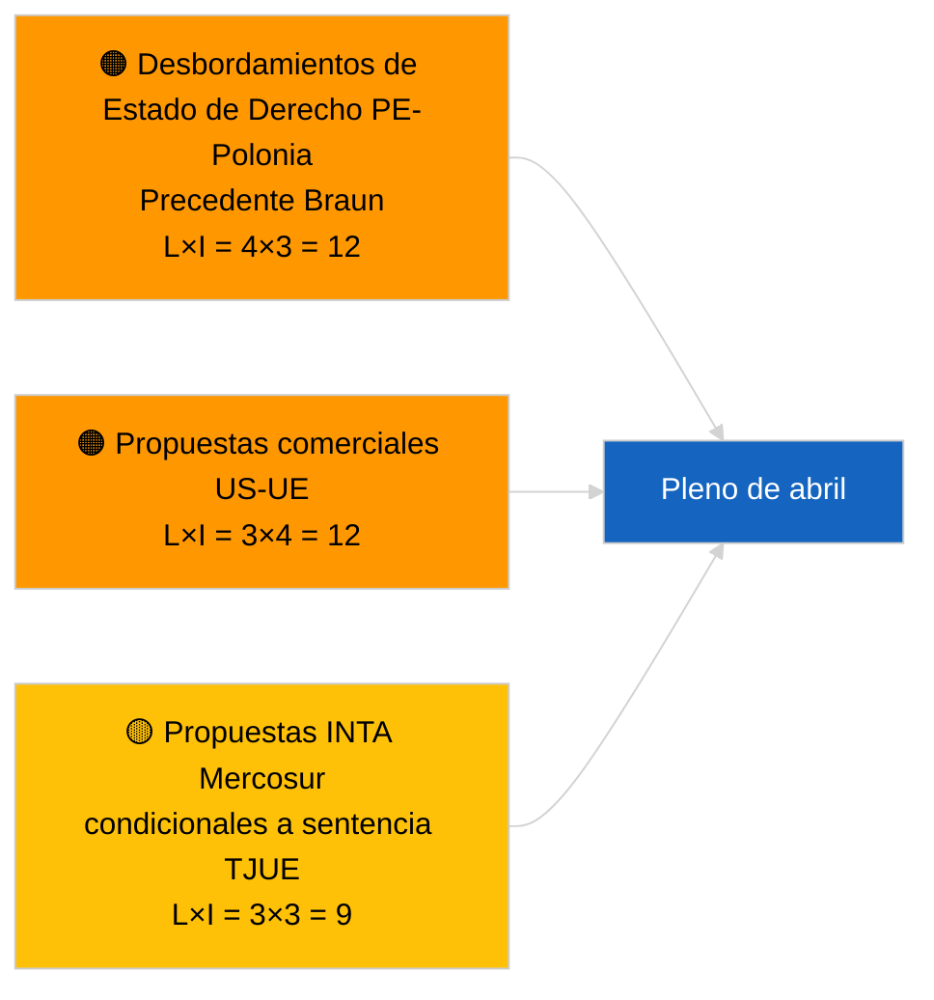
```mermaid
%%{init: {"theme":"dark"}}%%
graph LR
    R1["🟠 Desbordamientos de Estado de Derecho PE-Polonia<br/>Precedente Braun<br/>L×I = 4×3 = 12"] --> CONS["Pleno de abril"]
    R2["🟠 Propuestas comerciales US-UE<br/>L×I = 3×4 = 12"] --> CONS
    R3["🟡 Propuestas INTA Mercosur<br/>condicionales a sentencia TJUE<br/>L×I = 3×3 = 9"] --> CONS
    style R1 fill:#FF9800,color:#000000
    style R2 fill:#FF9800,color:#000000
    style R3 fill:#FFC107,color:#000000
    style CONS fill:#1565C0,color:#FFFFFF
```

| Riesgo | L | I | Puntuación | Desencadenante | Fuente | Almirantazgo |
|--------|:-:|:-:|:----------:|--------------|--------|:------------:|
| Desbordamientos Estado de Derecho PE-Polonia | 4 | 3 | 12 | Nuevo caso de inmunidad | TA-10-2026-0088 | A1 |
| Propuestas comerciales US-UE | 3 | 4 | 12 | Acción US desencadena propuesta | TA-10-2026-0096 | A1 |
| Propuestas Mercosur (condicionales) | 3 | 3 | 9 | Dictamen judicial emitido | TA-10-2026-0008 | A2 |
| Dominancia estructural PPE | 4 | 3 | 12 | Presentación asimétrica de propuestas | Aritmética de coalición | A2 |

---

### 🔮 Principal Desencadenante Futuro

**Primera oleada de propuestas de pleno de abril presentadas ~17-20 de abril de 2026.** La composición temática indica si el encuadre dominante será cargado de comercio (Escenario A), Estado de Derecho (Escenario B) o económico/industrial (Escenario C) para la sesión de Estrasburgo del 27-30 de abril.

---

### 🛡️ Evaluación de la Calidad de las Fuentes

- **Fuentes primarias:** Portal de datos abiertos del Parlamento Europeo — ejecución de análisis `6ab9ff5b-5062-4c7c-8625-af376a01eb16` e inventario de propuestas/resoluciones de marzo de 2026.
- **Limitaciones de los datos:** `get_parliamentary_questions_feed` y flujos relacionados devolvieron 404 en la ejecución breaking simultánea; la confianza en la ausencia de actividad de presentación está anclada en el calendario del PE.
- **Nivel de confianza para la inactividad condicionada por el calendario:** 🟢 ALTO.

---

### 📎 Enlaces

| Enlace | Ruta |
|--------|------|
| Artículo | `./article.md` |
| Clasificación (vacía) | `./classification/` |
| Ejecuciones hermanas | `analysis/daily/2026-04-01/breaking/`, `committee-reports/`, `month-ahead/`, `propositions/` |
| Manifiesto | `./manifest.json` |

---

### 🔄 Referencia Cruzada

**Ejecuciones de plantilla vacías simultáneas:** committee-reports, month-ahead, propositions el 2026-04-01 muestran todos salida idéntica de 0 actores/RUTINA, confirmando el estado de receso de todo el sistema.

---

**Control del documento**
- **Plantilla:** `/analysis/templates/executive-brief.md`
- **Ruta del artefacto:** `analysis/daily/2026-04-01/motions/executive-brief.md`
- **Clasificación:** Público
- **Generación retrospectiva:** Sesión de relleno.

### Executive Brief Fi

### 🎯 BLUF

**Uusia päätöslauselmaesityksiä ei rekisteröity 2026-04-01.** Analyysiajoajo `6ab9ff5b-5062-4c7c-8625-af376a01eb16` palautti **0 luokiteltua toimijaa** ja **RUTIINITASON** merkittävyyden — johdonmukainen sen kanssa, että EP on istuntojen välisessä tauossa (27. maaliskuuta → 26. huhtikuuta). Päätöslauselmaesitykset jätetään tyypillisesti täysistuntoa välittömästi edeltävänä työviikkona; sellaisia jättämisiä ei odoteta ennen huhtikuun puoliväliä. Päätöslauselmaesitysten substantiaalinen peruslinja on siis edelleen Strasbourg-viikon 9.-12. maaliskuuta (Georgian poliittiset vangit TA-10-2026-0083, HDV-päästökreditit TA-10-2026-0084, EKP:n varapuheenjohtaja TA-10-2026-0060) ja Bryssel-miniplenaarikokous 25.-26. maaliskuuta (Yhdysvaltojen tullit TA-10-2026-0096, Braun-immuniteetti TA-10-2026-0088) videreförda. **🟢 KORKEA luottamus** sille, että tyhjä tila johtuu kalenterista.

---

### 🧭 3 Päätöstä, joita tämä tiiviistelmä tukee

| # | Päätös | Kuka päättää | Määräaika | Näyttö |
|:-:|--------|-------------|:---------:|--------|
| 1 | **Toimituksellinen:** JÄTä päätöslauselmaesitykset päivittäin; tuota viikkokatsaus | Päätoimittaja | +24h | Tyhjä ajon tuloste |
| 2 | **Seuranta:** merkitse ensimmäinen aalto huhtikuun esityksistä ~17.-20. huhtikuuta (T-7 – T-10) | Analyytikko | 2026-04-17 | EP:n jättämismalli |
| 3 | **Eteenpäin katsova seuranta:** skenaario A:n kauppapainotteinen painotus ennustaa Yhdysvaltojen tulleja ja Mercosuria käsitteleviä esityksiä | Analyysipäällikkö | 2026-04-20 | Siirtyvät prioriteetit |

---

### 📰 60 Sekunnin Katsaus

- 🔴 **Uusia esityksiä ei jätetty** 2026-04-01; taukoviikko, jättämistoimintaa ei odoteta. (🟢 Korkea)
- 🟠 **0 toimijaa luokiteltu** tässä päätöslauselmaesityksiin keskittyvässä ajossa; esittelijöitä tai kanssavarmentajia ei tunnistettu. (🟢 Korkea)
- 🟢 **Siirtyvä päätöslauselmaesitysperuslinja:** viisi korkeasignifikaanttia maaliskuun tekstiä on edelleen aktiiviset referenssipisteet huhtikuun täysistunnon esitysvaiheen toiminnalle. (🟢 Korkea)
- 🟡 **Riskiulottuvuudet kaikki "ei mitään"** — ei akuuttia esitysvaiheen riskiä liputtanut tänään. (🟢 Korkea)
- 🔵 **Taloudellinen konteksti:** Yhdysvaltojen tullit (TA-10-2026-0096) ja EKP:n varapuheenjohtaja (TA-10-2026-0060) ovat hallitsevat taloudellisen peruslinjan tiedostot päätöslauselmaesityksille. (🟢 Korkea)
- 🟣 **Ristiviite:** sisarajo 2026-04-01/breaking dokumentoi 6/8 neuvontasyötteen 404-virhemallista, joka selittää tämän päivän tyhjiöä. (🟢 Korkea)
- 🩷 **Häiriövektori:** ei akuutti; rakenteellinen PPE-dominanssi ja ulkoinen Yhdysvaltojen kauppapaine peritty. (🟡 Keskitaso)
- ⚪ **Siirtäminen eteenpäin:** Mercosur EY-tuomioistuimeen lähettäminen (TA-10-2026-0008) odotettavasti johtaa esitys(iin) tuomioistuinlausunnon tultua.

---

### 🗂️ Tärkeimmät Asiakirjat / Menettelyt — Päätöslauselmaesitysten Seuranta

| Sija | EP-viite | Otsikko (lyhyt) | Merkittävyys | Luottamustaso | Tila |
|:----:|----------|-----------------|:------------:|:-------------:|------|
| 1 | — | Ei uusia esityksiä 2026-04-01 | 0,0 | 🟢 KORKEA | Tauko — ei jättämistä |
| 2 | TA-10-2026-0083 | Georgian poliittiset vangit (siirretty) | 7,0 | 🟢 KORKEA | Täytäntöönpanoraportointi erääntyy |
| 3 | TA-10-2026-0096 | Yhdysvaltojen tullit (siirretty) | 7,0 | 🟢 KORKEA | Seurantaesitys todennäköisesti huhtikuussa |

---

### ⚠️ Riski- ja Uhka-analyysi

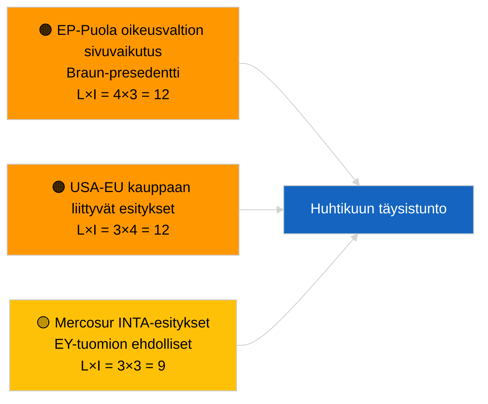
```mermaid
%%{init: {"theme":"dark"}}%%
graph LR
    R1["🟠 EP-Puola oikeusvaltion sivuvaikutus<br/>Braun-presedentti<br/>L×I = 4×3 = 12"] --> CONS["Huhtikuun täysistunto"]
    R2["🟠 USA-EU kauppaan liittyvät esitykset<br/>L×I = 3×4 = 12"] --> CONS
    R3["🟡 Mercosur INTA-esitykset<br/>EY-tuomion ehdolliset<br/>L×I = 3×3 = 9"] --> CONS
    style R1 fill:#FF9800,color:#000000
    style R2 fill:#FF9800,color:#000000
    style R3 fill:#FFC107,color:#000000
    style CONS fill:#1565C0,color:#FFFFFF
```

| Riski | L | I | Pisteet | Laukaisin | Lähde | Admiraliteetti |
|-------|:-:|:-:|:-------:|-----------|-------|:--------------:|
| EP-Puola oikeusvaltion sivuvaikutus | 4 | 3 | 12 | Uusi immuniteeettitapaus | TA-10-2026-0088 | A1 |
| USA-EU kauppaan liittyvät esitykset | 3 | 4 | 12 | USA:n toiminta laukaisee esityksen | TA-10-2026-0096 | A1 |
| Mercosur-esitykset (ehdolliset) | 3 | 3 | 9 | Tuomioistuinlausunto saapuu | TA-10-2026-0008 | A2 |
| PPE rakenteellinen dominanssi | 4 | 3 | 12 | Epäsymmetrinen esitysjättäminen | Koalitioaritmetiikka | A2 |

---

### 🔮 Tärkein Ennakoiva Laukaisin

**Ensimmäinen aalto huhtikuun täysistuntoesityksistä jätetty ~17.-20. huhtikuuta 2026.** Aiheiden yhdistelmä osoittaa, dominoiko kauppapainotteinen (Skenaario A), oikeusvaltiollinen (Skenaario B) vai taloudellinen/teollinen (Skenaario C) kehystäminen Strasbourgin sessiota 27.-30. huhtikuuta.

---

### 🛡️ Lähteen Laadun Arviointi

- **Ensisijaiset lähteet:** Euroopan parlamentin avoin dataportti — analyysiajoajo `6ab9ff5b-5062-4c7c-8625-af376a01eb16` ja maaliskuun 2026 esitykset/resoluutioiden inventaario.
- **Tietorajoitukset:** `get_parliamentary_questions_feed` ja liittyvät syötteet palauttivat 404 concurrent breaking-ajossa; luottamus jättämistoiminnan puuttumiseen on ankkuroitu EP:n kalenteriin.
- **Luottamus kalenterista johtuvaan inaktiivisuuteen:** 🟢 KORKEA.

---

### 📎 Linkit

| Linkki | Polku |
|--------|-------|
| Artikkeli | `./article.md` |
| Luokittelu (tyhjä) | `./classification/` |
| Sisa-ajot | `analysis/daily/2026-04-01/breaking/`, `committee-reports/`, `month-ahead/`, `propositions/` |
| Manifesti | `./manifest.json` |

---

### 🔄 Ristiviite

**Samanaikaiset tyhjät malliaajot:** committee-reports, month-ahead, propositions 2026-04-01 osoittavat kaikki identtisiä 0-toimija/RUTIINITASON tulosteita, vahvistaen koko järjestelmän tauko-tilaa.

---

**Asiakirjavalvonta**
- **Malli:** `/analysis/templates/executive-brief.md`
- **Artefaktipolku:** `analysis/daily/2026-04-01/motions/executive-brief.md`
- **Luokittelu:** Julkinen
- **Retrospektiivinen luominen:** Täyttö-sessio.

### Executive Brief Fr

### 🎯 BLUF

**Aucune nouvelle proposition de résolution enregistrée le 2026-04-01.** L'exécution d'analyse `6ab9ff5b-5062-4c7c-8625-af376a01eb16` a retourné **0 acteur classifié** et une signification de niveau **ROUTINE** — cohérent avec la période intersessionnelle du PE (27 mars → 26 avril). Les propositions de résolution sont typiquement déposées au cours de la semaine de travail qui précède immédiatement une séance plénière ; de tels dépôts ne sont pas attendus avant la mi-avril. La base substantielle des propositions de résolution demeure donc celle des textes reportés de la semaine de Strasbourg du 9-12 mars (prisonniers politiques géorgiens TA-10-2026-0083, crédits d'émissions VPH TA-10-2026-0084, vice-président de la BCE TA-10-2026-0060) et de la mini-plénière bruxelloise des 25-26 mars (tarifs douaniers américains TA-10-2026-0096, immunité Braun TA-10-2026-0088). **🟢 HAUTE confiance** que l'état vide est conditionné par le calendrier.

---

### 🧭 3 Décisions que ce Brief Soutient

| # | Décision | Décideur | Délai | Fondement |
|:-:|---------|---------|:-----:|-----------|
| 1 | **Éditorial :** IGNORER les propositions de résolution quotidiennes ; produire un récapitulatif hebdomadaire | Rédacteur | +24h | Sortie d'exécution vide |
| 2 | **Surveillance :** signaler la première vague de propositions d'avril pour ~17-20 avril (T-7 à T-10) | Analyste | 2026-04-17 | Modèle de dépôt du PE |
| 3 | **Veille prospective :** la pondération de commerce du scénario A prédit des propositions thématiques sur les droits de douane américains et Mercosur | Responsable analyse | 2026-04-20 | Priorités reportées |

---

### 📰 Lecture en 60 Secondes

- 🔴 **Aucune nouvelle proposition déposée** le 2026-04-01 ; semaine de reces, aucune activité de dépôt attendue. (🟢 Élevé)
- 🟠 **0 acteur classifié** dans cette exécution axée sur les propositions de résolution ; aucun rapporteur ni cosignataire identifié. (🟢 Élevé)
- 🟢 **Base reportée de propositions de résolution :** cinq textes de mars à haute signification restent les points de référence actifs pour la phase de propositions de la séance plénière d'avril. (🟢 Élevé)
- 🟡 **Toutes les dimensions de risque à « aucun »** — aucun risque aigu de phase de proposition signalé aujourd'hui. (🟢 Élevé)
- 🔵 **Contexte économique :** les tarifs douaniers américains (TA-10-2026-0096) et le vice-président de la BCE (TA-10-2026-0060) sont les principaux fichiers de base économique pour les propositions de résolution. (🟢 Élevé)
- 🟣 **Référence croisée :** la session sœur 2026-04-01/breaking documente le schéma 404 du flux d'avis 6/8 qui explique le vide de données actuel. (🟢 Élevé)
- 🩷 **Vecteur de perturbation :** aucun aigu ; dominance structurelle du PPE et pression commerciale américaine externe héritées. (🟡 Moyen)
- ⚪ **Transmission prospective :** le renvoi Mercosur à la CJE (TA-10-2026-0008) devrait générer des propositions une fois l'avis juridictionnel rendu.

---

### 🗂️ Documents / Procédures Prioritaires — Liste de Surveillance des Propositions

| Rang | Référence PE | Titre (court) | Signification | Confiance | Statut |
|:----:|-------------|---------------|:------------:|:---------:|--------|
| 1 | — | Aucune nouvelle proposition 2026-04-01 | 0,0 | 🟢 ÉLEVÉ | Reces — aucun dépôt |
| 2 | TA-10-2026-0083 | Prisonniers politiques géorgiens (reporté) | 7,0 | 🟢 ÉLEVÉ | Rapport de mise en œuvre dû |
| 3 | TA-10-2026-0096 | Tarifs douaniers américains (reporté) | 7,0 | 🟢 ÉLEVÉ | Proposition de suivi probable en avril |

---

### ⚠️ Tableau des Risques et Menaces

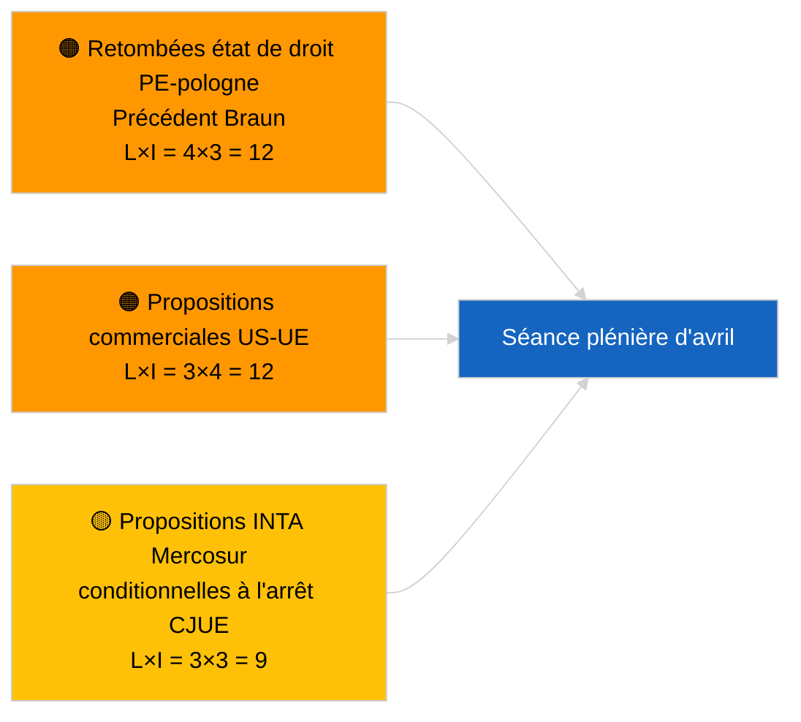
```mermaid
%%{init: {"theme":"dark"}}%%
graph LR
    R1["🟠 Retombées état de droit PE-pologne<br/>Précédent Braun<br/>L×I = 4×3 = 12"] --> CONS["Séance plénière d'avril"]
    R2["🟠 Propositions commerciales US-UE<br/>L×I = 3×4 = 12"] --> CONS
    R3["🟡 Propositions INTA Mercosur<br/>conditionnelles à l'arrêt CJUE<br/>L×I = 3×3 = 9"] --> CONS
    style R1 fill:#FF9800,color:#000000
    style R2 fill:#FF9800,color:#000000
    style R3 fill:#FFC107,color:#000000
    style CONS fill:#1565C0,color:#FFFFFF
```

| Risque | L | I | Score | Déclencheur | Source | Amirauté |
|--------|:-:|:-:|:-----:|------------|--------|:--------:|
| Retombées état de droit PE-Pologne | 4 | 3 | 12 | Nouvelle affaire d'immunité | TA-10-2026-0088 | A1 |
| Propositions commerciales US-UE | 3 | 4 | 12 | Action US déclenche proposition | TA-10-2026-0096 | A1 |
| Propositions Mercosur (conditionnelles) | 3 | 3 | 9 | Avis juridictionnel rendu | TA-10-2026-0008 | A2 |
| Dominance structurelle PPE | 4 | 3 | 12 | Dépôt asymétrique de propositions | Arithmétique de coalition | A2 |

---

### 🔮 Principal Déclencheur Anticipé

**Première vague de propositions de séance plénière d'avril déposées ~17-20 avril 2026.** La composition thématique indique si un cadrage commercial lourd (Scénario A), état de droit (Scénario B) ou économique/industriel (Scénario C) dominera la session de Strasbourg du 27-30 avril.

---

### 🛡️ Évaluation de la Qualité des Sources

- **Sources primaires :** Portail de données ouvertes du Parlement européen — exécution d'analyse `6ab9ff5b-5062-4c7c-8625-af376a01eb16` et inventaire des propositions/résolutions de mars 2026.
- **Limites des données :** `get_parliamentary_questions_feed` et les flux associés ont retourné 404 lors de l'exécution breaking concomitante ; la confiance dans l'absence d'activité de dépôt est ancrée dans le calendrier du PE.
- **Niveau de confiance pour l'inactivité conditionnée par le calendrier :** 🟢 ÉLEVÉ.

---

### 📎 Liens

| Lien | Chemin |
|------|--------|
| Article | `./article.md` |
| Classification (vide) | `./classification/` |
| Exécutions sœurs | `analysis/daily/2026-04-01/breaking/`, `committee-reports/`, `month-ahead/`, `propositions/` |
| Manifeste | `./manifest.json` |

---

### 🔄 Référence Croisée

**Exécutions de gabarit vides simultanées :** committee-reports, month-ahead, propositions le 2026-04-01 affichent tous une sortie identique 0-acteur/ROUTINE, confirmant l'état de reces à l'échelle du système.

---

**Contrôle du document**
- **Gabarit :** `/analysis/templates/executive-brief.md`
- **Chemin de l'artefact :** `analysis/daily/2026-04-01/motions/executive-brief.md`
- **Classification :** Public
- **Génération rétrospective :** Session de remplissage.

### Executive Brief He

**סיווג:** OSINT | רשומה פרלמנטרית ציבורית
**רמת אמינות:** 🟢 גבוהה (הערכה מבנית בין-מושבית)
**נוצר:** 2026-04-01T00:00:00Z (סיכום רטרוספקטיבי)
**סוג מאמר:** הצעות לאומות
**מזהה הרצה:** `6ab9ff5b-5062-4c7c-8625-af376a01eb16`
**מקור:** פורטל הנתונים הפתוח של הפרלמנט האירופי

---

### 🎯 BLUF

**לא נרשמו הצעות החלטה חדשות ב-2026-04-01.** הרצת הניתוח `6ab9ff5b-5062-4c7c-8625-af376a01eb16` החזירה **0 שחקנים מסווגים** ומשמעות ברמת **שגרה** — עקבי עם העובדה שה-EP נמצא בפסקת-בין-מושבית (27 במרץ → 26 באפריל). הצעות החלטה מוגשות בדרך כלל בשבוע העבודה שקדם מיד לפגישה מליאה; הגשות כאלה אינן צפויות לפני אמצע אפריל. בסיס הצעות ההחלטה הממשי נשאר אפוא זה שהועבר משבוע שטרסבורג 9-12 במרץ (אסירים פוליטיים גאורגיים TA-10-2026-0083, אשראי פליטות HDV TA-10-2026-0084, סגן נשיא ECB TA-10-2026-0060) ומן המליאה הזוטרה בבריסל 25-26 במרץ (מכסי יבוא אמריקאיים TA-10-2026-0096, חסינות ברון TA-10-2026-0088). **🟢 אמינות גבוהה** שהמצב הריק מותנה בלוח השנה.

---

### 🧭 3 החלטות שתדרוך זה תומך בהן

| # | החלטה | מי מחליט | מועד אחרון | ראיות |
|:-:|-------|---------|:---------:|-------|
| 1 | **עריכה:** דלג על הצעות החלטה יומיות; הפק סיכום שבועי | עורך | +24 שעות | פלט הרצה ריק |
| 2 | **ניטור:** סמן את גל ההצעות הראשון של אפריל לתאריכים ~17-20 אפריל (T-7 עד T-10) | אנליסט | 2026-04-17 | דפוס הגשה של ה-EP |
| 3 | **ניטור קדימה:** משקל סיפר-A כבד-סחר מנבא הצעות בנושאי מכסי יבוא אמריקאיים ומרקוסור | אחראי ניתוח | 2026-04-20 | עדיפויות שהועברו |

---

### 📰 קריאה ב-60 שניות

- 🔴 **לא הוגשו הצעות חדשות** ב-2026-04-01; שבוע הפסקה, לא צפויה פעילות הגשה. (🟢 גבוהה)
- 🟠 **0 שחקנים מסווגים** בהרצה זו המתמקדת בהצעות החלטה; לא זוהו מדווחים או שותפי חתימה. (🟢 גבוהה)
- 🟢 **בסיס הצעות ההחלטה המועבר:** חמישה טקסטים בעלי חשיבות גבוהה ממרץ נותרים נקודות ייחוס פעילות לשלב ההצעות של המליאה של אפריל. (🟢 גבוהה)
- 🟡 **כל ממדי הסיכון "אפס"** — לא הוגדר סיכון חריף של שלב הצעות היום. (🟢 גבוהה)
- 🔵 **הקשר כלכלי:** מכסי יבוא אמריקאיים (TA-10-2026-0096) וסגן נשיא ECB (TA-10-2026-0060) הם קבצי הבסיס הכלכלי הדומיננטיים להצעות החלטה. (🟢 גבוהה)
- 🟣 **הפנייה צולבת:** הרצת האחות 2026-04-01/breaking מתעדת את דפוס 404 בהזנת ייעוץ 6/8 שמסביר את ריק הנתונים הנוכחי. (🟢 גבוהה)
- 🩷 **וקטור שיבוש:** ללא דחיפות; שליטת PPE מבנית ולחץ סחר אמריקאי חיצוני עוברים בירושה. (🟡 בינוני)
- ⚪ **העברה קדימה:** הפניית מרקוסור ל-ECJ (TA-10-2026-0008) צפויה להוביל להצעות עם קבלת חוות דעת שיפוטית.

---

### 🗂️ מסמכים / נהלים מובילים — רשימת מעקב הצעות

| דירוג | הפנייה ל-EP | כותרת (קצרה) | חשיבות | אמינות | מצב |
|:-----:|------------|--------------|:------:|:------:|-----|
| 1 | — | אין הצעות חדשות 2026-04-01 | 0.0 | 🟢 גבוהה | הפסקה — אין הגשה |
| 2 | TA-10-2026-0083 | אסירים פוליטיים גאורגיים (הועבר) | 7.0 | 🟢 גבוהה | דו"ח יישום מגיע לפרק |
| 3 | TA-10-2026-0096 | מכסי יבוא אמריקאיים (הועבר) | 7.0 | 🟢 גבוהה | הצעת המשך צפויה באפריל |

---

### ⚠️ תמונת סיכונים ואיומים

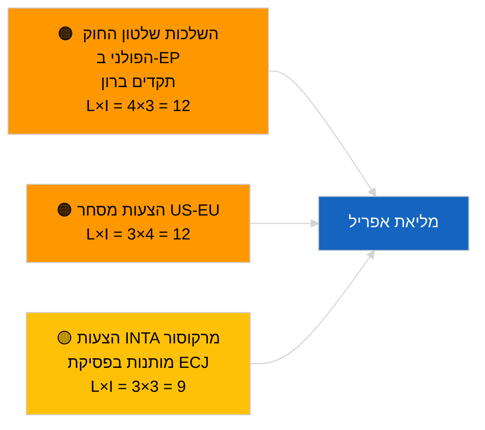
```mermaid
%%{init: {"theme":"dark"}}%%
graph LR
    R1["🟠 השלכות שלטון החוק הפולני ב-EP<br/>תקדים ברון<br/>L×I = 4×3 = 12"] --> CONS["מליאת אפריל"]
    R2["🟠 הצעות מסחר US-EU<br/>L×I = 3×4 = 12"] --> CONS
    R3["🟡 הצעות INTA מרקוסור<br/>מותנות בפסיקת ECJ<br/>L×I = 3×3 = 9"] --> CONS
    style R1 fill:#FF9800,color:#000000
    style R2 fill:#FF9800,color:#000000
    style R3 fill:#FFC107,color:#000000
    style CONS fill:#1565C0,color:#FFFFFF
```

| סיכון | ל | ה | ניקוד | מפעיל | מקור | אדמירליות |
|-------|:-:|:-:|:-----:|------|------|:---------:|
| השלכות שלטון החוק הפולני | 4 | 3 | 12 | מקרה חסינות חדש | TA-10-2026-0088 | A1 |
| הצעות מסחר US-EU | 3 | 4 | 12 | פעולה אמריקאית מפעילה הצעה | TA-10-2026-0096 | A1 |
| הצעות מרקוסור (מותנות) | 3 | 3 | 9 | חוות דעת שיפוטית מתקבלת | TA-10-2026-0008 | A2 |
| שליטת PPE המבנית | 4 | 3 | 12 | הגשת הצעות א-סימטרית | אריתמטיקה קואליציונית | A2 |

---

### 🔮 מפעיל עתידי עיקרי

**גל ראשון של הצעות מליאת אפריל מוגש ~17-20 באפריל 2026.** מגוון הנושאים מצביע על אם הסיפור הכבד-מסחרי (תרחיש A), שלטון החוק (תרחיש B) או הכלכלי/תעשייתי (תרחיש C) הוא הדומיננטי בדיוני שטרסבורג 27-30 באפריל.

---

### 🛡️ הערכת איכות מקורות

- **מקורות ראשיים:** פורטל הנתונים הפתוח של הפרלמנט האירופי — הרצת ניתוח `6ab9ff5b-5062-4c7c-8625-af376a01eb16` ומלאי הצעות ההחלטה של מרץ 2026.
- **מגבלות נתונים:** `get_parliamentary_questions_feed` והזנות קשורות החזירו 404 בהרצת breaking המקבילה; האמינות לאי-קיום פעילות הגשה מעוגנת בלוח השנה של ה-EP.
- **רמת אמינות לחוסר פעילות מותנה בלוח שנה:** 🟢 גבוהה.

---

### 📎 קישורים

| קישור | נתיב |
|-------|------|
| מאמר | `./article.md` |
| סיווג (ריק) | `./classification/` |
| הרצות אחיות | `analysis/daily/2026-04-01/breaking/`, `committee-reports/`, `month-ahead/`, `propositions/` |
| מניפסט | `./manifest.json` |

---

### 🔄 הפנייה צולבת

**הרצות תבנית ריקות מקבילות:** committee-reports, month-ahead, propositions ב-2026-04-01 מציגות כולן פלט זהה של 0 שחקנים/שגרה, ומאשרות את מצב ההפסקה ברמת המערכת כולה.

---

**בקרת מסמך**
- **תבנית:** `/analysis/templates/executive-brief.md`
- **נתיב יצירה:** `analysis/daily/2026-04-01/motions/executive-brief.md`
- **סיווג:** ציבורי
- **יצירה רטרוספקטיבית:** מושב מילוי נתונים.

### Executive Brief Ja

**分類:** OSINT｜公開議会記録
**信頼度:** 🟢 高（会期間構造評価）
**生成日時:** 2026-04-01T00:00:00Z（回顧的要約）
**記事タイプ:** 動議・決議案
**実行ID:** `6ab9ff5b-5062-4c7c-8625-af376a01eb16`
**ソース:** 欧州議会オープンデータポータル

---

### 🎯 BLUF（要点）

**2026年4月1日、新規決議案の登録なし。** 分析実行 `6ab9ff5b-5062-4c7c-8625-af376a01eb16` は**分類済みアクター0件**、重要度「**ルーティン**」を返した。これは欧州議会が会期間休会中（3月27日→4月26日）であることと整合する。決議案は通常、本会議直前の就業週に提出されるため、4月中旬以前の提出は見込まれない。したがって、実質的な決議案のベースラインは引き続き、ストラスブール週（3月9〜12日）から持ち越されたジョージアの政治犯 TA-10-2026-0083、HDV排出クレジット TA-10-2026-0084、ECB副総裁 TA-10-2026-0060、およびブリュッセル小本会議（3月25〜26日）からの米国関税 TA-10-2026-0096、ブラウン免責 TA-10-2026-0088 となる。**🟢 高信頼度**：空白状態は暦的条件によるものと判断。

---

### 🧭 本ブリーフが支援する3つの意思決定

| # | 意思決定 | 決定者 | 期限 | 根拠 |
|:-:|---------|--------|:----:|------|
| 1 | **編集方針:** 決議案の日次報告をスキップし、週次まとめを作成する | 編集長 | +24時間 | 実行出力空白 |
| 2 | **監視:** 4月17〜20日頃（T-7〜T-10）に4月の第一波決議案をフラグ立て | アナリスト | 2026-04-17 | 欧州議会提出パターン |
| 3 | **先行監視:** シナリオAの貿易重視ウェイティングが米国関税・メルコスール関連の決議案を予測 | 分析責任者 | 2026-04-20 | 持ち越し優先事項 |

---

### 📰 60秒読み

- 🔴 **2026年4月1日、新規決議案提出なし**；休会週、提出活動の見込みなし。（🟢 高）
- 🟠 **本実行でのアクター分類0件**；報告者や共同署名者を識別できず。（🟢 高）
- 🟢 **持ち越し決議案ベースライン:** 3月の高重要度テキスト5件が引き続き4月本会議の決議案フェーズの参照点となっている。（🟢 高）
- 🟡 **リスク次元はすべて「なし」**：今日の決議フェーズにおける急迫リスクなし。（🟢 高）
- 🔵 **経済的文脈:** 米国関税（TA-10-2026-0096）とECB副総裁（TA-10-2026-0060）が決議案の主要な経済ベースラインファイル。（🟢 高）
- 🟣 **クロスリファレンス:** 姉妹実行 2026-04-01/breaking が、今日のデータ空白を説明する6/8アドバイスフィード404パターンを記録。（🟢 高）
- 🩷 **混乱ベクトル:** 急迫なし；PPE構造的優位と外部米国貿易圧力を引き継ぎ。（🟡 中）
- ⚪ **先行引継ぎ:** メルコスールECJ付託（TA-10-2026-0008）は司法意見が出次第、決議案を生む可能性が高い。

---

### 🗂️ 主要文書・手続き — 決議案ウォッチリスト

| 順位 | EP参照 | 題名（短縮） | 重要度 | 信頼度 | 状態 |
|:---:|--------|------------|:------:|:------:|------|
| 1 | — | 新規決議案なし 2026-04-01 | 0.0 | 🟢 高 | 休会中 — 提出なし |
| 2 | TA-10-2026-0083 | ジョージア政治犯（持ち越し） | 7.0 | 🟢 高 | 実施報告期限到来 |
| 3 | TA-10-2026-0096 | 米国関税（持ち越し） | 7.0 | 🟢 高 | 4月に追跡決議案の可能性 |

---

### ⚠️ リスク・脅威スナップショット

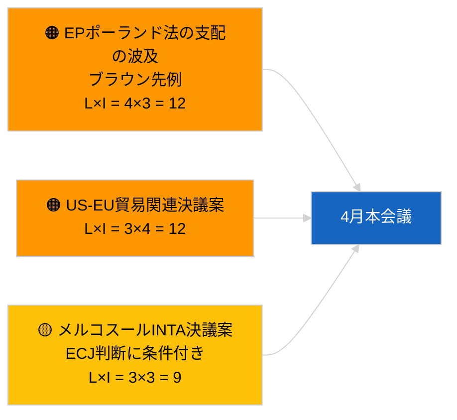
```mermaid
%%{init: {"theme":"dark"}}%%
graph LR
    R1["🟠 EPポーランド法の支配の波及<br/>ブラウン先例<br/>L×I = 4×3 = 12"] --> CONS["4月本会議"]
    R2["🟠 US-EU貿易関連決議案<br/>L×I = 3×4 = 12"] --> CONS
    R3["🟡 メルコスールINTA決議案<br/>ECJ判断に条件付き<br/>L×I = 3×3 = 9"] --> CONS
    style R1 fill:#FF9800,color:#000000
    style R2 fill:#FF9800,color:#000000
    style R3 fill:#FFC107,color:#000000
    style CONS fill:#1565C0,color:#FFFFFF
```

| リスク | 可 | 影 | スコア | トリガー | ソース | 信頼度 |
|--------|:--:|:--:|:------:|---------|--------|:------:|
| EPポーランド法の支配の波及 | 4 | 3 | 12 | 新免責事件 | TA-10-2026-0088 | A1 |
| US-EU貿易関連決議案 | 3 | 4 | 12 | 米国の行動が決議案を誘発 | TA-10-2026-0096 | A1 |
| メルコスール決議案（条件付き） | 3 | 3 | 9 | 司法意見の発出 | TA-10-2026-0008 | A2 |
| PPE構造的優位 | 4 | 3 | 12 | 非対称な決議案提出 | 連立算術 | A2 |

---

### 🔮 最重要な今後のトリガー

**4月本会議の第一波決議案が2026年4月17〜20日頃に提出される見通し。** テーマの組み合わせにより、貿易重視（シナリオA）、法の支配（シナリオB）、経済・産業（シナリオC）のいずれのフレーミングが4月27〜30日のストラスブール会議を支配するかが明らかになる。

---

### 🛡️ ソース品質評価

- **一次ソース:** 欧州議会オープンデータポータル — 分析実行 `6ab9ff5b-5062-4c7c-8625-af376a01eb16` および2026年3月決議案・決議インベントリ。
- **データ制限:** `get_parliamentary_questions_feed` および関連フィードが並行breaking実行で404を返した；提出活動の不在に関する信頼度は欧州議会カレンダーに根拠を置く。
- **暦的非活動に対する信頼度:** 🟢 高。

---

### 📎 リンク

| リンク | パス |
|--------|------|
| 記事 | `./article.md` |
| 分類（空） | `./classification/` |
| 姉妹実行 | `analysis/daily/2026-04-01/breaking/`, `committee-reports/`, `month-ahead/`, `propositions/` |
| マニフェスト | `./manifest.json` |

---

### 🔄 クロスリファレンス

**同時空白テンプレート実行:** committee-reports, month-ahead, propositions の2026-04-01実行は全て0アクター/ルーティン出力を示し、システム全体の休会状態を確認している。

---

**文書管理**
- **テンプレート:** `/analysis/templates/executive-brief.md`
- **アーティファクトパス:** `analysis/daily/2026-04-01/motions/executive-brief.md`
- **分類:** 公開
- **回顧的生成:** バックフィルセッション。

### Executive Brief Ko

**분류:** OSINT | 공개 의회 기록
**신뢰 수준:** 🟢 높음 (회기 간 구조적 평가)
**생성일시:** 2026-04-01T00:00:00Z (소급 요약)
**기사 유형:** 동의안
**실행 ID:** `6ab9ff5b-5062-4c7c-8625-af376a01eb16`
**출처:** 유럽의회 공개 데이터 포털

---

### 🎯 BLUF (핵심 요약)

**2026년 4월 1일, 신규 결의안 등록 없음.** 분석 실행 `6ab9ff5b-5062-4c7c-8625-af376a01eb16`는 **분류된 행위자 0명**과 **일상** 수준의 중요도를 반환했다. 이는 유럽의회가 회기 간 휴회 중(3월 27일 → 4월 26일)이라는 사실과 일치한다. 결의안은 통상 본회의 직전 업무 주에 제출되므로, 4월 중순 이전에는 제출이 예상되지 않는다. 따라서 결의안의 실질적 기준선은 스트라스부르 주간(3월 9〜12일)에서 이월된 조지아 정치범 TA-10-2026-0083, HDV 배출권 TA-10-2026-0084, ECB 부총재 TA-10-2026-0060 및 브뤼셀 미니 전체회의(3월 25〜26일)의 미국 관세 TA-10-2026-0096, 브라운 면책 TA-10-2026-0088으로 유지된다. **🟢 높은 신뢰도**: 공백 상태는 일정에 의한 것으로 판단.

---

### 🧭 본 브리핑이 지원하는 3가지 의사결정

| # | 결정 | 결정자 | 기한 | 근거 |
|:-:|------|--------|:----:|------|
| 1 | **편집 방침:** 일일 결의안 보고 건너뛰기; 주간 요약 작성 | 편집장 | +24시간 | 빈 실행 출력 |
| 2 | **모니터링:** 4월 17〜20일경(T-7〜T-10) 4월 첫 번째 결의안 파동 플래그 지정 | 분석가 | 2026-04-17 | 유럽의회 제출 패턴 |
| 3 | **선행 모니터링:** 시나리오 A의 무역 중심 가중치가 미국 관세 및 메르코수르 테마 결의안을 예측 | 분석 책임자 | 2026-04-20 | 이월 우선사항 |

---

### 📰 60초 요약

- 🔴 **2026년 4월 1일 신규 결의안 제출 없음**; 휴회 주간, 제출 활동 예상 없음. (🟢 높음)
- 🟠 **본 실행에서 분류된 행위자 0명**; 보고관 또는 공동 서명자 미확인. (🟢 높음)
- 🟢 **이월된 결의안 기준선:** 3월의 고중요도 텍스트 5건이 계속해서 4월 본회의 결의안 단계의 참조점으로 기능. (🟢 높음)
- 🟡 **모든 위험 차원 "없음"**: 오늘 결의 단계의 긴급 위험 없음. (🟢 높음)
- 🔵 **경제적 맥락:** 미국 관세(TA-10-2026-0096)와 ECB 부총재(TA-10-2026-0060)가 결의안의 주요 경제 기준선 파일. (🟢 높음)
- 🟣 **교차 참조:** 자매 실행 2026-04-01/breaking이 오늘의 데이터 공백을 설명하는 6/8 자문 피드 404 패턴을 기록. (🟢 높음)
- 🩷 **혼란 벡터:** 긴급 없음; PPE 구조적 우위와 외부 미국 무역 압력 이월. (🟡 중간)
- ⚪ **선행 이월:** 메르코수르 ECJ 회부(TA-10-2026-0008)는 사법 의견 발표 시 결의안 제출로 이어질 가능성 높음.

---

### 🗂️ 주요 문서 / 절차 — 결의안 감시 목록

| 순위 | EP 참조 | 제목 (약식) | 중요도 | 신뢰도 | 상태 |
|:---:|---------|-----------|:------:|:------:|------|
| 1 | — | 신규 결의안 없음 2026-04-01 | 0.0 | 🟢 높음 | 휴회 — 제출 없음 |
| 2 | TA-10-2026-0083 | 조지아 정치범 (이월) | 7.0 | 🟢 높음 | 이행 보고 기한 도래 |
| 3 | TA-10-2026-0096 | 미국 관세 (이월) | 7.0 | 🟢 높음 | 4월에 후속 결의안 가능성 |

---

### ⚠️ 위험 및 위협 스냅샷

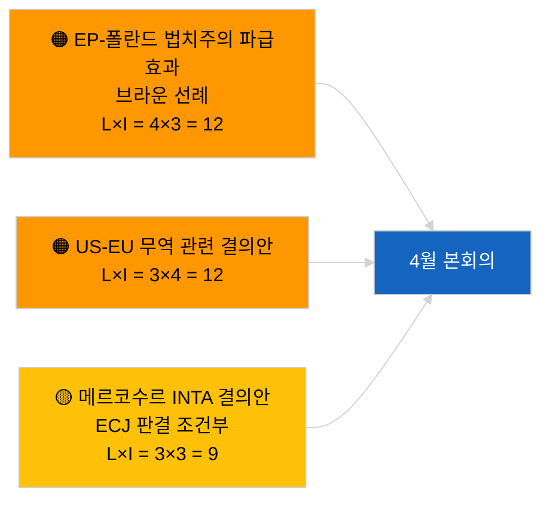
```mermaid
%%{init: {"theme":"dark"}}%%
graph LR
    R1["🟠 EP-폴란드 법치주의 파급효과<br/>브라운 선례<br/>L×I = 4×3 = 12"] --> CONS["4월 본회의"]
    R2["🟠 US-EU 무역 관련 결의안<br/>L×I = 3×4 = 12"] --> CONS
    R3["🟡 메르코수르 INTA 결의안<br/>ECJ 판결 조건부<br/>L×I = 3×3 = 9"] --> CONS
    style R1 fill:#FF9800,color:#000000
    style R2 fill:#FF9800,color:#000000
    style R3 fill:#FFC107,color:#000000
    style CONS fill:#1565C0,color:#FFFFFF
```

| 위험 | 가 | 영 | 점수 | 트리거 | 출처 | 신뢰도 |
|------|:--:|:--:|:----:|--------|------|:------:|
| EP-폴란드 법치주의 파급효과 | 4 | 3 | 12 | 신규 면책 사건 | TA-10-2026-0088 | A1 |
| US-EU 무역 관련 결의안 | 3 | 4 | 12 | 미국 행동이 결의안 촉발 | TA-10-2026-0096 | A1 |
| 메르코수르 결의안 (조건부) | 3 | 3 | 9 | 사법 의견 발표 | TA-10-2026-0008 | A2 |
| PPE 구조적 우위 | 4 | 3 | 12 | 비대칭적 결의안 제출 | 연립 산술 | A2 |

---

### 🔮 가장 중요한 미래 트리거

**2026년 4월 17〜20일경 4월 본회의 결의안 첫 번째 파동 제출 예정.** 주제 구성은 무역 중심(시나리오 A), 법치주의(시나리오 B), 경제·산업(시나리오 C) 중 어느 프레임이 4월 27〜30일 스트라스부르 회의를 지배할지를 나타낸다.

---

### 🛡️ 출처 품질 평가

- **1차 출처:** 유럽의회 공개 데이터 포털 — 분석 실행 `6ab9ff5b-5062-4c7c-8625-af376a01eb16` 및 2026년 3월 결의안 인벤토리.
- **데이터 제한:** `get_parliamentary_questions_feed` 및 관련 피드가 병행 breaking 실행에서 404를 반환; 제출 활동 부재에 대한 신뢰도는 유럽의회 일정에 근거.
- **일정 조건부 비활동에 대한 신뢰도:** 🟢 높음.

---

### 📎 링크

| 링크 | 경로 |
|------|------|
| 기사 | `./article.md` |
| 분류 (비어 있음) | `./classification/` |
| 자매 실행 | `analysis/daily/2026-04-01/breaking/`, `committee-reports/`, `month-ahead/`, `propositions/` |
| 매니페스트 | `./manifest.json` |

---

### 🔄 교차 참조

**동시 빈 템플릿 실행:** committee-reports, month-ahead, propositions의 2026-04-01 실행은 모두 행위자 0명/일상 출력을 표시하며, 시스템 전체 휴회 상태를 확인한다.

---

**문서 관리**
- **템플릿:** `/analysis/templates/executive-brief.md`
- **아티팩트 경로:** `analysis/daily/2026-04-01/motions/executive-brief.md`
- **분류:** 공개
- **소급 생성:** 백필 세션.

### Executive Brief Nl

### 🎯 BLUF

**Geen nieuwe moties geregistreerd op 2026-04-01.** Analyserun `6ab9ff5b-5062-4c7c-8625-af376a01eb16` retourneerde **0 geclassificeerde actoren** en **ROUTINE**-betekenis — consistent met het feit dat het EP met intersessioneel reces is (27 maart → 26 april). Moties worden doorgaans ingediend in de werkweek die onmiddellijk voorafgaat aan een plenaire vergadering; dergelijke indieningen worden vóór half april niet verwacht. De substantiële baseline van moties blijft dan ook die van de overgenomen teksten van de Straatsburg-week van 9-12 maart (Georgische politieke gevangenen TA-10-2026-0083, HDV-emissiekredieten TA-10-2026-0084, vicevoorzitter ECB TA-10-2026-0060) en de Brussel-miniplenaire van 25-26 maart (Amerikaanse tarieven TA-10-2026-0096, immuniteit Braun TA-10-2026-0088). **🟢 HOOG betrouwbaarheidsniveau** dat de lege toestand door de kalender wordt bepaald.

**Opmerking:** IMF blijft IMF; WEO blijft WEO — nooit lokaliseren naar IMV of andere varianten.

---

### 🧭 3 Besluiten die Dit Overzicht Ondersteunt

| # | Besluit | Wie beslist | Deadline | Onderbouwing |
|:-:|--------|------------|:--------:|--------------|
| 1 | **Redactioneel:** OVERSLAAN dagelijkse moties; wekelijkse samenvatting produceren | Hoofdredacteur | +24u | Lege uitvoeringsuitvoer |
| 2 | **Bewaking:** eerste golf van aprilmoties signaleren voor ~17-20 april (T-7 tot T-10) | Analist | 2026-04-17 | EP-indieningspatroon |
| 3 | **Vooruitkijkende bewaking:** scenario-A handelszware weging voorspelt US-tarief- en Mercosur-thematische moties | Analyseverantwoordelijke | 2026-04-20 | Overgenomen prioriteiten |

---

### 📰 60-Seconden Lezing

- 🔴 **Geen nieuwe moties ingediend** op 2026-04-01; recesweek, geen indieningsactiviteit verwacht. (🟢 Hoog)
- 🟠 **0 actoren geclassificeerd** in deze op moties gerichte run; geen rapporteurs of medeondertekenaars geïdentificeerd. (🟢 Hoog)
- 🟢 **Overgenomen motiebaseline:** vijf hoogsignificante maartse teksten blijven de actieve referentiepunten voor de motiefase van de aprilplenaire. (🟢 Hoog)
- 🟡 **Alle risicsdimensies op "geen"** — geen acuut motierisico vandaag gesignaleerd. (🟢 Hoog)
- 🔵 **Economische context:** Amerikaanse tarieven (TA-10-2026-0096) en vicevoorzitter ECB (TA-10-2026-0060) zijn de dominante economische basisbestanden voor moties. (🟢 Hoog)
- 🟣 **Kruisverwijzing:** zusterrun 2026-04-01/breaking documenteert het 6/8-adviesfeed-404-patroon dat het huidige datavacuüm verklaart. (🟢 Hoog)
- 🩷 **Verstoringsvector:** geen acuut; structurele PPE-dominantie en extern US-handelsdruk zijn overgenomen. (🟡 Gemiddeld)
- ⚪ **Voorwaartse overdracht:** Mercosur-HvJ-verwijzing (TA-10-2026-0008) zal naar verwachting aanleiding geven tot motie(s) zodra het rechterlijke advies beschikbaar is.

---

### 🗂️ Topdocumenten / -Procedures — Motie-Watchlist

| Rang | EP-referentie | Titel (kort) | Belang | Betrouwbaarheid | Status |
|:----:|--------------|--------------|:------:|:---------------:|--------|
| 1 | — | Geen nieuwe moties 2026-04-01 | 0,0 | 🟢 HOOG | Reces — geen indiening |
| 2 | TA-10-2026-0083 | Georgische politieke gevangenen (overgenomen) | 7,0 | 🟢 HOOG | Implementatierapportage verschuldigd |
| 3 | TA-10-2026-0096 | Amerikaanse tarieven (overgenomen) | 7,0 | 🟢 HOOG | Vervolgmotie waarschijnlijk in april |

---

### ⚠️ Risico- en Dreigingsoverzicht

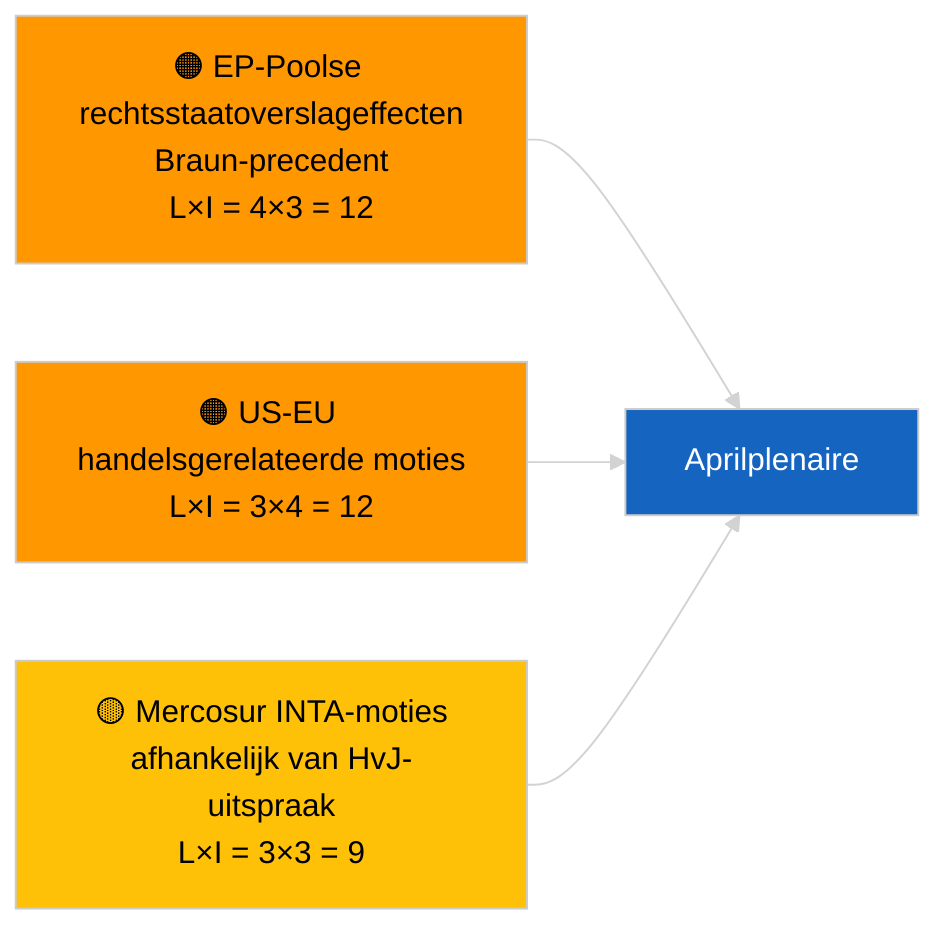
```mermaid
%%{init: {"theme":"dark"}}%%
graph LR
    R1["🟠 EP-Poolse rechtsstaatoverslageffecten<br/>Braun-precedent<br/>L×I = 4×3 = 12"] --> CONS["Aprilplenaire"]
    R2["🟠 US-EU handelsgerelateerde moties<br/>L×I = 3×4 = 12"] --> CONS
    R3["🟡 Mercosur INTA-moties<br/>afhankelijk van HvJ-uitspraak<br/>L×I = 3×3 = 9"] --> CONS
    style R1 fill:#FF9800,color:#000000
    style R2 fill:#FF9800,color:#000000
    style R3 fill:#FFC107,color:#000000
    style CONS fill:#1565C0,color:#FFFFFF
```

| Risico | L | I | Score | Aanleiding | Bron | Admiraliteit |
|--------|:-:|:-:|:-----:|-----------|------|:------------:|
| EP-Poolse rechtsstaatoverslageffecten | 4 | 3 | 12 | Nieuwe immuniteitszaak | TA-10-2026-0088 | A1 |
| US-EU handelsgerelateerde moties | 3 | 4 | 12 | US-actie leidt tot motie | TA-10-2026-0096 | A1 |
| Mercosur-moties (voorwaardelijk) | 3 | 3 | 9 | Rechterlijk advies beschikbaar | TA-10-2026-0008 | A2 |
| PPE structurele dominantie | 4 | 3 | 12 | Asymmetrische motie-indiening | Coalitie-arithmetiek | A2 |

---

### 🔮 Belangrijkste Toekomstige Aanleiding

**Eerste golf van aprilplenaire moties ingediend ~17-20 april 2026.** De themamix geeft aan of een handelszware (Scenario A), rechtsstatelijke (Scenario B) of economische/industriële (Scenario C) framing de Straatsburg-sessie van 27-30 april domineert.

---

### 🛡️ Beoordeling van de Bronkwaliteit

- **Primaire bronnen:** Open dataportal van het Europees Parlement — analyserun `6ab9ff5b-5062-4c7c-8625-af376a01eb16` en inventaris van maart 2026 moties/resoluties.
- **Gegevensbeperkingen:** `get_parliamentary_questions_feed` en gerelateerde feeds retourneerden 404 in gelijktijdige breaking-run; de betrouwbaarheid van de afwezigheid van indieningsactiviteit is verankerd aan de EP-kalender.
- **Betrouwbaarheidsniveau voor kalendergebonden inactiviteit:** 🟢 HOOG.

---

### 📎 Links

| Link | Pad |
|------|-----|
| Artikel | `./article.md` |
| Classificatie (leeg) | `./classification/` |
| Zusterruns | `analysis/daily/2026-04-01/breaking/`, `committee-reports/`, `month-ahead/`, `propositions/` |
| Manifest | `./manifest.json` |

---

### 🔄 Kruisverwijzing

**Gelijktijdige lege sjabloonruns:** committee-reports, month-ahead, propositions op 2026-04-01 tonen allemaal identieke 0-actor/ROUTINE-uitvoer, wat de systeembrede recestoestand bevestigt.

---

**Documentbeheersing**
- **Sjabloon:** `/analysis/templates/executive-brief.md`
- **Artefactpad:** `analysis/daily/2026-04-01/motions/executive-brief.md`
- **Classificatie:** Openbaar
- **Retrospectieve generatie:** Terugvulsessie.

### Executive Brief No

### 🎯 BLUF

**Ingen nye forslag til resolusjon registrert 2026-04-01.** Analysekjøring `6ab9ff5b-5062-4c7c-8625-af376a01eb16` returnerte **0 klassifiserte aktører** og **RUTINEMESSIG** betydning — konsistent med at EP er i intersesjonelt reces (27. mars → 26. april). Forslag til resolusjon legges typisk frem i arbeidsuken umiddelbart før en plenumssesjon; slike innleveringer forventes ikke før midten av april. Den substansielle resolusjonsforslags-basisen er derfor fortsatt de videreførte fra Strasbourg-uka 9-12 mars (georgiske politiske fanger TA-10-2026-0083, HDV-utslippskreditter TA-10-2026-0084, ECB-visesentralbanksjef TA-10-2026-0060) og Brussel-mini-plenum 25-26 mars (USAs tolltariff TA-10-2026-0096, Braun-immunitet TA-10-2026-0088). **🟢 HØY konfidensnivå** om at den tomme tilstanden er kalender-betinget.

---

### 🧭 3 Beslutninger Dette Notatet Støtter

| # | Beslutning | Hvem bestemmer | Frist | Dokumentasjon |
|:-:|-----------|---------------|:-----:|---------------|
| 1 | **Redaksjonell:** HOPP OVER daglige resolusjonsforslag; produser ukeoppsummering | Redaktør | +24h | Tom kjøringsutdata |
| 2 | **Overvåking:** flagg første bølge av aprilforslag for ~17-20 april (T-7 til T-10) | Analytiker | 2026-04-17 | EP-innleveringsmønster |
| 3 | **Fremoverrettet overvåking:** scenario-A handelstung vekting forutsier USA-toll- og Mercosur-tematiske forslag | Analyseansvarlig | 2026-04-20 | Videreførte prioriteringer |

---

### 📰 60-Sekunders Lesning

- 🔴 **Ingen nye forslag fremmet** 2026-04-01; recesuke, ingen innleveringsaktivitet forventet. (🟢 Høy)
- 🟠 **0 aktører klassifisert** i denne resolusjonsforslagsfokuserte kjøringen; ingen ordførere eller medsignatarer identifisert. (🟢 Høy)
- 🟢 **Videreført resolusjonsforslagsgrunnlag:** fem høysignifikante mars-tekster er fortsatt de aktive referansepunktene for aprilplenum-forslagsfaseaktivitet. (🟢 Høy)
- 🟡 **Risikodimensjoner alle "ingen"** — ingen akutt forslagsfaserisiko flagget i dag. (🟢 Høy)
- 🔵 **Økonomisk kontekst:** USAs tolltariff (TA-10-2026-0096) og ECB-visesentralbanksjef (TA-10-2026-0060) er de dominerende økonomi-baseline-filene for resolusjonsforslag. (🟢 Høy)
- 🟣 **Kryssreferanse:** søsken 2026-04-01/breaking dokumenterer 6/8 rådgivningsfeed 404-mønsteret som forklarer dagens datavakuum. (🟢 Høy)
- 🩷 **Forstyrelsesvektor:** ingen akutt; strukturell PPE-dominans og eksternt USA-handelspress er nedarvet. (🟡 Middels)
- ⚪ **Fremoverføring:** Mercosur EF-domstolshenvising (TA-10-2026-0008) forventes å gi opphav til forslag når domstolsuttalelse foreligger.

---

### 🗂️ Topdokumenter / Prosedyrer — Resolusjonsforslags-overvåking

| Rang | EP-referanse | Tittel (kort) | Betydning | Konfidensnivå | Status |
|:----:|--------------|---------------|:---------:|:-------------:|--------|
| 1 | — | Ingen nye forslag 2026-04-01 | 0,0 | 🟢 HØY | Reces — ingen innlevering |
| 2 | TA-10-2026-0083 | Georgiske politiske fanger (videreført) | 7,0 | 🟢 HØY | Implementeringsrapportering forfaller |
| 3 | TA-10-2026-0096 | USAs tolltariff (videreført) | 7,0 | 🟢 HØY | Oppfølgingsforslag sannsynligvis i april |

---

### ⚠️ Risiko- og Trusselbilde

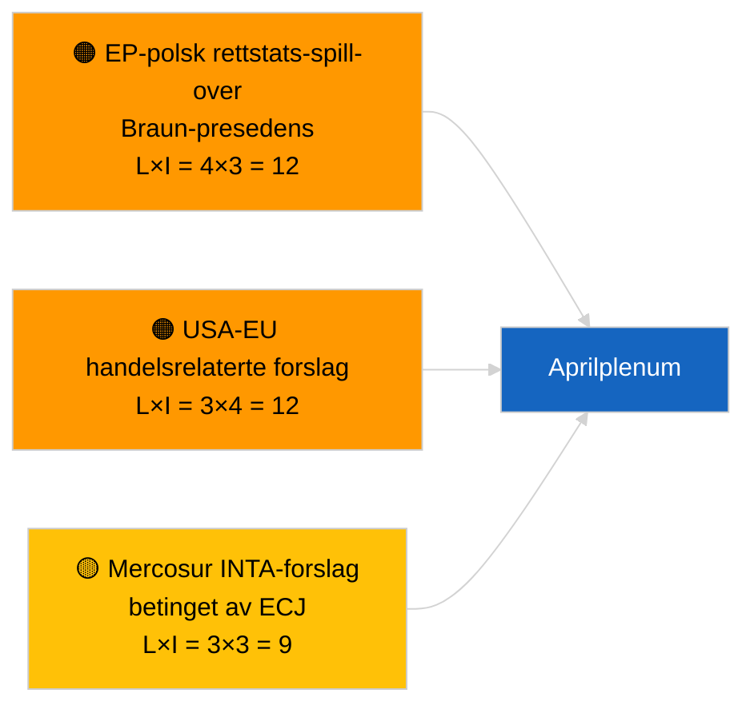
```mermaid
%%{init: {"theme":"dark"}}%%
graph LR
    R1["🟠 EP-polsk rettstats-spill-over<br/>Braun-presedens<br/>L×I = 4×3 = 12"] --> CONS["Aprilplenum"]
    R2["🟠 USA-EU handelsrelaterte forslag<br/>L×I = 3×4 = 12"] --> CONS
    R3["🟡 Mercosur INTA-forslag<br/>betinget av ECJ<br/>L×I = 3×3 = 9"] --> CONS
    style R1 fill:#FF9800,color:#000000
    style R2 fill:#FF9800,color:#000000
    style R3 fill:#FFC107,color:#000000
    style CONS fill:#1565C0,color:#FFFFFF
```

| Risiko | L | I | Skår | Utløser | Kilde | Admiralitet |
|--------|:-:|:-:|:----:|---------|-------|:-----------:|
| EP-polsk rettstats-spill-over | 4 | 3 | 12 | Ny immunitetsak | TA-10-2026-0088 | A1 |
| USA-EU handelsrelaterte forslag | 3 | 4 | 12 | USA-handling utløser forslag | TA-10-2026-0096 | A1 |
| Mercosur-forslag (betingede) | 3 | 3 | 9 | Domstolsuttalelse foreligger | TA-10-2026-0008 | A2 |
| PPE strukturell dominans | 4 | 3 | 12 | Asymmetrisk forslagsinnlevering | Koalisjonsaritmetikk | A2 |

---

### 🔮 Viktigste Fremtidige Utløser

**Første bølge av aprilplenum-forslag fremmet ~17-20 april 2026.** Emnemiksen indikerer om handelstung (Scenario A), rettsstat (Scenario B) eller økonomisk/industriell (Scenario C) innramming dominerer Strasbourg-sesjonen 27-30 april.

---

### 🛡️ Vurdering av Kildekvalitet

- **Primærkilder:** Europaparlamentets åpne dataportal — analysekjøring `6ab9ff5b-5062-4c7c-8625-af376a01eb16` og mars 2026 forslag/resolusjonsinventar.
- **Databegrensninger:** `get_parliamentary_questions_feed` og relaterte feeds returnerte 404 i concurrent breaking-kjøring; konfidensen om fravær av innleveringsaktivitet er forankret til EP-kalenderen.
- **Konfidensnivå for kalender-betinget inaktivitet:** 🟢 HØY.

---

### 📎 Lenker

| Lenke | Sti |
|-------|-----|
| Artikkel | `./article.md` |
| Klassifisering (tom) | `./classification/` |
| Søsken-kjøringer | `analysis/daily/2026-04-01/breaking/`, `committee-reports/`, `month-ahead/`, `propositions/` |
| Manifest | `./manifest.json` |

---

### 🔄 Kryssreferanse

**Samtidige tomme malkjøringer:** committee-reports, month-ahead, propositions 2026-04-01 viser alle identisk 0-aktør/RUTINEMESSIG utdata, noe som bekrefter den systemomfattende recestilstanden.

---

**Dokumentkontroll**
- **Mal:** `/analysis/templates/executive-brief.md`
- **Artefaktsti:** `analysis/daily/2026-04-01/motions/executive-brief.md`
- **Klassifisering:** Offentlig
- **Retrospektiv generering:** Tilbakefyllings-sesjon.

### Executive Brief Sv

### 🎯 BLUF

**Inga nya resolutionsförslag registrerade den 2026-04-01.** Analyskörning `6ab9ff5b-5062-4c7c-8625-af376a01eb16` returnerade **0 klassificerade aktörer** och **RUTINMÄSSIG** signifikans — konsekvent med att EP befinner sig i intersessionellt uppehåll (27 mars → 26 april). Resolutionsförslag läggs typiskt in under arbetsveckan omedelbart före en plenarsession; ingen sådan inlämning förväntas före mitten av april. Den substantiella resolutionsförslagsbaslinjen är därför fortfarande de vidareförda från Strasbourg-veckan 9-12 mars (georgiska politiska fångar TA-10-2026-0083, HDV-utsläppskrediter TA-10-2026-0084, ECB vice-ordförande TA-10-2026-0060) och Bryssel-miniplenarsessionen 25-26 mars (USA:s tulltariff TA-10-2026-0096, Braun-immunitet TA-10-2026-0088). **🟢 HÖG konfidensgrad** att det tomma tillståndet är kalendariskt betingat.

---

### 🧭 3 Beslut som detta underlag stöder

| # | Beslut | Vem beslutar | Deadline | Evidens |
|:-:|--------|-------------|:--------:|---------|
| 1 | **Redaktionell:** HOPPA ÖVER dagliga resolutionsförslag; producera veckorekapitulation | Redaktör | +24h | Tom körningsutdata |
| 2 | **Bevakning:** flagga den första vågen av aprilresolutioner för ~17-20 april (T-7 till T-10) | Analytiker | 2026-04-17 | EP-inlämningsmönster |
| 3 | **Framåtbevakning:** scenario-A handelstung viktning förutspår USA-tull- och Mercosur-tematiska resolutioner | Analysansvarig | 2026-04-20 | Vidareförda prioriteringar |

---

### 📰 60-Sekunders Läsning

- 🔴 **Inga nya resolutioner inlämnade** den 2026-04-01; uppehållsvecka, ingen inlämningsaktivitet förväntas. (🟢 Hög)
- 🟠 **0 aktörer klassificerade** i denna resolutionsinriktade körning; inga föredragande eller medsignatärer identifierade. (🟢 Hög)
- 🟢 **Vidareförd resolutionsbaslinje:** fem högsignifikanta mars-texter kvarstår som aktiva referenspunkter för aprilplenumsresolutionsfasaktivitet. (🟢 Hög)
- 🟡 **Riskdimensioner alla "inga"** — ingen akut resolutionsfasrisk flaggad idag. (🟢 Hög)
- 🔵 **Ekonomisk kontext:** USA:s tulltariff (TA-10-2026-0096) och ECB vice-ordförande (TA-10-2026-0060) är de dominerande ekonomiska resolutionsbaslinjefilerna. (🟢 Hög)
- 🟣 **Korsreferens:** syskon 2026-04-01/breaking dokumenterar 6/8 rådgivningsflöde 404-mönster som förklarar dagens datavoid. (🟢 Hög)
- 🩷 **Störningsfaktor:** ingen akut; strukturell PPE-dominans och externt USA-handelstryck nedärvda. (🟡 Medel)
- ⚪ **Vidareföring:** Mercosur EG-domstolshänvisning (TA-10-2026-0008) sannolikt att ge upphov till resolution(er) när domstolsyttrande väl kommer.

---

### 🗂️ Toppidokument / Procedurer — Resolutionsbevakningslista

| Rang | EP-referens | Titel (kort) | Betydelse | Konfidensgrad | Status |
|:----:|-------------|--------------|:---------:|:-------------:|--------|
| 1 | — | Inga nya resolutioner 2026-04-01 | 0,0 | 🟢 HÖG | Uppehåll — ingen inlämning |
| 2 | TA-10-2026-0083 | Georgiska politiska fångar (vidareförd) | 7,0 | 🟢 HÖG | Implementeringsrapportering förfaller |
| 3 | TA-10-2026-0096 | USA:s tulltariff (vidareförd) | 7,0 | 🟢 HÖG | Uppföljningsresolution sannolikt i april |

---

### ⚠️ Risk- och Hotöversikt

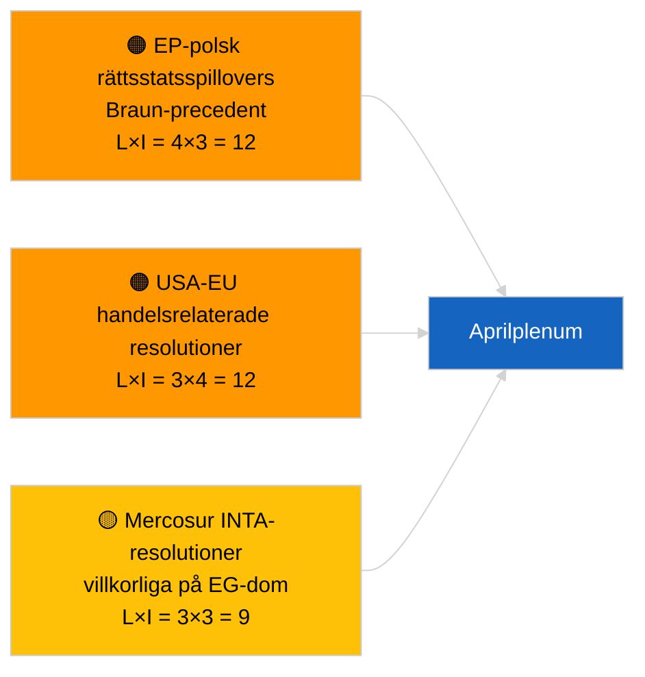
```mermaid
%%{init: {"theme":"dark"}}%%
graph LR
    R1["🟠 EP-polsk rättsstatsspillovers<br/>Braun-precedent<br/>L×I = 4×3 = 12"] --> CONS["Aprilplenum"]
    R2["🟠 USA-EU handelsrelaterade resolutioner<br/>L×I = 3×4 = 12"] --> CONS
    R3["🟡 Mercosur INTA-resolutioner<br/>villkorliga på EG-dom<br/>L×I = 3×3 = 9"] --> CONS
    style R1 fill:#FF9800,color:#000000
    style R2 fill:#FF9800,color:#000000
    style R3 fill:#FFC107,color:#000000
    style CONS fill:#1565C0,color:#FFFFFF
```

| Risk | L | I | Poäng | Utlösare | Källa | Admiralitet |
|------|:-:|:-:|:-----:|---------|-------|:-----------:|
| EP-polsk rättsstatsspillovers | 4 | 3 | 12 | Nytt immunitetsärende | TA-10-2026-0088 | A1 |
| USA-EU handelsrelaterade resolutioner | 3 | 4 | 12 | USA:s åtgärd utlöser resolution | TA-10-2026-0096 | A1 |
| Mercosur-resolutioner (villkorliga) | 3 | 3 | 9 | Domstolsyttrande meddelas | TA-10-2026-0008 | A2 |
| PPE strukturell dominans | 4 | 3 | 12 | Asymmetrisk resolutionsinlämning | Koalitionsaritmetik | A2 |

---

### 🔮 Viktigaste Framtida Utlösare

**Första vågen av aprilplenarresolutioner inlämnade ~17-20 april 2026.** Ämnesblandningen indikerar huruvida handelstung (Scenario A), rättsstats- (Scenario B) eller ekonomisk/industriell (Scenario C) inramning dominerar Strasbourgplenarsessionen 27-30 april.

---

### 🛡️ Källkvalitetsbedömning

- **Primärkällor:** Europaparlamentets öppna dataportal — analyskörning `6ab9ff5b-5062-4c7c-8625-af376a01eb16` och mars 2026 resolutioner/resolutionsinventering.
- **Databegränsningar:** `get_parliamentary_questions_feed` och relaterade flöden returnerade 404 i concurrent breaking-körning; konfidensgrad för frånvaro av inlämningsaktivitet är förankrad till EP-kalendern.
- **Konfidensgrad för kalendariskt betingad inaktivitet:** 🟢 HÖG.

---

### 📎 Länkar

| Länk | Sökväg |
|------|--------|
| Artikel | `./article.md` |
| Klassificering (tom) | `./classification/` |
| Syskonkörningar | `analysis/daily/2026-04-01/breaking/`, `committee-reports/`, `month-ahead/`, `propositions/` |
| Manifest | `./manifest.json` |

---

### 🔄 Korsreferens

**Concurrent tomma mallkörningar:** committee-reports, month-ahead, propositions den 2026-04-01 visar alla identisk 0-aktör/RUTINMÄSSIG utdata, vilket bekräftar det systemövergripande uppehållstillståndet.

---

**Dokumentkontroll**
- **Mall:** `/analysis/templates/executive-brief.md`
- **Artefaktsökväg:** `analysis/daily/2026-04-01/motions/executive-brief.md`
- **Klassificering:** Offentlig
- **Retrospektiv generering:** Återfyllningssession.

### Executive Brief Zh

**分类：** OSINT｜公开议会记录
**可信度：** 🟢 高（会期间结构性评估）
**生成时间：** 2026-04-01T00:00:00Z（回溯性摘要）
**文章类型：** 动议与决议草案
**运行ID：** `6ab9ff5b-5062-4c7c-8625-af376a01eb16`
**来源：** 欧洲议会开放数据门户

---

### 🎯 BLUF（核心结论）

**2026年4月1日未登记任何新决议草案。** 分析运行 `6ab9ff5b-5062-4c7c-8625-af376a01eb16` 返回**0名分类行为者**，重要性级别为**常规**——与欧洲议会处于会期间休会期（3月27日→4月26日）的事实相吻合。决议草案通常在全体会议前一周的工作日内提交；预计4月中旬前不会有此类提交。因此，决议草案的实质性基准线仍为斯特拉斯堡周（3月9-12日）沿用下来的格鲁吉亚政治犯 TA-10-2026-0083、重型车辆排放信用额度 TA-10-2026-0084、欧洲央行副行长 TA-10-2026-0060，以及布鲁塞尔小型全体会议（3月25-26日）的美国关税 TA-10-2026-0096、布劳恩豁免权 TA-10-2026-0088。**🟢 高可信度**：空白状态系日历条件所致。

---

### 🧭 本简报支持的3项决策

| # | 决策 | 决策者 | 截止日期 | 依据 |
|:-:|------|--------|:--------:|------|
| 1 | **编辑方针：** 跳过每日决议草案报告；产出周度摘要 | 主编 | +24小时 | 运行输出为空 |
| 2 | **监测：** 在4月17-20日前后（T-7至T-10）标记四月第一批草案 | 分析员 | 2026-04-17 | 欧洲议会提交规律 |
| 3 | **前瞻监测：** 情景A贸易重权重预测涉美国关税及墨西哥南方共同市场主题草案 | 分析负责人 | 2026-04-20 | 沿用优先事项 |

---

### 📰 60秒阅读

- 🔴 **2026年4月1日未提交新草案**；休会周，预计无提交活动。（🟢 高）
- 🟠 **本次运行中分类行为者0名**；未识别报告员或共同签署者。（🟢 高）
- 🟢 **沿用决议草案基准线：** 三月高重要度文本5份仍为四月全体会议决议草案阶段的活跃参考点。（🟢 高）
- 🟡 **所有风险维度均为"无"**——今日未标记任何紧急草案阶段风险。（🟢 高）
- 🔵 **经济背景：** 美国关税（TA-10-2026-0096）与欧洲央行副行长（TA-10-2026-0060）是决议草案最主要的经济基准线文件。（🟢 高）
- 🟣 **交叉参考：** 姊妹运行 2026-04-01/breaking 记录了6/8咨询数据源404模式，解释了当前数据空白。（🟢 高）
- 🩷 **干扰向量：** 无紧急情况；PPE结构性优势及外部美国贸易压力为沿用因素。（🟡 中等）
- ⚪ **前瞻传递：** 墨西哥南方共同市场欧盟法院提交（TA-10-2026-0008）在司法意见出台后有望催生草案。

---

### 🗂️ 重点文件/程序 — 决议草案监测名单

| 排名 | 欧洲议会参考编号 | 标题（简短） | 重要性 | 可信度 | 状态 |
|:---:|---------------|------------|:------:|:------:|------|
| 1 | — | 2026年4月1日无新草案 | 0.0 | 🟢 高 | 休会中——无提交 |
| 2 | TA-10-2026-0083 | 格鲁吉亚政治犯（沿用） | 7.0 | 🟢 高 | 执行报告期限临近 |
| 3 | TA-10-2026-0096 | 美国关税（沿用） | 7.0 | 🟢 高 | 四月可能出现后续草案 |

---

### ⚠️ 风险与威胁快照

```mermaid
%%{init: {"theme":"dark"}}%%
graph LR
    R1["🟠 欧洲议会-波兰法治溢出效应<br/>布劳恩先例<br/>L×I = 4×3 = 12"] --> CONS["四月全体会议"]
    R2["🟠 美欧贸易相关草案<br/>L×I = 3×4 = 12"] --> CONS
    R3["🟡 墨西哥南方共同市场INTA草案<br/>取决于欧盟法院裁决<br/>L×I = 3×3 = 9"] --> CONS
    style R1 fill:#FF9800,color:#000000
    style R2 fill:#FF9800,color:#000000
    style R3 fill:#FFC107,color:#000000
    style CONS fill:#1565C0,color:#FFFFFF
```

| 风险 | 可 | 影 | 分数 | 触发因素 | 来源 | 可信度 |
|------|:--:|:--:|:----:|---------|------|:------:|
| 欧洲议会-波兰法治溢出效应 | 4 | 3 | 12 | 新豁免权案件 | TA-10-2026-0088 | A1 |
| 美欧贸易相关草案 | 3 | 4 | 12 | 美国行动触发草案 | TA-10-2026-0096 | A1 |
| 墨西哥南方共同市场草案（有条件） | 3 | 3 | 9 | 司法意见出台 | TA-10-2026-0008 | A2 |
| PPE结构性优势 | 4 | 3 | 12 | 非对称草案提交 | 联合算术 | A2 |

---

### 🔮 最重要的未来触发因素

**2026年4月17-20日前后，四月全体会议第一批草案将被提交。** 主题组合将揭示贸易重权重（情景A）、法治（情景B）还是经济/工业（情景C）框架主导4月27-30日斯特拉斯堡会议。

---

### 🛡️ 来源质量评估

- **主要来源：** 欧洲议会开放数据门户——分析运行 `6ab9ff5b-5062-4c7c-8625-af376a01eb16` 及2026年3月草案/决议清单。
- **数据限制：** `get_parliamentary_questions_feed` 及相关数据源在并行breaking运行中返回404；无提交活动的可信度以欧洲议会日历为锚点。
- **日历条件性不活跃的可信度：** 🟢 高。

---

### 📎 链接

| 链接 | 路径 |
|------|------|
| 文章 | `./article.md` |
| 分类（空） | `./classification/` |
| 姊妹运行 | `analysis/daily/2026-04-01/breaking/`, `committee-reports/`, `month-ahead/`, `propositions/` |
| 清单 | `./manifest.json` |

---

### 🔄 交叉参考

**同步空白模板运行：** 2026年4月1日的committee-reports、month-ahead、propositions均显示0行为者/常规输出，确认系统范围内的休会状态。

---

**文件管控**
- **模板：** `/analysis/templates/executive-brief.md`
- **制品路径：** `analysis/daily/2026-04-01/motions/executive-brief.md`
- **分类：** 公开
- **回溯生成：** 补填会话。

### Coalition Analysis

### Overview
Analysis of political group cohesion and coalition dynamics.

### Coalition Metrics
- **Overall Stability**: 0.0%
- **Forecast**: volatile
- **Patterns Analysed**: 0

### Group Analysis
- **Stable Groups**: No stable groups identified
- **Declining Groups**: No declining groups identified

### Coalition Intelligence
- **Patterns Evaluated**: 0

### Date: 2026-04-01

### Stakeholder Analysis

### Data Available for Stakeholder Assessment
| Stakeholder Group | Primary Data Sources | Data Points |
|-------------------|---------------------|-------------|
| Political Groups | Procedures, Adopted Texts, Voting Records, Coalitions | 242 |
| Civil Society | Documents, Questions, Events | 0 |
| Industry | Procedures, Adopted Texts | 242 |
| National Governments | Adopted Texts, Procedures, Coalitions | 242 |
| Citizens | Questions, MEP Updates, Events | 737 |
| EU Institutions | Events, Procedures, Adopted Texts, Voting Records | 242 |

### Data Source Summary
| Source | Count |
|--------|-------|
| patterns | 0 |
| votingRecords | 0 |
| events | 0 |
| documents | 0 |
| adoptedTexts | 242 |
| procedures | 0 |
| mepUpdates | 737 |
| plenaryDocuments | 0 |
| committeeDocuments | 0 |
| plenarySessionDocuments | 0 |
| externalDocuments | 30 |
| questions | 0 |
| declarations | 498 |
| corporateBodies | 0 |

### Date: 2026-04-01

> **Provenance & Audit**
>
> - **Article type:** `motions`
> - **Run date:** 2026-04-01
> - **Run id:** `6ab9ff5b-5062-4c7c-8625-af376a01eb16`
> - **Gate result:** `PENDING`
> - **Analysis tree:** [analysis/daily/2026-04-01/motions](https://github.com/Hack23/euparliamentmonitor/tree/main/analysis/daily/2026-04-01/motions)
> - **Manifest:** [manifest.json](https://github.com/Hack23/euparliamentmonitor/blob/main/analysis/daily/2026-04-01/motions/manifest.json)

<h2 id="aggregator-tradecraft-references">Tradecraft References</h2>

This article is produced under the [Hack23 AB](https://hack23.com) intelligence tradecraft library. Every methodology and artifact template applied to this run is linked below.

### Artifact templates

- [README](https://github.com/Hack23/euparliamentmonitor/blob/main/analysis/templates/README.md)
- [Actor Mapping](https://github.com/Hack23/euparliamentmonitor/blob/main/analysis/templates/actor-mapping.md)
- [Actor Threat Profiles](https://github.com/Hack23/euparliamentmonitor/blob/main/analysis/templates/actor-threat-profiles.md)
- [Analysis Index](https://github.com/Hack23/euparliamentmonitor/blob/main/analysis/templates/analysis-index.md)
- [Coalition Dynamics](https://github.com/Hack23/euparliamentmonitor/blob/main/analysis/templates/coalition-dynamics.md)
- [Coalition Mathematics](https://github.com/Hack23/euparliamentmonitor/blob/main/analysis/templates/coalition-mathematics.md)
- [Commission Wp Alignment](https://github.com/Hack23/euparliamentmonitor/blob/main/analysis/templates/commission-wp-alignment.md)
- [Comparative International](https://github.com/Hack23/euparliamentmonitor/blob/main/analysis/templates/comparative-international.md)
- [Consequence Trees](https://github.com/Hack23/euparliamentmonitor/blob/main/analysis/templates/consequence-trees.md)
- [Cross Reference Map](https://github.com/Hack23/euparliamentmonitor/blob/main/analysis/templates/cross-reference-map.md)
- [Cross Run Diff](https://github.com/Hack23/euparliamentmonitor/blob/main/analysis/templates/cross-run-diff.md)
- [Cross Session Intelligence](https://github.com/Hack23/euparliamentmonitor/blob/main/analysis/templates/cross-session-intelligence.md)
- [Data Availability Assessment](https://github.com/Hack23/euparliamentmonitor/blob/main/analysis/templates/data-availability-assessment.md)
- [Data Download Manifest](https://github.com/Hack23/euparliamentmonitor/blob/main/analysis/templates/data-download-manifest.md)
- [Deep Analysis](https://github.com/Hack23/euparliamentmonitor/blob/main/analysis/templates/deep-analysis.md)
- [Devils Advocate Analysis](https://github.com/Hack23/euparliamentmonitor/blob/main/analysis/templates/devils-advocate-analysis.md)
- [Economic Context](https://github.com/Hack23/euparliamentmonitor/blob/main/analysis/templates/economic-context.md)
- [Executive Brief](https://github.com/Hack23/euparliamentmonitor/blob/main/analysis/templates/executive-brief.md)
- [Forces Analysis](https://github.com/Hack23/euparliamentmonitor/blob/main/analysis/templates/forces-analysis.md)
- [Forward Indicators](https://github.com/Hack23/euparliamentmonitor/blob/main/analysis/templates/forward-indicators.md)
- [Forward Projection](https://github.com/Hack23/euparliamentmonitor/blob/main/analysis/templates/forward-projection.md)
- [Historical Baseline](https://github.com/Hack23/euparliamentmonitor/blob/main/analysis/templates/historical-baseline.md)
- [Historical Parallels](https://github.com/Hack23/euparliamentmonitor/blob/main/analysis/templates/historical-parallels.md)
- [Imf Vintage Audit](https://github.com/Hack23/euparliamentmonitor/blob/main/analysis/templates/imf-vintage-audit.md)
- [Impact Matrix](https://github.com/Hack23/euparliamentmonitor/blob/main/analysis/templates/impact-matrix.md)
- [Implementation Feasibility](https://github.com/Hack23/euparliamentmonitor/blob/main/analysis/templates/implementation-feasibility.md)
- [Intelligence Assessment](https://github.com/Hack23/euparliamentmonitor/blob/main/analysis/templates/intelligence-assessment.md)
- [Legislative Disruption](https://github.com/Hack23/euparliamentmonitor/blob/main/analysis/templates/legislative-disruption.md)
- [Legislative Pipeline Forecast](https://github.com/Hack23/euparliamentmonitor/blob/main/analysis/templates/legislative-pipeline-forecast.md)
- [Legislative Velocity Risk](https://github.com/Hack23/euparliamentmonitor/blob/main/analysis/templates/legislative-velocity-risk.md)
- [Mandate Fulfilment Scorecard](https://github.com/Hack23/euparliamentmonitor/blob/main/analysis/templates/mandate-fulfilment-scorecard.md)
- [Mcp Reliability Audit](https://github.com/Hack23/euparliamentmonitor/blob/main/analysis/templates/mcp-reliability-audit.md)
- [Media Framing Analysis](https://github.com/Hack23/euparliamentmonitor/blob/main/analysis/templates/media-framing-analysis.md)
- [Methodology Reflection](https://github.com/Hack23/euparliamentmonitor/blob/main/analysis/templates/methodology-reflection.md)
- [Parliamentary Calendar Projection](https://github.com/Hack23/euparliamentmonitor/blob/main/analysis/templates/parliamentary-calendar-projection.md)
- [Per File Political Intelligence](https://github.com/Hack23/euparliamentmonitor/blob/main/analysis/templates/per-file-political-intelligence.md)
- [Pestle Analysis](https://github.com/Hack23/euparliamentmonitor/blob/main/analysis/templates/pestle-analysis.md)
- [Political Capital Risk](https://github.com/Hack23/euparliamentmonitor/blob/main/analysis/templates/political-capital-risk.md)
- [Political Classification](https://github.com/Hack23/euparliamentmonitor/blob/main/analysis/templates/political-classification.md)
- [Political Threat Landscape](https://github.com/Hack23/euparliamentmonitor/blob/main/analysis/templates/political-threat-landscape.md)
- [Presidency Trio Context](https://github.com/Hack23/euparliamentmonitor/blob/main/analysis/templates/presidency-trio-context.md)
- [Quantitative Swot](https://github.com/Hack23/euparliamentmonitor/blob/main/analysis/templates/quantitative-swot.md)
- [Reference Analysis Quality](https://github.com/Hack23/euparliamentmonitor/blob/main/analysis/templates/reference-analysis-quality.md)
- [Risk Assessment](https://github.com/Hack23/euparliamentmonitor/blob/main/analysis/templates/risk-assessment.md)
- [Risk Matrix](https://github.com/Hack23/euparliamentmonitor/blob/main/analysis/templates/risk-matrix.md)
- [Scenario Forecast](https://github.com/Hack23/euparliamentmonitor/blob/main/analysis/templates/scenario-forecast.md)
- [Seat Projection](https://github.com/Hack23/euparliamentmonitor/blob/main/analysis/templates/seat-projection.md)
- [Session Baseline](https://github.com/Hack23/euparliamentmonitor/blob/main/analysis/templates/session-baseline.md)
- [Significance Classification](https://github.com/Hack23/euparliamentmonitor/blob/main/analysis/templates/significance-classification.md)
- [Significance Scoring](https://github.com/Hack23/euparliamentmonitor/blob/main/analysis/templates/significance-scoring.md)
- [Stakeholder Impact](https://github.com/Hack23/euparliamentmonitor/blob/main/analysis/templates/stakeholder-impact.md)
- [Stakeholder Map](https://github.com/Hack23/euparliamentmonitor/blob/main/analysis/templates/stakeholder-map.md)
- [Swot Analysis](https://github.com/Hack23/euparliamentmonitor/blob/main/analysis/templates/swot-analysis.md)
- [Synthesis Summary](https://github.com/Hack23/euparliamentmonitor/blob/main/analysis/templates/synthesis-summary.md)
- [Term Arc](https://github.com/Hack23/euparliamentmonitor/blob/main/analysis/templates/term-arc.md)
- [Threat Analysis](https://github.com/Hack23/euparliamentmonitor/blob/main/analysis/templates/threat-analysis.md)
- [Threat Model](https://github.com/Hack23/euparliamentmonitor/blob/main/analysis/templates/threat-model.md)
- [Voter Segmentation](https://github.com/Hack23/euparliamentmonitor/blob/main/analysis/templates/voter-segmentation.md)
- [Voting Patterns](https://github.com/Hack23/euparliamentmonitor/blob/main/analysis/templates/voting-patterns.md)
- [Wildcards Blackswans](https://github.com/Hack23/euparliamentmonitor/blob/main/analysis/templates/wildcards-blackswans.md)
- [Workflow Audit](https://github.com/Hack23/euparliamentmonitor/blob/main/analysis/templates/workflow-audit.md)

### Methodologies

- [README](https://github.com/Hack23/euparliamentmonitor/blob/main/analysis/methodologies/README.md)
- [Ai Driven Analysis Guide](https://github.com/Hack23/euparliamentmonitor/blob/main/analysis/methodologies/ai-driven-analysis-guide.md)
- [Analytical Supplementary Methodology](https://github.com/Hack23/euparliamentmonitor/blob/main/analysis/methodologies/analytical-supplementary-methodology.md)
- [Artifact Catalog](https://github.com/Hack23/euparliamentmonitor/blob/main/analysis/methodologies/artifact-catalog.md)
- [Confidence Calibration](https://github.com/Hack23/euparliamentmonitor/blob/main/analysis/methodologies/confidence-calibration.md)
- [Electoral Cycle Methodology](https://github.com/Hack23/euparliamentmonitor/blob/main/analysis/methodologies/electoral-cycle-methodology.md)
- [Electoral Domain Methodology](https://github.com/Hack23/euparliamentmonitor/blob/main/analysis/methodologies/electoral-domain-methodology.md)
- [Forward Projection Methodology](https://github.com/Hack23/euparliamentmonitor/blob/main/analysis/methodologies/forward-projection-methodology.md)
- [Imf Indicator Mapping](https://github.com/Hack23/euparliamentmonitor/blob/main/analysis/methodologies/imf-indicator-mapping.md)
- [Osint Tradecraft Standards](https://github.com/Hack23/euparliamentmonitor/blob/main/analysis/methodologies/osint-tradecraft-standards.md)
- [Per Artifact Methodologies](https://github.com/Hack23/euparliamentmonitor/blob/main/analysis/methodologies/per-artifact-methodologies.md)
- [Per Document Methodology](https://github.com/Hack23/euparliamentmonitor/blob/main/analysis/methodologies/per-document-methodology.md)
- [Political Classification Guide](https://github.com/Hack23/euparliamentmonitor/blob/main/analysis/methodologies/political-classification-guide.md)
- [Political Risk Methodology](https://github.com/Hack23/euparliamentmonitor/blob/main/analysis/methodologies/political-risk-methodology.md)
- [Political Style Guide](https://github.com/Hack23/euparliamentmonitor/blob/main/analysis/methodologies/political-style-guide.md)
- [Political Swot Framework](https://github.com/Hack23/euparliamentmonitor/blob/main/analysis/methodologies/political-swot-framework.md)
- [Political Threat Framework](https://github.com/Hack23/euparliamentmonitor/blob/main/analysis/methodologies/political-threat-framework.md)
- [Seo Headers Policy](https://github.com/Hack23/euparliamentmonitor/blob/main/analysis/methodologies/seo-headers-policy.md)
- [Source Triangulation](https://github.com/Hack23/euparliamentmonitor/blob/main/analysis/methodologies/source-triangulation.md)
- [Strategic Extensions Methodology](https://github.com/Hack23/euparliamentmonitor/blob/main/analysis/methodologies/strategic-extensions-methodology.md)
- [Structural Metadata Methodology](https://github.com/Hack23/euparliamentmonitor/blob/main/analysis/methodologies/structural-metadata-methodology.md)
- [Synthesis Methodology](https://github.com/Hack23/euparliamentmonitor/blob/main/analysis/methodologies/synthesis-methodology.md)
- [Voter Segmentation Methodology](https://github.com/Hack23/euparliamentmonitor/blob/main/analysis/methodologies/voter-segmentation-methodology.md)
- [Worldbank Indicator Mapping](https://github.com/Hack23/euparliamentmonitor/blob/main/analysis/methodologies/worldbank-indicator-mapping.md)

<h2 id="aggregator-analysis-index">Analysis Index</h2>

Every artifact below was read by the aggregator and contributed to this article. The raw [manifest.json](https://github.com/Hack23/euparliamentmonitor/blob/main/analysis/daily/2026-04-01/motions/manifest.json) carries the full machine-readable list, including gate-result history.

| Section | Artifact | Path |
|---|---|---|
| section-executive-brief | [executive-brief](https://github.com/Hack23/euparliamentmonitor/blob/main/analysis/daily/2026-04-01/motions/executive-brief.md) | `executive-brief.md` |
| section-actors-forces | [actor-mapping](https://github.com/Hack23/euparliamentmonitor/blob/main/analysis/daily/2026-04-01/motions/classification/actor-mapping.md) | `classification/actor-mapping.md` |
| section-actors-forces | [forces-analysis](https://github.com/Hack23/euparliamentmonitor/blob/main/analysis/daily/2026-04-01/motions/classification/forces-analysis.md) | `classification/forces-analysis.md` |
| section-actors-forces | [impact-matrix](https://github.com/Hack23/euparliamentmonitor/blob/main/analysis/daily/2026-04-01/motions/classification/impact-matrix.md) | `classification/impact-matrix.md` |
| section-actors-forces | [significance-assessment](https://github.com/Hack23/euparliamentmonitor/blob/main/analysis/daily/2026-04-01/motions/classification/significance-assessment.md) | `classification/significance-assessment.md` |
| section-coalitions-voting | [voting-patterns](https://github.com/Hack23/euparliamentmonitor/blob/main/analysis/daily/2026-04-01/motions/existing/voting-patterns.md) | `existing/voting-patterns.md` |
| section-risk | [risk-matrix](https://github.com/Hack23/euparliamentmonitor/blob/main/analysis/daily/2026-04-01/motions/risk-scoring/risk-matrix.md) | `risk-scoring/risk-matrix.md` |
| section-risk | [quantitative-swot](https://github.com/Hack23/euparliamentmonitor/blob/main/analysis/daily/2026-04-01/motions/risk-scoring/quantitative-swot.md) | `risk-scoring/quantitative-swot.md` |
| section-risk | [political-capital-risk](https://github.com/Hack23/euparliamentmonitor/blob/main/analysis/daily/2026-04-01/motions/risk-scoring/political-capital-risk.md) | `risk-scoring/political-capital-risk.md` |
| section-risk | [legislative-velocity-risk](https://github.com/Hack23/euparliamentmonitor/blob/main/analysis/daily/2026-04-01/motions/risk-scoring/legislative-velocity-risk.md) | `risk-scoring/legislative-velocity-risk.md` |
| section-risk | [agent-risk-workflow](https://github.com/Hack23/euparliamentmonitor/blob/main/analysis/daily/2026-04-01/motions/risk-scoring/agent-risk-workflow.md) | `risk-scoring/agent-risk-workflow.md` |
| section-threat | [actor-threat-profiles](https://github.com/Hack23/euparliamentmonitor/blob/main/analysis/daily/2026-04-01/motions/threat-assessment/actor-threat-profiles.md) | `threat-assessment/actor-threat-profiles.md` |
| section-threat | [consequence-trees](https://github.com/Hack23/euparliamentmonitor/blob/main/analysis/daily/2026-04-01/motions/threat-assessment/consequence-trees.md) | `threat-assessment/consequence-trees.md` |
| section-threat | [legislative-disruption](https://github.com/Hack23/euparliamentmonitor/blob/main/analysis/daily/2026-04-01/motions/threat-assessment/legislative-disruption.md) | `threat-assessment/legislative-disruption.md` |
| section-threat | [political-threat-landscape](https://github.com/Hack23/euparliamentmonitor/blob/main/analysis/daily/2026-04-01/motions/threat-assessment/political-threat-landscape.md) | `threat-assessment/political-threat-landscape.md` |
| section-continuity | [cross-session-intelligence](https://github.com/Hack23/euparliamentmonitor/blob/main/analysis/daily/2026-04-01/motions/existing/cross-session-intelligence.md) | `existing/cross-session-intelligence.md` |
| section-deep-analysis | [deep-analysis](https://github.com/Hack23/euparliamentmonitor/blob/main/analysis/daily/2026-04-01/motions/existing/deep-analysis.md) | `existing/deep-analysis.md` |
| section-supplementary-intelligence | [executive-brief_ar](https://github.com/Hack23/euparliamentmonitor/blob/main/analysis/daily/2026-04-01/motions/executive-brief_ar.md) | `executive-brief_ar.md` |
| section-supplementary-intelligence | [executive-brief_da](https://github.com/Hack23/euparliamentmonitor/blob/main/analysis/daily/2026-04-01/motions/executive-brief_da.md) | `executive-brief_da.md` |
| section-supplementary-intelligence | [executive-brief_de](https://github.com/Hack23/euparliamentmonitor/blob/main/analysis/daily/2026-04-01/motions/executive-brief_de.md) | `executive-brief_de.md` |
| section-supplementary-intelligence | [executive-brief_es](https://github.com/Hack23/euparliamentmonitor/blob/main/analysis/daily/2026-04-01/motions/executive-brief_es.md) | `executive-brief_es.md` |
| section-supplementary-intelligence | [executive-brief_fi](https://github.com/Hack23/euparliamentmonitor/blob/main/analysis/daily/2026-04-01/motions/executive-brief_fi.md) | `executive-brief_fi.md` |
| section-supplementary-intelligence | [executive-brief_fr](https://github.com/Hack23/euparliamentmonitor/blob/main/analysis/daily/2026-04-01/motions/executive-brief_fr.md) | `executive-brief_fr.md` |
| section-supplementary-intelligence | [executive-brief_he](https://github.com/Hack23/euparliamentmonitor/blob/main/analysis/daily/2026-04-01/motions/executive-brief_he.md) | `executive-brief_he.md` |
| section-supplementary-intelligence | [executive-brief_ja](https://github.com/Hack23/euparliamentmonitor/blob/main/analysis/daily/2026-04-01/motions/executive-brief_ja.md) | `executive-brief_ja.md` |
| section-supplementary-intelligence | [executive-brief_ko](https://github.com/Hack23/euparliamentmonitor/blob/main/analysis/daily/2026-04-01/motions/executive-brief_ko.md) | `executive-brief_ko.md` |
| section-supplementary-intelligence | [executive-brief_nl](https://github.com/Hack23/euparliamentmonitor/blob/main/analysis/daily/2026-04-01/motions/executive-brief_nl.md) | `executive-brief_nl.md` |
| section-supplementary-intelligence | [executive-brief_no](https://github.com/Hack23/euparliamentmonitor/blob/main/analysis/daily/2026-04-01/motions/executive-brief_no.md) | `executive-brief_no.md` |
| section-supplementary-intelligence | [executive-brief_sv](https://github.com/Hack23/euparliamentmonitor/blob/main/analysis/daily/2026-04-01/motions/executive-brief_sv.md) | `executive-brief_sv.md` |
| section-supplementary-intelligence | [executive-brief_zh](https://github.com/Hack23/euparliamentmonitor/blob/main/analysis/daily/2026-04-01/motions/executive-brief_zh.md) | `executive-brief_zh.md` |
| section-supplementary-intelligence | [coalition-analysis](https://github.com/Hack23/euparliamentmonitor/blob/main/analysis/daily/2026-04-01/motions/existing/coalition-analysis.md) | `existing/coalition-analysis.md` |
| section-supplementary-intelligence | [stakeholder-analysis](https://github.com/Hack23/euparliamentmonitor/blob/main/analysis/daily/2026-04-01/motions/existing/stakeholder-analysis.md) | `existing/stakeholder-analysis.md` |

