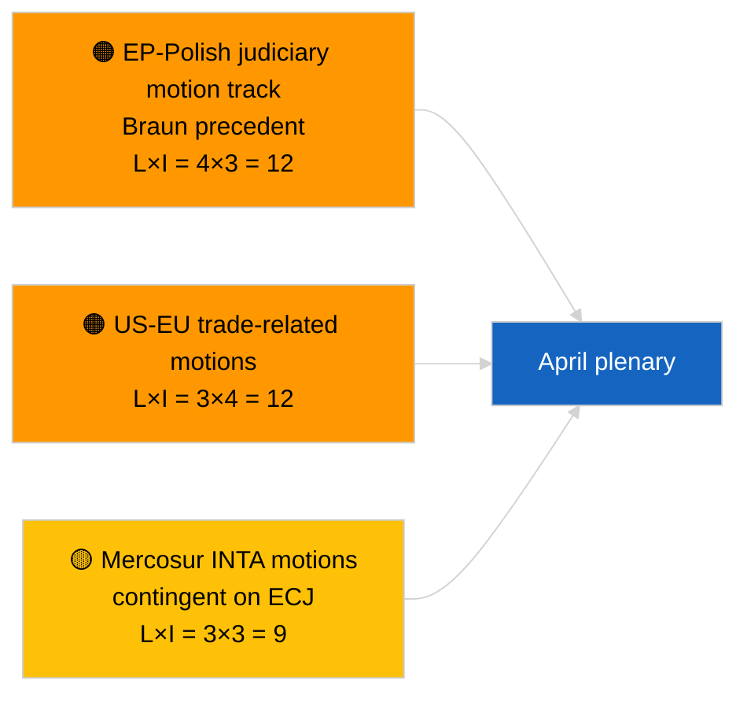

<!-- SPDX-FileCopyrightText: 2026 Hack23 AB -->
<!-- SPDX-License-Identifier: Apache-2.0 -->

# Executive Brief — Motions | 2026-04-01

**Classification:** OSINT | Public Parliamentary Record
**Confidence:** 🟢 High (recess-period structural assessment)
**Generated:** 2026-04-01T00:00:00Z (retrospective brief)
**Article Type:** Motions
**Run ID:** `6ab9ff5b-5062-4c7c-8625-af376a01eb16`
**Source:** European Parliament Open Data Portal

---

## 🎯 BLUF

**No new motions for a resolution recorded on 2026-04-01.** Analysis run `6ab9ff5b-5062-4c7c-8625-af376a01eb16` returned **0 classified actors** and **ROUTINE** significance — consistent with the EP being in inter-sessional recess (27 March → 26 April). Motions for a resolution are typically tabled in the working week immediately preceding a plenary; no such tabling is expected before mid-April. The substantive motions baseline therefore remains the carry-over from the 9-12 March Strasbourg week (Georgia political prisoners TA-10-2026-0083, HDV emission credits TA-10-2026-0084, ECB Vice-President TA-10-2026-0060) and the 25-26 March Brussels mini-plenary (US customs tariff TA-10-2026-0096, Braun immunity TA-10-2026-0088). **🟢 HIGH confidence** the empty state is calendar-driven.

---

## 🧭 3 Decisions This Brief Supports

| # | Decision | Who Decides | Deadline | Evidence |
|:-:|----------|-------------|:--------:|----------|
| 1 | **Editorial:** SKIP motions daily; produce week-recap | Editor | +24h | Empty run output |
| 2 | **Monitoring:** flag first wave of April motions for ~17-20 April (T-7 to T-10) | Analyst | 2026-04-17 | EP tabling pattern |
| 3 | **Forward-watch:** scenario-A trade-heavy weighting predicts US-tariff- and Mercosur-themed motions | Analysis lead | 2026-04-20 | Carry-over priorities |

---

## 📰 60-Second Read

- 🔴 **No new motions tabled** on 2026-04-01; recess week, no tabling activity expected. (🟢 High)
- 🟠 **0 actors classified** in this motions-focused run; no rapporteurs or co-signatories identified. (🟢 High)
- 🟢 **Carry-over motions baseline:** five high-significance March texts remain the active reference points for April-plenary motion-stage activity. (🟢 High)
- 🟡 **Risk dimensions all "none"** — no acute motions-stage risk flagged today. (🟢 High)
- 🔵 **Economic context:** US customs tariff (TA-10-2026-0096) and ECB Vice-President (TA-10-2026-0060) are the dominant economic motion-baseline files. (🟢 High)
- 🟣 **Cross-reference:** sibling 2026-04-01/breaking documents 6/8 advisory-feed 404 pattern that explains today's data void. (🟢 High)
- 🩷 **Disruption vector:** none acute; structural PPE-dominance and external US-trade pressure inherited. (🟡 Medium)
- ⚪ **Carry-forward:** Mercosur ECJ-referral (TA-10-2026-0008) likely to spawn motion(s) once Court opinion lands.

---

## 🗂️ Top Documents / Procedures — Motions Watch

| Rank | EP reference | Title (short) | Significance | Confidence | Status |
|:----:|--------------|---------------|:------------:|:----------:|--------|
| 1 | — | No new motions on 2026-04-01 | 0.0 | 🟢 HIGH | Recess — no tabling |
| 2 | TA-10-2026-0083 | Georgia political prisoners (carry-over) | 7.0 | 🟢 HIGH | Implementation reporting due |
| 3 | TA-10-2026-0096 | US customs tariff (carry-over) | 7.0 | 🟢 HIGH | Follow-up motion likely in April |

---

## ⚠️ Risk & Threat Snapshot

| Risk | L | I | Score | Trigger | Source | Admiralty |
|------|:-:|:-:|:-----:|---------|--------|:---------:|
| EP-Polish judiciary motion track | 4 | 3 | 12 | New immunity case | TA-10-2026-0088 | A1 |
| US-EU trade-related motions | 3 | 4 | 12 | US action triggers motion | TA-10-2026-0096 | A1 |
| Mercosur motions (contingent) | 3 | 3 | 9 | Court opinion lands | TA-10-2026-0008 | A2 |
| PPE structural dominance | 4 | 3 | 12 | Asymmetric motion-tabling | Coalition arithmetic | A2 |

---

## 🔮 Top Forward Trigger

**First wave of April-plenary motions tabled ~17-20 April 2026.** Topic mix will indicate whether trade-heavy (Scenario A), rule-of-law (Scenario B), or economic/industrial (Scenario C) framing dominates the 27-30 April Strasbourg session.

---

## 🛡️ Source Quality Assessment

- **Primary sources:** EP Open Data Portal — analysis run `6ab9ff5b-5062-4c7c-8625-af376a01eb16` and March 2026 motions/resolutions inventory.
- **Data limitations:** `get_parliamentary_questions_feed` and related feeds returned 404 in concurrent breaking run; confidence on absence-of-tabling activity is anchored to the EP calendar.
- **Confidence on calendar-driven inactivity:** 🟢 HIGH.

---

## 📎 Links

| Link | Path |
|------|------|
| Article | `./article.md` |
| Classification (empty) | `./classification/` |
| Sibling runs | `analysis/daily/2026-04-01/breaking/`, `committee-reports/`, `month-ahead/`, `propositions/` |
| Manifest | `./manifest.json` |

---

## 🔄 Cross-Reference

**Concurrent empty-template runs:** committee-reports, month-ahead, propositions on 2026-04-01 all show identical 0-actor / ROUTINE output, confirming the system-wide recess-period state.

---

**Document Control**
- **Template:** `/analysis/templates/executive-brief.md`
- **Artifact path:** `analysis/daily/2026-04-01/motions/executive-brief.md`
- **Classification:** Public
- **Retrospective generation:** Back-fill session.
