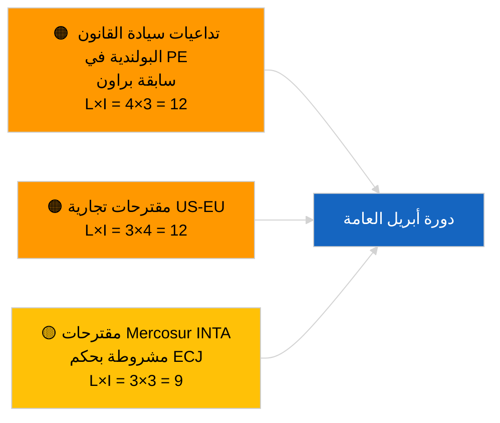

<!-- SPDX-FileCopyrightText: 2026 Hack23 AB -->
<!-- SPDX-License-Identifier: Apache-2.0 -->

# Executive Brief — مقترحات القرارات | 2026-04-01

**التصنيف:** OSINT | سجل برلماني عام
**مستوى الثقة:** 🟢 مرتفع (تقييم هيكلي بين الدورات)
**تاريخ الإنشاء:** 2026-04-01T00:00:00Z (ملاحظة استرجاعية)
**نوع المقال:** مقترحات القرارات
**معرّف التشغيل:** `6ab9ff5b-5062-4c7c-8625-af376a01eb16`
**المصدر:** بوابة البيانات المفتوحة للبرلمان الأوروبي

---

## 🎯 الخلاصة التنفيذية (BLUF)

**لم يُسجَّل أي مقترح قرار جديد بتاريخ 2026-04-01.** أسفرت عملية التحليل `6ab9ff5b-5062-4c7c-8625-af376a01eb16` عن **0 جهة فاعلة مصنَّفة** وأهمية من مستوى **روتيني** — وهو ما يتسق مع توقف البرلمان الأوروبي خلال الفترة بين الدورات (27 مارس → 26 أبريل). تُقدَّم مقترحات القرارات عادةً في أسبوع العمل السابق مباشرةً لجلسة عامة؛ ولا يُتوقع تقديم مثل هذه المقترحات قبل منتصف أبريل. وعليه، تظل القاعدة الجوهرية لمقترحات القرارات هي تلك المنقولة من أسبوع ستراسبورغ (9-12 مارس) المتعلقة بالمعتقلين السياسيين الجورجيين TA-10-2026-0083، وائتمانات انبعاثات المركبات الثقيلة TA-10-2026-0084، ونائب رئيس البنك المركزي الأوروبي TA-10-2026-0060، إضافةً إلى الجلسة المصغرة في بروكسل (25-26 مارس) بشأن التعريفات الجمركية الأمريكية TA-10-2026-0096، وحصانة براون TA-10-2026-0088. **🟢 ثقة مرتفعة** بأن الفراغ ناجم عن التقويم البرلماني.

---

## 🧭 3 قرارات يدعمها هذا الملخص

| # | القرار | صاحب القرار | الموعد النهائي | الأدلة |
|:-:|--------|------------|:-------------:|--------|
| 1 | **تحريري:** تجاهل مقترحات القرارات اليومية؛ إنتاج ملخص أسبوعي | المحرر | +24 ساعة | إخراج تشغيل فارغ |
| 2 | **مراقبة:** تحديد الموجة الأولى من مقترحات أبريل للفترة 17-20 أبريل (T-7 إلى T-10) | المحلل | 2026-04-17 | نمط تقديم البرلمان الأوروبي |
| 3 | **رصد استباقي:** يتنبأ السيناريو أ بمقترحات ذات طابع تجاري وثيق الصلة بالتعريفات الأمريكية وميركوسور | مسؤول التحليل | 2026-04-20 | الأولويات المنقولة |

---

## 📰 قراءة في 60 ثانية

- 🔴 **لم تُقدَّم أي مقترحات جديدة** بتاريخ 2026-04-01؛ أسبوع عطلة، لا تقديمات متوقعة. (🟢 مرتفع)
- 🟠 **0 جهة فاعلة مصنَّفة** في هذا التشغيل المركّز على مقترحات القرارات؛ لم تُحدَّد أي مقررين أو شركاء في التوقيع. (🟢 مرتفع)
- 🟢 **القاعدة المنقولة لمقترحات القرارات:** خمسة نصوص عالية الأهمية من مارس لا تزال نقاط مرجعية نشطة لمرحلة مقترحات دورة أبريل العامة. (🟢 مرتفع)
- 🟡 **جميع أبعاد المخاطر «لا شيء»** — لم تُرفع أي إنذارات مخاطر عاجلة اليوم. (🟢 مرتفع)
- 🔵 **السياق الاقتصادي:** التعريفات الجمركية الأمريكية (TA-10-2026-0096) ونائب رئيس البنك المركزي الأوروبي (TA-10-2026-0060) هما الملفان الأساسيان السائدان في السياق الاقتصادي لمقترحات القرارات. (🟢 مرتفع)
- 🟣 **المرجع المتقاطع:** الجلسة الشقيقة 2026-04-01/breaking توثّق النمط 6/8 لخطأ 404 في تغذية الاستشارات الذي يفسر فراغ البيانات الحالي. (🟢 مرتفع)
- 🩷 **متجه الاضطراب:** لا إنذارات عاجلة؛ هيمنة PPE الهيكلية والضغط التجاري الأمريكي الخارجي موروثان. (🟡 متوسط)
- ⚪ **نقل الأولويات:** إحالة ميركوسور إلى محكمة العدل الأوروبية (TA-10-2026-0008) يُرجَّح أن تُفضي إلى مقترحات عند صدور رأي المحكمة.

---

## 🗂️ أبرز الوثائق / الإجراءات — قائمة رصد المقترحات

| الترتيب | مرجع البرلمان الأوروبي | العنوان (مختصر) | الأهمية | مستوى الثقة | الحالة |
|:-------:|----------------------|----------------|:-------:|:-----------:|--------|
| 1 | — | لا مقترحات جديدة 2026-04-01 | 0.0 | 🟢 مرتفع | عطلة — لا تقديمات |
| 2 | TA-10-2026-0083 | المعتقلون السياسيون الجورجيون (منقول) | 7.0 | 🟢 مرتفع | تقرير تنفيذ مستحق |
| 3 | TA-10-2026-0096 | التعريفات الجمركية الأمريكية (منقول) | 7.0 | 🟢 مرتفع | مقترح متابعة مرجَّح في أبريل |

---

## ⚠️ لمحة عن المخاطر والتهديدات

| المخاطرة | ل | أ | الدرجة | المحفّز | المصدر | الأميرالية |
|---------|:-:|:-:|:------:|---------|--------|:----------:|
| تداعيات سيادة القانون البولندية | 4 | 3 | 12 | قضية حصانة جديدة | TA-10-2026-0088 | A1 |
| مقترحات تجارية US-EU | 3 | 4 | 12 | إجراء أمريكي يُطلق مقترحاً | TA-10-2026-0096 | A1 |
| مقترحات ميركوسور (مشروطة) | 3 | 3 | 9 | صدور رأي المحكمة | TA-10-2026-0008 | A2 |
| هيمنة PPE الهيكلية | 4 | 3 | 12 | تقديم غير متماثل للمقترحات | حسابات التحالف | A2 |

---

## 🔮 أهم محفّز مستقبلي

**الموجة الأولى من مقترحات دورة أبريل العامة مُقدَّمة نحو 17-20 أبريل 2026.** يشير مزيج الموضوعات إلى ما إذا كان الإطار الثقيل تجارياً (السيناريو أ)، أو سيادة القانون (السيناريو ب)، أو الاقتصادي/الصناعي (السيناريو ج) هو المهيمن على دورة ستراسبورغ 27-30 أبريل.

---

## 🛡️ تقييم جودة المصادر

- **المصادر الأولية:** بوابة البيانات المفتوحة للبرلمان الأوروبي — عملية التحليل `6ab9ff5b-5062-4c7c-8625-af376a01eb16` وجرد مارس 2026 للمقترحات والقرارات.
- **قيود البيانات:** أعاد `get_parliamentary_questions_feed` والتغذيات ذات الصلة خطأ 404 في تشغيل breaking المتزامن؛ ثقة غياب نشاط التقديم مرتكزة على تقويم البرلمان الأوروبي.
- **مستوى الثقة للتوقف المشروط بالتقويم:** 🟢 مرتفع.

---

## 📎 روابط

| الرابط | المسار |
|--------|--------|
| المقال | `./article.md` |
| التصنيف (فارغ) | `./classification/` |
| الجلسات الشقيقة | `analysis/daily/2026-04-01/breaking/`, `committee-reports/`, `month-ahead/`, `propositions/` |
| البيان | `./manifest.json` |

---

## 🔄 مراجع متقاطعة

**تشغيلات القوالب الفارغة المتزامنة:** committee-reports وmonth-ahead وpropositions بتاريخ 2026-04-01 تُظهر جميعها إخراجاً متطابقاً من 0 جهة فاعلة/روتيني، مما يُؤكد حالة التوقف على مستوى النظام بأكمله.

---

**ضبط الوثيقة**
- **النموذج:** `/analysis/templates/executive-brief.md`
- **مسار الوثيقة:** `analysis/daily/2026-04-01/motions/executive-brief.md`
- **التصنيف:** عام
- **الإنشاء الاسترجاعي:** جلسة استيفاء البيانات.
