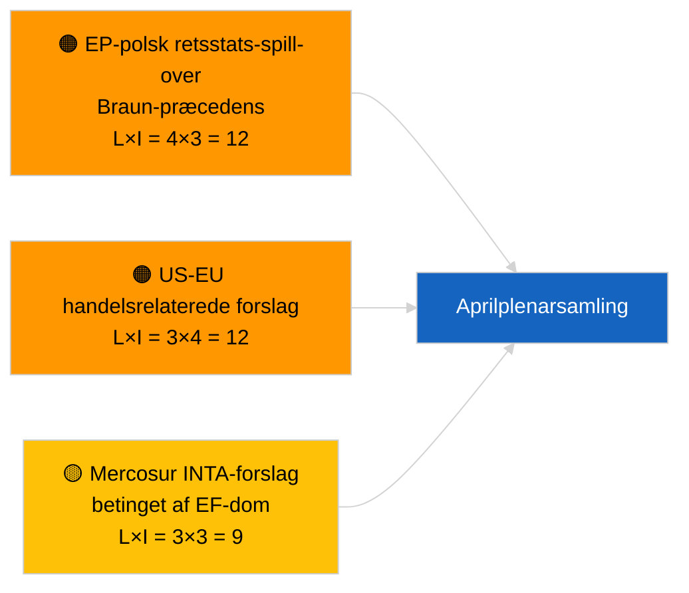

<!-- SPDX-FileCopyrightText: 2026 Hack23 AB -->
<!-- SPDX-License-Identifier: Apache-2.0 -->

# Executive Brief — Beslutningsforslag | 2026-04-01

**Klassifikation:** OSINT | Offentlig parlamentarisk optegnelse
**Konfidensgrad:** 🟢 Høj (intersessionel strukturel vurdering)
**Genereret:** 2026-04-01T00:00:00Z (retrospektivt notat)
**Artikeltype:** Beslutningsforslag
**Kørsel-ID:** `6ab9ff5b-5062-4c7c-8625-af376a01eb16`
**Kilde:** Europa-Parlamentets åbne dataportal

---

## 🎯 BLUF

**Ingen nye beslutningsforslag registreret den 2026-04-01.** Analysekørsel `6ab9ff5b-5062-4c7c-8625-af376a01eb16` returnerede **0 klassificerede aktører** og **RUTINE**-signifikans — konsistent med at EP er i intersessionelt reces (27. marts → 26. april). Beslutningsforslag fremsættes typisk i den arbejdsuge der går umiddelbart forud for en plenarsamling; sådanne fremsættelser forventes ikke inden midten af april. Den substantielle baseline for beslutningsforslag er derfor fortsat de overførte fra Strasbourg-ugen 9-12 marts (georgiske politiske fanger TA-10-2026-0083, HDV-emissionskreditter TA-10-2026-0084, ECB-næstformand TA-10-2026-0060) og Bruxelles-miniplenary 25-26 marts (US toldtarif TA-10-2026-0096, Braun-immunitet TA-10-2026-0088). **🟢 HØJ konfidensgrad** om at den tomme tilstand er kalender-betinget.

---

## 🧭 3 Beslutninger Dette Notat Understøtter

| # | Beslutning | Hvem beslutter | Deadline | Dokumentation |
|:-:|-----------|---------------|:--------:|---------------|
| 1 | **Redaktionel:** SPRING beslutningsforslag over dagligt; udarbejd uge-opsummering | Redaktør | +24h | Tom kørselsoutput |
| 2 | **Overvågning:** flag den første bølge af aprilforslag for ~17-20 april (T-7 til T-10) | Analytiker | 2026-04-17 | EP-fremsættelses-mønster |
| 3 | **Fremadrettet bevakning:** scenarie-A handelstung vægtning forudsiger US-told- og Mercosur-tematiske forslag | Analyseansvarlig | 2026-04-20 | Overførte prioriteter |

---

## 📰 60-Sekunders Læsning

- 🔴 **Ingen nye forslag fremsat** den 2026-04-01; recesuge, ingen fremsættelsesaktivitet forventet. (🟢 Høj)
- 🟠 **0 aktører klassificeret** i denne beslutningsforslag-fokuserede kørsel; ingen ordførere eller medforslagsstillere identificeret. (🟢 Høj)
- 🟢 **Overført baseline for beslutningsforslag:** fem høj-signifikante marts-tekster er fortsat de aktive referencepunkter for aprilplenar-forslagsfaseaktivitet. (🟢 Høj)
- 🟡 **Risiko-dimensioner alle "ingen"** — ingen akut forslagsfaserisiko markeret i dag. (🟢 Høj)
- 🔵 **Økonomisk kontekst:** US toldtarif (TA-10-2026-0096) og ECB-næstformand (TA-10-2026-0060) er de dominerende økonomi-baseline-filer for beslutningsforslag. (🟢 Høj)
- 🟣 **Krydsreference:** søskende 2026-04-01/breaking dokumenterer 6/8 rådgivningsfeed 404-mønsteret der forklarer det aktuelle datavakuum. (🟢 Høj)
- 🩷 **Forstyrrelsesvektor:** ingen akut; strukturel PPE-dominans og ekstern US-handelspres er nedarvet. (🟡 Middel)
- ⚪ **Fremadrettet overførsel:** Mercosur EF-domstolshenskydning (TA-10-2026-0008) forventes at give anledning til forslag, når domstolsudtalelse foreligger.

---

## 🗂️ Topdokumenter / Procedurer — Beslutningsforslag-overvågning

| Rang | EP-reference | Titel (kort) | Betydning | Konfidensgrad | Status |
|:----:|--------------|--------------|:---------:|:-------------:|--------|
| 1 | — | Ingen nye forslag 2026-04-01 | 0,0 | 🟢 HØJ | Reces — ingen fremsættelse |
| 2 | TA-10-2026-0083 | Georgiske politiske fanger (overført) | 7,0 | 🟢 HØJ | Implementeringsrapportering forfalder |
| 3 | TA-10-2026-0096 | US toldtarif (overført) | 7,0 | 🟢 HØJ | Opfølgningsforslag sandsynligvis i april |

---

## ⚠️ Risiko- og Trusselbillede

| Risiko | L | I | Score | Udløser | Kilde | Admiralitet |
|--------|:-:|:-:|:-----:|---------|-------|:-----------:|
| EP-polsk retsstats-spill-over | 4 | 3 | 12 | Ny immunitetsssag | TA-10-2026-0088 | A1 |
| US-EU handelsrelaterede forslag | 3 | 4 | 12 | US-handling udløser forslag | TA-10-2026-0096 | A1 |
| Mercosur-forslag (betingede) | 3 | 3 | 9 | Domstolsudtalelse foreligger | TA-10-2026-0008 | A2 |
| PPE strukturel dominans | 4 | 3 | 12 | Asymmetrisk forslagsfremsættelse | Koalitionsaritmetik | A2 |

---

## 🔮 Vigtigste Fremtidige Udløser

**Første bølge af aprilplenarforslag fremsat ~17-20. april 2026.** Emnemixen angiver om handelstung (Scenarie A), retsstat (Scenarie B) eller økonomisk/industriel (Scenarie C) framing dominerer Strasbourg-sessionen 27-30 april.

---

## 🛡️ Vurdering af Kildekvalitet

- **Primære kilder:** Europa-Parlamentets åbne dataportal — analysekørsel `6ab9ff5b-5062-4c7c-8625-af376a01eb16` og marts 2026 beslutningsforslag/resolutionsinventar.
- **Databegrænsninger:** `get_parliamentary_questions_feed` og relaterede feeds returnerede 404 i concurrent breaking-kørsel; konfidensen om fravær af fremsættelsesaktivitet er forankret til EP-kalenderen.
- **Konfidensgrad for kalender-betinget inaktivitet:** 🟢 HØJ.

---

## 📎 Links

| Link | Sti |
|------|-----|
| Artikel | `./article.md` |
| Klassificering (tom) | `./classification/` |
| Søskende-kørsler | `analysis/daily/2026-04-01/breaking/`, `committee-reports/`, `month-ahead/`, `propositions/` |
| Manifest | `./manifest.json` |

---

## 🔄 Krydsreference

**Samtidige tomme skabelon-kørsler:** committee-reports, month-ahead, propositions den 2026-04-01 viser alle identisk 0-aktør/RUTINE-output, der bekræfter den systemdækkende recestilstand.

---

**Dokumentkontrol**
- **Skabelon:** `/analysis/templates/executive-brief.md`
- **Artefaktsti:** `analysis/daily/2026-04-01/motions/executive-brief.md`
- **Klassifikation:** Offentlig
- **Retrospektiv generering:** Tilbagedateret session.
