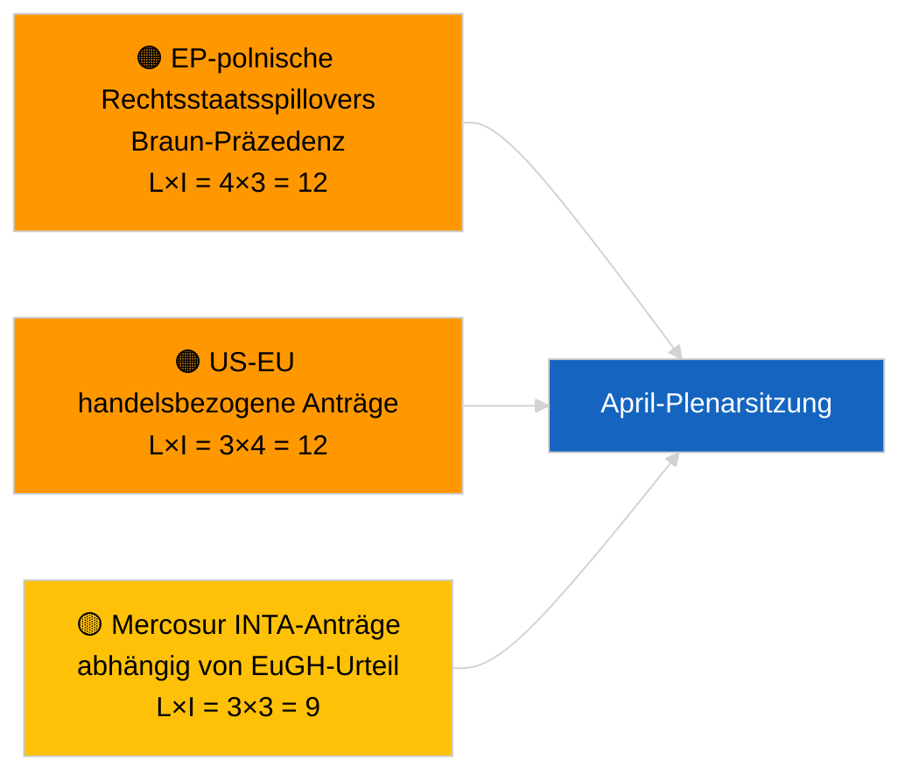

<!-- SPDX-FileCopyrightText: 2026 Hack23 AB -->
<!-- SPDX-License-Identifier: Apache-2.0 -->

# Executive Brief — Entschließungsanträge | 2026-04-01

**Klassifizierung:** OSINT | Öffentliche parlamentarische Aufzeichnung
**Konfidenzniveau:** 🟢 Hoch (intersessionelle strukturelle Bewertung)
**Erstellt:** 2026-04-01T00:00:00Z (retrospektive Zusammenfassung)
**Artikeltyp:** Entschließungsanträge
**Ausführungs-ID:** `6ab9ff5b-5062-4c7c-8625-af376a01eb16`
**Quelle:** Offenes Datenportal des Europäischen Parlaments

---

## 🎯 BLUF

**Keine neuen Entschließungsanträge für den 2026-04-01 registriert.** Die Analyseausführung `6ab9ff5b-5062-4c7c-8625-af376a01eb16` ergab **0 klassifizierte Akteure** und **ROUTINE**-Bedeutung — konsistent mit dem intersessionellen Rückzug des EP (27. März → 26. April). Entschließungsanträge werden typischerweise in der Arbeitswoche unmittelbar vor einer Plenartagung eingebracht; solche Einreichungen sind bis Mitte April nicht zu erwarten. Die substantielle Baseline der Entschließungsanträge bleibt daher die der Straßburg-Woche 9.-12. März (georgische politische Gefangene TA-10-2026-0083, HDV-Emissionsgutschriften TA-10-2026-0084, EZB-Vizepräsident TA-10-2026-0060) und der Brüsseler Mini-Plenarsitzung 25.-26. März (US-Zolltarife TA-10-2026-0096, Braun-Immunität TA-10-2026-0088) übernommenen Texte. **🟢 HOHES Konfidenzniveau**, dass der leere Zustand kalenderbedingt ist.

---

## 🧭 3 Entscheidungen, die dieser Brief unterstützt

| # | Entscheidung | Wer entscheidet | Frist | Evidenz |
|:-:|-------------|----------------|:-----:|---------|
| 1 | **Redaktionell:** ÜBERSPRINGEN Sie tägliche Entschließungsanträge; erstellen Sie Wochenzusammenfassung | Redakteur | +24h | Leere Ausführungsausgabe |
| 2 | **Beobachtung:** Kennzeichnung der ersten Welle von April-Anträgen für ~17.-20. April (T-7 bis T-10) | Analytiker | 2026-04-17 | EP-Einreichungsmuster |
| 3 | **Vorausschauende Überwachung:** Szenario-A handelsgewichtete Gewichtung sagt US-Zoll- und Mercosur-thematische Anträge voraus | Analysebeauftragter | 2026-04-20 | Übernommene Prioritäten |

---

## 📰 60-Sekunden-Lektüre

- 🔴 **Keine neuen Anträge eingebracht** am 2026-04-01; Sitzungspause, keine Einreichungsaktivität erwartet. (🟢 Hoch)
- 🟠 **0 Akteure klassifiziert** in dieser auf Entschließungsanträge fokussierten Ausführung; keine Berichterstatter oder Mitunterzeichner identifiziert. (🟢 Hoch)
- 🟢 **Übernommene Entschließungsantrags-Baseline:** Fünf hochwichtige März-Texte bleiben die aktiven Referenzpunkte für die Entschließungsantragsphase der April-Plenarsitzung. (🟢 Hoch)
- 🟡 **Risikodimensionen alle „keine"** — kein akutes Antragsrisiko heute markiert. (🟢 Hoch)
- 🔵 **Wirtschaftlicher Kontext:** US-Zolltarife (TA-10-2026-0096) und EZB-Vizepräsident (TA-10-2026-0060) sind die dominierenden wirtschaftlichen Basisdateien für Entschließungsanträge. (🟢 Hoch)
- 🟣 **Querverweise:** Geschwister 2026-04-01/breaking dokumentiert das 6/8-Beratungsfeed-404-Muster, das das heutige Datenvakuum erklärt. (🟢 Hoch)
- 🩷 **Störungsvektor:** kein akuter; strukturelle PPE-Dominanz und externer US-Handelsdruck sind geerbt. (🟡 Mittel)
- ⚪ **Weitergabe:** Mercosur-EuGH-Vorlage (TA-10-2026-0008) wird voraussichtlich Anträge auslösen, sobald das Gerichtsgutachten vorliegt.

---

## 🗂️ Top-Dokumente / -Verfahren — Entschließungsantrags-Watchlist

| Rang | EP-Referenz | Titel (kurz) | Bedeutung | Konfidenzniveau | Status |
|:----:|-------------|--------------|:---------:|:---------------:|--------|
| 1 | — | Keine neuen Anträge 2026-04-01 | 0,0 | 🟢 HOCH | Pause — keine Einreichung |
| 2 | TA-10-2026-0083 | Georgische politische Gefangene (übernommen) | 7,0 | 🟢 HOCH | Umsetzungsberichterstattung fällig |
| 3 | TA-10-2026-0096 | US-Zolltarife (übernommen) | 7,0 | 🟢 HOCH | Folgantrag wahrscheinlich im April |

---

## ⚠️ Risiko- und Bedrohungsübersicht

| Risiko | L | I | Punktzahl | Auslöser | Quelle | Admiralität |
|--------|:-:|:-:|:---------:|---------|--------|:-----------:|
| EP-polnische Rechtsstaatsspillovers | 4 | 3 | 12 | Neuer Immunitätsfall | TA-10-2026-0088 | A1 |
| US-EU handelsbezogene Anträge | 3 | 4 | 12 | US-Aktion löst Antrag aus | TA-10-2026-0096 | A1 |
| Mercosur-Anträge (bedingt) | 3 | 3 | 9 | EuGH-Stellungnahme liegt vor | TA-10-2026-0008 | A2 |
| PPE strukturelle Dominanz | 4 | 3 | 12 | Asymmetrische Antragseinreichung | Koalitionsarithmetik | A2 |

---

## 🔮 Wichtigster Künftiger Auslöser

**Erste Welle der April-Plenarsitzungsanträge eingebracht ~17.-20. April 2026.** Die Themenkomposition zeigt an, ob handelsschwere (Szenario A), Rechtsstaats- (Szenario B) oder wirtschaftliche/industrielle (Szenario C) Rahmung die Straßburger Sitzung vom 27.-30. April dominiert.

---

## 🛡️ Bewertung der Quellenqualität

- **Primärquellen:** Offenes Datenportal des Europäischen Parlaments — Analyseausführung `6ab9ff5b-5062-4c7c-8625-af376a01eb16` und März 2026 Anträge/Resolutionsinventar.
- **Datenbeschränkungen:** `get_parliamentary_questions_feed` und verwandte Feeds gaben in concurrent Breaking-Ausführung 404 zurück; das Konfidenzniveau für die Abwesenheit von Einreichungsaktivität ist am EP-Kalender verankert.
- **Konfidenzniveau für kalenderbedingte Inaktivität:** 🟢 HOCH.

---

## 📎 Links

| Link | Pfad |
|------|------|
| Artikel | `./article.md` |
| Klassifizierung (leer) | `./classification/` |
| Geschwister-Ausführungen | `analysis/daily/2026-04-01/breaking/`, `committee-reports/`, `month-ahead/`, `propositions/` |
| Manifest | `./manifest.json` |

---

## 🔄 Querverweise

**Gleichzeitige leere Vorlageausführungen:** committee-reports, month-ahead, propositions am 2026-04-01 zeigen alle identische 0-Akteur/ROUTINE-Ausgaben und bestätigen den systemweiten Rückzugszustand.

---

**Dokumentenkontrolle**
- **Vorlage:** `/analysis/templates/executive-brief.md`
- **Artefaktpfad:** `analysis/daily/2026-04-01/motions/executive-brief.md`
- **Klassifizierung:** Öffentlich
- **Retrospektive Generierung:** Nachfüllsitzung.
