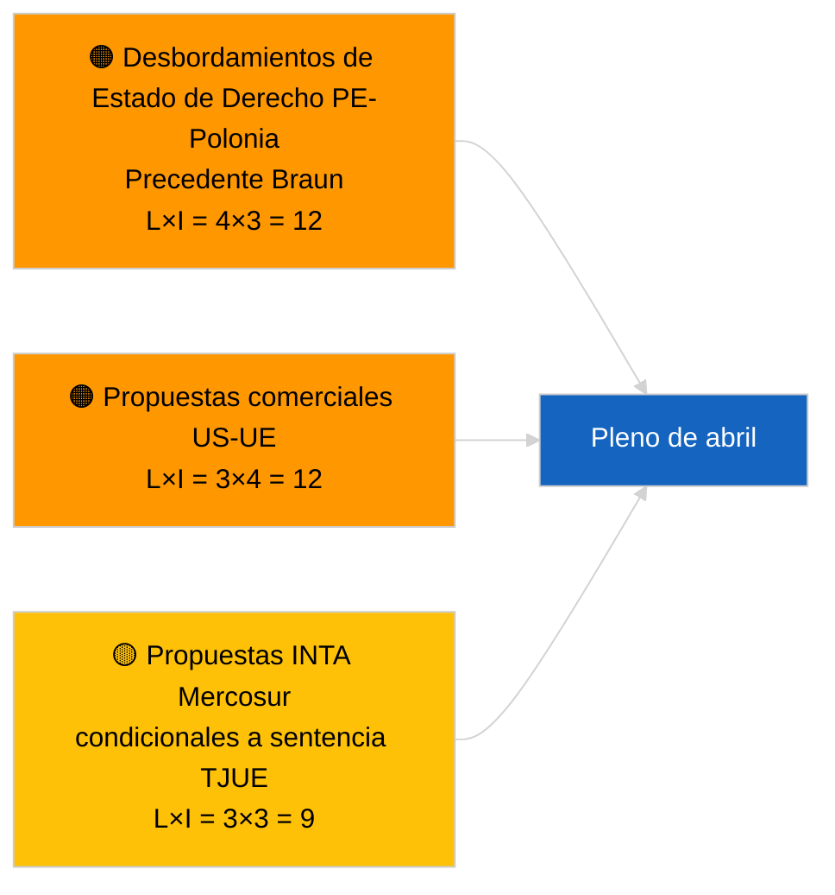

<!-- SPDX-FileCopyrightText: 2026 Hack23 AB -->
<!-- SPDX-License-Identifier: Apache-2.0 -->

# Executive Brief — Propuestas de Resolución | 2026-04-01

**Clasificación:** OSINT | Registro parlamentario público
**Nivel de confianza:** 🟢 Alto (evaluación estructural intersesional)
**Generado:** 2026-04-01T00:00:00Z (nota retrospectiva)
**Tipo de artículo:** Propuestas de Resolución
**ID de ejecución:** `6ab9ff5b-5062-4c7c-8625-af376a01eb16`
**Fuente:** Portal de datos abiertos del Parlamento Europeo

---

## 🎯 BLUF

**No se han registrado nuevas propuestas de resolución el 2026-04-01.** La ejecución de análisis `6ab9ff5b-5062-4c7c-8625-af376a01eb16` devolvió **0 actores clasificados** y significación de nivel **RUTINA** — coherente con que el PE se encuentra en receso intersesional (27 de marzo → 26 de abril). Las propuestas de resolución se presentan típicamente en la semana laboral inmediatamente anterior a un período de sesiones plenarias; no se esperan presentaciones antes de mediados de abril. La base sustancial de propuestas de resolución sigue siendo la de los textos trasladados de la semana de Estrasburgo del 9-12 de marzo (presos políticos georgianos TA-10-2026-0083, créditos de emisiones de VCH TA-10-2026-0084, vicepresidente del BCE TA-10-2026-0060) y del minipleno de Bruselas del 25-26 de marzo (aranceles aduaneros de EE.UU. TA-10-2026-0096, inmunidad Braun TA-10-2026-0088). **🟢 ALTO nivel de confianza** en que el estado vacío está condicionado por el calendario.

---

## 🧭 3 Decisiones que Este Brief Apoya

| # | Decisión | Quién decide | Plazo | Evidencia |
|:-:|---------|-------------|:-----:|-----------|
| 1 | **Editorial:** OMITIR propuestas de resolución diarias; producir resumen semanal | Editor | +24h | Salida de ejecución vacía |
| 2 | **Vigilancia:** señalar la primera oleada de propuestas de abril para ~17-20 de abril (T-7 a T-10) | Analista | 2026-04-17 | Patrón de presentación del PE |
| 3 | **Vigilancia prospectiva:** la ponderación de escenario A con carga comercial predice propuestas temáticas sobre aranceles de EE.UU. y Mercosur | Responsable de análisis | 2026-04-20 | Prioridades trasladadas |

---

## 📰 Lectura en 60 Segundos

- 🔴 **Sin nuevas propuestas presentadas** el 2026-04-01; semana de receso, no se espera actividad de presentación. (🟢 Alto)
- 🟠 **0 actores clasificados** en esta ejecución centrada en propuestas de resolución; no se han identificado ponentes ni cofirmantes. (🟢 Alto)
- 🟢 **Base trasladada de propuestas de resolución:** cinco textos de alta significación de marzo siguen siendo los puntos de referencia activos para la actividad de la fase de propuestas del pleno de abril. (🟢 Alto)
- 🟡 **Todas las dimensiones de riesgo a «ninguno»** — ningún riesgo agudo de fase de propuesta marcado hoy. (🟢 Alto)
- 🔵 **Contexto económico:** los aranceles aduaneros de EE.UU. (TA-10-2026-0096) y el vicepresidente del BCE (TA-10-2026-0060) son los archivos de base económica dominantes para las propuestas de resolución. (🟢 Alto)
- 🟣 **Referencia cruzada:** la ejecución hermana 2026-04-01/breaking documenta el patrón 404 del flujo de asesoramiento 6/8 que explica el vacío de datos actual. (🟢 Alto)
- 🩷 **Vector de perturbación:** ninguno agudo; dominancia estructural del PPE y presión comercial externa de EE.UU. heredadas. (🟡 Medio)
- ⚪ **Traslado prospectivo:** la remisión al TJUE de Mercosur (TA-10-2026-0008) previsiblemente dará lugar a propuesta(s) una vez emitido el dictamen judicial.

---

## 🗂️ Principales Documentos / Procedimientos — Lista de Vigilancia de Propuestas

| Rango | Referencia PE | Título (corto) | Significación | Confianza | Estado |
|:-----:|--------------|----------------|:------------:|:---------:|--------|
| 1 | — | Sin nuevas propuestas 2026-04-01 | 0,0 | 🟢 ALTO | Receso — sin presentación |
| 2 | TA-10-2026-0083 | Presos políticos georgianos (trasladado) | 7,0 | 🟢 ALTO | Informe de implementación pendiente |
| 3 | TA-10-2026-0096 | Aranceles aduaneros de EE.UU. (trasladado) | 7,0 | 🟢 ALTO | Propuesta de seguimiento probable en abril |

---

## ⚠️ Panorama de Riesgos y Amenazas

| Riesgo | L | I | Puntuación | Desencadenante | Fuente | Almirantazgo |
|--------|:-:|:-:|:----------:|--------------|--------|:------------:|
| Desbordamientos Estado de Derecho PE-Polonia | 4 | 3 | 12 | Nuevo caso de inmunidad | TA-10-2026-0088 | A1 |
| Propuestas comerciales US-UE | 3 | 4 | 12 | Acción US desencadena propuesta | TA-10-2026-0096 | A1 |
| Propuestas Mercosur (condicionales) | 3 | 3 | 9 | Dictamen judicial emitido | TA-10-2026-0008 | A2 |
| Dominancia estructural PPE | 4 | 3 | 12 | Presentación asimétrica de propuestas | Aritmética de coalición | A2 |

---

## 🔮 Principal Desencadenante Futuro

**Primera oleada de propuestas de pleno de abril presentadas ~17-20 de abril de 2026.** La composición temática indica si el encuadre dominante será cargado de comercio (Escenario A), Estado de Derecho (Escenario B) o económico/industrial (Escenario C) para la sesión de Estrasburgo del 27-30 de abril.

---

## 🛡️ Evaluación de la Calidad de las Fuentes

- **Fuentes primarias:** Portal de datos abiertos del Parlamento Europeo — ejecución de análisis `6ab9ff5b-5062-4c7c-8625-af376a01eb16` e inventario de propuestas/resoluciones de marzo de 2026.
- **Limitaciones de los datos:** `get_parliamentary_questions_feed` y flujos relacionados devolvieron 404 en la ejecución breaking simultánea; la confianza en la ausencia de actividad de presentación está anclada en el calendario del PE.
- **Nivel de confianza para la inactividad condicionada por el calendario:** 🟢 ALTO.

---

## 📎 Enlaces

| Enlace | Ruta |
|--------|------|
| Artículo | `./article.md` |
| Clasificación (vacía) | `./classification/` |
| Ejecuciones hermanas | `analysis/daily/2026-04-01/breaking/`, `committee-reports/`, `month-ahead/`, `propositions/` |
| Manifiesto | `./manifest.json` |

---

## 🔄 Referencia Cruzada

**Ejecuciones de plantilla vacías simultáneas:** committee-reports, month-ahead, propositions el 2026-04-01 muestran todos salida idéntica de 0 actores/RUTINA, confirmando el estado de receso de todo el sistema.

---

**Control del documento**
- **Plantilla:** `/analysis/templates/executive-brief.md`
- **Ruta del artefacto:** `analysis/daily/2026-04-01/motions/executive-brief.md`
- **Clasificación:** Público
- **Generación retrospectiva:** Sesión de relleno.
