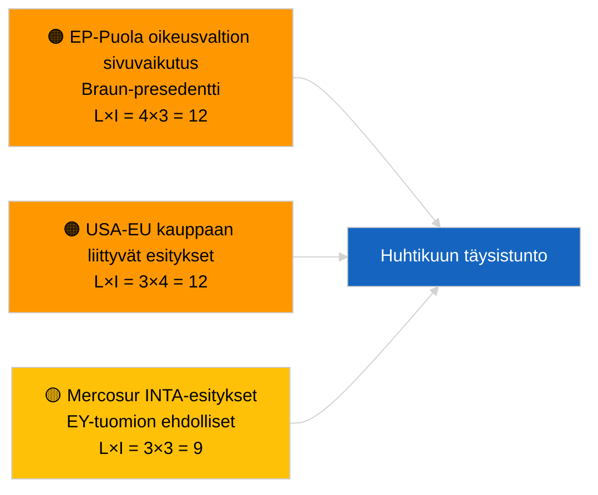

<!-- SPDX-FileCopyrightText: 2026 Hack23 AB -->
<!-- SPDX-License-Identifier: Apache-2.0 -->

# Executive Brief — Päätöslauselmaesitykset | 2026-04-01

**Luokittelu:** OSINT | Julkinen parlamentaarinen asiakirja
**Luottamustaso:** 🟢 Korkea (istuntojen välinen rakenteellinen arviointi)
**Luotu:** 2026-04-01T00:00:00Z (retrospektiivinen tiivis yhteenveto)
**Artikkelityyppi:** Päätöslauselmaesitykset
**Ajon ID:** `6ab9ff5b-5062-4c7c-8625-af376a01eb16`
**Lähde:** Euroopan parlamentin avoin dataportti

---

## 🎯 BLUF

**Uusia päätöslauselmaesityksiä ei rekisteröity 2026-04-01.** Analyysiajoajo `6ab9ff5b-5062-4c7c-8625-af376a01eb16` palautti **0 luokiteltua toimijaa** ja **RUTIINITASON** merkittävyyden — johdonmukainen sen kanssa, että EP on istuntojen välisessä tauossa (27. maaliskuuta → 26. huhtikuuta). Päätöslauselmaesitykset jätetään tyypillisesti täysistuntoa välittömästi edeltävänä työviikkona; sellaisia jättämisiä ei odoteta ennen huhtikuun puoliväliä. Päätöslauselmaesitysten substantiaalinen peruslinja on siis edelleen Strasbourg-viikon 9.-12. maaliskuuta (Georgian poliittiset vangit TA-10-2026-0083, HDV-päästökreditit TA-10-2026-0084, EKP:n varapuheenjohtaja TA-10-2026-0060) ja Bryssel-miniplenaarikokous 25.-26. maaliskuuta (Yhdysvaltojen tullit TA-10-2026-0096, Braun-immuniteetti TA-10-2026-0088) videreförda. **🟢 KORKEA luottamus** sille, että tyhjä tila johtuu kalenterista.

---

## 🧭 3 Päätöstä, joita tämä tiiviistelmä tukee

| # | Päätös | Kuka päättää | Määräaika | Näyttö |
|:-:|--------|-------------|:---------:|--------|
| 1 | **Toimituksellinen:** JÄTä päätöslauselmaesitykset päivittäin; tuota viikkokatsaus | Päätoimittaja | +24h | Tyhjä ajon tuloste |
| 2 | **Seuranta:** merkitse ensimmäinen aalto huhtikuun esityksistä ~17.-20. huhtikuuta (T-7 – T-10) | Analyytikko | 2026-04-17 | EP:n jättämismalli |
| 3 | **Eteenpäin katsova seuranta:** skenaario A:n kauppapainotteinen painotus ennustaa Yhdysvaltojen tulleja ja Mercosuria käsitteleviä esityksiä | Analyysipäällikkö | 2026-04-20 | Siirtyvät prioriteetit |

---

## 📰 60 Sekunnin Katsaus

- 🔴 **Uusia esityksiä ei jätetty** 2026-04-01; taukoviikko, jättämistoimintaa ei odoteta. (🟢 Korkea)
- 🟠 **0 toimijaa luokiteltu** tässä päätöslauselmaesityksiin keskittyvässä ajossa; esittelijöitä tai kanssavarmentajia ei tunnistettu. (🟢 Korkea)
- 🟢 **Siirtyvä päätöslauselmaesitysperuslinja:** viisi korkeasignifikaanttia maaliskuun tekstiä on edelleen aktiiviset referenssipisteet huhtikuun täysistunnon esitysvaiheen toiminnalle. (🟢 Korkea)
- 🟡 **Riskiulottuvuudet kaikki "ei mitään"** — ei akuuttia esitysvaiheen riskiä liputtanut tänään. (🟢 Korkea)
- 🔵 **Taloudellinen konteksti:** Yhdysvaltojen tullit (TA-10-2026-0096) ja EKP:n varapuheenjohtaja (TA-10-2026-0060) ovat hallitsevat taloudellisen peruslinjan tiedostot päätöslauselmaesityksille. (🟢 Korkea)
- 🟣 **Ristiviite:** sisarajo 2026-04-01/breaking dokumentoi 6/8 neuvontasyötteen 404-virhemallista, joka selittää tämän päivän tyhjiöä. (🟢 Korkea)
- 🩷 **Häiriövektori:** ei akuutti; rakenteellinen PPE-dominanssi ja ulkoinen Yhdysvaltojen kauppapaine peritty. (🟡 Keskitaso)
- ⚪ **Siirtäminen eteenpäin:** Mercosur EY-tuomioistuimeen lähettäminen (TA-10-2026-0008) odotettavasti johtaa esitys(iin) tuomioistuinlausunnon tultua.

---

## 🗂️ Tärkeimmät Asiakirjat / Menettelyt — Päätöslauselmaesitysten Seuranta

| Sija | EP-viite | Otsikko (lyhyt) | Merkittävyys | Luottamustaso | Tila |
|:----:|----------|-----------------|:------------:|:-------------:|------|
| 1 | — | Ei uusia esityksiä 2026-04-01 | 0,0 | 🟢 KORKEA | Tauko — ei jättämistä |
| 2 | TA-10-2026-0083 | Georgian poliittiset vangit (siirretty) | 7,0 | 🟢 KORKEA | Täytäntöönpanoraportointi erääntyy |
| 3 | TA-10-2026-0096 | Yhdysvaltojen tullit (siirretty) | 7,0 | 🟢 KORKEA | Seurantaesitys todennäköisesti huhtikuussa |

---

## ⚠️ Riski- ja Uhka-analyysi

| Riski | L | I | Pisteet | Laukaisin | Lähde | Admiraliteetti |
|-------|:-:|:-:|:-------:|-----------|-------|:--------------:|
| EP-Puola oikeusvaltion sivuvaikutus | 4 | 3 | 12 | Uusi immuniteeettitapaus | TA-10-2026-0088 | A1 |
| USA-EU kauppaan liittyvät esitykset | 3 | 4 | 12 | USA:n toiminta laukaisee esityksen | TA-10-2026-0096 | A1 |
| Mercosur-esitykset (ehdolliset) | 3 | 3 | 9 | Tuomioistuinlausunto saapuu | TA-10-2026-0008 | A2 |
| PPE rakenteellinen dominanssi | 4 | 3 | 12 | Epäsymmetrinen esitysjättäminen | Koalitioaritmetiikka | A2 |

---

## 🔮 Tärkein Ennakoiva Laukaisin

**Ensimmäinen aalto huhtikuun täysistuntoesityksistä jätetty ~17.-20. huhtikuuta 2026.** Aiheiden yhdistelmä osoittaa, dominoiko kauppapainotteinen (Skenaario A), oikeusvaltiollinen (Skenaario B) vai taloudellinen/teollinen (Skenaario C) kehystäminen Strasbourgin sessiota 27.-30. huhtikuuta.

---

## 🛡️ Lähteen Laadun Arviointi

- **Ensisijaiset lähteet:** Euroopan parlamentin avoin dataportti — analyysiajoajo `6ab9ff5b-5062-4c7c-8625-af376a01eb16` ja maaliskuun 2026 esitykset/resoluutioiden inventaario.
- **Tietorajoitukset:** `get_parliamentary_questions_feed` ja liittyvät syötteet palauttivat 404 concurrent breaking-ajossa; luottamus jättämistoiminnan puuttumiseen on ankkuroitu EP:n kalenteriin.
- **Luottamus kalenterista johtuvaan inaktiivisuuteen:** 🟢 KORKEA.

---

## 📎 Linkit

| Linkki | Polku |
|--------|-------|
| Artikkeli | `./article.md` |
| Luokittelu (tyhjä) | `./classification/` |
| Sisa-ajot | `analysis/daily/2026-04-01/breaking/`, `committee-reports/`, `month-ahead/`, `propositions/` |
| Manifesti | `./manifest.json` |

---

## 🔄 Ristiviite

**Samanaikaiset tyhjät malliaajot:** committee-reports, month-ahead, propositions 2026-04-01 osoittavat kaikki identtisiä 0-toimija/RUTIINITASON tulosteita, vahvistaen koko järjestelmän tauko-tilaa.

---

**Asiakirjavalvonta**
- **Malli:** `/analysis/templates/executive-brief.md`
- **Artefaktipolku:** `analysis/daily/2026-04-01/motions/executive-brief.md`
- **Luokittelu:** Julkinen
- **Retrospektiivinen luominen:** Täyttö-sessio.
