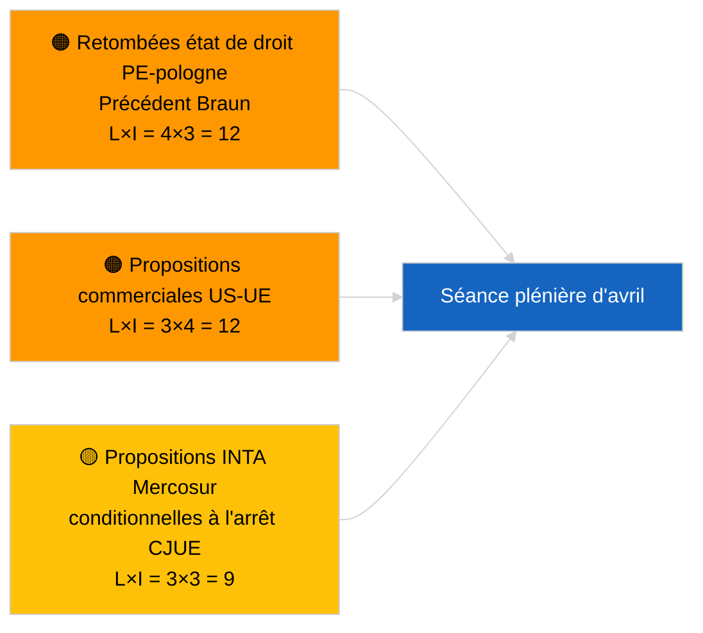

<!-- SPDX-FileCopyrightText: 2026 Hack23 AB -->
<!-- SPDX-License-Identifier: Apache-2.0 -->

# Executive Brief — Propositions de Résolution | 2026-04-01

**Classification :** OSINT | Procès-verbal parlementaire public
**Niveau de confiance :** 🟢 Élevé (évaluation structurelle intersessionnelle)
**Généré :** 2026-04-01T00:00:00Z (note rétrospective)
**Type d'article :** Propositions de résolution
**ID d'exécution :** `6ab9ff5b-5062-4c7c-8625-af376a01eb16`
**Source :** Portail de données ouvertes du Parlement européen

---

## 🎯 BLUF

**Aucune nouvelle proposition de résolution enregistrée le 2026-04-01.** L'exécution d'analyse `6ab9ff5b-5062-4c7c-8625-af376a01eb16` a retourné **0 acteur classifié** et une signification de niveau **ROUTINE** — cohérent avec la période intersessionnelle du PE (27 mars → 26 avril). Les propositions de résolution sont typiquement déposées au cours de la semaine de travail qui précède immédiatement une séance plénière ; de tels dépôts ne sont pas attendus avant la mi-avril. La base substantielle des propositions de résolution demeure donc celle des textes reportés de la semaine de Strasbourg du 9-12 mars (prisonniers politiques géorgiens TA-10-2026-0083, crédits d'émissions VPH TA-10-2026-0084, vice-président de la BCE TA-10-2026-0060) et de la mini-plénière bruxelloise des 25-26 mars (tarifs douaniers américains TA-10-2026-0096, immunité Braun TA-10-2026-0088). **🟢 HAUTE confiance** que l'état vide est conditionné par le calendrier.

---

## 🧭 3 Décisions que ce Brief Soutient

| # | Décision | Décideur | Délai | Fondement |
|:-:|---------|---------|:-----:|-----------|
| 1 | **Éditorial :** IGNORER les propositions de résolution quotidiennes ; produire un récapitulatif hebdomadaire | Rédacteur | +24h | Sortie d'exécution vide |
| 2 | **Surveillance :** signaler la première vague de propositions d'avril pour ~17-20 avril (T-7 à T-10) | Analyste | 2026-04-17 | Modèle de dépôt du PE |
| 3 | **Veille prospective :** la pondération de commerce du scénario A prédit des propositions thématiques sur les droits de douane américains et Mercosur | Responsable analyse | 2026-04-20 | Priorités reportées |

---

## 📰 Lecture en 60 Secondes

- 🔴 **Aucune nouvelle proposition déposée** le 2026-04-01 ; semaine de reces, aucune activité de dépôt attendue. (🟢 Élevé)
- 🟠 **0 acteur classifié** dans cette exécution axée sur les propositions de résolution ; aucun rapporteur ni cosignataire identifié. (🟢 Élevé)
- 🟢 **Base reportée de propositions de résolution :** cinq textes de mars à haute signification restent les points de référence actifs pour la phase de propositions de la séance plénière d'avril. (🟢 Élevé)
- 🟡 **Toutes les dimensions de risque à « aucun »** — aucun risque aigu de phase de proposition signalé aujourd'hui. (🟢 Élevé)
- 🔵 **Contexte économique :** les tarifs douaniers américains (TA-10-2026-0096) et le vice-président de la BCE (TA-10-2026-0060) sont les principaux fichiers de base économique pour les propositions de résolution. (🟢 Élevé)
- 🟣 **Référence croisée :** la session sœur 2026-04-01/breaking documente le schéma 404 du flux d'avis 6/8 qui explique le vide de données actuel. (🟢 Élevé)
- 🩷 **Vecteur de perturbation :** aucun aigu ; dominance structurelle du PPE et pression commerciale américaine externe héritées. (🟡 Moyen)
- ⚪ **Transmission prospective :** le renvoi Mercosur à la CJE (TA-10-2026-0008) devrait générer des propositions une fois l'avis juridictionnel rendu.

---

## 🗂️ Documents / Procédures Prioritaires — Liste de Surveillance des Propositions

| Rang | Référence PE | Titre (court) | Signification | Confiance | Statut |
|:----:|-------------|---------------|:------------:|:---------:|--------|
| 1 | — | Aucune nouvelle proposition 2026-04-01 | 0,0 | 🟢 ÉLEVÉ | Reces — aucun dépôt |
| 2 | TA-10-2026-0083 | Prisonniers politiques géorgiens (reporté) | 7,0 | 🟢 ÉLEVÉ | Rapport de mise en œuvre dû |
| 3 | TA-10-2026-0096 | Tarifs douaniers américains (reporté) | 7,0 | 🟢 ÉLEVÉ | Proposition de suivi probable en avril |

---

## ⚠️ Tableau des Risques et Menaces

| Risque | L | I | Score | Déclencheur | Source | Amirauté |
|--------|:-:|:-:|:-----:|------------|--------|:--------:|
| Retombées état de droit PE-Pologne | 4 | 3 | 12 | Nouvelle affaire d'immunité | TA-10-2026-0088 | A1 |
| Propositions commerciales US-UE | 3 | 4 | 12 | Action US déclenche proposition | TA-10-2026-0096 | A1 |
| Propositions Mercosur (conditionnelles) | 3 | 3 | 9 | Avis juridictionnel rendu | TA-10-2026-0008 | A2 |
| Dominance structurelle PPE | 4 | 3 | 12 | Dépôt asymétrique de propositions | Arithmétique de coalition | A2 |

---

## 🔮 Principal Déclencheur Anticipé

**Première vague de propositions de séance plénière d'avril déposées ~17-20 avril 2026.** La composition thématique indique si un cadrage commercial lourd (Scénario A), état de droit (Scénario B) ou économique/industriel (Scénario C) dominera la session de Strasbourg du 27-30 avril.

---

## 🛡️ Évaluation de la Qualité des Sources

- **Sources primaires :** Portail de données ouvertes du Parlement européen — exécution d'analyse `6ab9ff5b-5062-4c7c-8625-af376a01eb16` et inventaire des propositions/résolutions de mars 2026.
- **Limites des données :** `get_parliamentary_questions_feed` et les flux associés ont retourné 404 lors de l'exécution breaking concomitante ; la confiance dans l'absence d'activité de dépôt est ancrée dans le calendrier du PE.
- **Niveau de confiance pour l'inactivité conditionnée par le calendrier :** 🟢 ÉLEVÉ.

---

## 📎 Liens

| Lien | Chemin |
|------|--------|
| Article | `./article.md` |
| Classification (vide) | `./classification/` |
| Exécutions sœurs | `analysis/daily/2026-04-01/breaking/`, `committee-reports/`, `month-ahead/`, `propositions/` |
| Manifeste | `./manifest.json` |

---

## 🔄 Référence Croisée

**Exécutions de gabarit vides simultanées :** committee-reports, month-ahead, propositions le 2026-04-01 affichent tous une sortie identique 0-acteur/ROUTINE, confirmant l'état de reces à l'échelle du système.

---

**Contrôle du document**
- **Gabarit :** `/analysis/templates/executive-brief.md`
- **Chemin de l'artefact :** `analysis/daily/2026-04-01/motions/executive-brief.md`
- **Classification :** Public
- **Génération rétrospective :** Session de remplissage.
