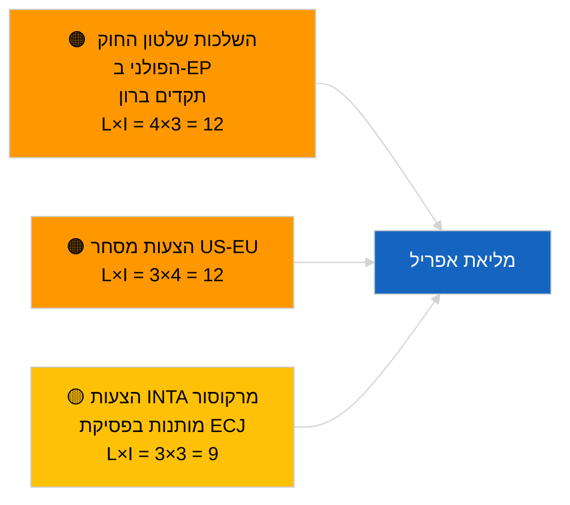

<!-- SPDX-FileCopyrightText: 2026 Hack23 AB -->
<!-- SPDX-License-Identifier: Apache-2.0 -->

# Executive Brief — הצעות לאומות | 2026-04-01

**סיווג:** OSINT | רשומה פרלמנטרית ציבורית
**רמת אמינות:** 🟢 גבוהה (הערכה מבנית בין-מושבית)
**נוצר:** 2026-04-01T00:00:00Z (סיכום רטרוספקטיבי)
**סוג מאמר:** הצעות לאומות
**מזהה הרצה:** `6ab9ff5b-5062-4c7c-8625-af376a01eb16`
**מקור:** פורטל הנתונים הפתוח של הפרלמנט האירופי

---

## 🎯 BLUF

**לא נרשמו הצעות החלטה חדשות ב-2026-04-01.** הרצת הניתוח `6ab9ff5b-5062-4c7c-8625-af376a01eb16` החזירה **0 שחקנים מסווגים** ומשמעות ברמת **שגרה** — עקבי עם העובדה שה-EP נמצא בפסקת-בין-מושבית (27 במרץ → 26 באפריל). הצעות החלטה מוגשות בדרך כלל בשבוע העבודה שקדם מיד לפגישה מליאה; הגשות כאלה אינן צפויות לפני אמצע אפריל. בסיס הצעות ההחלטה הממשי נשאר אפוא זה שהועבר משבוע שטרסבורג 9-12 במרץ (אסירים פוליטיים גאורגיים TA-10-2026-0083, אשראי פליטות HDV TA-10-2026-0084, סגן נשיא ECB TA-10-2026-0060) ומן המליאה הזוטרה בבריסל 25-26 במרץ (מכסי יבוא אמריקאיים TA-10-2026-0096, חסינות ברון TA-10-2026-0088). **🟢 אמינות גבוהה** שהמצב הריק מותנה בלוח השנה.

---

## 🧭 3 החלטות שתדרוך זה תומך בהן

| # | החלטה | מי מחליט | מועד אחרון | ראיות |
|:-:|-------|---------|:---------:|-------|
| 1 | **עריכה:** דלג על הצעות החלטה יומיות; הפק סיכום שבועי | עורך | +24 שעות | פלט הרצה ריק |
| 2 | **ניטור:** סמן את גל ההצעות הראשון של אפריל לתאריכים ~17-20 אפריל (T-7 עד T-10) | אנליסט | 2026-04-17 | דפוס הגשה של ה-EP |
| 3 | **ניטור קדימה:** משקל סיפר-A כבד-סחר מנבא הצעות בנושאי מכסי יבוא אמריקאיים ומרקוסור | אחראי ניתוח | 2026-04-20 | עדיפויות שהועברו |

---

## 📰 קריאה ב-60 שניות

- 🔴 **לא הוגשו הצעות חדשות** ב-2026-04-01; שבוע הפסקה, לא צפויה פעילות הגשה. (🟢 גבוהה)
- 🟠 **0 שחקנים מסווגים** בהרצה זו המתמקדת בהצעות החלטה; לא זוהו מדווחים או שותפי חתימה. (🟢 גבוהה)
- 🟢 **בסיס הצעות ההחלטה המועבר:** חמישה טקסטים בעלי חשיבות גבוהה ממרץ נותרים נקודות ייחוס פעילות לשלב ההצעות של המליאה של אפריל. (🟢 גבוהה)
- 🟡 **כל ממדי הסיכון "אפס"** — לא הוגדר סיכון חריף של שלב הצעות היום. (🟢 גבוהה)
- 🔵 **הקשר כלכלי:** מכסי יבוא אמריקאיים (TA-10-2026-0096) וסגן נשיא ECB (TA-10-2026-0060) הם קבצי הבסיס הכלכלי הדומיננטיים להצעות החלטה. (🟢 גבוהה)
- 🟣 **הפנייה צולבת:** הרצת האחות 2026-04-01/breaking מתעדת את דפוס 404 בהזנת ייעוץ 6/8 שמסביר את ריק הנתונים הנוכחי. (🟢 גבוהה)
- 🩷 **וקטור שיבוש:** ללא דחיפות; שליטת PPE מבנית ולחץ סחר אמריקאי חיצוני עוברים בירושה. (🟡 בינוני)
- ⚪ **העברה קדימה:** הפניית מרקוסור ל-ECJ (TA-10-2026-0008) צפויה להוביל להצעות עם קבלת חוות דעת שיפוטית.

---

## 🗂️ מסמכים / נהלים מובילים — רשימת מעקב הצעות

| דירוג | הפנייה ל-EP | כותרת (קצרה) | חשיבות | אמינות | מצב |
|:-----:|------------|--------------|:------:|:------:|-----|
| 1 | — | אין הצעות חדשות 2026-04-01 | 0.0 | 🟢 גבוהה | הפסקה — אין הגשה |
| 2 | TA-10-2026-0083 | אסירים פוליטיים גאורגיים (הועבר) | 7.0 | 🟢 גבוהה | דו"ח יישום מגיע לפרק |
| 3 | TA-10-2026-0096 | מכסי יבוא אמריקאיים (הועבר) | 7.0 | 🟢 גבוהה | הצעת המשך צפויה באפריל |

---

## ⚠️ תמונת סיכונים ואיומים

| סיכון | ל | ה | ניקוד | מפעיל | מקור | אדמירליות |
|-------|:-:|:-:|:-----:|------|------|:---------:|
| השלכות שלטון החוק הפולני | 4 | 3 | 12 | מקרה חסינות חדש | TA-10-2026-0088 | A1 |
| הצעות מסחר US-EU | 3 | 4 | 12 | פעולה אמריקאית מפעילה הצעה | TA-10-2026-0096 | A1 |
| הצעות מרקוסור (מותנות) | 3 | 3 | 9 | חוות דעת שיפוטית מתקבלת | TA-10-2026-0008 | A2 |
| שליטת PPE המבנית | 4 | 3 | 12 | הגשת הצעות א-סימטרית | אריתמטיקה קואליציונית | A2 |

---

## 🔮 מפעיל עתידי עיקרי

**גל ראשון של הצעות מליאת אפריל מוגש ~17-20 באפריל 2026.** מגוון הנושאים מצביע על אם הסיפור הכבד-מסחרי (תרחיש A), שלטון החוק (תרחיש B) או הכלכלי/תעשייתי (תרחיש C) הוא הדומיננטי בדיוני שטרסבורג 27-30 באפריל.

---

## 🛡️ הערכת איכות מקורות

- **מקורות ראשיים:** פורטל הנתונים הפתוח של הפרלמנט האירופי — הרצת ניתוח `6ab9ff5b-5062-4c7c-8625-af376a01eb16` ומלאי הצעות ההחלטה של מרץ 2026.
- **מגבלות נתונים:** `get_parliamentary_questions_feed` והזנות קשורות החזירו 404 בהרצת breaking המקבילה; האמינות לאי-קיום פעילות הגשה מעוגנת בלוח השנה של ה-EP.
- **רמת אמינות לחוסר פעילות מותנה בלוח שנה:** 🟢 גבוהה.

---

## 📎 קישורים

| קישור | נתיב |
|-------|------|
| מאמר | `./article.md` |
| סיווג (ריק) | `./classification/` |
| הרצות אחיות | `analysis/daily/2026-04-01/breaking/`, `committee-reports/`, `month-ahead/`, `propositions/` |
| מניפסט | `./manifest.json` |

---

## 🔄 הפנייה צולבת

**הרצות תבנית ריקות מקבילות:** committee-reports, month-ahead, propositions ב-2026-04-01 מציגות כולן פלט זהה של 0 שחקנים/שגרה, ומאשרות את מצב ההפסקה ברמת המערכת כולה.

---

**בקרת מסמך**
- **תבנית:** `/analysis/templates/executive-brief.md`
- **נתיב יצירה:** `analysis/daily/2026-04-01/motions/executive-brief.md`
- **סיווג:** ציבורי
- **יצירה רטרוספקטיבית:** מושב מילוי נתונים.
