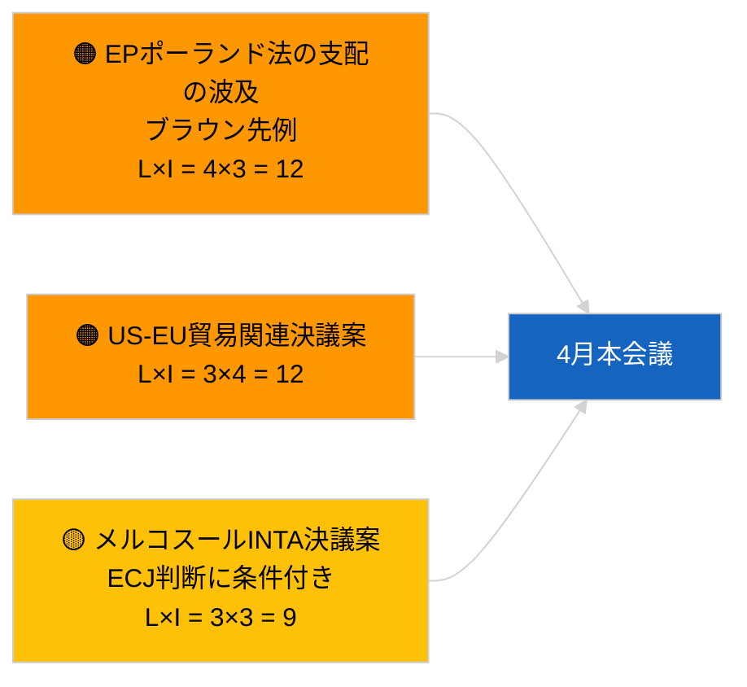

<!-- SPDX-FileCopyrightText: 2026 Hack23 AB -->
<!-- SPDX-License-Identifier: Apache-2.0 -->

# Executive Brief — 動議・決議案 | 2026-04-01

**分類:** OSINT｜公開議会記録
**信頼度:** 🟢 高（会期間構造評価）
**生成日時:** 2026-04-01T00:00:00Z（回顧的要約）
**記事タイプ:** 動議・決議案
**実行ID:** `6ab9ff5b-5062-4c7c-8625-af376a01eb16`
**ソース:** 欧州議会オープンデータポータル

---

## 🎯 BLUF（要点）

**2026年4月1日、新規決議案の登録なし。** 分析実行 `6ab9ff5b-5062-4c7c-8625-af376a01eb16` は**分類済みアクター0件**、重要度「**ルーティン**」を返した。これは欧州議会が会期間休会中（3月27日→4月26日）であることと整合する。決議案は通常、本会議直前の就業週に提出されるため、4月中旬以前の提出は見込まれない。したがって、実質的な決議案のベースラインは引き続き、ストラスブール週（3月9〜12日）から持ち越されたジョージアの政治犯 TA-10-2026-0083、HDV排出クレジット TA-10-2026-0084、ECB副総裁 TA-10-2026-0060、およびブリュッセル小本会議（3月25〜26日）からの米国関税 TA-10-2026-0096、ブラウン免責 TA-10-2026-0088 となる。**🟢 高信頼度**：空白状態は暦的条件によるものと判断。

---

## 🧭 本ブリーフが支援する3つの意思決定

| # | 意思決定 | 決定者 | 期限 | 根拠 |
|:-:|---------|--------|:----:|------|
| 1 | **編集方針:** 決議案の日次報告をスキップし、週次まとめを作成する | 編集長 | +24時間 | 実行出力空白 |
| 2 | **監視:** 4月17〜20日頃（T-7〜T-10）に4月の第一波決議案をフラグ立て | アナリスト | 2026-04-17 | 欧州議会提出パターン |
| 3 | **先行監視:** シナリオAの貿易重視ウェイティングが米国関税・メルコスール関連の決議案を予測 | 分析責任者 | 2026-04-20 | 持ち越し優先事項 |

---

## 📰 60秒読み

- 🔴 **2026年4月1日、新規決議案提出なし**；休会週、提出活動の見込みなし。（🟢 高）
- 🟠 **本実行でのアクター分類0件**；報告者や共同署名者を識別できず。（🟢 高）
- 🟢 **持ち越し決議案ベースライン:** 3月の高重要度テキスト5件が引き続き4月本会議の決議案フェーズの参照点となっている。（🟢 高）
- 🟡 **リスク次元はすべて「なし」**：今日の決議フェーズにおける急迫リスクなし。（🟢 高）
- 🔵 **経済的文脈:** 米国関税（TA-10-2026-0096）とECB副総裁（TA-10-2026-0060）が決議案の主要な経済ベースラインファイル。（🟢 高）
- 🟣 **クロスリファレンス:** 姉妹実行 2026-04-01/breaking が、今日のデータ空白を説明する6/8アドバイスフィード404パターンを記録。（🟢 高）
- 🩷 **混乱ベクトル:** 急迫なし；PPE構造的優位と外部米国貿易圧力を引き継ぎ。（🟡 中）
- ⚪ **先行引継ぎ:** メルコスールECJ付託（TA-10-2026-0008）は司法意見が出次第、決議案を生む可能性が高い。

---

## 🗂️ 主要文書・手続き — 決議案ウォッチリスト

| 順位 | EP参照 | 題名（短縮） | 重要度 | 信頼度 | 状態 |
|:---:|--------|------------|:------:|:------:|------|
| 1 | — | 新規決議案なし 2026-04-01 | 0.0 | 🟢 高 | 休会中 — 提出なし |
| 2 | TA-10-2026-0083 | ジョージア政治犯（持ち越し） | 7.0 | 🟢 高 | 実施報告期限到来 |
| 3 | TA-10-2026-0096 | 米国関税（持ち越し） | 7.0 | 🟢 高 | 4月に追跡決議案の可能性 |

---

## ⚠️ リスク・脅威スナップショット

| リスク | 可 | 影 | スコア | トリガー | ソース | 信頼度 |
|--------|:--:|:--:|:------:|---------|--------|:------:|
| EPポーランド法の支配の波及 | 4 | 3 | 12 | 新免責事件 | TA-10-2026-0088 | A1 |
| US-EU貿易関連決議案 | 3 | 4 | 12 | 米国の行動が決議案を誘発 | TA-10-2026-0096 | A1 |
| メルコスール決議案（条件付き） | 3 | 3 | 9 | 司法意見の発出 | TA-10-2026-0008 | A2 |
| PPE構造的優位 | 4 | 3 | 12 | 非対称な決議案提出 | 連立算術 | A2 |

---

## 🔮 最重要な今後のトリガー

**4月本会議の第一波決議案が2026年4月17〜20日頃に提出される見通し。** テーマの組み合わせにより、貿易重視（シナリオA）、法の支配（シナリオB）、経済・産業（シナリオC）のいずれのフレーミングが4月27〜30日のストラスブール会議を支配するかが明らかになる。

---

## 🛡️ ソース品質評価

- **一次ソース:** 欧州議会オープンデータポータル — 分析実行 `6ab9ff5b-5062-4c7c-8625-af376a01eb16` および2026年3月決議案・決議インベントリ。
- **データ制限:** `get_parliamentary_questions_feed` および関連フィードが並行breaking実行で404を返した；提出活動の不在に関する信頼度は欧州議会カレンダーに根拠を置く。
- **暦的非活動に対する信頼度:** 🟢 高。

---

## 📎 リンク

| リンク | パス |
|--------|------|
| 記事 | `./article.md` |
| 分類（空） | `./classification/` |
| 姉妹実行 | `analysis/daily/2026-04-01/breaking/`, `committee-reports/`, `month-ahead/`, `propositions/` |
| マニフェスト | `./manifest.json` |

---

## 🔄 クロスリファレンス

**同時空白テンプレート実行:** committee-reports, month-ahead, propositions の2026-04-01実行は全て0アクター/ルーティン出力を示し、システム全体の休会状態を確認している。

---

**文書管理**
- **テンプレート:** `/analysis/templates/executive-brief.md`
- **アーティファクトパス:** `analysis/daily/2026-04-01/motions/executive-brief.md`
- **分類:** 公開
- **回顧的生成:** バックフィルセッション。
