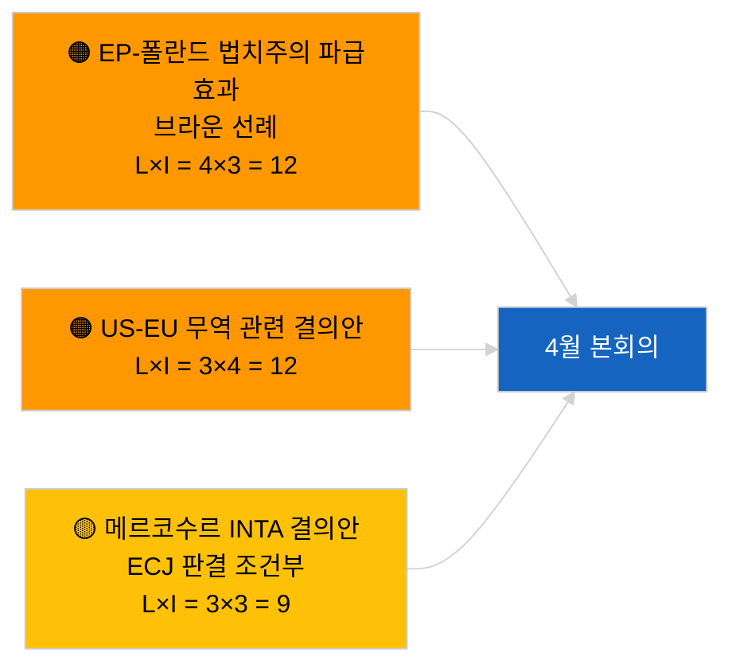

<!-- SPDX-FileCopyrightText: 2026 Hack23 AB -->
<!-- SPDX-License-Identifier: Apache-2.0 -->

# Executive Brief — 동의안 | 2026-04-01

**분류:** OSINT | 공개 의회 기록
**신뢰 수준:** 🟢 높음 (회기 간 구조적 평가)
**생성일시:** 2026-04-01T00:00:00Z (소급 요약)
**기사 유형:** 동의안
**실행 ID:** `6ab9ff5b-5062-4c7c-8625-af376a01eb16`
**출처:** 유럽의회 공개 데이터 포털

---

## 🎯 BLUF (핵심 요약)

**2026년 4월 1일, 신규 결의안 등록 없음.** 분석 실행 `6ab9ff5b-5062-4c7c-8625-af376a01eb16`는 **분류된 행위자 0명**과 **일상** 수준의 중요도를 반환했다. 이는 유럽의회가 회기 간 휴회 중(3월 27일 → 4월 26일)이라는 사실과 일치한다. 결의안은 통상 본회의 직전 업무 주에 제출되므로, 4월 중순 이전에는 제출이 예상되지 않는다. 따라서 결의안의 실질적 기준선은 스트라스부르 주간(3월 9〜12일)에서 이월된 조지아 정치범 TA-10-2026-0083, HDV 배출권 TA-10-2026-0084, ECB 부총재 TA-10-2026-0060 및 브뤼셀 미니 전체회의(3월 25〜26일)의 미국 관세 TA-10-2026-0096, 브라운 면책 TA-10-2026-0088으로 유지된다. **🟢 높은 신뢰도**: 공백 상태는 일정에 의한 것으로 판단.

---

## 🧭 본 브리핑이 지원하는 3가지 의사결정

| # | 결정 | 결정자 | 기한 | 근거 |
|:-:|------|--------|:----:|------|
| 1 | **편집 방침:** 일일 결의안 보고 건너뛰기; 주간 요약 작성 | 편집장 | +24시간 | 빈 실행 출력 |
| 2 | **모니터링:** 4월 17〜20일경(T-7〜T-10) 4월 첫 번째 결의안 파동 플래그 지정 | 분석가 | 2026-04-17 | 유럽의회 제출 패턴 |
| 3 | **선행 모니터링:** 시나리오 A의 무역 중심 가중치가 미국 관세 및 메르코수르 테마 결의안을 예측 | 분석 책임자 | 2026-04-20 | 이월 우선사항 |

---

## 📰 60초 요약

- 🔴 **2026년 4월 1일 신규 결의안 제출 없음**; 휴회 주간, 제출 활동 예상 없음. (🟢 높음)
- 🟠 **본 실행에서 분류된 행위자 0명**; 보고관 또는 공동 서명자 미확인. (🟢 높음)
- 🟢 **이월된 결의안 기준선:** 3월의 고중요도 텍스트 5건이 계속해서 4월 본회의 결의안 단계의 참조점으로 기능. (🟢 높음)
- 🟡 **모든 위험 차원 "없음"**: 오늘 결의 단계의 긴급 위험 없음. (🟢 높음)
- 🔵 **경제적 맥락:** 미국 관세(TA-10-2026-0096)와 ECB 부총재(TA-10-2026-0060)가 결의안의 주요 경제 기준선 파일. (🟢 높음)
- 🟣 **교차 참조:** 자매 실행 2026-04-01/breaking이 오늘의 데이터 공백을 설명하는 6/8 자문 피드 404 패턴을 기록. (🟢 높음)
- 🩷 **혼란 벡터:** 긴급 없음; PPE 구조적 우위와 외부 미국 무역 압력 이월. (🟡 중간)
- ⚪ **선행 이월:** 메르코수르 ECJ 회부(TA-10-2026-0008)는 사법 의견 발표 시 결의안 제출로 이어질 가능성 높음.

---

## 🗂️ 주요 문서 / 절차 — 결의안 감시 목록

| 순위 | EP 참조 | 제목 (약식) | 중요도 | 신뢰도 | 상태 |
|:---:|---------|-----------|:------:|:------:|------|
| 1 | — | 신규 결의안 없음 2026-04-01 | 0.0 | 🟢 높음 | 휴회 — 제출 없음 |
| 2 | TA-10-2026-0083 | 조지아 정치범 (이월) | 7.0 | 🟢 높음 | 이행 보고 기한 도래 |
| 3 | TA-10-2026-0096 | 미국 관세 (이월) | 7.0 | 🟢 높음 | 4월에 후속 결의안 가능성 |

---

## ⚠️ 위험 및 위협 스냅샷

| 위험 | 가 | 영 | 점수 | 트리거 | 출처 | 신뢰도 |
|------|:--:|:--:|:----:|--------|------|:------:|
| EP-폴란드 법치주의 파급효과 | 4 | 3 | 12 | 신규 면책 사건 | TA-10-2026-0088 | A1 |
| US-EU 무역 관련 결의안 | 3 | 4 | 12 | 미국 행동이 결의안 촉발 | TA-10-2026-0096 | A1 |
| 메르코수르 결의안 (조건부) | 3 | 3 | 9 | 사법 의견 발표 | TA-10-2026-0008 | A2 |
| PPE 구조적 우위 | 4 | 3 | 12 | 비대칭적 결의안 제출 | 연립 산술 | A2 |

---

## 🔮 가장 중요한 미래 트리거

**2026년 4월 17〜20일경 4월 본회의 결의안 첫 번째 파동 제출 예정.** 주제 구성은 무역 중심(시나리오 A), 법치주의(시나리오 B), 경제·산업(시나리오 C) 중 어느 프레임이 4월 27〜30일 스트라스부르 회의를 지배할지를 나타낸다.

---

## 🛡️ 출처 품질 평가

- **1차 출처:** 유럽의회 공개 데이터 포털 — 분석 실행 `6ab9ff5b-5062-4c7c-8625-af376a01eb16` 및 2026년 3월 결의안 인벤토리.
- **데이터 제한:** `get_parliamentary_questions_feed` 및 관련 피드가 병행 breaking 실행에서 404를 반환; 제출 활동 부재에 대한 신뢰도는 유럽의회 일정에 근거.
- **일정 조건부 비활동에 대한 신뢰도:** 🟢 높음.

---

## 📎 링크

| 링크 | 경로 |
|------|------|
| 기사 | `./article.md` |
| 분류 (비어 있음) | `./classification/` |
| 자매 실행 | `analysis/daily/2026-04-01/breaking/`, `committee-reports/`, `month-ahead/`, `propositions/` |
| 매니페스트 | `./manifest.json` |

---

## 🔄 교차 참조

**동시 빈 템플릿 실행:** committee-reports, month-ahead, propositions의 2026-04-01 실행은 모두 행위자 0명/일상 출력을 표시하며, 시스템 전체 휴회 상태를 확인한다.

---

**문서 관리**
- **템플릿:** `/analysis/templates/executive-brief.md`
- **아티팩트 경로:** `analysis/daily/2026-04-01/motions/executive-brief.md`
- **분류:** 공개
- **소급 생성:** 백필 세션.
