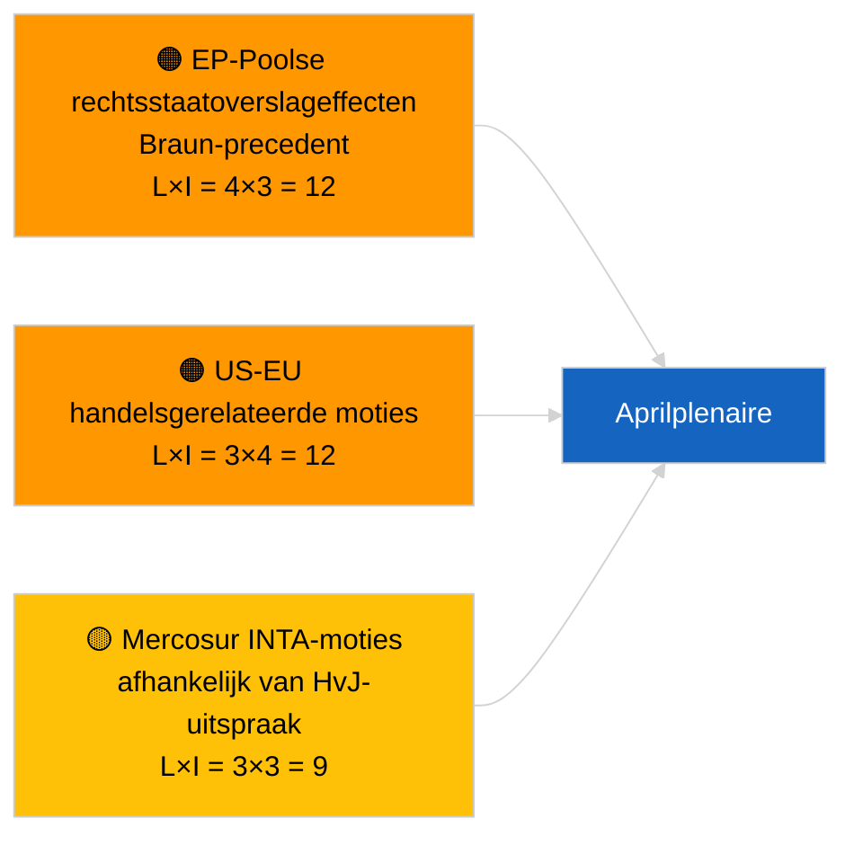

<!-- SPDX-FileCopyrightText: 2026 Hack23 AB -->
<!-- SPDX-License-Identifier: Apache-2.0 -->

# Executive Brief — Moties | 2026-04-01

**Classificatie:** OSINT | Openbare parlementaire registratie
**Betrouwbaarheidsniveau:** 🟢 Hoog (intersessionele structurele beoordeling)
**Gegenereerd:** 2026-04-01T00:00:00Z (retrospectieve samenvatting)
**Artikeltype:** Moties
**Uitvoerings-ID:** `6ab9ff5b-5062-4c7c-8625-af376a01eb16`
**Bron:** Open dataportal van het Europees Parlement

---

## 🎯 BLUF

**Geen nieuwe moties geregistreerd op 2026-04-01.** Analyserun `6ab9ff5b-5062-4c7c-8625-af376a01eb16` retourneerde **0 geclassificeerde actoren** en **ROUTINE**-betekenis — consistent met het feit dat het EP met intersessioneel reces is (27 maart → 26 april). Moties worden doorgaans ingediend in de werkweek die onmiddellijk voorafgaat aan een plenaire vergadering; dergelijke indieningen worden vóór half april niet verwacht. De substantiële baseline van moties blijft dan ook die van de overgenomen teksten van de Straatsburg-week van 9-12 maart (Georgische politieke gevangenen TA-10-2026-0083, HDV-emissiekredieten TA-10-2026-0084, vicevoorzitter ECB TA-10-2026-0060) en de Brussel-miniplenaire van 25-26 maart (Amerikaanse tarieven TA-10-2026-0096, immuniteit Braun TA-10-2026-0088). **🟢 HOOG betrouwbaarheidsniveau** dat de lege toestand door de kalender wordt bepaald.

**Opmerking:** IMF blijft IMF; WEO blijft WEO — nooit lokaliseren naar IMV of andere varianten.

---

## 🧭 3 Besluiten die Dit Overzicht Ondersteunt

| # | Besluit | Wie beslist | Deadline | Onderbouwing |
|:-:|--------|------------|:--------:|--------------|
| 1 | **Redactioneel:** OVERSLAAN dagelijkse moties; wekelijkse samenvatting produceren | Hoofdredacteur | +24u | Lege uitvoeringsuitvoer |
| 2 | **Bewaking:** eerste golf van aprilmoties signaleren voor ~17-20 april (T-7 tot T-10) | Analist | 2026-04-17 | EP-indieningspatroon |
| 3 | **Vooruitkijkende bewaking:** scenario-A handelszware weging voorspelt US-tarief- en Mercosur-thematische moties | Analyseverantwoordelijke | 2026-04-20 | Overgenomen prioriteiten |

---

## 📰 60-Seconden Lezing

- 🔴 **Geen nieuwe moties ingediend** op 2026-04-01; recesweek, geen indieningsactiviteit verwacht. (🟢 Hoog)
- 🟠 **0 actoren geclassificeerd** in deze op moties gerichte run; geen rapporteurs of medeondertekenaars geïdentificeerd. (🟢 Hoog)
- 🟢 **Overgenomen motiebaseline:** vijf hoogsignificante maartse teksten blijven de actieve referentiepunten voor de motiefase van de aprilplenaire. (🟢 Hoog)
- 🟡 **Alle risicsdimensies op "geen"** — geen acuut motierisico vandaag gesignaleerd. (🟢 Hoog)
- 🔵 **Economische context:** Amerikaanse tarieven (TA-10-2026-0096) en vicevoorzitter ECB (TA-10-2026-0060) zijn de dominante economische basisbestanden voor moties. (🟢 Hoog)
- 🟣 **Kruisverwijzing:** zusterrun 2026-04-01/breaking documenteert het 6/8-adviesfeed-404-patroon dat het huidige datavacuüm verklaart. (🟢 Hoog)
- 🩷 **Verstoringsvector:** geen acuut; structurele PPE-dominantie en extern US-handelsdruk zijn overgenomen. (🟡 Gemiddeld)
- ⚪ **Voorwaartse overdracht:** Mercosur-HvJ-verwijzing (TA-10-2026-0008) zal naar verwachting aanleiding geven tot motie(s) zodra het rechterlijke advies beschikbaar is.

---

## 🗂️ Topdocumenten / -Procedures — Motie-Watchlist

| Rang | EP-referentie | Titel (kort) | Belang | Betrouwbaarheid | Status |
|:----:|--------------|--------------|:------:|:---------------:|--------|
| 1 | — | Geen nieuwe moties 2026-04-01 | 0,0 | 🟢 HOOG | Reces — geen indiening |
| 2 | TA-10-2026-0083 | Georgische politieke gevangenen (overgenomen) | 7,0 | 🟢 HOOG | Implementatierapportage verschuldigd |
| 3 | TA-10-2026-0096 | Amerikaanse tarieven (overgenomen) | 7,0 | 🟢 HOOG | Vervolgmotie waarschijnlijk in april |

---

## ⚠️ Risico- en Dreigingsoverzicht

| Risico | L | I | Score | Aanleiding | Bron | Admiraliteit |
|--------|:-:|:-:|:-----:|-----------|------|:------------:|
| EP-Poolse rechtsstaatoverslageffecten | 4 | 3 | 12 | Nieuwe immuniteitszaak | TA-10-2026-0088 | A1 |
| US-EU handelsgerelateerde moties | 3 | 4 | 12 | US-actie leidt tot motie | TA-10-2026-0096 | A1 |
| Mercosur-moties (voorwaardelijk) | 3 | 3 | 9 | Rechterlijk advies beschikbaar | TA-10-2026-0008 | A2 |
| PPE structurele dominantie | 4 | 3 | 12 | Asymmetrische motie-indiening | Coalitie-arithmetiek | A2 |

---

## 🔮 Belangrijkste Toekomstige Aanleiding

**Eerste golf van aprilplenaire moties ingediend ~17-20 april 2026.** De themamix geeft aan of een handelszware (Scenario A), rechtsstatelijke (Scenario B) of economische/industriële (Scenario C) framing de Straatsburg-sessie van 27-30 april domineert.

---

## 🛡️ Beoordeling van de Bronkwaliteit

- **Primaire bronnen:** Open dataportal van het Europees Parlement — analyserun `6ab9ff5b-5062-4c7c-8625-af376a01eb16` en inventaris van maart 2026 moties/resoluties.
- **Gegevensbeperkingen:** `get_parliamentary_questions_feed` en gerelateerde feeds retourneerden 404 in gelijktijdige breaking-run; de betrouwbaarheid van de afwezigheid van indieningsactiviteit is verankerd aan de EP-kalender.
- **Betrouwbaarheidsniveau voor kalendergebonden inactiviteit:** 🟢 HOOG.

---

## 📎 Links

| Link | Pad |
|------|-----|
| Artikel | `./article.md` |
| Classificatie (leeg) | `./classification/` |
| Zusterruns | `analysis/daily/2026-04-01/breaking/`, `committee-reports/`, `month-ahead/`, `propositions/` |
| Manifest | `./manifest.json` |

---

## 🔄 Kruisverwijzing

**Gelijktijdige lege sjabloonruns:** committee-reports, month-ahead, propositions op 2026-04-01 tonen allemaal identieke 0-actor/ROUTINE-uitvoer, wat de systeembrede recestoestand bevestigt.

---

**Documentbeheersing**
- **Sjabloon:** `/analysis/templates/executive-brief.md`
- **Artefactpad:** `analysis/daily/2026-04-01/motions/executive-brief.md`
- **Classificatie:** Openbaar
- **Retrospectieve generatie:** Terugvulsessie.
