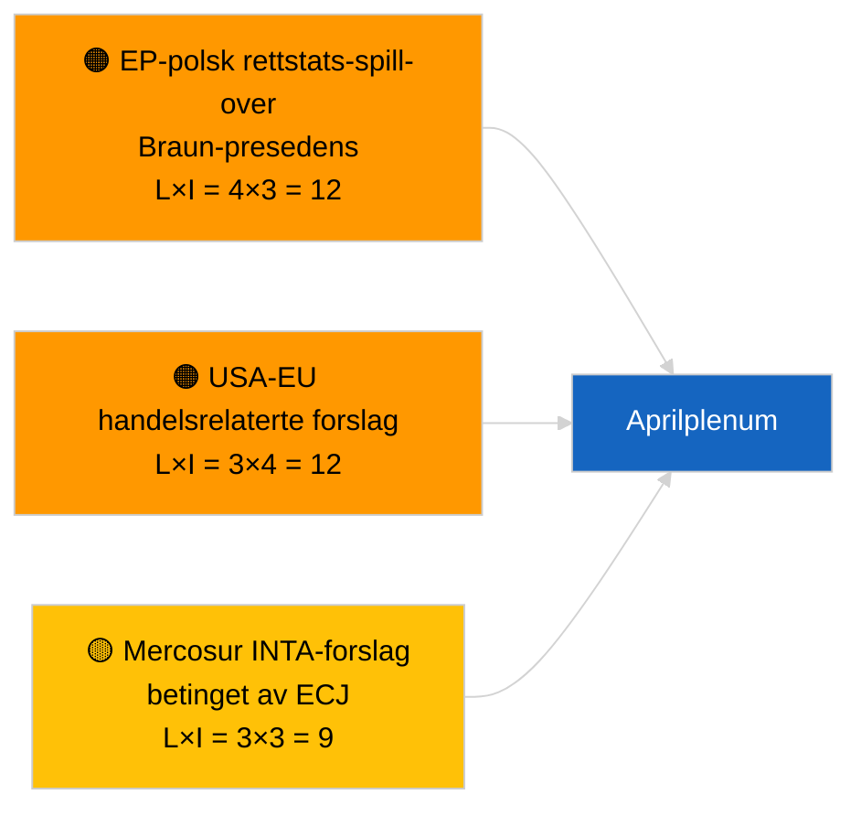

<!-- SPDX-FileCopyrightText: 2026 Hack23 AB -->
<!-- SPDX-License-Identifier: Apache-2.0 -->

# Executive Brief — Forslag til Resolusjon | 2026-04-01

**Klassifisering:** OSINT | Offentlig parlamentarisk protokoll
**Konfidensnivå:** 🟢 Høy (intersesjonell strukturell vurdering)
**Generert:** 2026-04-01T00:00:00Z (retrospektivt notat)
**Artikkeltype:** Forslag til Resolusjon
**Kjøre-ID:** `6ab9ff5b-5062-4c7c-8625-af376a01eb16`
**Kilde:** Europaparlamentets åpne dataportal

---

## 🎯 BLUF

**Ingen nye forslag til resolusjon registrert 2026-04-01.** Analysekjøring `6ab9ff5b-5062-4c7c-8625-af376a01eb16` returnerte **0 klassifiserte aktører** og **RUTINEMESSIG** betydning — konsistent med at EP er i intersesjonelt reces (27. mars → 26. april). Forslag til resolusjon legges typisk frem i arbeidsuken umiddelbart før en plenumssesjon; slike innleveringer forventes ikke før midten av april. Den substansielle resolusjonsforslags-basisen er derfor fortsatt de videreførte fra Strasbourg-uka 9-12 mars (georgiske politiske fanger TA-10-2026-0083, HDV-utslippskreditter TA-10-2026-0084, ECB-visesentralbanksjef TA-10-2026-0060) og Brussel-mini-plenum 25-26 mars (USAs tolltariff TA-10-2026-0096, Braun-immunitet TA-10-2026-0088). **🟢 HØY konfidensnivå** om at den tomme tilstanden er kalender-betinget.

---

## 🧭 3 Beslutninger Dette Notatet Støtter

| # | Beslutning | Hvem bestemmer | Frist | Dokumentasjon |
|:-:|-----------|---------------|:-----:|---------------|
| 1 | **Redaksjonell:** HOPP OVER daglige resolusjonsforslag; produser ukeoppsummering | Redaktør | +24h | Tom kjøringsutdata |
| 2 | **Overvåking:** flagg første bølge av aprilforslag for ~17-20 april (T-7 til T-10) | Analytiker | 2026-04-17 | EP-innleveringsmønster |
| 3 | **Fremoverrettet overvåking:** scenario-A handelstung vekting forutsier USA-toll- og Mercosur-tematiske forslag | Analyseansvarlig | 2026-04-20 | Videreførte prioriteringer |

---

## 📰 60-Sekunders Lesning

- 🔴 **Ingen nye forslag fremmet** 2026-04-01; recesuke, ingen innleveringsaktivitet forventet. (🟢 Høy)
- 🟠 **0 aktører klassifisert** i denne resolusjonsforslagsfokuserte kjøringen; ingen ordførere eller medsignatarer identifisert. (🟢 Høy)
- 🟢 **Videreført resolusjonsforslagsgrunnlag:** fem høysignifikante mars-tekster er fortsatt de aktive referansepunktene for aprilplenum-forslagsfaseaktivitet. (🟢 Høy)
- 🟡 **Risikodimensjoner alle "ingen"** — ingen akutt forslagsfaserisiko flagget i dag. (🟢 Høy)
- 🔵 **Økonomisk kontekst:** USAs tolltariff (TA-10-2026-0096) og ECB-visesentralbanksjef (TA-10-2026-0060) er de dominerende økonomi-baseline-filene for resolusjonsforslag. (🟢 Høy)
- 🟣 **Kryssreferanse:** søsken 2026-04-01/breaking dokumenterer 6/8 rådgivningsfeed 404-mønsteret som forklarer dagens datavakuum. (🟢 Høy)
- 🩷 **Forstyrelsesvektor:** ingen akutt; strukturell PPE-dominans og eksternt USA-handelspress er nedarvet. (🟡 Middels)
- ⚪ **Fremoverføring:** Mercosur EF-domstolshenvising (TA-10-2026-0008) forventes å gi opphav til forslag når domstolsuttalelse foreligger.

---

## 🗂️ Topdokumenter / Prosedyrer — Resolusjonsforslags-overvåking

| Rang | EP-referanse | Tittel (kort) | Betydning | Konfidensnivå | Status |
|:----:|--------------|---------------|:---------:|:-------------:|--------|
| 1 | — | Ingen nye forslag 2026-04-01 | 0,0 | 🟢 HØY | Reces — ingen innlevering |
| 2 | TA-10-2026-0083 | Georgiske politiske fanger (videreført) | 7,0 | 🟢 HØY | Implementeringsrapportering forfaller |
| 3 | TA-10-2026-0096 | USAs tolltariff (videreført) | 7,0 | 🟢 HØY | Oppfølgingsforslag sannsynligvis i april |

---

## ⚠️ Risiko- og Trusselbilde

| Risiko | L | I | Skår | Utløser | Kilde | Admiralitet |
|--------|:-:|:-:|:----:|---------|-------|:-----------:|
| EP-polsk rettstats-spill-over | 4 | 3 | 12 | Ny immunitetsak | TA-10-2026-0088 | A1 |
| USA-EU handelsrelaterte forslag | 3 | 4 | 12 | USA-handling utløser forslag | TA-10-2026-0096 | A1 |
| Mercosur-forslag (betingede) | 3 | 3 | 9 | Domstolsuttalelse foreligger | TA-10-2026-0008 | A2 |
| PPE strukturell dominans | 4 | 3 | 12 | Asymmetrisk forslagsinnlevering | Koalisjonsaritmetikk | A2 |

---

## 🔮 Viktigste Fremtidige Utløser

**Første bølge av aprilplenum-forslag fremmet ~17-20 april 2026.** Emnemiksen indikerer om handelstung (Scenario A), rettsstat (Scenario B) eller økonomisk/industriell (Scenario C) innramming dominerer Strasbourg-sesjonen 27-30 april.

---

## 🛡️ Vurdering av Kildekvalitet

- **Primærkilder:** Europaparlamentets åpne dataportal — analysekjøring `6ab9ff5b-5062-4c7c-8625-af376a01eb16` og mars 2026 forslag/resolusjonsinventar.
- **Databegrensninger:** `get_parliamentary_questions_feed` og relaterte feeds returnerte 404 i concurrent breaking-kjøring; konfidensen om fravær av innleveringsaktivitet er forankret til EP-kalenderen.
- **Konfidensnivå for kalender-betinget inaktivitet:** 🟢 HØY.

---

## 📎 Lenker

| Lenke | Sti |
|-------|-----|
| Artikkel | `./article.md` |
| Klassifisering (tom) | `./classification/` |
| Søsken-kjøringer | `analysis/daily/2026-04-01/breaking/`, `committee-reports/`, `month-ahead/`, `propositions/` |
| Manifest | `./manifest.json` |

---

## 🔄 Kryssreferanse

**Samtidige tomme malkjøringer:** committee-reports, month-ahead, propositions 2026-04-01 viser alle identisk 0-aktør/RUTINEMESSIG utdata, noe som bekrefter den systemomfattende recestilstanden.

---

**Dokumentkontroll**
- **Mal:** `/analysis/templates/executive-brief.md`
- **Artefaktsti:** `analysis/daily/2026-04-01/motions/executive-brief.md`
- **Klassifisering:** Offentlig
- **Retrospektiv generering:** Tilbakefyllings-sesjon.
