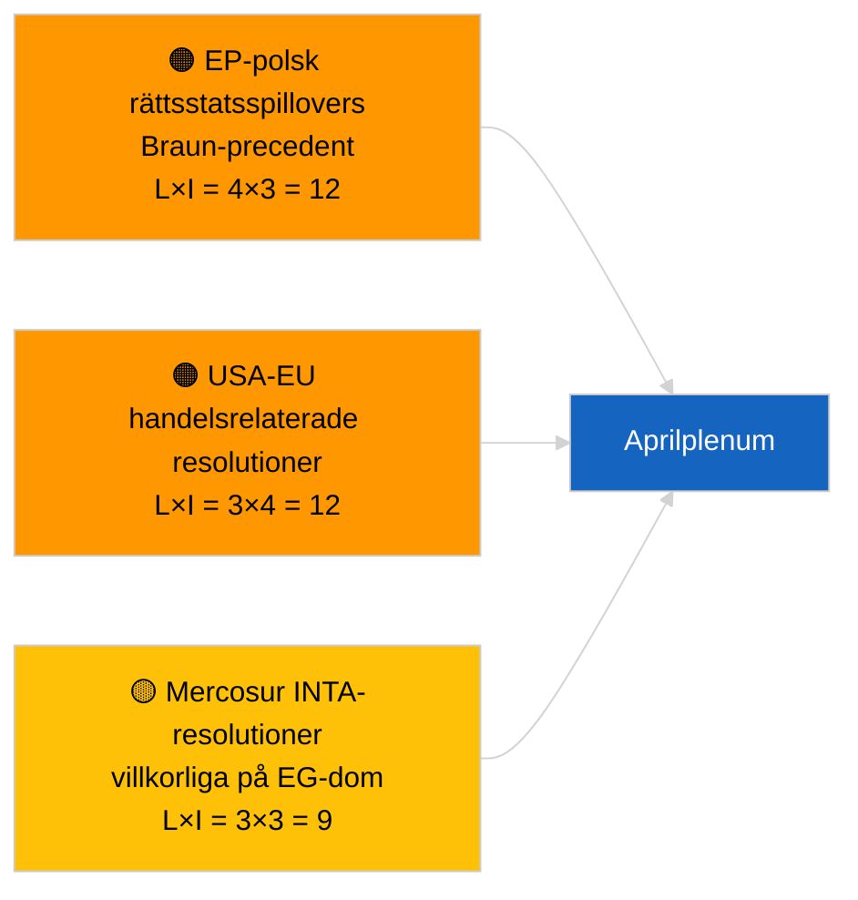

<!-- SPDX-FileCopyrightText: 2026 Hack23 AB -->
<!-- SPDX-License-Identifier: Apache-2.0 -->

# Executive Brief — Resolutionsförslag | 2026-04-01

**Klassificering:** OSINT | Offentligt parlamentariskt protokoll
**Konfidensgrad:** 🟢 Hög (intersessionell strukturell bedömning)
**Genererad:** 2026-04-01T00:00:00Z (retrospektiv sammanfattning)
**Artikeltyp:** Resolutionsförslag
**Kör-ID:** `6ab9ff5b-5062-4c7c-8625-af376a01eb16`
**Källa:** Europaparlamentets öppna dataportal

---

## 🎯 BLUF

**Inga nya resolutionsförslag registrerade den 2026-04-01.** Analyskörning `6ab9ff5b-5062-4c7c-8625-af376a01eb16` returnerade **0 klassificerade aktörer** och **RUTINMÄSSIG** signifikans — konsekvent med att EP befinner sig i intersessionellt uppehåll (27 mars → 26 april). Resolutionsförslag läggs typiskt in under arbetsveckan omedelbart före en plenarsession; ingen sådan inlämning förväntas före mitten av april. Den substantiella resolutionsförslagsbaslinjen är därför fortfarande de vidareförda från Strasbourg-veckan 9-12 mars (georgiska politiska fångar TA-10-2026-0083, HDV-utsläppskrediter TA-10-2026-0084, ECB vice-ordförande TA-10-2026-0060) och Bryssel-miniplenarsessionen 25-26 mars (USA:s tulltariff TA-10-2026-0096, Braun-immunitet TA-10-2026-0088). **🟢 HÖG konfidensgrad** att det tomma tillståndet är kalendariskt betingat.

---

## 🧭 3 Beslut som detta underlag stöder

| # | Beslut | Vem beslutar | Deadline | Evidens |
|:-:|--------|-------------|:--------:|---------|
| 1 | **Redaktionell:** HOPPA ÖVER dagliga resolutionsförslag; producera veckorekapitulation | Redaktör | +24h | Tom körningsutdata |
| 2 | **Bevakning:** flagga den första vågen av aprilresolutioner för ~17-20 april (T-7 till T-10) | Analytiker | 2026-04-17 | EP-inlämningsmönster |
| 3 | **Framåtbevakning:** scenario-A handelstung viktning förutspår USA-tull- och Mercosur-tematiska resolutioner | Analysansvarig | 2026-04-20 | Vidareförda prioriteringar |

---

## 📰 60-Sekunders Läsning

- 🔴 **Inga nya resolutioner inlämnade** den 2026-04-01; uppehållsvecka, ingen inlämningsaktivitet förväntas. (🟢 Hög)
- 🟠 **0 aktörer klassificerade** i denna resolutionsinriktade körning; inga föredragande eller medsignatärer identifierade. (🟢 Hög)
- 🟢 **Vidareförd resolutionsbaslinje:** fem högsignifikanta mars-texter kvarstår som aktiva referenspunkter för aprilplenumsresolutionsfasaktivitet. (🟢 Hög)
- 🟡 **Riskdimensioner alla "inga"** — ingen akut resolutionsfasrisk flaggad idag. (🟢 Hög)
- 🔵 **Ekonomisk kontext:** USA:s tulltariff (TA-10-2026-0096) och ECB vice-ordförande (TA-10-2026-0060) är de dominerande ekonomiska resolutionsbaslinjefilerna. (🟢 Hög)
- 🟣 **Korsreferens:** syskon 2026-04-01/breaking dokumenterar 6/8 rådgivningsflöde 404-mönster som förklarar dagens datavoid. (🟢 Hög)
- 🩷 **Störningsfaktor:** ingen akut; strukturell PPE-dominans och externt USA-handelstryck nedärvda. (🟡 Medel)
- ⚪ **Vidareföring:** Mercosur EG-domstolshänvisning (TA-10-2026-0008) sannolikt att ge upphov till resolution(er) när domstolsyttrande väl kommer.

---

## 🗂️ Toppidokument / Procedurer — Resolutionsbevakningslista

| Rang | EP-referens | Titel (kort) | Betydelse | Konfidensgrad | Status |
|:----:|-------------|--------------|:---------:|:-------------:|--------|
| 1 | — | Inga nya resolutioner 2026-04-01 | 0,0 | 🟢 HÖG | Uppehåll — ingen inlämning |
| 2 | TA-10-2026-0083 | Georgiska politiska fångar (vidareförd) | 7,0 | 🟢 HÖG | Implementeringsrapportering förfaller |
| 3 | TA-10-2026-0096 | USA:s tulltariff (vidareförd) | 7,0 | 🟢 HÖG | Uppföljningsresolution sannolikt i april |

---

## ⚠️ Risk- och Hotöversikt

| Risk | L | I | Poäng | Utlösare | Källa | Admiralitet |
|------|:-:|:-:|:-----:|---------|-------|:-----------:|
| EP-polsk rättsstatsspillovers | 4 | 3 | 12 | Nytt immunitetsärende | TA-10-2026-0088 | A1 |
| USA-EU handelsrelaterade resolutioner | 3 | 4 | 12 | USA:s åtgärd utlöser resolution | TA-10-2026-0096 | A1 |
| Mercosur-resolutioner (villkorliga) | 3 | 3 | 9 | Domstolsyttrande meddelas | TA-10-2026-0008 | A2 |
| PPE strukturell dominans | 4 | 3 | 12 | Asymmetrisk resolutionsinlämning | Koalitionsaritmetik | A2 |

---

## 🔮 Viktigaste Framtida Utlösare

**Första vågen av aprilplenarresolutioner inlämnade ~17-20 april 2026.** Ämnesblandningen indikerar huruvida handelstung (Scenario A), rättsstats- (Scenario B) eller ekonomisk/industriell (Scenario C) inramning dominerar Strasbourgplenarsessionen 27-30 april.

---

## 🛡️ Källkvalitetsbedömning

- **Primärkällor:** Europaparlamentets öppna dataportal — analyskörning `6ab9ff5b-5062-4c7c-8625-af376a01eb16` och mars 2026 resolutioner/resolutionsinventering.
- **Databegränsningar:** `get_parliamentary_questions_feed` och relaterade flöden returnerade 404 i concurrent breaking-körning; konfidensgrad för frånvaro av inlämningsaktivitet är förankrad till EP-kalendern.
- **Konfidensgrad för kalendariskt betingad inaktivitet:** 🟢 HÖG.

---

## 📎 Länkar

| Länk | Sökväg |
|------|--------|
| Artikel | `./article.md` |
| Klassificering (tom) | `./classification/` |
| Syskonkörningar | `analysis/daily/2026-04-01/breaking/`, `committee-reports/`, `month-ahead/`, `propositions/` |
| Manifest | `./manifest.json` |

---

## 🔄 Korsreferens

**Concurrent tomma mallkörningar:** committee-reports, month-ahead, propositions den 2026-04-01 visar alla identisk 0-aktör/RUTINMÄSSIG utdata, vilket bekräftar det systemövergripande uppehållstillståndet.

---

**Dokumentkontroll**
- **Mall:** `/analysis/templates/executive-brief.md`
- **Artefaktsökväg:** `analysis/daily/2026-04-01/motions/executive-brief.md`
- **Klassificering:** Offentlig
- **Retrospektiv generering:** Återfyllningssession.
