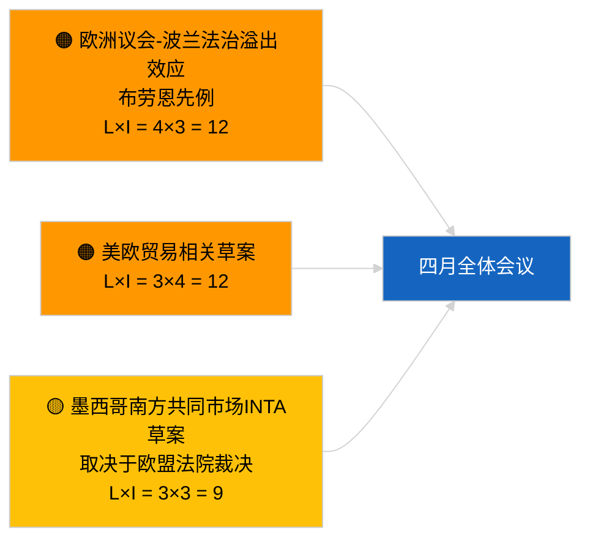

<!-- SPDX-FileCopyrightText: 2026 Hack23 AB -->
<!-- SPDX-License-Identifier: Apache-2.0 -->

# Executive Brief — 动议与决议草案 | 2026-04-01

**分类：** OSINT｜公开议会记录
**可信度：** 🟢 高（会期间结构性评估）
**生成时间：** 2026-04-01T00:00:00Z（回溯性摘要）
**文章类型：** 动议与决议草案
**运行ID：** `6ab9ff5b-5062-4c7c-8625-af376a01eb16`
**来源：** 欧洲议会开放数据门户

---

## 🎯 BLUF（核心结论）

**2026年4月1日未登记任何新决议草案。** 分析运行 `6ab9ff5b-5062-4c7c-8625-af376a01eb16` 返回**0名分类行为者**，重要性级别为**常规**——与欧洲议会处于会期间休会期（3月27日→4月26日）的事实相吻合。决议草案通常在全体会议前一周的工作日内提交；预计4月中旬前不会有此类提交。因此，决议草案的实质性基准线仍为斯特拉斯堡周（3月9-12日）沿用下来的格鲁吉亚政治犯 TA-10-2026-0083、重型车辆排放信用额度 TA-10-2026-0084、欧洲央行副行长 TA-10-2026-0060，以及布鲁塞尔小型全体会议（3月25-26日）的美国关税 TA-10-2026-0096、布劳恩豁免权 TA-10-2026-0088。**🟢 高可信度**：空白状态系日历条件所致。

---

## 🧭 本简报支持的3项决策

| # | 决策 | 决策者 | 截止日期 | 依据 |
|:-:|------|--------|:--------:|------|
| 1 | **编辑方针：** 跳过每日决议草案报告；产出周度摘要 | 主编 | +24小时 | 运行输出为空 |
| 2 | **监测：** 在4月17-20日前后（T-7至T-10）标记四月第一批草案 | 分析员 | 2026-04-17 | 欧洲议会提交规律 |
| 3 | **前瞻监测：** 情景A贸易重权重预测涉美国关税及墨西哥南方共同市场主题草案 | 分析负责人 | 2026-04-20 | 沿用优先事项 |

---

## 📰 60秒阅读

- 🔴 **2026年4月1日未提交新草案**；休会周，预计无提交活动。（🟢 高）
- 🟠 **本次运行中分类行为者0名**；未识别报告员或共同签署者。（🟢 高）
- 🟢 **沿用决议草案基准线：** 三月高重要度文本5份仍为四月全体会议决议草案阶段的活跃参考点。（🟢 高）
- 🟡 **所有风险维度均为"无"**——今日未标记任何紧急草案阶段风险。（🟢 高）
- 🔵 **经济背景：** 美国关税（TA-10-2026-0096）与欧洲央行副行长（TA-10-2026-0060）是决议草案最主要的经济基准线文件。（🟢 高）
- 🟣 **交叉参考：** 姊妹运行 2026-04-01/breaking 记录了6/8咨询数据源404模式，解释了当前数据空白。（🟢 高）
- 🩷 **干扰向量：** 无紧急情况；PPE结构性优势及外部美国贸易压力为沿用因素。（🟡 中等）
- ⚪ **前瞻传递：** 墨西哥南方共同市场欧盟法院提交（TA-10-2026-0008）在司法意见出台后有望催生草案。

---

## 🗂️ 重点文件/程序 — 决议草案监测名单

| 排名 | 欧洲议会参考编号 | 标题（简短） | 重要性 | 可信度 | 状态 |
|:---:|---------------|------------|:------:|:------:|------|
| 1 | — | 2026年4月1日无新草案 | 0.0 | 🟢 高 | 休会中——无提交 |
| 2 | TA-10-2026-0083 | 格鲁吉亚政治犯（沿用） | 7.0 | 🟢 高 | 执行报告期限临近 |
| 3 | TA-10-2026-0096 | 美国关税（沿用） | 7.0 | 🟢 高 | 四月可能出现后续草案 |

---

## ⚠️ 风险与威胁快照

| 风险 | 可 | 影 | 分数 | 触发因素 | 来源 | 可信度 |
|------|:--:|:--:|:----:|---------|------|:------:|
| 欧洲议会-波兰法治溢出效应 | 4 | 3 | 12 | 新豁免权案件 | TA-10-2026-0088 | A1 |
| 美欧贸易相关草案 | 3 | 4 | 12 | 美国行动触发草案 | TA-10-2026-0096 | A1 |
| 墨西哥南方共同市场草案（有条件） | 3 | 3 | 9 | 司法意见出台 | TA-10-2026-0008 | A2 |
| PPE结构性优势 | 4 | 3 | 12 | 非对称草案提交 | 联合算术 | A2 |

---

## 🔮 最重要的未来触发因素

**2026年4月17-20日前后，四月全体会议第一批草案将被提交。** 主题组合将揭示贸易重权重（情景A）、法治（情景B）还是经济/工业（情景C）框架主导4月27-30日斯特拉斯堡会议。

---

## 🛡️ 来源质量评估

- **主要来源：** 欧洲议会开放数据门户——分析运行 `6ab9ff5b-5062-4c7c-8625-af376a01eb16` 及2026年3月草案/决议清单。
- **数据限制：** `get_parliamentary_questions_feed` 及相关数据源在并行breaking运行中返回404；无提交活动的可信度以欧洲议会日历为锚点。
- **日历条件性不活跃的可信度：** 🟢 高。

---

## 📎 链接

| 链接 | 路径 |
|------|------|
| 文章 | `./article.md` |
| 分类（空） | `./classification/` |
| 姊妹运行 | `analysis/daily/2026-04-01/breaking/`, `committee-reports/`, `month-ahead/`, `propositions/` |
| 清单 | `./manifest.json` |

---

## 🔄 交叉参考

**同步空白模板运行：** 2026年4月1日的committee-reports、month-ahead、propositions均显示0行为者/常规输出，确认系统范围内的休会状态。

---

**文件管控**
- **模板：** `/analysis/templates/executive-brief.md`
- **制品路径：** `analysis/daily/2026-04-01/motions/executive-brief.md`
- **分类：** 公开
- **回溯生成：** 补填会话。
