# Propositions — 2026-04-01

<h2 id="section-executive-brief">Executive Brief</h2>

### 🎯 BLUF

**No new Commission propositions or EP own-initiative dossiers indexed on 2026-04-01.** Analysis run `4cf3b11a-f38e-4a3c-a81c-5c73d6eb8adc` returned **0 classified actors** and **ROUTINE** significance across all dimensions. Inter-sessional EP recess (27 March → 26 April) and concurrent `get_procedures_feed` 404 (logged in sibling breaking run) explain the data void. The substantive propositions baseline is therefore the inherited pipeline: HDV emission-credits 2025-2029 framework (TA-10-2026-0084), ECB Vice-President procedure (TA-10-2026-0060), Better Law-Making report (TA-10-2026-0063), and the live EU-Mercosur Court-of-Justice referral (TA-10-2026-0008). **🟢 HIGH confidence** the empty state is calendar- and feed-availability-driven, not a pipeline regression.

---

### 🧭 3 Decisions This Brief Supports

| # | Decision | Who Decides | Deadline | Evidence |
|:-:|----------|-------------|:--------:|----------|
| 1 | **Editorial:** SKIP propositions daily; defer until next active session | Editor | +24h | Empty run output |
| 2 | **Monitoring:** verify `get_procedures_feed` health next cycle | Data pipeline | 2026-04-02 | 404 on 2026-04-01 |
| 3 | **Forward-watch:** track Commission April-week communications for new propositions | Analysis lead | 2026-04-13 | Commission tabling cadence |

---

### 📰 60-Second Read

- 🔴 **No new procedures opened** on 2026-04-01; `get_procedures_feed` 404 in concurrent run. (🟡 Medium — endpoint availability is the caveat)
- 🟠 **0 actors classified**; no Commissioner, DG, or rapporteur identified. (🟢 High)
- 🟢 **Pipeline carry-over** — HDV emissions, ECB Vice-President, Better Law-Making, Mercosur referral remain the active propositions inventory entering April. (🟢 High)
- 🟡 **Risk dimensions all "none"** — no acute proposition-stage risk flagged today. (🟢 High)
- 🔵 **Economic context:** anticipated Commission Q2 propositions on AI Act implementing regulations, Defence Industrial Strategy, and MFF preparatory communications remain on the watch board. (🟡 Medium — Commission tabling cadence)
- 🟣 **Cross-reference:** sibling 2026-04-01/breaking documents the 6/8 advisory-feed 404 pattern. (🟢 High)
- 🩷 **Disruption vector:** US trade pressure may force fast-track Commission proposition during April. (🟡 Medium)
- ⚪ **Carry-forward:** Mercosur ECJ opinion is the highest-impact pending propositions trigger.

---

### 🗂️ Top Documents / Procedures — Propositions Watch

| Rank | EP reference | Title (short) | Significance | Confidence | Status |
|:----:|--------------|---------------|:------------:|:----------:|--------|
| 1 | — | No new propositions on 2026-04-01 | 0.0 | 🟢 HIGH | Recess + feed 404 |
| 2 | TA-10-2026-0008 | EU-Mercosur ECJ referral (pending) | 8.0 | 🟡 MEDIUM | Court opinion expected |
| 3 | TA-10-2026-0084 | HDV emission credits 2025-2029 | 7.0 | 🟢 HIGH | Transposition pipeline |
| 4 | TA-10-2026-0063 | Better Law-Making (regulatory baseline) | 6.0 | 🟢 HIGH | Cross-cutting frame |

---

### ⚠️ Risk & Threat Snapshot

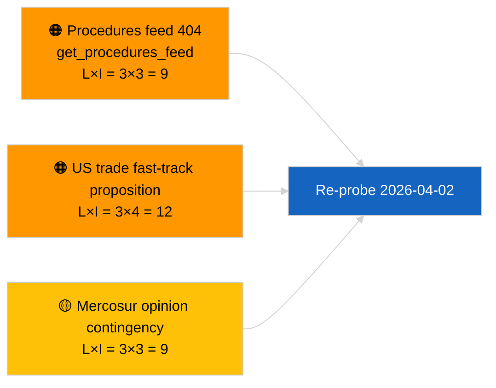
```mermaid
%%{init: {"theme":"dark"}}%%
graph LR
    R1["🟠 Procedures feed 404<br/>get_procedures_feed<br/>L×I = 3×3 = 9"] --> CONS["Re-probe 2026-04-02"]
    R2["🟠 US trade fast-track proposition<br/>L×I = 3×4 = 12"] --> CONS
    R3["🟡 Mercosur opinion contingency<br/>L×I = 3×3 = 9"] --> CONS
    style R1 fill:#FF9800,color:#000000
    style R2 fill:#FF9800,color:#000000
    style R3 fill:#FFC107,color:#000000
    style CONS fill:#1565C0,color:#FFFFFF
```

| Risk | L | I | Score | Trigger | Source | Admiralty |
|------|:-:|:-:|:-----:|---------|--------|:---------:|
| `get_procedures_feed` reliability | 3 | 3 | 9 | Sustained 404 | Sibling breaking run | B2 |
| US trade fast-track proposition | 3 | 4 | 12 | US action triggers Commission tabling | TA-10-2026-0096 | A1 |
| Mercosur opinion contingency | 3 | 3 | 9 | Court releases | TA-10-2026-0008 | A2 |
| MFF preparatory friction | 3 | 4 | 12 | Q2 Commission communication | Commission cadence | B2 |

---

### 🔮 Top Forward Trigger

**Commission Tuesday meeting cycle resumes 7 April 2026.** First post-Easter Commission propositions are typically tabled at the early-April college meeting; topical mix (defence / digital / trade / climate) will calibrate the Q2 propositions watch list.

---

### 🛡️ Source Quality Assessment

- **Primary sources:** EP Open Data Portal — analysis run `4cf3b11a-f38e-4a3c-a81c-5c73d6eb8adc` and external-documents inventory for March.
- **Data limitations:** `get_procedures_feed` 404 on 2026-04-01 prevents independent corroboration of "no new procedures opened" today.
- **Confidence on calendar-driven inactivity:** 🟢 HIGH.

---

### 📎 Links

| Link | Path |
|------|------|
| Article | `./article.md` |
| Classification (empty) | `./classification/` |
| Sibling runs | `analysis/daily/2026-04-01/breaking/`, `committee-reports/`, `month-ahead/`, `motions/` |
| Manifest | `./manifest.json` |

---

### 🔄 Cross-Reference

**Concurrent empty-template runs:** breaking, committee-reports, month-ahead, motions for 2026-04-01 all show identical empty state — confirms system-wide recess + feed-API conditions, not propositions-specific regression.

---

**Document Control**
- **Template:** `/analysis/templates/executive-brief.md`
- **Artifact path:** `analysis/daily/2026-04-01/propositions/executive-brief.md`
- **Classification:** Public
- **Retrospective generation:** Back-fill session.

<h2 id="reader-intelligence-guide">Reader Intelligence Guide</h2>

Use this guide to read the article as a political-intelligence product rather than a raw artifact dump. High-value reader lenses appear first; technical provenance remains available in the audit appendices.

| Reader need | What you'll get | Source artifact |
|---|---|---|
| [BLUF and editorial decisions](#section-executive-brief) | fast answer to what happened, why it matters, who is accountable, and the next dated trigger | `executive-brief.md` |
| [Actors and forces](#section-actors-forces) | who is driving the story, what political forces line up behind them, and which institutional levers they can pull | `classification/actor-mapping.md` |
| [Coalitions and voting](#section-coalitions-voting) | political group alignment, voting evidence, and coalition pressure points | `existing/voting-patterns.md` |
| [Risk assessment](#section-risk) | policy, institutional, coalition, communications, and implementation risk register | `risk-scoring/risk-matrix.md` |
| [Threat landscape](#section-threat) | hostile actors, attack vectors, consequence trees, and legislative-disruption pathways | `threat-assessment/actor-threat-profiles.md` |
| [Cross-run continuity](#section-continuity) | what changed since prior sessions and how confidence shifted between runs | `existing/cross-session-intelligence.md` |
| [Deep analysis](#section-deep-analysis) | long-form Economist-style explanation for readers who want the full argument | `existing/deep-analysis.md` |
| [Supplementary intelligence](#section-supplementary-intelligence) | additional markdown discovered in the run that has not yet been assigned to a canonical section | `executive-brief_ar.md` |

<h2 id="section-actors-forces">Actors & Forces</h2>

### Actor Mapping

### Actors Identified: 0

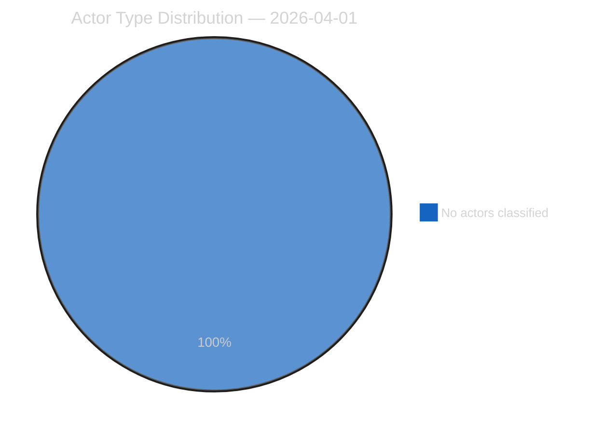
```mermaid
%%{init: {"theme":"dark","themeVariables":{"primaryColor":"#1565C0","primaryTextColor":"#ffffff","primaryBorderColor":"#0A3F7F","lineColor":"#90CAF9","secondaryColor":"#2E7D32","secondaryTextColor":"#ffffff","secondaryBorderColor":"#0F3F00","tertiaryColor":"#FF9800","tertiaryTextColor":"#000000","tertiaryBorderColor":"#7F4F00","mainBkg":"#1565C0","secondBkg":"#2E7D32","tertiaryBkg":"#FF9800","noteBkgColor":"#FFC107","noteTextColor":"#000000","noteBorderColor":"#7F6000","errorBkgColor":"#D32F2F","errorTextColor":"#ffffff","fontFamily":"Inter, Helvetica, Arial, sans-serif","pie1":"#1565C0","pie2":"#2E7D32","pie3":"#FF9800","pie4":"#D32F2F","pie5":"#FFC107","pie6":"#7B1FA2","pie7":"#9E9E9E","pie8":"#0288D1","pie9":"#388E3C","pie10":"#F57C00","pie11":"#C62828","pie12":"#FBC02D","pieTitleTextSize":"18px","pieSectionTextSize":"14px","pieLegendTextSize":"13px","pieStrokeColor":"#1e1e1e","pieOuterStrokeColor":"#1e1e1e","git0":"#1565C0","git1":"#2E7D32","git2":"#FF9800","git3":"#D32F2F","gitBranchLabel0":"#ffffff","gitBranchLabel1":"#ffffff","gitBranchLabel2":"#000000","gitBranchLabel3":"#ffffff","cScale0":"#1565C0","cScale1":"#2E7D32","cScale2":"#FF9800","cScale3":"#D32F2F","cScale4":"#FFC107","cScale5":"#7B1FA2","cScale6":"#9E9E9E","cScale7":"#0288D1","xyChart":{"backgroundColor":"#1e1e1e","plotColorPalette":"#1565C0,#2E7D32,#FF9800,#D32F2F,#FFC107,#7B1FA2,#9E9E9E"}}}}%%
pie title Actor Type Distribution — 2026-04-01
    "No actors classified" : 1
```

### Actor Classification

| Actor | Type | Influence | Position | Role |
|-------|------|-----------|----------|------|
| — | — | — | — | — |

### Type Counts

| Type | Count |
|------|-------|
| — | 0 |

### Date: 2026-04-01

### Forces Analysis

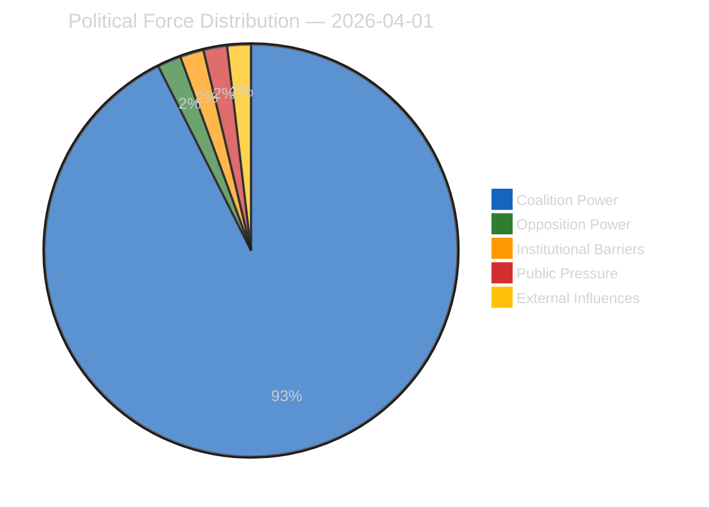
```mermaid
%%{init: {"theme":"dark","themeVariables":{"primaryColor":"#1565C0","primaryTextColor":"#ffffff","primaryBorderColor":"#0A3F7F","lineColor":"#90CAF9","secondaryColor":"#2E7D32","secondaryTextColor":"#ffffff","secondaryBorderColor":"#0F3F00","tertiaryColor":"#FF9800","tertiaryTextColor":"#000000","tertiaryBorderColor":"#7F4F00","mainBkg":"#1565C0","secondBkg":"#2E7D32","tertiaryBkg":"#FF9800","noteBkgColor":"#FFC107","noteTextColor":"#000000","noteBorderColor":"#7F6000","errorBkgColor":"#D32F2F","errorTextColor":"#ffffff","fontFamily":"Inter, Helvetica, Arial, sans-serif","pie1":"#1565C0","pie2":"#2E7D32","pie3":"#FF9800","pie4":"#D32F2F","pie5":"#FFC107","pie6":"#7B1FA2","pie7":"#9E9E9E","pie8":"#0288D1","pie9":"#388E3C","pie10":"#F57C00","pie11":"#C62828","pie12":"#FBC02D","pieTitleTextSize":"18px","pieSectionTextSize":"14px","pieLegendTextSize":"13px","pieStrokeColor":"#1e1e1e","pieOuterStrokeColor":"#1e1e1e","git0":"#1565C0","git1":"#2E7D32","git2":"#FF9800","git3":"#D32F2F","gitBranchLabel0":"#ffffff","gitBranchLabel1":"#ffffff","gitBranchLabel2":"#000000","gitBranchLabel3":"#ffffff","cScale0":"#1565C0","cScale1":"#2E7D32","cScale2":"#FF9800","cScale3":"#D32F2F","cScale4":"#FFC107","cScale5":"#7B1FA2","cScale6":"#9E9E9E","cScale7":"#0288D1","xyChart":{"backgroundColor":"#1e1e1e","plotColorPalette":"#1565C0,#2E7D32,#FF9800,#D32F2F,#FFC107,#7B1FA2,#9E9E9E"}}}}%%
pie title Political Force Distribution — 2026-04-01
    "Coalition Power" : 50
    "Opposition Power" : 1
    "Institutional Barriers" : 1
    "Public Pressure" : 1
    "External Influences" : 1
```

### Forces Data

| Force | Trend | Strength | Key Actors | Confidence |
|-------|-------|----------|------------|------------|
| Coalition Power | stable | 50% | — | low |
| Opposition Power | stable | 0% | — | low |
| Institutional Barriers | stable | 0% | — | low |
| Public Pressure | stable | 0% | — | low |
| External Influences | stable | 0% | — | low |

### Balance

| Metric | Value |
|--------|-------|
| Coalition vs Opposition | 50% vs 1% |
| Dominant force | Coalition |
| Date | 2026-04-01 |

### Date: 2026-04-01

### Impact Matrix

### Overall Significance: **ROUTINE**

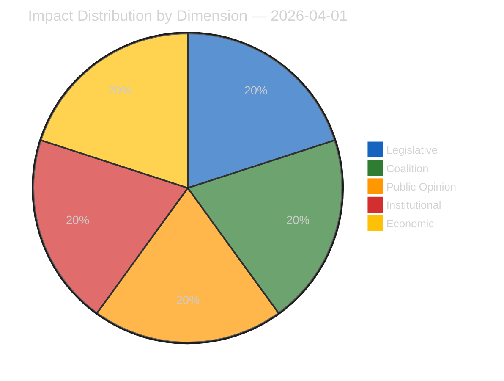
```mermaid
%%{init: {"theme":"dark","themeVariables":{"primaryColor":"#1565C0","primaryTextColor":"#ffffff","primaryBorderColor":"#0A3F7F","lineColor":"#90CAF9","secondaryColor":"#2E7D32","secondaryTextColor":"#ffffff","secondaryBorderColor":"#0F3F00","tertiaryColor":"#FF9800","tertiaryTextColor":"#000000","tertiaryBorderColor":"#7F4F00","mainBkg":"#1565C0","secondBkg":"#2E7D32","tertiaryBkg":"#FF9800","noteBkgColor":"#FFC107","noteTextColor":"#000000","noteBorderColor":"#7F6000","errorBkgColor":"#D32F2F","errorTextColor":"#ffffff","fontFamily":"Inter, Helvetica, Arial, sans-serif","pie1":"#1565C0","pie2":"#2E7D32","pie3":"#FF9800","pie4":"#D32F2F","pie5":"#FFC107","pie6":"#7B1FA2","pie7":"#9E9E9E","pie8":"#0288D1","pie9":"#388E3C","pie10":"#F57C00","pie11":"#C62828","pie12":"#FBC02D","pieTitleTextSize":"18px","pieSectionTextSize":"14px","pieLegendTextSize":"13px","pieStrokeColor":"#1e1e1e","pieOuterStrokeColor":"#1e1e1e","git0":"#1565C0","git1":"#2E7D32","git2":"#FF9800","git3":"#D32F2F","gitBranchLabel0":"#ffffff","gitBranchLabel1":"#ffffff","gitBranchLabel2":"#000000","gitBranchLabel3":"#ffffff","cScale0":"#1565C0","cScale1":"#2E7D32","cScale2":"#FF9800","cScale3":"#D32F2F","cScale4":"#FFC107","cScale5":"#7B1FA2","cScale6":"#9E9E9E","cScale7":"#0288D1","xyChart":{"backgroundColor":"#1e1e1e","plotColorPalette":"#1565C0,#2E7D32,#FF9800,#D32F2F,#FFC107,#7B1FA2,#9E9E9E"}}}}%%
pie title Impact Distribution by Dimension — 2026-04-01
    "Legislative" : 5
    "Coalition" : 5
    "Public Opinion" : 5
    "Institutional" : 5
    "Economic" : 5
```

### Impact Dimensions

| Dimension | Level | Indicator | Numeric |
|-----------|-------|-----------|---------|
| Legislative | none | 🟢 | 5 |
| Coalition | none | 🟢 | 5 |
| Public Opinion | none | 🟢 | 5 |
| Institutional | none | 🟢 | 5 |
| Economic | none | 🟢 | 5 |

### Summary

| Metric | Value |
|--------|-------|
| Overall significance | ROUTINE |
| Highest impact | Legislative |
| Date | 2026-04-01 |

### Date: 2026-04-01

### Significance Assessment

### Overall Significance: **ROUTINE**

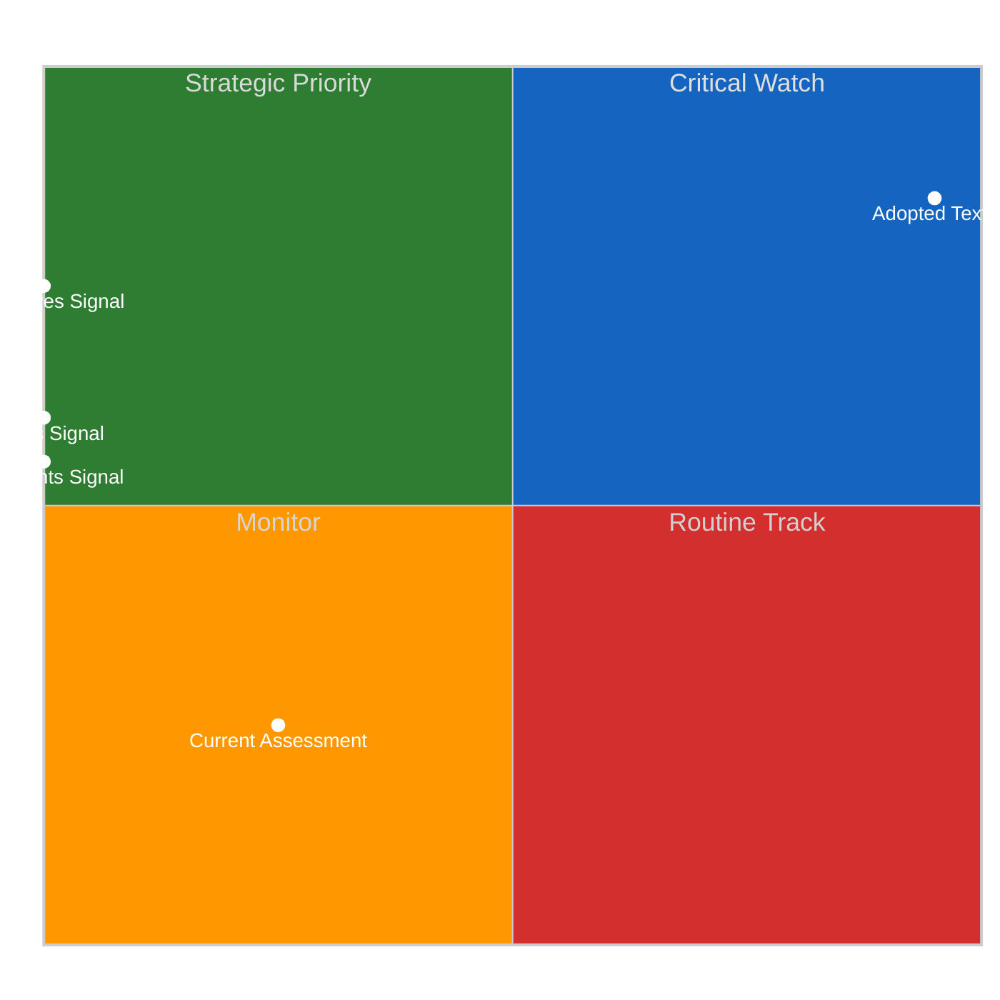
```mermaid
%%{init: {
  "theme": "dark",
  "themeVariables": {
    "quadrant1Fill": "#1565C0",
    "quadrant2Fill": "#2E7D32",
    "quadrant3Fill": "#FF9800",
    "quadrant4Fill": "#D32F2F",
    "quadrantTitleFill": "#ffffff",
    "quadrantPointFill": "#ffffff",
    "quadrantPointTextFill": "#ffffff",
    "quadrantXAxisTextFill": "#ffffff",
    "quadrantYAxisTextFill": "#ffffff"
  },
  "quadrantChart": {
    "chartWidth": 700,
    "chartHeight": 700,
    "pointLabelFontSize": 14,
    "titleFontSize": 22,
    "quadrantLabelFontSize": 18,
    "xAxisLabelFontSize": 16,
    "yAxisLabelFontSize": 16
  }
}}%%
quadrantChart
    title Political Significance Assessment — 2026-04-01
    x-axis Low Volume --> High Volume
    y-axis Low Impact --> High Impact
    quadrant-1 Critical Watch
    quadrant-2 Strategic Priority
    quadrant-3 Monitor
    quadrant-4 Routine Track
    Current Assessment: [0.25, 0.25]
    Events Signal: [0.00, 0.60]
    Documents Signal: [0.00, 0.55]
    Procedures Signal: [0.00, 0.75]
    Adopted Texts: [0.95, 0.85]
```

### 5-Signal Model Scores

| Signal | Raw Data | Score |
|--------|----------|-------|
| Volume | 0 events, 0 documents | 0.0/5 |
| Pipeline | 0 procedures | 0.0/5 |
| Output | 20 adopted texts | 4.0/5 |
| Anomalies | Pattern deviation detection | — |
| Coalition | Group alignment analysis | — |

### Data Summary

| Metric | Value |
|--------|-------|
| Computed significance | ROUTINE |
| Total data points | 20 |
| Events | 0 |
| Documents | 0 |
| Procedures | 0 |
| Adopted texts | 20 |
| Date | 2026-04-01 |

### Date: 2026-04-01

<h2 id="section-coalitions-voting">Coalitions & Voting</h2>

### Voting Patterns

### Overview
Detection and analysis of voting trends across European Parliament proceedings.

### Detected Trends
| Trend ID | Direction | Confidence | Data Points |
|----------|-----------|------------|-------------|
| No trend data available | — | — | — |

### Summary
- **Trends identified**: 0
- **Records analysed**: 0
- **Date**: 2026-04-01

<h2 id="section-risk">Risk Assessment</h2>

### Risk Matrix

### Overview

Quantitative risk scoring across 0 identified political dimensions.
This matrix uses a standardized likelihood × impact framework to quantify and
prioritize political risks affecting the European Parliament legislative process.

### Risk Heat Map

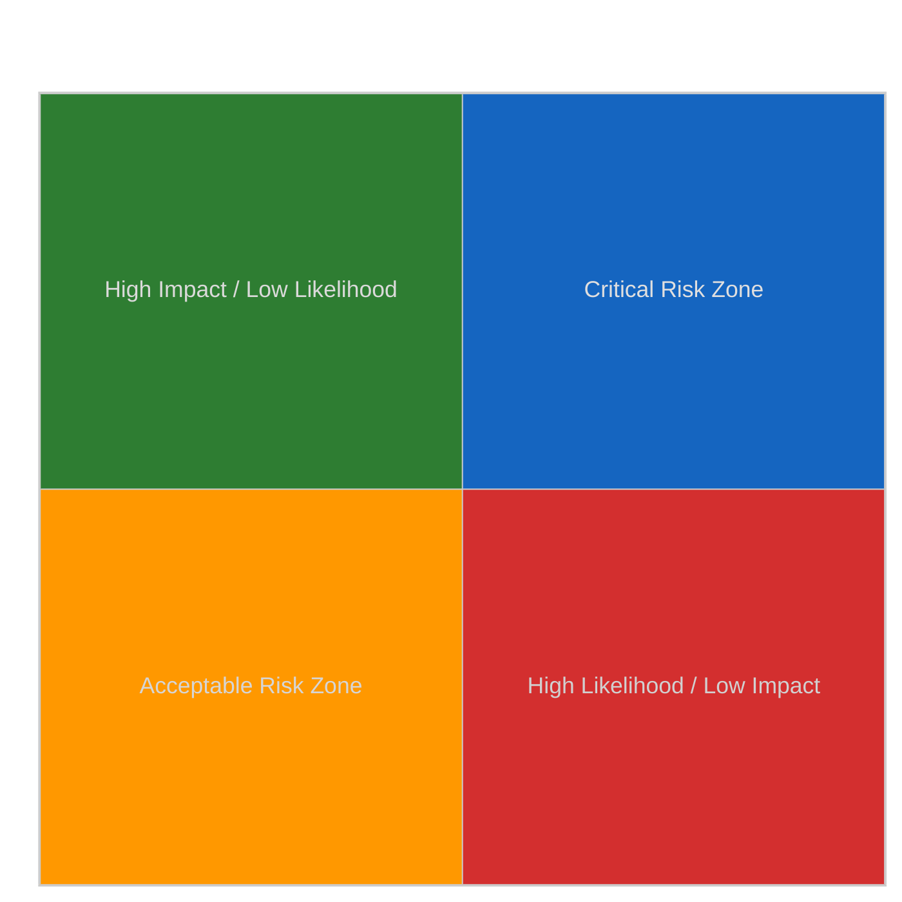
```mermaid
%%{init: {
  "theme": "dark",
  "themeVariables": {
    "quadrant1Fill": "#1565C0",
    "quadrant2Fill": "#2E7D32",
    "quadrant3Fill": "#FF9800",
    "quadrant4Fill": "#D32F2F",
    "quadrantTitleFill": "#ffffff",
    "quadrantPointFill": "#ffffff",
    "quadrantPointTextFill": "#ffffff",
    "quadrantXAxisTextFill": "#ffffff",
    "quadrantYAxisTextFill": "#ffffff"
  },
  "quadrantChart": {
    "chartWidth": 700,
    "chartHeight": 700,
    "pointLabelFontSize": 14,
    "titleFontSize": 22,
    "quadrantLabelFontSize": 18,
    "xAxisLabelFontSize": 16,
    "yAxisLabelFontSize": 16
  }
}}%%
quadrantChart
    title Political Risk Heat Map — 2026-04-01
    x-axis Low Likelihood --> High Likelihood
    y-axis Low Impact --> High Impact
    quadrant-1 Critical Risk Zone
    quadrant-2 High Impact / Low Likelihood
    quadrant-3 Acceptable Risk Zone
    quadrant-4 High Likelihood / Low Impact

```

### Risk Matrix

| Risk ID | Description | Likelihood | Impact | Score | Level |
|---------|-------------|------------|--------|-------|-------|
| — | — | — | — | — | — |

> **Risk Score** = Likelihood × Impact. **Levels**: 🟢 LOW (≤1.0), 🟡 MEDIUM (≤2.0), 🟠 HIGH (≤3.5), 🔴 CRITICAL (>3.5)

### Risk Assessment Details

| — | — | — | — | — | — |

### Risk Mitigation Framework

| Risk Level | Count | Tolerance | Action Required |
|------------|-------|-----------|-----------------|
| 🔴 CRITICAL | 0 | Zero tolerance | Immediate escalation |
| 🟠 HIGH | 0 | Low tolerance | Active mitigation |
| 🟡 MEDIUM | 0 | Moderate | Enhanced monitoring |
| 🟢 LOW | 0 | Acceptable | Routine tracking |

### Date: 2026-04-01

### Quantitative Swot

### Executive Summary

**Strategic Position Score**: 2.0/10
**Overall Assessment**: Weak strategic position: weaknesses and threats dominate — urgent mitigation needed.
**Analysis Date**: 2026-04-01

> This SWOT analysis is derived from 0 procedures, 0 events, 20 adopted texts, 0 documents, 0 voting records, and 0 coalition data points fetched from the European Parliament.

### SWOT Quadrant Chart

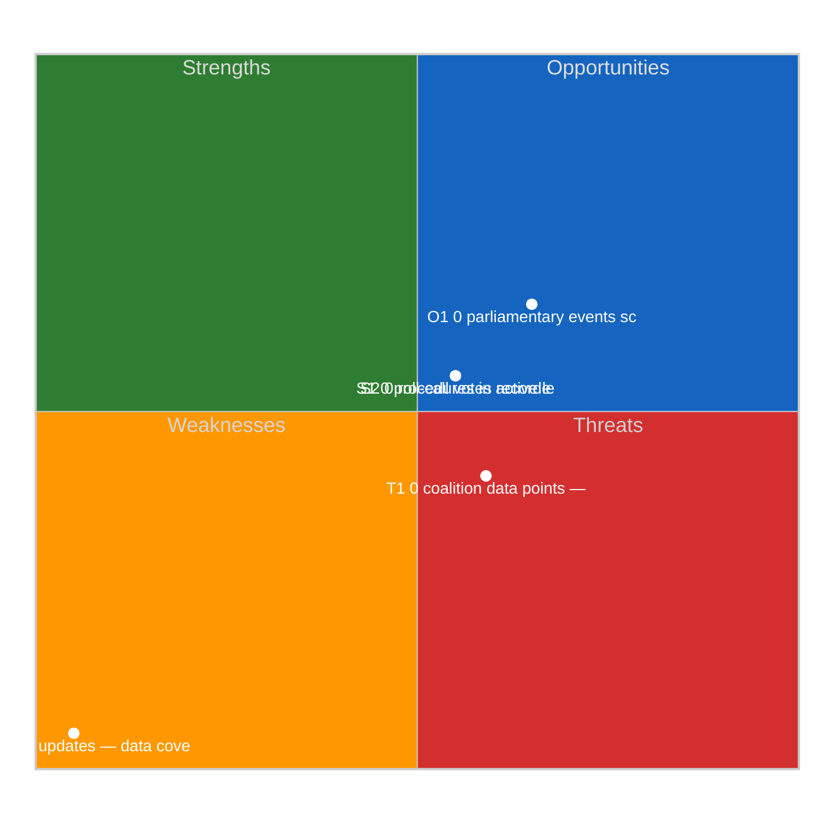
```mermaid
%%{init: {
  "theme": "dark",
  "themeVariables": {
    "quadrant1Fill": "#1565C0",
    "quadrant2Fill": "#2E7D32",
    "quadrant3Fill": "#FF9800",
    "quadrant4Fill": "#D32F2F",
    "quadrantTitleFill": "#ffffff",
    "quadrantPointFill": "#ffffff",
    "quadrantPointTextFill": "#ffffff",
    "quadrantXAxisTextFill": "#ffffff",
    "quadrantYAxisTextFill": "#ffffff"
  },
  "quadrantChart": {
    "chartWidth": 700,
    "chartHeight": 700,
    "pointLabelFontSize": 14,
    "titleFontSize": 22,
    "quadrantLabelFontSize": 18,
    "xAxisLabelFontSize": 16,
    "yAxisLabelFontSize": 16
  }
}}%%
quadrantChart
    title Political SWOT — Strategic Position (2026-04-01)
    x-axis Low Impact --> High Impact
    y-axis Low Priority --> High Priority
    quadrant-1 Opportunities
    quadrant-2 Strengths
    quadrant-3 Weaknesses
    quadrant-4 Threats
    S1 0 procedures in active le: [0.55, 0.55]
    S2 0 roll-call votes recorde: [0.55, 0.55]
    W1 0 MEP updates — data cove: [0.05, 0.05]
    O1 0 parliamentary events sc: [0.65, 0.65]
    T1 0 coalition data points —: [0.59, 0.41]
```

### SWOT Overview

| Category | Items | Avg Score | Trend |
|----------|-------|-----------|-------|
| 🟢 Strengths | 2 | 0.0 | stable |
| 🔴 Weaknesses | 1 | 5.0 | stable |
| 🔵 Opportunities | 1 | 1.5 | stable |
| 🟠 Threats | 1 | 0.9 | stable |

### 🟢 Strengths

#### S1: 0 procedures in active legislative pipeline
- **Score**: 0.0/5
- **Confidence**: low
- **Trend**: stable
- **Evidence**:
  - 0 procedures tracked in current period
  - 20 texts adopted
  - 0 documents published

#### S2: 0 roll-call votes recorded with 0 questions
- **Score**: 0.0/5
- **Confidence**: low
- **Trend**: stable
- **Evidence**:
  - 0 voting records available
  - 0 parliamentary questions filed
  - 0 MEP activity updates

### 🔴 Weaknesses

#### W1: 0 MEP updates — data coverage gap assessment
- **Score**: 5.0/5
- **Confidence**: medium
- **Trend**: stable
- **Evidence**:
  - 0 MEP updates in current period
  - 0 documents vs 0 procedures ratio
  - Data freshness depends on EP feed update frequency

### 🔵 Opportunities

#### O1: 0 parliamentary events scheduled
- **Score**: 1.5/5
- **Confidence**: medium
- **Trend**: stable
- **Evidence**:
  - 0 events in analysis period
  - 20 texts adopted indicates legislative throughput
  - 0 procedures in various stages

### 🟠 Threats

#### T1: 0 coalition data points — cohesion monitoring
- **Score**: 0.9/5
- **Confidence**: low
- **Trend**: stable
- **Evidence**:
  - 0 coalition observations recorded
  - Cross-reference with 0 voting records
  - 0 procedures may be affected by coalition shifts

### Cross-Impact Matrix

| Interaction | Net Effect | Rationale |
|-------------|-----------|----------|
| strength #1 × threat #1 | 0.00 | Strength "0 procedures in active legislative pipeline" partially mitigates threat "0 coalition data points — cohesion monitoring" |
| strength #2 × threat #1 | 0.00 | Strength "0 roll-call votes recorded with 0 questions" partially mitigates threat "0 coalition data points — cohesion monitoring" |
| weakness #1 × threat #1 | 0.75 | Weakness "0 MEP updates — data coverage gap assessment" amplifies threat "0 coalition data points — cohesion monitoring" |

### Strategic Priorities Matrix

### Data Summary

| Data Source | Count |
|-------------|-------|
| Procedures | 0 |
| Events | 0 |
| Documents | 0 |
| Voting Records | 0 |
| Adopted Texts | 20 |
| Coalitions | 0 |
| Questions | 0 |
| MEP Updates | 0 |
| **Total Data Points** | **20** |

### Date: 2026-04-01

### Political Capital Risk

### Data Inventory for Capital Risk Assessment
| Data Source | Count | Relevance |
|-------------|-------|-----------|
| Coalition data points | 0 | Group cohesion indicators |
| Voting records | 0 | Voting alignment metrics |
| Voting patterns | 0 | Trend and anomaly data |
| Active procedures | 0 | Legislative engagement |

### Date: 2026-04-01

### Legislative Velocity Risk

### Overview
Risk assessment based on legislative processing speed for 0 procedures.

### Top Velocity Risks
| Procedure | Title | Stage | Days (actual/expected) | Risk Score | Level |
|-----------|-------|-------|----------------------|------------|-------|
| — | — | — | — | — | — |

### Summary
- **Procedures analysed**: 0
- **High/Critical risks**: 0
- **Date**: 2026-04-01

### Agent Risk Workflow

### Risk Heat Map

| Impact ↓ / Likelihood → | Rare | Unlikely | Possible | Likely | Almost Certain |
|--------------------------|------|----------|----------|--------|----------------|
| **Severe** | 🟢 | 🟡 | 🟠 | 🟠 | 🔴 |
| **Major** | 🟢 | 🟡 | 🟡 | 🟠 | 🔴 |
| **Moderate** | 🟢 | 🟢 | 🟡 | 🟠 | 🟠 |
| **Minor** | 🟢 | 🟢 | 🟢 | 🟡 | 🟡 |
| **Negligible** | 🟢 | 🟢 | 🟢 | 🟢 | 🟢 |

### Identified Risks

#### RISK-W00: Baseline political risk
- **Likelihood**: rare (0.1) | **Impact**: minor (2) | **Score**: 0.2 (LOW) | **Confidence**: low
- **Evidence**: Routine parliamentary activity
- **Mitigating Factors**: Stable institutional framework

### Risk Evaluation Matrix

| Rank | Risk ID | Description | Score | Level | Confidence |
|------|---------|-------------|-------|-------|------------|
| 1 | RISK-W00 | Baseline political risk | 0.2 | LOW | low |

### Risk Treatment Plan

- Monitor legislative velocity indicators
- Track coalition voting patterns

### Recommendations

- Monitor legislative velocity indicators
- Track coalition voting patterns

<h2 id="section-threat">Threat Landscape</h2>

### Actor Threat Profiles

### Overview
Individual threat profiles for 0 political actors.

### Actor Threat Matrix
| Actor | Type | Capability | Motivation | Opportunity | Threat Level |
|-------|------|------------|------------|-------------|--------------|
| — | — | — | — | — | — |

### Date: 2026-04-01

### Consequence Trees

### Overview
Structured analysis of action-consequence chains for 0 legislative procedures.

### No procedures available for consequence analysis

### Date: 2026-04-01

### Legislative Disruption

### Overview
Identification of factors disrupting the normal legislative process.

### Disruption Assessment
| Procedure ID | Title | Stage | Resilience | Disruption Points |
|-------------|-------|-------|-----------|-------------------|
| — | — | — | — | — |

### Date: 2026-04-01

### Political Threat Landscape

### Political Threat Landscape Analysis

#### Coalition Shifts
**Threat Level**: 🟢 Low

Coalition stability appears maintained. No significant realignment signals.

**Evidence:**
- No coalition shift signals detected in available data

#### Transparency Deficit
**Threat Level**: ⚠️ Moderate

Transparency concerns at moderate level. Review committee meeting records and public documentation.

**Evidence:**
- No committee activity data available — potential information gap

#### Policy Reversal
**Threat Level**: 🟢 Low

Legislative trajectory appears stable. No major reversal signals.

**Evidence:**
- No significant policy reversal signals detected

#### Institutional Pressure
**Threat Level**: 🟢 Low

Institutional balance appears maintained. Power distribution within normal parameters.

**Evidence:**
- No institutional threat signals detected

#### Legislative Obstruction
**Threat Level**: 🟢 Low

Legislative pace within normal parameters. No obstruction signals.

**Evidence:**
- No significant legislative delay signals detected

#### Democratic Erosion
**Threat Level**: 🟢 Low

Democratic norms appear stable. Institutional processes functioning within expected parameters.

**Evidence:**
- Democratic norms appear stable. No systematic erosion signals.

### Actor Threat Profiles

*No actor threat profiles generated from available data.*

### Consequence Trees

#### Consequence Tree: Standard legislative activity assessment

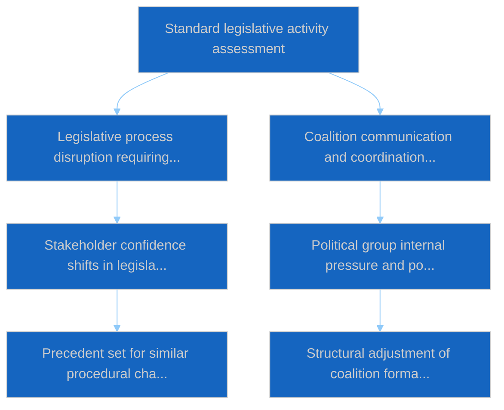
```mermaid
%%{init: {"theme":"dark","themeVariables":{"primaryColor":"#1565C0","primaryTextColor":"#ffffff","primaryBorderColor":"#0A3F7F","lineColor":"#90CAF9","secondaryColor":"#2E7D32","secondaryTextColor":"#ffffff","secondaryBorderColor":"#0F3F00","tertiaryColor":"#FF9800","tertiaryTextColor":"#000000","tertiaryBorderColor":"#7F4F00","mainBkg":"#1565C0","secondBkg":"#2E7D32","tertiaryBkg":"#FF9800","noteBkgColor":"#FFC107","noteTextColor":"#000000","noteBorderColor":"#7F6000","errorBkgColor":"#D32F2F","errorTextColor":"#ffffff","fontFamily":"Inter, Helvetica, Arial, sans-serif","pie1":"#1565C0","pie2":"#2E7D32","pie3":"#FF9800","pie4":"#D32F2F","pie5":"#FFC107","pie6":"#7B1FA2","pie7":"#9E9E9E","pie8":"#0288D1","pie9":"#388E3C","pie10":"#F57C00","pie11":"#C62828","pie12":"#FBC02D","pieTitleTextSize":"18px","pieSectionTextSize":"14px","pieLegendTextSize":"13px","pieStrokeColor":"#1e1e1e","pieOuterStrokeColor":"#1e1e1e","git0":"#1565C0","git1":"#2E7D32","git2":"#FF9800","git3":"#D32F2F","gitBranchLabel0":"#ffffff","gitBranchLabel1":"#ffffff","gitBranchLabel2":"#000000","gitBranchLabel3":"#ffffff","cScale0":"#1565C0","cScale1":"#2E7D32","cScale2":"#FF9800","cScale3":"#D32F2F","cScale4":"#FFC107","cScale5":"#7B1FA2","cScale6":"#9E9E9E","cScale7":"#0288D1","xyChart":{"backgroundColor":"#1e1e1e","plotColorPalette":"#1565C0,#2E7D32,#FF9800,#D32F2F,#FFC107,#7B1FA2,#9E9E9E"}}}}%%
graph TD
    A["Standard legislative activity assessment"]
    B0["Legislative process disruption requiring..."]
    A --> B0
    B1["Coalition communication and coordination..."]
    A --> B1
    C0["Stakeholder confidence shifts in legisla..."]
    B0 --> C0
    C1["Political group internal pressure and po..."]
    B1 --> C1
    D0["Precedent set for similar procedural cha..."]
    C0 --> D0
    D1["Structural adjustment of coalition forma..."]
    C1 --> D1
```

**Mitigating Factors:**
- Institutional resilience mechanisms
- Cross-party dialogue channels

**Amplifying Factors:**
- No significant amplifying factors identified

### Legislative Disruption Analysis

#### Procedure: General legislative pipeline

**Current Stage**: proposal | **Resilience**: high

| Stage | Threat Category | Likelihood | Risk Level |
|-------|----------------|------------|------------|
| proposal | delay | 8% | 🟢 Low |
| committee | transparency | 18% | 🟢 Low |
| plenary first reading | shift | 22% | 🟢 Low |
| council position | delay | 12% | 🟢 Low |
| plenary second reading | shift | 21% | 🟢 Low |
| conciliation | reversal | 17% | 🟢 Low |
| adoption | delay | 5% | 🟢 Low |

**Alternative Pathways:**
- Commission resubmission with revised proposal
- Enhanced informal trilogue engagement
- Interim resolution as procedural bridge

### Key Findings

- No high-priority threats detected across threat landscape dimensions

### Recommendations

- Continue routine monitoring of parliamentary activity

---
*Assessment generated by EU Parliament Monitor Political Threat Assessment Pipeline.*  
*Based on public European Parliament data. GDPR-compliant.*

<h2 id="section-continuity">Cross-Run Continuity</h2>

### Cross Session Intelligence

### Overview
Analysis of coalition stability patterns across multiple plenary sessions.

### Stability Report
- **Overall Stability**: 0.0%
- **Forecast**: volatile
- **Patterns Analysed**: 0

### Group Analysis
- **Stable Groups**: None identified
- **Declining Groups**: None identified

### Date: 2026-04-01

<h2 id="section-deep-analysis">Deep Analysis</h2>

### Raw Data Inventory
| Data Source | Count |
|-------------|-------|
| Events | 0 |
| Procedures | 0 |
| Documents | 0 |
| Adopted Texts | 20 |
| Questions | 0 |
| MEP Updates | 0 |
| **Total** | **20** |

### Stakeholder Groups for AI Analysis
| Stakeholder Group | Data Points Available |
|-------------------|---------------------|
| Political Groups | 20 (procedures + adopted texts) |
| Civil Society | 0 (documents + questions) |
| Industry | 0 (procedures) |
| National Governments | 20 (adopted texts) |
| Citizens | 0 (questions + MEP updates) |
| EU Institutions | 0 (events + procedures) |

### Date: 2026-04-01

<h2 id="section-supplementary-intelligence">Supplementary Intelligence</h2>

### Executive Brief Ar

**التصنيف:** OSINT | سجل برلماني عام
**مستوى الثقة:** 🟢 مرتفع (تقييم هيكلي في فترة الاستراحة)
**تاريخ الإنشاء:** 2026-04-01T00:00:00Z (موجز استعادي)
**نوع المقال:** مقترحات
**معرّف الجلسة:** `4cf3b11a-f38e-4a3c-a81c-5c73d6eb8adc`
**المصدر:** بوابة البيانات المفتوحة للبرلمان الأوروبي

---

### 🎯 BLUF

**لم تُفهرَس أي مقترحات جديدة للمفوضية أو ملفات مبادرة ذاتية للبرلمان الأوروبي بتاريخ 2026-04-01.** أسفرت جلسة التحليل `4cf3b11a-f38e-4a3c-a81c-5c73d6eb8adc` عن **0 جهة مصنّفة** وأهمية **روتينية** في جميع الأبعاد. يُفسَّر الفراغ المعلوماتي بالعطلة البرلمانية بين الدورتين (27 مارس → 26 أبريل) وخطأ `get_procedures_feed` 404 المتزامن (الموثّق في تقرير الأخبار العاجلة المصاحب). وبالتالي فإن خط الأساس الفعلي للمقترحات هو البنية التحتية الموروثة: إطار أرصدة انبعاثات المركبات ثقيلة الحمولة 2025–2029 (TA-10-2026-0084)، إجراءات نائب رئيس البنك المركزي الأوروبي (TA-10-2026-0060)، تقرير التشريع الأفضل (TA-10-2026-0063)، والإحالة الجارية لاتفاقية الاتحاد الأوروبي-ميركوسور إلى محكمة العدل (TA-10-2026-0008). **🟢 ثقة مرتفعة** في أن الحالة الفارغة مدفوعة بالتقويم وتوافر البيانات وليست انحداراً في البنية التحتية.

---

### 🧭 3 قرارات يدعمها هذا الموجز

| # | القرار | صاحب القرار | الموعد النهائي | الأدلة |
|:-:|--------|------------|:--------------:|--------|
| 1 | **تحريري:** تخطّي المقترحات اليومية؛ تأجيل حتى الجلسة النشطة التالية | المحرر | +24 ساعة | مخرجات التشغيل الفارغة |
| 2 | **المراقبة:** التحقق من صحة `get_procedures_feed` في الدورة التالية | البنية التحتية للبيانات | 2026-04-02 | 404 بتاريخ 2026-04-01 |
| 3 | **المراقبة الاستشرافية:** تتبع مراسلات أسبوع أبريل للمفوضية بحثاً عن مقترحات جديدة | قائد التحليل | 2026-04-13 | إيقاع إدراج المفوضية |

---

### 📰 قراءة من 60 ثانية

- 🔴 **لم تُفتتَح إجراءات جديدة** بتاريخ 2026-04-01؛ `get_procedures_feed` 404 في تشغيل موازٍ. (🟡 متوسط — توافر نقطة النهاية هو التحفظ)
- 🟠 **0 جهات مصنّفة**؛ لم يُحدَّد أي مفوض أو مديرية عامة أو مقرر. (🟢 مرتفع)
- 🟢 **ترحيل البنية التحتية** — انبعاثات المركبات الثقيلة، نائب رئيس البنك المركزي الأوروبي، التشريع الأفضل، إحالة ميركوسور تبقى المخزون النشط للمقترحات الداخلة في أبريل. (🟢 مرتفع)
- 🟡 **جميع أبعاد المخاطر "لا شيء"** — لم تُرصَد مخاطر حادة في مرحلة المقترحات اليوم. (🟢 مرتفع)
- 🔵 **السياق الاقتصادي:** تبقى مقترحات المفوضية للربع الثاني المتوقعة بشأن لوائح تنفيذ قانون الذكاء الاصطناعي واستراتيجية الصناعة الدفاعية والمراسلات التحضيرية للإطار المالي متعدد السنوات على قائمة المراقبة. (🟡 متوسط — إيقاع إدراج المفوضية)
- 🟣 **الإسناد المتقاطع:** يوثّق التقرير المصاحب 2026-04-01/breaking نمط 6/8 من تغذيات 404 الاستشارية. (🟢 مرتفع)
- 🩷 **ناقل الاضطراب:** قد يجبر الضغط التجاري الأمريكي على تقديم مقترح بمسار سريع من المفوضية في أبريل. (🟡 متوسط)
- ⚪ **الترحيل:** رأي محكمة العدل الأوروبية بشأن ميركوسور هو أعلى المشغّلات المنتظرة تأثيراً في المقترحات.

---

### 🗂️ أبرز الوثائق / الإجراءات — مراقبة المقترحات

| الترتيب | المرجع البرلماني | العنوان (مختصر) | الأهمية | الثقة | الحالة |
|:-------:|-----------------|-----------------|:-------:|:-----:|--------|
| 1 | — | لا مقترحات جديدة بتاريخ 2026-04-01 | 0.0 | 🟢 مرتفعة | استراحة + تغذية 404 |
| 2 | TA-10-2026-0008 | إحالة EU-Mercosur إلى محكمة العدل (معلّقة) | 8.0 | 🟡 متوسطة | رأي المحكمة متوقع |
| 3 | TA-10-2026-0084 | أرصدة انبعاثات المركبات الثقيلة 2025–2029 | 7.0 | 🟢 مرتفعة | بنية تحتية للنقل |
| 4 | TA-10-2026-0063 | التشريع الأفضل (الخط الأساسي التنظيمي) | 6.0 | 🟢 مرتفعة | إطار شامل |

---

### ⚠️ لقطة المخاطر والتهديدات

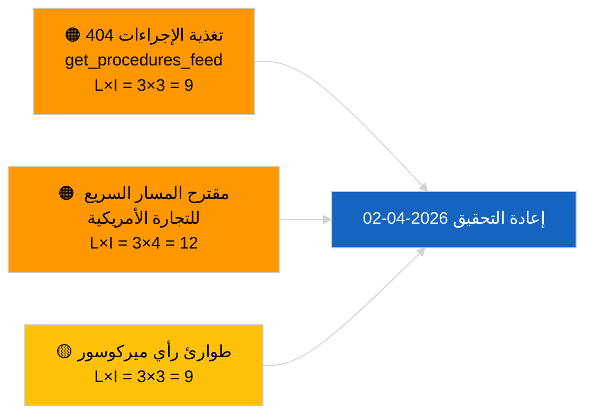
```mermaid
%%{init: {"theme":"dark"}}%%
graph LR
    R1["🟠 تغذية الإجراءات 404<br/>get_procedures_feed<br/>L×I = 3×3 = 9"] --> CONS["إعادة التحقيق 2026-04-02"]
    R2["🟠 مقترح المسار السريع للتجارة الأمريكية<br/>L×I = 3×4 = 12"] --> CONS
    R3["🟡 طوارئ رأي ميركوسور<br/>L×I = 3×3 = 9"] --> CONS
    style R1 fill:#FF9800,color:#000000
    style R2 fill:#FF9800,color:#000000
    style R3 fill:#FFC107,color:#000000
    style CONS fill:#1565C0,color:#FFFFFF
```

| المخاطرة | L | I | النتيجة | المشغّل | المصدر | Admiralty |
|---------|:-:|:-:|:-------:|---------|--------|:---------:|
| موثوقية `get_procedures_feed` | 3 | 3 | 9 | استمرار 404 | تقرير الأخبار العاجلة المصاحب | B2 |
| مقترح المسار السريع للتجارة الأمريكية | 3 | 4 | 12 | إجراء أمريكي يُفعّل إدراج المفوضية | TA-10-2026-0096 | A1 |
| طوارئ رأي ميركوسور | 3 | 3 | 9 | نشر المحكمة | TA-10-2026-0008 | A2 |
| احتكاك الاستعداد للإطار المالي | 3 | 4 | 12 | مراسلة المفوضية للربع الثاني | إيقاع المفوضية | B2 |

---

### 🔮 أبرز المشغّلات المستقبلية

**تستأنف دورة اجتماعات يوم الثلاثاء للمفوضية في 7 أبريل 2026.** تُدرَج أولى مقترحات المفوضية ما بعد عيد الفصح عادةً في اجتماع الكوليجيوم مطلع أبريل؛ ويُعيّن المزيج الموضوعي (دفاع/رقمي/تجارة/مناخ) قائمة مراقبة مقترحات الربع الثاني.

---

### 🛡️ تقييم جودة المصادر

- **المصادر الأولية:** بوابة البيانات المفتوحة للبرلمان الأوروبي — جلسة التحليل `4cf3b11a-f38e-4a3c-a81c-5c73d6eb8adc` ومخزون الوثائق الخارجية لشهر مارس.
- **قيود البيانات:** `get_procedures_feed` 404 بتاريخ 2026-04-01 يحول دون التحقق المستقل من "عدم افتتاح إجراءات جديدة اليوم".
- **الثقة في حالة الخمول المرتبطة بالتقويم:** 🟢 مرتفعة.

---

### 📎 الروابط

| الرابط | المسار |
|--------|--------|
| المقال | `./article.md` |
| التصنيف (فارغ) | `./classification/` |
| التشغيلات المصاحبة | `analysis/daily/2026-04-01/breaking/`, `committee-reports/`, `month-ahead/`, `motions/` |
| الجرد | `./manifest.json` |

---

### 🔄 الإسناد المتقاطع

**تشغيلات قوالب فارغة متزامنة:** breaking وcommittee-reports وmonth-ahead وmotions لتاريخ 2026-04-01 جميعها تُظهر حالة فارغة متطابقة — مما يؤكد ظروف الاستراحة الشاملة للنظام + شروط API التغذية، وليس انحداراً خاصاً بالمقترحات.

---

**التحكم في الوثيقة**
- **القالب:** `/analysis/templates/executive-brief.md`
- **مسار المنتج:** `analysis/daily/2026-04-01/propositions/executive-brief.md`
- **التصنيف:** عام
- **الإنشاء الاستعادي:** جلسة ملء استعادية.

### Executive Brief Da

### 🎯 BLUF

**Ingen nye Kommissions-forslag eller EP-egne initiativsager indekseret den 2026-04-01.** Analyskørsel `4cf3b11a-f38e-4a3c-a81c-5c73d6eb8adc` returnerede **0 klassificerede aktører** og **RUTINE**-betydning på tværs af alle dimensioner. EP's intersessionelle recess (27. marts → 26. april) og den samtidige `get_procedures_feed` 404-fejl (dokumenteret i søsterkørslen om seneste nyheder) forklarer datatomrummet. Det substantielle forslagsbaseline er derfor den arvede pipeline: HDV-emissionskreditter 2025–2029-ramme (TA-10-2026-0084), ECB-næstformandsprocedure (TA-10-2026-0060), rapport om bedre lovgivning (TA-10-2026-0063) og den igangværende EU-Mercosur-domstolshenvisning (TA-10-2026-0008). **🟢 HØJ konfidens** om at den tomme tilstand er kalender- og feedtilgængeligheds-drevet, ikke en pipeline-regression.

---

### 🧭 3 Beslutninger som denne resumé understøtter

| # | Beslutning | Beslutningstagere | Deadline | Dokumentation |
|:-:|------------|------------------|:--------:|--------------|
| 1 | **Redaktion:** SPRING daglige forslag over; udskyd til næste aktive session | Redaktør | +24t | Tom kørselsoutput |
| 2 | **Overvågning:** verificer `get_procedures_feed`-sundhed i næste cyklus | Datapipeline | 2026-04-02 | 404 den 2026-04-01 |
| 3 | **Fremadrettet bevakning:** spor Kommissionens april-uge-kommunikationer for nye forslag | Analyseansvarlig | 2026-04-13 | Kommissionens tabellerings-kadence |

---

### 📰 60-sekunders læsning

- 🔴 **Ingen nye procedurer åbnet** den 2026-04-01; `get_procedures_feed` 404 i parallel kørsel. (🟡 Medium — endepunkttilgængelighed er forbeholdet)
- 🟠 **0 aktører klassificeret**; ingen kommissær, GD eller rapportør identificeret. (🟢 Høj)
- 🟢 **Pipeline-videreførelse** — HDV-emissioner, ECB-næstformand, bedre lovgivning, Mercosur-henvisning forbliver den aktive forslags-beholdning i april. (🟢 Høj)
- 🟡 **Alle risikodimensioner "ingen"** — ingen akut forslagsfase-risiko markeret i dag. (🟢 Høj)
- 🔵 **Økonomisk sammenhæng:** forventede Kommissions-kvartal-2-forslag om AI-lovens gennemførelsesforordninger, strategi for forsvarsindustri og MFF-forberedende kommunikationer forbliver på bevakningslisten. (🟡 Medium — Kommissionens tabellerings-kadence)
- 🟣 **Krydshenvisning:** søsterrapporten 2026-04-01/breaking dokumenterer mønstret 6/8 rådgivende feeds 404. (🟢 Høj)
- 🩷 **Forstyrrelsesvektorer:** US-handelspres kan tvinge hurtigsporet Kommissions-forslag frem i april. (🟡 Medium)
- ⚪ **Overføring:** Mercosur ECJ-udtalelse er den højest-impact afventende forslagsudløser.

---

### 🗂️ Top-dokumenter / procedurer — Forslagsbevakning

| Rang | EP-reference | Titel (kort) | Betydning | Konfidens | Status |
|:----:|--------------|--------------|:---------:|:---------:|--------|
| 1 | — | Ingen nye forslag den 2026-04-01 | 0,0 | 🟢 HØJ | Recess + feed 404 |
| 2 | TA-10-2026-0008 | EU-Mercosur ECJ-henvisning (afventende) | 8,0 | 🟡 MEDIUM | Domstolsudtalelse forventet |
| 3 | TA-10-2026-0084 | HDV-emissionskreditter 2025–2029 | 7,0 | 🟢 HØJ | Transpositionspipeline |
| 4 | TA-10-2026-0063 | Bedre lovgivning (regulatorisk baseline) | 6,0 | 🟢 HØJ | Tværgående ramme |

---

### ⚠️ Risiko- og trusselsbillede

```mermaid
%%{init: {"theme":"dark"}}%%
graph LR
    R1["🟠 Procedurefeed 404<br/>get_procedures_feed<br/>L×I = 3×3 = 9"] --> CONS["Gensond 2026-04-02"]
    R2["🟠 US-handel hurtigspor-forslag<br/>L×I = 3×4 = 12"] --> CONS
    R3["🟡 Mercosur-udtalelse kontingent<br/>L×I = 3×3 = 9"] --> CONS
    style R1 fill:#FF9800,color:#000000
    style R2 fill:#FF9800,color:#000000
    style R3 fill:#FFC107,color:#000000
    style CONS fill:#1565C0,color:#FFFFFF
```

| Risiko | L | I | Score | Udløser | Kilde | Admiralty |
|--------|:-:|:-:|:-----:|---------|-------|:---------:|
| `get_procedures_feed`-pålidelighed | 3 | 3 | 9 | Vedvarende 404 | Søster-breaking-kørsel | B2 |
| US-handel hurtigspor-forslag | 3 | 4 | 12 | US-handling udløser Kommissions-tabelläring | TA-10-2026-0096 | A1 |
| Mercosur-udtalelse kontingent | 3 | 3 | 9 | Domstolen offentliggør | TA-10-2026-0008 | A2 |
| MFF-forberedende friktion | 3 | 4 | 12 | Kvartal-2 Kommissions-kommunikation | Kommissions-kadence | B2 |

---

### 🔮 Vigtigste fremadrettede udløser

**Kommissionens tirsdagsmøde-cyklus genoptages 7. april 2026.** Første post-påske-Kommissions-forslag tabelläres typisk ved det tidlige april-kollegiemøde; den aktuelle blanding (forsvar/digitalt/handel/klima) kalibrerer kvartal-2-forslagsbevaknlisten.

---

### 🛡️ Kildekvalitetsvurdering

- **Primære kilder:** EP's åbne dataportal — analyskørsel `4cf3b11a-f38e-4a3c-a81c-5c73d6eb8adc` og ekstern-dokument-beholdningen for marts.
- **Databegrænsninger:** `get_procedures_feed` 404 den 2026-04-01 forhindrer uafhængig korroboration af "ingen nye procedurer åbnet i dag".
- **Konfidens for kalender-drevet inaktivitet:** 🟢 HØJ.

---

### 📎 Links

| Link | Sti |
|------|-----|
| Artikel | `./article.md` |
| Klassifikation (tom) | `./classification/` |
| Søsterkørsler | `analysis/daily/2026-04-01/breaking/`, `committee-reports/`, `month-ahead/`, `motions/` |
| Manifest | `./manifest.json` |

---

### 🔄 Krydshenvisning

**Samtidige tomme skabelon-kørsler:** breaking, committee-reports, month-ahead, motions for 2026-04-01 viser alle identisk tom tilstand — bekræfter systemdækkende recess + feed-API-vilkår, ikke forslags-specifik regression.

---

**Dokumentstyring**
- **Skabelon:** `/analysis/templates/executive-brief.md`
- **Artefaktsti:** `analysis/daily/2026-04-01/propositions/executive-brief.md`
- **Klassifikation:** Offentlig
- **Retrospektiv generering:** Tilbage-fyldningssession.

### Executive Brief De

### 🎯 BLUF

**Keine neuen Kommissionsvorschläge oder EP-Eigeninitiativdossiers am 2026-04-01 indiziert.** Analyselauf `4cf3b11a-f38e-4a3c-a81c-5c73d6eb8adc` lieferte **0 klassifizierte Akteure** und **ROUTINE**-Bedeutung in allen Dimensionen. Die intersessionelle EP-Pause (27. März → 26. April) und der gleichzeitige `get_procedures_feed` 404-Fehler (im Parallelreport zu aktuellen Meldungen dokumentiert) erklären die Datenlücke. Die inhaltliche Vorschlagsbaseline ist daher die übernommene Pipeline: HDV-Emissionskredite 2025–2029-Rahmen (TA-10-2026-0084), EZB-Vizepräsidentenverfahren (TA-10-2026-0060), Bericht über bessere Rechtsetzung (TA-10-2026-0063) und die laufende EU-Mercosur-Gerichtsverweisung (TA-10-2026-0008). **🟢 HOHE Konfidenz**, dass der leere Zustand kalender- und feedverfügbarkeitsbedingt ist, keine Pipeline-Regression.

---

### 🧭 3 Entscheidungen, die diese Kurzinformation unterstützt

| # | Entscheidung | Entscheider | Frist | Belege |
|:-:|--------------|-------------|:-----:|--------|
| 1 | **Redaktion:** ÜBERSPRINGEN täglich Vorschläge; Verschiebung bis zur nächsten aktiven Sitzung | Redakteur | +24h | Leere Laufausgabe |
| 2 | **Überwachung:** `get_procedures_feed`-Gesundheit beim nächsten Zyklus prüfen | Datenpipeline | 2026-04-02 | 404 am 2026-04-01 |
| 3 | **Vorausschau:** Kommissions-April-Wochenkommunikationen auf neue Vorschläge beobachten | Analyseleitung | 2026-04-13 | Kommissions-Tabellierkadenz |

---

### 📰 60-Sekunden-Lesestoff

- 🔴 **Keine neuen Verfahren eröffnet** am 2026-04-01; `get_procedures_feed` 404 im Parallellauf. (🟡 Mittel — Endpunktverfügbarkeit ist der Vorbehalt)
- 🟠 **0 Akteure klassifiziert**; kein Kommissar, GD oder Berichterstatter identifiziert. (🟢 Hoch)
- 🟢 **Pipeline-Übertrag** — HDV-Emissionen, EZB-Vizepräsident, bessere Rechtsetzung, Mercosur-Verweisung bleiben der aktive Vorschlagsbestand für April. (🟢 Hoch)
- 🟡 **Alle Risikodimensionen „keine"** — kein akutes Vorschlagsphasenrisiko heute markiert. (🟢 Hoch)
- 🔵 **Wirtschaftlicher Kontext:** erwartete Kommissions-Q2-Vorschläge zu KI-Gesetz-Durchführungsverordnungen, Verteidigungsindustriestrategie und MFF-Vorbereitungsmitteilungen bleiben auf der Beobachtungsliste. (🟡 Mittel — Kommissions-Tabellierkadenz)
- 🟣 **Querverweis:** Schwesterbericht 2026-04-01/breaking dokumentiert das Muster 6/8 beratender Feeds 404. (🟢 Hoch)
- 🩷 **Störungsvektor:** US-Handelsdruck könnte im April einen Schnellspurvorschlag der Kommission erzwingen. (🟡 Mittel)
- ⚪ **Übertrag:** Mercosur-EuGH-Gutachten ist der hochwertigste ausstehende Vorschlagsauslöser.

---

### 🗂️ Top-Dokumente / Verfahren — Vorschlagsüberwachung

| Rang | EP-Referenz | Titel (kurz) | Bedeutung | Konfidenz | Status |
|:----:|-------------|--------------|:---------:|:---------:|--------|
| 1 | — | Keine neuen Vorschläge am 2026-04-01 | 0,0 | 🟢 HOCH | Pause + Feed 404 |
| 2 | TA-10-2026-0008 | EU-Mercosur-EuGH-Verweisung (ausstehend) | 8,0 | 🟡 MITTEL | Gerichtsgutachten erwartet |
| 3 | TA-10-2026-0084 | HDV-Emissionskredite 2025–2029 | 7,0 | 🟢 HOCH | Transpositionspipeline |
| 4 | TA-10-2026-0063 | Bessere Rechtsetzung (regulatorische Basislinie) | 6,0 | 🟢 HOCH | Querschnittsrahmen |

---

### ⚠️ Risiko- und Bedrohungsübersicht

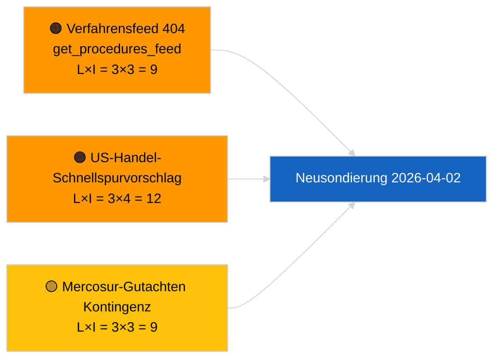
```mermaid
%%{init: {"theme":"dark"}}%%
graph LR
    R1["🟠 Verfahrensfeed 404<br/>get_procedures_feed<br/>L×I = 3×3 = 9"] --> CONS["Neusondierung 2026-04-02"]
    R2["🟠 US-Handel-Schnellspurvorschlag<br/>L×I = 3×4 = 12"] --> CONS
    R3["🟡 Mercosur-Gutachten Kontingenz<br/>L×I = 3×3 = 9"] --> CONS
    style R1 fill:#FF9800,color:#000000
    style R2 fill:#FF9800,color:#000000
    style R3 fill:#FFC107,color:#000000
    style CONS fill:#1565C0,color:#FFFFFF
```

| Risiko | L | I | Wertung | Auslöser | Quelle | Admiralty |
|--------|:-:|:-:|:-------:|----------|--------|:---------:|
| `get_procedures_feed`-Zuverlässigkeit | 3 | 3 | 9 | Anhaltender 404 | Schwesterbericht breaking | B2 |
| US-Handel-Schnellspurvorschlag | 3 | 4 | 12 | US-Maßnahme löst Kommissionstabellieru ng aus | TA-10-2026-0096 | A1 |
| Mercosur-Gutachten Kontingenz | 3 | 3 | 9 | Gericht veröffentlicht | TA-10-2026-0008 | A2 |
| MFF-Vorbereitungsreibung | 3 | 4 | 12 | Q2-Kommissionsmitteilung | Kommissionskadenz | B2 |

---

### 🔮 Wichtigster Vorausauslöser

**Kommissionsdienstagssitzungszyklus wird am 7. April 2026 wieder aufgenommen.** Erste Post-Oster-Kommissionsvorschläge werden typischerweise beim frühen April-Kollegiumstreffen tabelliert; der thematische Mix (Verteidigung/Digital/Handel/Klima) kalibriert die Q2-Vorschlagsbeobachtungsliste.

---

### 🛡️ Quellqualitätsbewertung

- **Primärquellen:** EP-Datenportal — Analyselauf `4cf3b11a-f38e-4a3c-a81c-5c73d6eb8adc` und Externe-Dokumente-Inventar für März.
- **Datenbeschränkungen:** `get_procedures_feed` 404 am 2026-04-01 verhindert unabhängige Bestätigung von „heute keine neuen Verfahren eröffnet".
- **Konfidenz für kalenderbedingte Inaktivität:** 🟢 HOCH.

---

### 📎 Links

| Link | Pfad |
|------|------|
| Artikel | `./article.md` |
| Klassifizierung (leer) | `./classification/` |
| Schwesterkäufe | `analysis/daily/2026-04-01/breaking/`, `committee-reports/`, `month-ahead/`, `motions/` |
| Manifest | `./manifest.json` |

---

### 🔄 Querverweis

**Gleichzeitige leere Vorlagenläufe:** breaking, committee-reports, month-ahead, motions für 2026-04-01 zeigen alle identischen Leerzustand — bestätigt systemweite Pause- + Feed-API-Bedingungen, keine vorschlagsspezifische Regression.

---

**Dokumentenkontrolle**
- **Vorlage:** `/analysis/templates/executive-brief.md`
- **Artefaktpfad:** `analysis/daily/2026-04-01/propositions/executive-brief.md`
- **Klassifizierung:** Öffentlich
- **Retrospektive Erstellung:** Rückwirkende Auffüllsitzung.

### Executive Brief Es

### 🎯 BLUF

**No se indexaron nuevas propuestas de la Comisión ni expedientes de iniciativa propia del PE el 2026-04-01.** La ejecución de análisis `4cf3b11a-f38e-4a3c-a81c-5c73d6eb8adc` devolvió **0 actores clasificados** y significación **RUTINARIA** en todas las dimensiones. El receso intersesional del PE (27 de marzo → 26 de abril) y el error `get_procedures_feed` 404 simultáneo (documentado en la ejecución paralela de últimas noticias) explican el vacío de datos. La base sustantiva de proposiciones es, por tanto, la canalización heredada: marco de créditos de emisiones HDV 2025–2029 (TA-10-2026-0084), procedimiento del vicepresidente del BCE (TA-10-2026-0060), informe de mejora legislativa (TA-10-2026-0063) y la remisión pendiente EU-Mercosur ante el Tribunal de Justicia (TA-10-2026-0008). **🟢 ALTA confianza** en que el estado vacío es consecuencia del calendario y la disponibilidad del flujo, no de una regresión de la canalización.

---

### 🧭 3 Decisiones que apoya este resumen

| # | Decisión | Responsable | Plazo | Evidencia |
|:-:|----------|------------|:-----:|-----------|
| 1 | **Editorial:** OMITIR proposiciones diarias; posponer a la próxima sesión activa | Editor | +24h | Salida de ejecución vacía |
| 2 | **Supervisión:** verificar el estado de `get_procedures_feed` en el próximo ciclo | Tubería de datos | 2026-04-02 | 404 el 2026-04-01 |
| 3 | **Vigilancia prospectiva:** rastrear las comunicaciones semanales de abril de la Comisión para nuevas propuestas | Responsable de análisis | 2026-04-13 | Cadencia de tabulación de la Comisión |

---

### 📰 Lectura de 60 segundos

- 🔴 **No se abrieron nuevos procedimientos** el 2026-04-01; `get_procedures_feed` 404 en ejecución paralela. (🟡 Medio — la disponibilidad del punto final es la salvedad)
- 🟠 **0 actores clasificados**; ningún comisario, DG ni ponente identificado. (🟢 Alto)
- 🟢 **Traslado de canalización** — emisiones HDV, vicepresidente BCE, mejora legislativa, remisión Mercosur siguen siendo el inventario activo de proposiciones en abril. (🟢 Alto)
- 🟡 **Todas las dimensiones de riesgo "ninguna"** — ningún riesgo agudo en la fase de proposiciones marcado hoy. (🟢 Alto)
- 🔵 **Contexto económico:** las propuestas de la Comisión T2 previstas sobre reglamentos de ejecución de la Ley de IA, la Estrategia Industrial de Defensa y las comunicaciones preparatorias del MFF siguen en la lista de seguimiento. (🟡 Medio — cadencia de tabulación de la Comisión)
- 🟣 **Referencia cruzada:** el informe paralelo 2026-04-01/breaking documenta el patrón 6/8 de flujos consultivos 404. (🟢 Alto)
- 🩷 **Vector de perturbación:** la presión comercial de EE. UU. podría forzar una propuesta de vía rápida de la Comisión en abril. (🟡 Medio)
- ⚪ **Traslado:** la opinión del TJUE sobre Mercosur es el desencadenante pendiente de mayor impacto en proposiciones.

---

### 🗂️ Principales documentos / procedimientos — Seguimiento de proposiciones

| Rango | Referencia PE | Título (abreviado) | Importancia | Confianza | Estado |
|:-----:|---------------|-------------------|:-----------:|:---------:|--------|
| 1 | — | No hay nuevas proposiciones el 2026-04-01 | 0,0 | 🟢 ALTA | Receso + flujo 404 |
| 2 | TA-10-2026-0008 | Remisión EU-Mercosur ante el TJUE (pendiente) | 8,0 | 🟡 MEDIA | Opinión del Tribunal esperada |
| 3 | TA-10-2026-0084 | Créditos de emisiones HDV 2025–2029 | 7,0 | 🟢 ALTA | Canalización de transposición |
| 4 | TA-10-2026-0063 | Mejora legislativa (base regulatoria) | 6,0 | 🟢 ALTA | Marco transversal |

---

### ⚠️ Instantánea de riesgos y amenazas

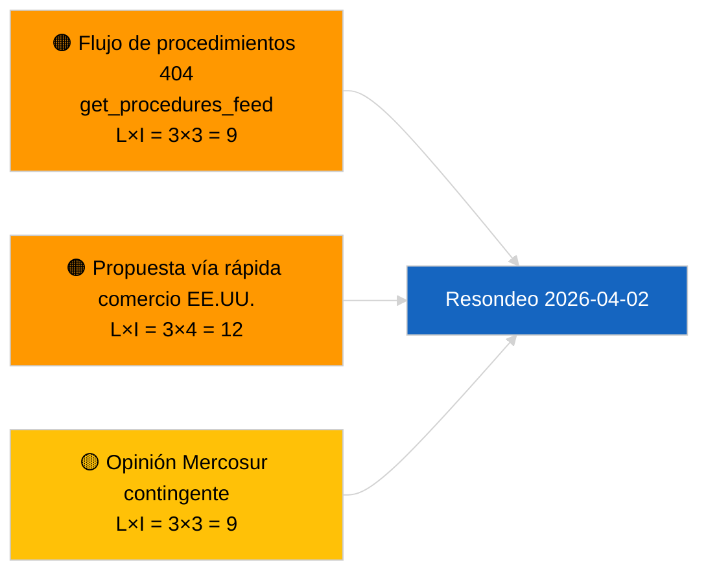
```mermaid
%%{init: {"theme":"dark"}}%%
graph LR
    R1["🟠 Flujo de procedimientos 404<br/>get_procedures_feed<br/>L×I = 3×3 = 9"] --> CONS["Resondeo 2026-04-02"]
    R2["🟠 Propuesta vía rápida comercio EE.UU.<br/>L×I = 3×4 = 12"] --> CONS
    R3["🟡 Opinión Mercosur contingente<br/>L×I = 3×3 = 9"] --> CONS
    style R1 fill:#FF9800,color:#000000
    style R2 fill:#FF9800,color:#000000
    style R3 fill:#FFC107,color:#000000
    style CONS fill:#1565C0,color:#FFFFFF
```

| Riesgo | L | I | Puntuación | Desencadenante | Fuente | Admiralty |
|--------|:-:|:-:|:----------:|----------------|--------|:---------:|
| Fiabilidad `get_procedures_feed` | 3 | 3 | 9 | 404 persistente | Informe sœur breaking | B2 |
| Propuesta vía rápida comercio EE.UU. | 3 | 4 | 12 | Acción EE.UU. activa tabulación Comisión | TA-10-2026-0096 | A1 |
| Opinión Mercosur contingente | 3 | 3 | 9 | Tribunal publica | TA-10-2026-0008 | A2 |
| Fricción preparatoria MFF | 3 | 4 | 12 | Comunicación Comisión T2 | Cadencia Comisión | B2 |

---

### 🔮 Principal desencadenante prospectivo

**El ciclo de reuniones de los martes de la Comisión se reanuda el 7 de abril de 2026.** Las primeras propuestas post-Semana Santa de la Comisión se suelen tabular en la reunión del Colegio de principios de abril; el mix temático (defensa/digital/comercio/clima) calibra la lista de seguimiento de proposiciones del T2.

---

### 🛡️ Evaluación de la calidad de las fuentes

- **Fuentes primarias:** Portal de datos abiertos del PE — ejecución de análisis `4cf3b11a-f38e-4a3c-a81c-5c73d6eb8adc` e inventario de documentos externos de marzo.
- **Limitaciones de datos:** `get_procedures_feed` 404 el 2026-04-01 impide la corroboración independiente de "no se abrieron nuevos procedimientos hoy".
- **Confianza en la inactividad por motivos de calendario:** 🟢 ALTA.

---

### 📎 Enlaces

| Enlace | Ruta |
|--------|------|
| Artículo | `./article.md` |
| Clasificación (vacía) | `./classification/` |
| Ejecuciones hermanas | `analysis/daily/2026-04-01/breaking/`, `committee-reports/`, `month-ahead/`, `motions/` |
| Manifiesto | `./manifest.json` |

---

### 🔄 Referencia cruzada

**Ejecuciones de plantillas vacías simultáneas:** breaking, committee-reports, month-ahead, motions del 2026-04-01 muestran todas un estado vacío idéntico — confirma condiciones de receso a nivel de sistema + API de flujo, sin regresión específica de proposiciones.

---

**Control del documento**
- **Plantilla:** `/analysis/templates/executive-brief.md`
- **Ruta del artefacto:** `analysis/daily/2026-04-01/propositions/executive-brief.md`
- **Clasificación:** Pública
- **Generación retrospectiva:** Sesión de relleno retroactivo.

### Executive Brief Fi

### 🎯 BLUF

**Uusia komission ehdotuksia tai EP:n omia aloitekäsittelyjä ei indeksoitu 2026-04-01.** Analyysiajoitus `4cf3b11a-f38e-4a3c-a81c-5c73d6eb8adc` palautti **0 luokiteltua toimijaa** ja **RUTIINITASON** merkityksen kaikissa ulottuvuuksissa. EP:n istuntojen välinen tauko (27. maaliskuuta → 26. huhtikuuta) ja samanaikainen `get_procedures_feed` 404-virhe (dokumentoitu rinnakkaisessa breaking-ajossa) selittävät datavajeen. Substantiaalinen ehdotusten peruslinja on siksi peritty putkisto: HDV-päästöhyvitykset 2025–2029-kehys (TA-10-2026-0084), EKP:n varapuheenjohtajamenettely (TA-10-2026-0060), paremman lainsäädännön raportti (TA-10-2026-0063) ja käynnissä oleva EU:n ja Mercosur-maiden tuomioistuinviittaus (TA-10-2026-0008). **🟢 KORKEA luotettavuus** siitä, että tyhjä tila johtuu kalenterista ja syötteiden saatavuudesta, ei putkiston regressiosta.

---

### 🧭 3 Päätöstä, joita tämä yhteenveto tukee

| # | Päätös | Päätöksentekijä | Määräaika | Näyttö |
|:-:|--------|----------------|:---------:|--------|
| 1 | **Toimituksellinen:** OHITA päivittäiset ehdotukset; lykkää seuraavaan aktiiviseen istuntoon | Toimittaja | +24h | Tyhjä ajotulos |
| 2 | **Seuranta:** varmista `get_procedures_feed`-terveys seuraavalla syklillä | Dataputkisto | 2026-04-02 | 404 päivänä 2026-04-01 |
| 3 | **Eteenpäin katsova seuranta:** seuraa komission huhtikuun viikkotiedotteita uusien ehdotusten varalta | Analyysipäällikkö | 2026-04-13 | Komission taulukointi-kadenssi |

---

### 📰 60 sekunnin lukeminen

- 🔴 **Uusia menettelyjä ei avattu** 2026-04-01; `get_procedures_feed` 404 rinnakkaisajossa. (🟡 Keskitaso — päätepisteiden saatavuus on varaus)
- 🟠 **0 toimijaa luokiteltu**; yhtään komissaaria, pääosastoa tai esittelijää ei tunnistettu. (🟢 Korkea)
- 🟢 **Putkiston siirtymä** — HDV-päästöt, EKP:n varapuheenjohtaja, parempi lainsäädäntö, Mercosur-viittaus pysyvät aktiivisena ehdotusten varastona huhtikuulle. (🟢 Korkea)
- 🟡 **Kaikki riskin ulottuvuudet "ei mitään"** — yhtään akuuttia ehdotusvaiheen riskiä ei merkitty tänään. (🟢 Korkea)
- 🔵 **Taloudellinen konteksti:** odotetut komission 2. neljänneksen ehdotukset tekoälylain täytäntöönpanosäädöksistä, puolustusteollisuuden strategiasta ja MFF-valmisteluviesteistä pysyvät seurantalistalla. (🟡 Keskitaso — komission taulukointi-kadenssi)
- 🟣 **Ristiviittaus:** sisarjulkaisu 2026-04-01/breaking dokumentoi 6/8 neuvoa-antavien syötteiden 404-mallin. (🟢 Korkea)
- 🩷 **Häiriövektori:** yhdysvaltalainen kauppapaine voi pakottaa komission pikakäsittely-ehdotuksen huhtikuussa. (🟡 Keskitaso)
- ⚪ **Siirtymä:** Mercosur EYT-lausunto on korkein vaikutteinen odottava ehdotusten käynnistin.

---

### 🗂️ Huippuasiakirjat / menettelyt — Ehdotusten seuranta

| Sija | EP-viite | Otsikko (lyhyt) | Merkitys | Luotettavuus | Tila |
|:----:|----------|-----------------|:--------:|:------------:|------|
| 1 | — | Ei uusia ehdotuksia 2026-04-01 | 0,0 | 🟢 KORKEA | Tauko + syöte 404 |
| 2 | TA-10-2026-0008 | EU:n ja Mercosur-maiden EYT-viittaus (odottava) | 8,0 | 🟡 KESKITASO | Tuomioistuinlausunto odotetaan |
| 3 | TA-10-2026-0084 | HDV-päästöhyvitykset 2025–2029 | 7,0 | 🟢 KORKEA | Täytäntöönpanoputkisto |
| 4 | TA-10-2026-0063 | Parempi lainsäädäntö (sääntelypohja) | 6,0 | 🟢 KORKEA | Läpileikkaava kehys |

---

### ⚠️ Riski- ja uhka-arvio

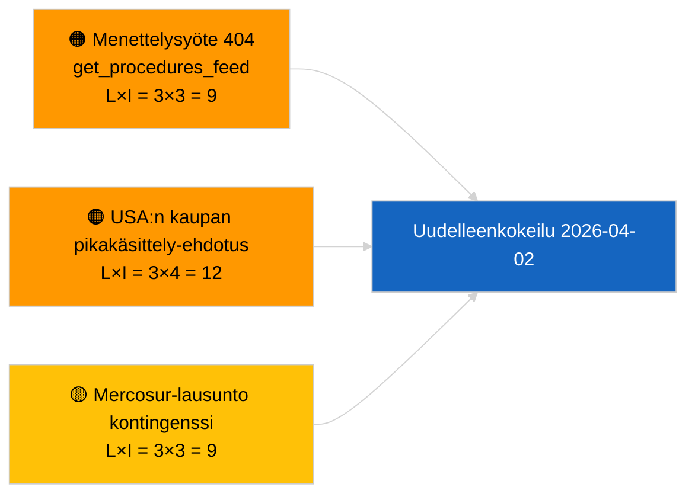
```mermaid
%%{init: {"theme":"dark"}}%%
graph LR
    R1["🟠 Menettelysyöte 404<br/>get_procedures_feed<br/>L×I = 3×3 = 9"] --> CONS["Uudelleenkokeilu 2026-04-02"]
    R2["🟠 USA:n kaupan pikakäsittely-ehdotus<br/>L×I = 3×4 = 12"] --> CONS
    R3["🟡 Mercosur-lausunto kontingenssi<br/>L×I = 3×3 = 9"] --> CONS
    style R1 fill:#FF9800,color:#000000
    style R2 fill:#FF9800,color:#000000
    style R3 fill:#FFC107,color:#000000
    style CONS fill:#1565C0,color:#FFFFFF
```

| Riski | L | I | Pistemäärä | Käynnistin | Lähde | Admiralty |
|-------|:-:|:-:|:----------:|------------|-------|:---------:|
| `get_procedures_feed`-luotettavuus | 3 | 3 | 9 | Jatkuva 404 | Sisarjulkaisu breaking-ajo | B2 |
| USA:n kaupan pikakäsittely-ehdotus | 3 | 4 | 12 | USA:n toimet käynnistävät komission taulukoinnin | TA-10-2026-0096 | A1 |
| Mercosur-lausunto kontingenssi | 3 | 3 | 9 | Tuomioistuin julkaisee | TA-10-2026-0008 | A2 |
| MFF-valmistelun kitka | 3 | 4 | 12 | 2. neljänneksen komission tiedote | Komission kadenssi | B2 |

---

### 🔮 Tärkein eteenpäin katsova käynnistin

**Komission tiistaikokousten sykli jatkuu 7. huhtikuuta 2026.** Ensimmäiset pääsiäisen jälkeiset komission ehdotukset taulukoidaan tyypillisesti huhtikuun alussa pidettävässä kollegiokokouksessa; aihejakauma (puolustus/digitaalisuus/kauppa/ilmasto) kalibroi 2. neljänneksen ehdotusten seurantalistan.

---

### 🛡️ Lähdekvaliteettiarvio

- **Ensisijaiset lähteet:** EP:n avoin dataportti — analyysiajoitus `4cf3b11a-f38e-4a3c-a81c-5c73d6eb8adc` ja ulkoisten asiakirjojen varasto maaliskuulta.
- **Datarajoitukset:** `get_procedures_feed` 404 päivänä 2026-04-01 estää riippumattoman vahvistuksen "uusia menettelyjä ei avattu tänään".
- **Luotettavuus kalenteriohjatusta passiivisuudesta:** 🟢 KORKEA.

---

### 📎 Linkit

| Linkki | Polku |
|--------|-------|
| Artikkeli | `./article.md` |
| Luokitus (tyhjä) | `./classification/` |
| Sisarajot | `analysis/daily/2026-04-01/breaking/`, `committee-reports/`, `month-ahead/`, `motions/` |
| Manifesti | `./manifest.json` |

---

### 🔄 Ristiviittaus

**Samanaikaiset tyhjät malliajoitukset:** breaking, committee-reports, month-ahead, motions 2026-04-01 osoittavat kaikki identtisen tyhjän tilan — vahvistaa järjestelmänlaajuiset tauko- ja syöte-API-olosuhteet, ei ehdotuskohtaista regressiota.

---

**Asiakirjan hallinta**
- **Malli:** `/analysis/templates/executive-brief.md`
- **Artefaktipolku:** `analysis/daily/2026-04-01/propositions/executive-brief.md`
- **Luokitus:** Julkinen
- **Takautuva luonti:** Täyttöistunto.

### Executive Brief Fr

### 🎯 BLUF

**Aucune nouvelle proposition de la Commission ni dossier d'initiative propre du PE n'a été indexé le 2026-04-01.** La session d'analyse `4cf3b11a-f38e-4a3c-a81c-5c73d6eb8adc` a renvoyé **0 acteur classifié** et un niveau de signification **ROUTINIER** dans toutes les dimensions. La session intersessionnelle du PE (27 mars → 26 avril) et l'erreur `get_procedures_feed` 404 simultanée (consignée dans l'exécution sœur relative aux informations en cours) expliquent le vide de données. La base substantielle des propositions est donc la pipeline héritée : cadre de crédits d'émissions HDV 2025–2029 (TA-10-2026-0084), procédure du vice-président de la BCE (TA-10-2026-0060), rapport Mieux légiférer (TA-10-2026-0063) et le renvoi en cours EU-Mercosur devant la Cour de justice (TA-10-2026-0008). **🟢 Confiance ÉLEVÉE** que l'état vide est lié au calendrier et à la disponibilité du flux, et non à une régression de la pipeline.

---

### 🧭 3 Décisions que cette synthèse soutient

| # | Décision | Décideur | Échéance | Éléments de preuve |
|:-:|----------|----------|:--------:|-------------------|
| 1 | **Éditorial :** IGNORER les propositions quotidiennes ; reporter à la prochaine session active | Éditeur | +24h | Sortie d'exécution vide |
| 2 | **Surveillance :** vérifier la santé de `get_procedures_feed` au prochain cycle | Pipeline de données | 2026-04-02 | 404 le 2026-04-01 |
| 3 | **Veille prospective :** suivre les communications hebdomadaires d'avril de la Commission pour de nouvelles propositions | Responsable analyse | 2026-04-13 | Cadence de tabellarisation de la Commission |

---

### 📰 Lecture de 60 secondes

- 🔴 **Aucune nouvelle procédure ouverte** le 2026-04-01 ; `get_procedures_feed` 404 lors de l'exécution parallèle. (🟡 Moyen — la disponibilité du point de terminaison est le caveat)
- 🟠 **0 acteur classifié** ; aucun commissaire, DG ou rapporteur identifié. (🟢 Élevé)
- 🟢 **Report de pipeline** — émissions HDV, vice-président BCE, Mieux légiférer, renvoi Mercosur constituent le stock actif de propositions entrant en avril. (🟢 Élevé)
- 🟡 **Toutes les dimensions de risque « aucune »** — aucun risque aigu au stade des propositions signalé aujourd'hui. (🟢 Élevé)
- 🔵 **Contexte économique :** les propositions attendues de la Commission au T2 concernant les règlements d'application de l'IA Act, la Stratégie industrielle de défense et les communications préparatoires au CFP restent dans la liste de surveillance. (🟡 Moyen — cadence de tabellarisation de la Commission)
- 🟣 **Référence croisée :** le rapport sœur 2026-04-01/breaking documente le schéma 6/8 flux consultatifs 404. (🟢 Élevé)
- 🩷 **Vecteur de perturbation :** la pression commerciale américaine pourrait forcer une proposition rapide de la Commission en avril. (🟡 Moyen)
- ⚪ **Report :** l'avis Mercosur de la CJE est le déclencheur de propositions en attente à impact le plus élevé.

---

### 🗂️ Principaux documents / procédures — Veille des propositions

| Rang | Référence PE | Titre (court) | Signification | Confiance | Statut |
|:----:|--------------|---------------|:-------------:|:---------:|--------|
| 1 | — | Aucune nouvelle proposition le 2026-04-01 | 0,0 | 🟢 ÉLEVÉE | Recess + flux 404 |
| 2 | TA-10-2026-0008 | Renvoi EU-Mercosur devant la CJE (en attente) | 8,0 | 🟡 MOYEN | Avis de la Cour attendu |
| 3 | TA-10-2026-0084 | Crédits d'émissions HDV 2025–2029 | 7,0 | 🟢 ÉLEVÉE | Pipeline de transposition |
| 4 | TA-10-2026-0063 | Mieux légiférer (base réglementaire) | 6,0 | 🟢 ÉLEVÉE | Cadre transversal |

---

### ⚠️ Tableau des risques et menaces

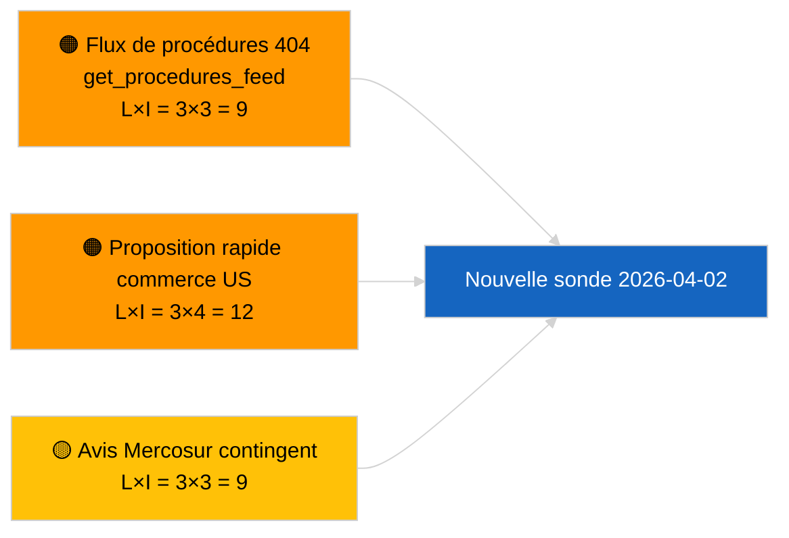
```mermaid
%%{init: {"theme":"dark"}}%%
graph LR
    R1["🟠 Flux de procédures 404<br/>get_procedures_feed<br/>L×I = 3×3 = 9"] --> CONS["Nouvelle sonde 2026-04-02"]
    R2["🟠 Proposition rapide commerce US<br/>L×I = 3×4 = 12"] --> CONS
    R3["🟡 Avis Mercosur contingent<br/>L×I = 3×3 = 9"] --> CONS
    style R1 fill:#FF9800,color:#000000
    style R2 fill:#FF9800,color:#000000
    style R3 fill:#FFC107,color:#000000
    style CONS fill:#1565C0,color:#FFFFFF
```

| Risque | L | I | Score | Déclencheur | Source | Admiralty |
|--------|:-:|:-:|:-----:|-------------|--------|:---------:|
| Fiabilité `get_procedures_feed` | 3 | 3 | 9 | 404 persistant | Rapport sœur breaking | B2 |
| Proposition rapide commerce US | 3 | 4 | 12 | Action US déclenche la tabellarisation Commission | TA-10-2026-0096 | A1 |
| Avis Mercosur contingent | 3 | 3 | 9 | La Cour publie | TA-10-2026-0008 | A2 |
| Friction préparatoire CFP | 3 | 4 | 12 | Communication Commission T2 | Cadence Commission | B2 |

---

### 🔮 Principal déclencheur prospectif

**Le cycle de réunions du mardi de la Commission reprend le 7 avril 2026.** Les premières propositions post-Pâques de la Commission sont généralement tabellarisées lors de la réunion du collège de début avril ; le mix thématique (défense/numérique/commerce/climat) calibre la liste de surveillance des propositions T2.

---

### 🛡️ Évaluation de la qualité des sources

- **Sources primaires :** Portail de données ouvert du PE — session d'analyse `4cf3b11a-f38e-4a3c-a81c-5c73d6eb8adc` et inventaire des documents externes pour mars.
- **Limites des données :** `get_procedures_feed` 404 le 2026-04-01 empêche la corroboration indépendante de « aucune nouvelle procédure ouverte aujourd'hui ».
- **Confiance pour l'inactivité due au calendrier :** 🟢 ÉLEVÉE.

---

### 📎 Liens

| Lien | Chemin |
|------|--------|
| Article | `./article.md` |
| Classification (vide) | `./classification/` |
| Exécutions sœurs | `analysis/daily/2026-04-01/breaking/`, `committee-reports/`, `month-ahead/`, `motions/` |
| Manifeste | `./manifest.json` |

---

### 🔄 Référence croisée

**Exécutions de modèles vides simultanées :** breaking, committee-reports, month-ahead, motions pour le 2026-04-01 affichent tous un état vide identique — confirme les conditions de recess à l'échelle du système + API de flux, pas de régression spécifique aux propositions.

---

**Contrôle du document**
- **Modèle :** `/analysis/templates/executive-brief.md`
- **Chemin d'artefact :** `analysis/daily/2026-04-01/propositions/executive-brief.md`
- **Classification :** Publique
- **Génération rétrospective :** Session de remplissage rétroactif.

### Executive Brief He

**סיווג:** OSINT | רשומה פרלמנטרית ציבורית
**רמת אמינות:** 🟢 גבוהה (הערכה מבנית בתקופת הפגרה)
**נוצר:** 2026-04-01T00:00:00Z (תקציר רטרואקטיבי)
**סוג המאמר:** הצעות
**מזהה ריצה:** `4cf3b11a-f38e-4a3c-a81c-5c73d6eb8adc`
**מקור:** פורטל הנתונים הפתוח של הפרלמנט האירופי

---

### 🎯 BLUF

**לא נוספו הצעות חדשות של הנציבות או תיקים ביוזמה עצמאית של הפרלמנט האירופי בתאריך 2026-04-01.** ריצת הניתוח `4cf3b11a-f38e-4a3c-a81c-5c73d6eb8adc` החזירה **0 שחקנים מסווגים** ומשמעות **שגרתית** בכל הממדים. פגרת הפרלמנט בין-מושבית (27 במרץ → 26 באפריל) והשגיאה המקבילה `get_procedures_feed` 404 (מתועדת בדוח האחים על חדשות שוטפות) מסבירים את ריק הנתונים. בסיס ההצעות המהותי הוא לפיכך הצינור הירוש: מסגרת זיכויי פליטות רכבים כבדים 2025–2029 (TA-10-2026-0084), הליך סגן נשיא הבנק המרכזי האירופי (TA-10-2026-0060), דוח חקיקה טובה יותר (TA-10-2026-0063) והפנייה הפעילה לבית המשפט EU-Mercosur (TA-10-2026-0008). **🟢 אמינות גבוהה** שהמצב הריק נובע מלוח זמנים ותפקוד הזרם, לא מנסיגה בצינור.

---

### 🧭 3 החלטות שתקציר זה תומך בהן

| # | החלטה | מקבל ההחלטה | מועד אחרון | ראיות |
|:-:|-------|------------|:-----------:|------|
| 1 | **עריכה:** דלג על הצעות יומיות; דחה למושב הפעיל הבא | עורך | +24 שעות | פלט ריצה ריק |
| 2 | **ניטור:** אמת את תקינות `get_procedures_feed` במחזור הבא | צינור נתונים | 2026-04-02 | 404 ב-2026-04-01 |
| 3 | **מעקב צופה פני עתיד:** עקוב אחר תקשורת שבוע אפריל של הנציבות להצעות חדשות | ראש ניתוח | 2026-04-13 | קצב הטבלה של הנציבות |

---

### 📰 קריאה של 60 שניות

- 🔴 **לא נפתחו הליכים חדשים** ב-2026-04-01; `get_procedures_feed` 404 בריצה מקבילה. (🟡 בינוני — זמינות נקודת הקצה היא ההסתייגות)
- 🟠 **0 שחקנים מסווגים**; לא זוהו נציב, מנכ"ל או מדווח. (🟢 גבוה)
- 🟢 **העברת צינור** — פליטות רכבים כבדים, סגן נשיא הבנק המרכזי האירופי, חקיקה טובה יותר, הפנייה Mercosur נשארים המלאי הפעיל של ההצעות לאפריל. (🟢 גבוה)
- 🟡 **כל ממדי הסיכון "אין"** — לא סומן סיכון חריף בשלב ההצעות היום. (🟢 גבוה)
- 🔵 **הקשר כלכלי:** הצעות רבעון 2 הצפויות של הנציבות לגבי תקנות יישום חוק הבינה המלאכותית, אסטרטגיית התעשייה הביטחונית ותקשורת ההכנה ל-MFF נותרות ברשימת המעקב. (🟡 בינוני — קצב הטבלה של הנציבות)
- 🟣 **הפניה צולבת:** הדוח האחים 2026-04-01/breaking מתעד את תבנית 6/8 של זרמי 404 ייעוציים. (🟢 גבוה)
- 🩷 **וקטור שיבוש:** לחץ סחר אמריקאי עלול לאלץ הצעה במסלול מהיר מהנציבות באפריל. (🟡 בינוני)
- ⚪ **העברה:** חוות דעת בית המשפט האירופי בנושא Mercosur היא ה-Trigger המצפה בעל ההשפעה הגבוהה ביותר על ההצעות.

---

### 🗂️ מסמכים מובילים / הליכים — מעקב הצעות

| דירוג | אסמכתא לפרלמנט | כותרת (קצרה) | חשיבות | אמינות | סטטוס |
|:------:|----------------|--------------|:------:|:------:|-------|
| 1 | — | אין הצעות חדשות ב-2026-04-01 | 0.0 | 🟢 גבוהה | פגרה + זרם 404 |
| 2 | TA-10-2026-0008 | הפנייה EU-Mercosur לבית המשפט (ממתינה) | 8.0 | 🟡 בינונית | חוות דעת המשפט מצופה |
| 3 | TA-10-2026-0084 | זיכויי פליטות רכבים כבדים 2025–2029 | 7.0 | 🟢 גבוהה | צינור טרנספוזיציה |
| 4 | TA-10-2026-0063 | חקיקה טובה יותר (בסיס רגולטורי) | 6.0 | 🟢 גבוהה | מסגרת חוצת-נושאים |

---

### ⚠️ תמונת מצב סיכונים ואיומים

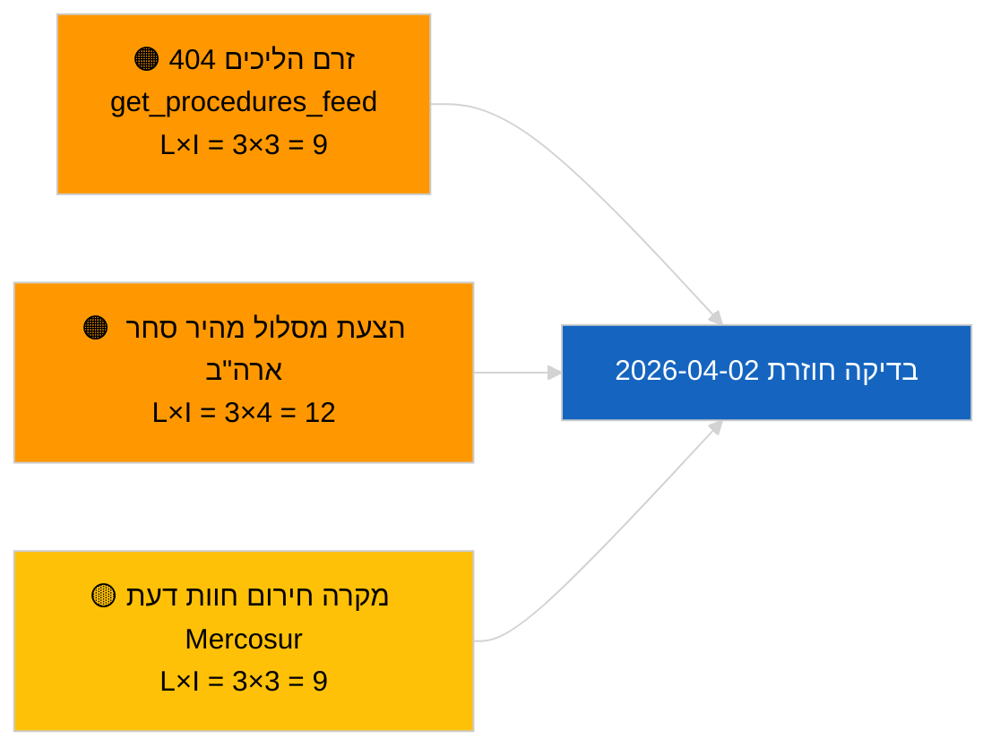
```mermaid
%%{init: {"theme":"dark"}}%%
graph LR
    R1["🟠 זרם הליכים 404<br/>get_procedures_feed<br/>L×I = 3×3 = 9"] --> CONS["בדיקה חוזרת 2026-04-02"]
    R2["🟠 הצעת מסלול מהיר סחר ארה&quot;ב<br/>L×I = 3×4 = 12"] --> CONS
    R3["🟡 מקרה חירום חוות דעת Mercosur<br/>L×I = 3×3 = 9"] --> CONS
    style R1 fill:#FF9800,color:#000000
    style R2 fill:#FF9800,color:#000000
    style R3 fill:#FFC107,color:#000000
    style CONS fill:#1565C0,color:#FFFFFF
```

| סיכון | L | I | ציון | טריגר | מקור | Admiralty |
|------|:-:|:-:|:----:|-------|------|:---------:|
| אמינות `get_procedures_feed` | 3 | 3 | 9 | 404 מתמשך | דוח אחים breaking | B2 |
| הצעת מסלול מהיר סחר ארה"ב | 3 | 4 | 12 | פעולה אמריקאית מפעילה טבלה של הנציבות | TA-10-2026-0096 | A1 |
| מקרה חירום חוות דעת Mercosur | 3 | 3 | 9 | בית המשפט פרסם | TA-10-2026-0008 | A2 |
| חיכוך הכנה ל-MFF | 3 | 4 | 12 | תקשורת נציבות רבעון 2 | קצב הנציבות | B2 |

---

### 🔮 הטריגר העתידי הראשי

**מחזור ישיבות יום שלישי של הנציבות מתחדש ב-7 באפריל 2026.** ההצעות הראשונות של הנציבות לאחר חג הפסחא מוטבלות בדרך כלל בישיבת הקולגיום של תחילת אפריל; המיקס הנושאי (ביטחון/דיגיטלי/סחר/אקלים) מכייל את רשימת מעקב הצעות רבעון 2.

---

### 🛡️ הערכת איכות המקורות

- **מקורות ראשוניים:** פורטל הנתונים הפתוח של הפרלמנט האירופי — ריצת ניתוח `4cf3b11a-f38e-4a3c-a81c-5c73d6eb8adc` ומלאי מסמכים חיצוניים לחודש מרץ.
- **מגבלות נתונים:** `get_procedures_feed` 404 ב-2026-04-01 מונע אימות עצמאי של "לא נפתחו הליכים חדשים היום".
- **אמינות לחוסר פעילות מונע לוח זמנים:** 🟢 גבוהה.

---

### 📎 קישורים

| קישור | נתיב |
|-------|------|
| מאמר | `./article.md` |
| סיווג (ריק) | `./classification/` |
| ריצות אחים | `analysis/daily/2026-04-01/breaking/`, `committee-reports/`, `month-ahead/`, `motions/` |
| מניפסט | `./manifest.json` |

---

### 🔄 הפניה צולבת

**ריצות תבנית ריקות בו-זמניות:** breaking, committee-reports, month-ahead, motions ל-2026-04-01 כולן מציגות מצב ריק זהה — מאשש תנאי פגרה ו-API זרם ברמת המערכת, לא נסיגה ספציפית להצעות.

---

**בקרת מסמכים**
- **תבנית:** `/analysis/templates/executive-brief.md`
- **נתיב תוצר:** `analysis/daily/2026-04-01/propositions/executive-brief.md`
- **סיווג:** ציבורי
- **יצירה רטרואקטיבית:** מושב מילוי לאחור.

### Executive Brief Ja

**分類：** OSINT | 公開議会記録
**信頼度：** 🟢 高（休会期間の構造的評価）
**作成日：** 2026-04-01T00:00:00Z（遡及ブリーフ）
**記事種別：** 提案
**実行ID：** `4cf3b11a-f38e-4a3c-a81c-5c73d6eb8adc`
**出典：** 欧州議会オープンデータポータル

---

### 🎯 BLUF

**2026-04-01 付けで欧州委員会の新規提案および欧州議会独自イニシアティブ案件はインデックスされませんでした。** 分析実行 `4cf3b11a-f38e-4a3c-a81c-5c73d6eb8adc` は**分類済み主体 0 件**、全次元にわたる**定型的（ROUTINE）**重要度を返しました。欧州議会の会期間休会（3月27日→4月26日）および並行実行中の `get_procedures_feed` 404 エラー（関連する速報実行に記録済み）がデータ空白を説明しています。したがって、実質的な提案ベースラインは引き継がれたパイプライン、すなわち HDV 排出クレジット 2025–2029 フレームワーク（TA-10-2026-0084）、ECB 副総裁手続き（TA-10-2026-0060）、より良い法律作りレポート（TA-10-2026-0063）、および進行中の EU-メルコスール欧州司法裁判所付託（TA-10-2026-0008）です。空の状態がカレンダーとフィード可用性に起因し、パイプライン後退ではないことについての**🟢 高い信頼度**があります。

---

### 🧭 このブリーフが支援する 3 つの意思決定

| # | 意思決定 | 決定者 | 期限 | 根拠 |
|:-:|---------|-------|:----:|------|
| 1 | **編集：** 日次提案をスキップ；次の活動会期まで延期 | 編集者 | +24時間 | 空の実行出力 |
| 2 | **監視：** 次サイクルで `get_procedures_feed` の健全性を検証 | データパイプライン | 2026-04-02 | 2026-04-01 の 404 |
| 3 | **前向き監視：** 新提案について欧州委員会の4月週次通信を追跡 | 分析リード | 2026-04-13 | 欧州委員会の提出ケイデンス |

---

### 📰 60 秒の要約

- 🔴 **2026-04-01 に新規手続き開始なし**；並行実行で `get_procedures_feed` 404 発生。（🟡 中 — エンドポイント可用性が注意事項）
- 🟠 **分類済み主体 0 件**；委員、DG、報告者いずれも特定されず。（🟢 高）
- 🟢 **パイプライン持ち越し** — HDV 排出、ECB 副総裁、より良い法律作り、メルコスール付託は4月に向けたアクティブな提案在庫のまま。（🟢 高）
- 🟡 **すべてのリスク次元「なし」** — 本日、提案フェーズでの急性リスクなし。（🟢 高）
- 🔵 **経済的文脈：** AI 法実施規則、防衛産業戦略、MFF 準備通信に関する欧州委員会 Q2 提案（予定）はウォッチリストに残存。（🟡 中 — 欧州委員会の提出ケイデンス）
- 🟣 **クロスリファレンス：** 関連レポート 2026-04-01/breaking が 6/8 の諮問フィード 404 パターンを記録。（🟢 高）
- 🩷 **混乱ベクター：** 米国の貿易圧力が4月中に欧州委員会の迅速提案を強制する可能性あり。（🟡 中）
- ⚪ **持ち越し：** メルコスール欧州司法裁判所意見書は最も影響の大きい保留中の提案トリガー。

---

### 🗂️ 主要文書 / 手続き — 提案ウォッチ

| 順位 | EP 参照 | 表題（略称） | 重要度 | 信頼度 | 状況 |
|:---:|---------|------------|:-----:|:-----:|------|
| 1 | — | 2026-04-01 に新規提案なし | 0.0 | 🟢 高 | 休会＋フィード 404 |
| 2 | TA-10-2026-0008 | EU-メルコスール ECJ 付託（保留中） | 8.0 | 🟡 中 | 裁判所意見書待ち |
| 3 | TA-10-2026-0084 | HDV 排出クレジット 2025–2029 | 7.0 | 🟢 高 | 転置パイプライン |
| 4 | TA-10-2026-0063 | より良い法律作り（規制ベースライン） | 6.0 | 🟢 高 | 横断的フレームワーク |

---

### ⚠️ リスク・脅威スナップショット

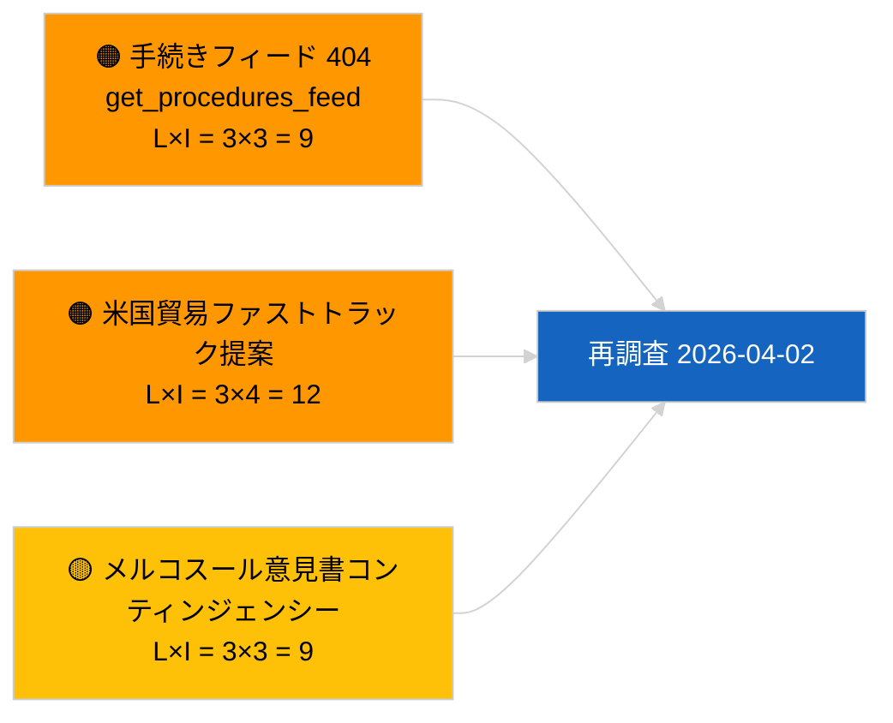
```mermaid
%%{init: {"theme":"dark"}}%%
graph LR
    R1["🟠 手続きフィード 404<br/>get_procedures_feed<br/>L×I = 3×3 = 9"] --> CONS["再調査 2026-04-02"]
    R2["🟠 米国貿易ファストトラック提案<br/>L×I = 3×4 = 12"] --> CONS
    R3["🟡 メルコスール意見書コンティンジェンシー<br/>L×I = 3×3 = 9"] --> CONS
    style R1 fill:#FF9800,color:#000000
    style R2 fill:#FF9800,color:#000000
    style R3 fill:#FFC107,color:#000000
    style CONS fill:#1565C0,color:#FFFFFF
```

| リスク | L | I | スコア | トリガー | 出典 | Admiralty |
|--------|:-:|:-:|:------:|---------|------|:---------:|
| `get_procedures_feed` 信頼性 | 3 | 3 | 9 | 持続的 404 | 関連速報実行 | B2 |
| 米国貿易ファストトラック提案 | 3 | 4 | 12 | 米国の行動が欧州委員会の提出を引き起こす | TA-10-2026-0096 | A1 |
| メルコスール意見書コンティンジェンシー | 3 | 3 | 9 | 裁判所が公表 | TA-10-2026-0008 | A2 |
| MFF 準備摩擦 | 3 | 4 | 12 | Q2 欧州委員会通信 | 欧州委員会ケイデンス | B2 |

---

### 🔮 主要な先行トリガー

**欧州委員会の火曜日会議サイクルが 2026年4月7日に再開。** 復活祭後最初の欧州委員会提案は通常4月上旬のコレジウム会議で提出される；テーマの組み合わせ（防衛/デジタル/貿易/気候）が Q2 提案ウォッチリストを較正する。

---

### 🛡️ 情報源品質評価

- **一次情報源：** 欧州議会オープンデータポータル — 分析実行 `4cf3b11a-f38e-4a3c-a81c-5c73d6eb8adc` と3月の外部文書在庫。
- **データ制限：** 2026-04-01 の `get_procedures_feed` 404 により「本日、新規手続き開始なし」の独立確認が不可能。
- **カレンダー起因の不活動に関する信頼度：** 🟢 高。

---

### 📎 リンク

| リンク | パス |
|--------|------|
| 記事 | `./article.md` |
| 分類（空） | `./classification/` |
| 関連実行 | `analysis/daily/2026-04-01/breaking/`, `committee-reports/`, `month-ahead/`, `motions/` |
| マニフェスト | `./manifest.json` |

---

### 🔄 クロスリファレンス

**同時発生の空テンプレート実行：** 2026-04-01 の breaking、committee-reports、month-ahead、motions はすべて同一の空の状態を示す — システム全体の休会＋フィード API 状況を確認、提案固有の後退ではない。

---

**文書管理**
- **テンプレート：** `/analysis/templates/executive-brief.md`
- **成果物パス：** `analysis/daily/2026-04-01/propositions/executive-brief.md`
- **分類：** 公開
- **遡及生成：** バックフィルセッション。

### Executive Brief Ko

**분류:** OSINT | 공개 의회 기록
**신뢰도:** 🟢 높음 (휴회 기간 구조적 평가)
**생성일:** 2026-04-01T00:00:00Z (소급 브리핑)
**기사 유형:** 제안
**실행 ID:** `4cf3b11a-f38e-4a3c-a81c-5c73d6eb8adc`
**출처:** 유럽의회 오픈 데이터 포털

---

### 🎯 BLUF

**2026-04-01 기준으로 새로운 집행위원회 제안 또는 유럽의회 자체 이니셔티브 파일이 인덱스되지 않았습니다.** 분석 실행 `4cf3b11a-f38e-4a3c-a81c-5c73d6eb8adc`는 **분류된 행위자 0명**, 모든 차원에서 **일상적(ROUTINE)** 중요도를 반환했습니다. 유럽의회 회기 간 휴회(3월 27일→4월 26일)와 동시 발생한 `get_procedures_feed` 404 오류(속보 병행 실행에 기록됨)가 데이터 공백을 설명합니다. 실질적인 제안 기준선은 따라서 승계된 파이프라인, 즉 HDV 배출 크레딧 2025–2029 프레임워크(TA-10-2026-0084), ECB 부총재 절차(TA-10-2026-0060), 더 나은 입법 보고서(TA-10-2026-0063), 진행 중인 EU-메르코수르 유럽사법재판소 회부(TA-10-2026-0008)입니다. 빈 상태가 달력 및 피드 가용성에 기인하며 파이프라인 회귀가 아니라는 **🟢 높은 신뢰도**가 있습니다.

---

### 🧭 이 브리핑이 지원하는 3가지 의사결정

| # | 결정 | 결정자 | 기한 | 근거 |
|:-:|------|-------|:----:|------|
| 1 | **편집:** 일일 제안 건너뜀; 다음 활성 회의까지 연기 | 편집자 | +24시간 | 빈 실행 출력 |
| 2 | **모니터링:** 다음 주기에 `get_procedures_feed` 상태 확인 | 데이터 파이프라인 | 2026-04-02 | 2026-04-01의 404 |
| 3 | **전향적 감시:** 새 제안에 대한 집행위원회 4월 주간 통신 추적 | 분석 리드 | 2026-04-13 | 집행위원회 상정 케이던스 |

---

### 📰 60초 요약

- 🔴 **2026-04-01에 새 절차 미개시**; 병행 실행에서 `get_procedures_feed` 404 발생. (🟡 중간 — 엔드포인트 가용성이 주의 사항)
- 🟠 **분류된 행위자 0명**; 집행위원, DG, 보고관 누구도 미파악. (🟢 높음)
- 🟢 **파이프라인 이월** — HDV 배출, ECB 부총재, 더 나은 입법, 메르코수르 회부가 4월 기준 활성 제안 재고로 유지. (🟢 높음)
- 🟡 **모든 위험 차원 "없음"** — 오늘 제안 단계의 급박한 위험 없음. (🟢 높음)
- 🔵 **경제적 맥락:** AI법 시행 규정, 방산 전략, MFF 준비 통신에 관한 집행위원회 2분기 제안(예정)이 감시 목록에 유지. (🟡 중간 — 집행위원회 상정 케이던스)
- 🟣 **교차 참조:** 자매 보고서 2026-04-01/breaking이 6/8 자문 피드 404 패턴을 기록. (🟢 높음)
- 🩷 **혼란 벡터:** 미국 무역 압력이 4월에 집행위원회 신속 제안을 강제할 수 있음. (🟡 중간)
- ⚪ **이월:** 메르코수르 ECJ 의견서는 영향력이 가장 높은 대기 중인 제안 트리거.

---

### 🗂️ 주요 문서 / 절차 — 제안 감시

| 순위 | EP 참조 | 제목 (약칭) | 중요도 | 신뢰도 | 상태 |
|:---:|---------|-----------|:-----:|:-----:|------|
| 1 | — | 2026-04-01에 새 제안 없음 | 0.0 | 🟢 높음 | 휴회＋피드 404 |
| 2 | TA-10-2026-0008 | EU-메르코수르 ECJ 회부 (대기 중) | 8.0 | 🟡 중간 | 재판소 의견서 대기 |
| 3 | TA-10-2026-0084 | HDV 배출 크레딧 2025–2029 | 7.0 | 🟢 높음 | 전치 파이프라인 |
| 4 | TA-10-2026-0063 | 더 나은 입법 (규제 기준선) | 6.0 | 🟢 높음 | 횡단적 프레임워크 |

---

### ⚠️ 위험·위협 스냅샷

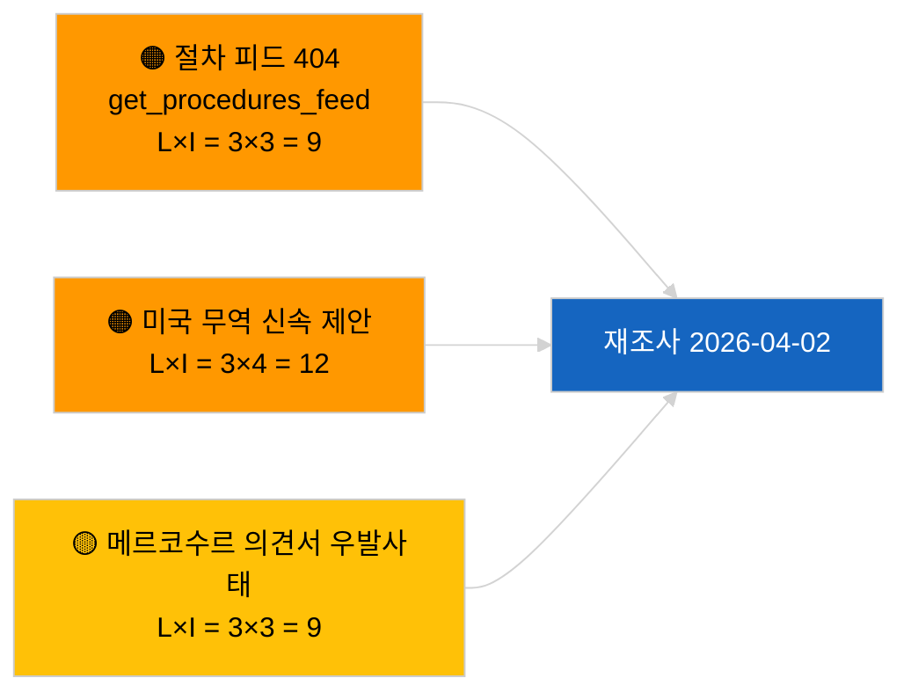
```mermaid
%%{init: {"theme":"dark"}}%%
graph LR
    R1["🟠 절차 피드 404<br/>get_procedures_feed<br/>L×I = 3×3 = 9"] --> CONS["재조사 2026-04-02"]
    R2["🟠 미국 무역 신속 제안<br/>L×I = 3×4 = 12"] --> CONS
    R3["🟡 메르코수르 의견서 우발사태<br/>L×I = 3×3 = 9"] --> CONS
    style R1 fill:#FF9800,color:#000000
    style R2 fill:#FF9800,color:#000000
    style R3 fill:#FFC107,color:#000000
    style CONS fill:#1565C0,color:#FFFFFF
```

| 위험 | L | I | 점수 | 트리거 | 출처 | Admiralty |
|-----|:-:|:-:|:---:|-------|------|:---------:|
| `get_procedures_feed` 신뢰성 | 3 | 3 | 9 | 지속적 404 | 자매 속보 실행 | B2 |
| 미국 무역 신속 제안 | 3 | 4 | 12 | 미국 조치가 집행위원회 상정 유발 | TA-10-2026-0096 | A1 |
| 메르코수르 의견서 우발사태 | 3 | 3 | 9 | 재판소 발표 | TA-10-2026-0008 | A2 |
| MFF 준비 마찰 | 3 | 4 | 12 | 2분기 집행위원회 통신 | 집행위원회 케이던스 | B2 |

---

### 🔮 주요 전향적 트리거

**집행위원회 화요일 회의 주기가 2026년 4월 7일 재개.** 부활절 이후 첫 집행위원회 제안은 통상 4월 초 대학 회의에서 상정됨; 주제 조합(방산/디지털/무역/기후)이 2분기 제안 감시 목록을 보정합니다.

---

### 🛡️ 출처 품질 평가

- **1차 출처:** 유럽의회 오픈 데이터 포털 — 분석 실행 `4cf3b11a-f38e-4a3c-a81c-5c73d6eb8adc`와 3월 외부 문서 목록.
- **데이터 한계:** 2026-04-01의 `get_procedures_feed` 404로 "오늘 새 절차 미개시"에 대한 독립 확인 불가.
- **달력 기인 비활성에 대한 신뢰도:** 🟢 높음.

---

### 📎 링크

| 링크 | 경로 |
|------|------|
| 기사 | `./article.md` |
| 분류 (비어 있음) | `./classification/` |
| 자매 실행 | `analysis/daily/2026-04-01/breaking/`, `committee-reports/`, `month-ahead/`, `motions/` |
| 매니페스트 | `./manifest.json` |

---

### 🔄 교차 참조

**동시 빈 템플릿 실행:** 2026-04-01의 breaking, committee-reports, month-ahead, motions 모두 동일한 빈 상태 표시 — 시스템 전반의 휴회＋피드 API 조건을 확인, 제안 특정 회귀 아님.

---

**문서 관리**
- **템플릿:** `/analysis/templates/executive-brief.md`
- **산출물 경로:** `analysis/daily/2026-04-01/propositions/executive-brief.md`
- **분류:** 공개
- **소급 생성:** 소급 채움 세션.

### Executive Brief Nl

### 🎯 BLUF

**Geen nieuwe Commissievoorstellen of EP-eigen-initiatiefbestanden geïndexeerd op 2026-04-01.** Analyserun `4cf3b11a-f38e-4a3c-a81c-5c73d6eb8adc` retourneerde **0 geclassificeerde actoren** en **ROUTINEMATIGE** betekenis in alle dimensies. Het intersessionele EP-reces (27 maart → 26 april) en de gelijktijdige `get_procedures_feed` 404-fout (gedocumenteerd in de nevenrun over nieuws) verklaren het datalek. De substantiële voorstellenbaseline is daarom de geërfde pijplijn: HDV-emissiekredieten 2025–2029-raamwerk (TA-10-2026-0084), ECB-vicepresident-procedure (TA-10-2026-0060), Beter wetgeven-rapport (TA-10-2026-0063) en de lopende EU-Mercosur-rechtbankverwijzing (TA-10-2026-0008). **🟢 HOGE betrouwbaarheid** dat de lege toestand kalender- en feed-beschikbaarheidsgedreven is, geen pipeline-regressie.

---

### 🧭 3 Beslissingen die dit overzicht ondersteunt

| # | Beslissing | Beslisser | Deadline | Bewijs |
|:-:|------------|----------|:--------:|--------|
| 1 | **Redactie:** SLAAG OVER dagelijkse voorstellen; uitstellen tot volgende actieve sessie | Redacteur | +24u | Lege runoutput |
| 2 | **Monitoring:** verifieer `get_procedures_feed`-gezondheid bij volgende cyclus | Datapijplijn | 2026-04-02 | 404 op 2026-04-01 |
| 3 | **Vooruitziende bewaking:** volg Commissie-april-weekcommunicaties op nieuwe voorstellen | Analyselead | 2026-04-13 | Commissie-tabelleringskadentie |

---

### 📰 60-secondenlezing

- 🔴 **Geen nieuwe procedures geopend** op 2026-04-01; `get_procedures_feed` 404 in parallelle run. (🟡 Gemiddeld — eindpunt-beschikbaarheid is het voorbehoud)
- 🟠 **0 actoren geclassificeerd**; geen commissaris, DG of rapporteur geïdentificeerd. (🟢 Hoog)
- 🟢 **Pijplijn-overdracht** — HDV-emissies, ECB-vicepresident, Beter wetgeven, Mercosur-verwijzing blijven de actieve voorraad voorstellen voor april. (🟢 Hoog)
- 🟡 **Alle risicondimensies "geen"** — geen acuut voorstellenfase-risico vandaag gemarkeerd. (🟢 Hoog)
- 🔵 **Economische context:** verwachte Commissie-Q2-voorstellen over AI-verordening-uitvoeringsbepalingen, Defensie-industriestrategie en MFF-voorbereidende communicaties blijven op de bewakingslijst. (🟡 Gemiddeld — Commissie-tabelleringskadentie)
- 🟣 **Kruisreferentie:** nevenrapport 2026-04-01/breaking documenteert het patroon 6/8 adviserende feeds 404. (🟢 Hoog)
- 🩷 **Verstoringsvector:** US-handelsdruk kan een snelspoor-Commissievoorstel in april forceren. (🟡 Gemiddeld)
- ⚪ **Overdracht:** Mercosur ECJ-advies is de hoogst-impact wachtende voorstellen-trigger.

---

### 🗂️ Topdocumenten / procedures — Voorstellenbewaking

| Rang | EP-referentie | Titel (kort) | Betekenis | Betrouwbaarheid | Status |
|:----:|---------------|--------------|:---------:|:---------------:|--------|
| 1 | — | Geen nieuwe voorstellen op 2026-04-01 | 0,0 | 🟢 HOOG | Reces + feed 404 |
| 2 | TA-10-2026-0008 | EU-Mercosur ECJ-verwijzing (hangende) | 8,0 | 🟡 GEMIDDELD | Hof advies verwacht |
| 3 | TA-10-2026-0084 | HDV-emissiekredieten 2025–2029 | 7,0 | 🟢 HOOG | Transpositiepijplijn |
| 4 | TA-10-2026-0063 | Beter wetgeven (regulatoire basislijn) | 6,0 | 🟢 HOOG | Transversaal kader |

---

### ⚠️ Risico- en dreigingsoverzicht

```mermaid
%%{init: {"theme":"dark"}}%%
graph LR
    R1["🟠 Procedurefeed 404<br/>get_procedures_feed<br/>L×I = 3×3 = 9"] --> CONS["Heronderzoek 2026-04-02"]
    R2["🟠 US-handel snelspoorvoorstel<br/>L×I = 3×4 = 12"] --> CONS
    R3["🟡 Mercosur-advies contingent<br/>L×I = 3×3 = 9"] --> CONS
    style R1 fill:#FF9800,color:#000000
    style R2 fill:#FF9800,color:#000000
    style R3 fill:#FFC107,color:#000000
    style CONS fill:#1565C0,color:#FFFFFF
```

| Risico | L | I | Score | Trigger | Bron | Admiralty |
|--------|:-:|:-:|:-----:|---------|------|:---------:|
| `get_procedures_feed`-betrouwbaarheid | 3 | 3 | 9 | Aanhoudende 404 | Nevenrapport breaking | B2 |
| US-handel snelspoorvoorstel | 3 | 4 | 12 | US-actie triggert Commissie-tabelläring | TA-10-2026-0096 | A1 |
| Mercosur-advies contingent | 3 | 3 | 9 | Hof publiceert | TA-10-2026-0008 | A2 |
| MFF-voorbereidende wrijving | 3 | 4 | 12 | Q2-Commissie-communicatie | Commissie-kadentie | B2 |

---

### 🔮 Voornaamste vooruitziende trigger

**Commissie-dinsdagvergaderingscyclus hervat op 7 april 2026.** Eerste post-Pasen-Commissievoorstellen worden doorgaans getabelleerd bij de vroeg-april-collegezitting; de thematische mix (defensie/digitaal/handel/klimaat) kalibreert de Q2-voorstellenbewakingslijst.

---

### 🛡️ Bronkwaliteitsbeoordeling

- **Primaire bronnen:** EP-open dataportaal — analyserun `4cf3b11a-f38e-4a3c-a81c-5c73d6eb8adc` en externe-documenteninventaris voor maart.
- **Databeperkingen:** `get_procedures_feed` 404 op 2026-04-01 verhindert onafhankelijke corroboratie van "vandaag geen nieuwe procedures geopend".
- **Betrouwbaarheid voor kalendergedreven inactiviteit:** 🟢 HOOG.

---

### 📎 Links

| Link | Pad |
|------|-----|
| Artikel | `./article.md` |
| Classificatie (leeg) | `./classification/` |
| Nevenruns | `analysis/daily/2026-04-01/breaking/`, `committee-reports/`, `month-ahead/`, `motions/` |
| Manifest | `./manifest.json` |

---

### 🔄 Kruisreferentie

**Gelijktijdige lege sjabloonruns:** breaking, committee-reports, month-ahead, motions voor 2026-04-01 tonen alle identieke lege toestand — bevestigt systeembrede reces + feed-API-omstandigheden, geen voorstellen-specifieke regressie.

---

**Documentbeheer**
- **Sjabloon:** `/analysis/templates/executive-brief.md`
- **Artefactpad:** `analysis/daily/2026-04-01/propositions/executive-brief.md`
- **Classificatie:** Openbaar
- **Retrospectieve generatie:** Terugvulsessie.

### Executive Brief No

### 🎯 BLUF

**Ingen nye Kommisjonsproposisjoner eller EP-egne initiativsaker indeksert den 2026-04-01.** Analyskjøring `4cf3b11a-f38e-4a3c-a81c-5c73d6eb8adc` returnerte **0 klassifiserte aktører** og **RUTINE**-betydning på tvers av alle dimensjoner. EPs intersesjonelle resess (27. mars → 26. april) og den samtidige `get_procedures_feed` 404-feilen (dokumentert i søsterkjøringen om siste nytt) forklarer datatomrommet. Det substantielle proposisjonsbaseline er derfor den arvede pipelinen: HDV-utslippskreditter 2025–2029-rammeverk (TA-10-2026-0084), ECB-visepresidentprosedyre (TA-10-2026-0060), rapport om bedre lovgivning (TA-10-2026-0063) og den pågående EU-Mercosur-domstolshenvisningen (TA-10-2026-0008). **🟢 HØY konfidens** om at den tomme tilstanden er kalender- og feedtilgjengelighets-drevet, ikke en pipeline-regresjon.

---

### 🧭 3 Beslutninger dette sammendraget støtter

| # | Beslutning | Beslutningstaker | Frist | Dokumentasjon |
|:-:|------------|-----------------|:-----:|--------------|
| 1 | **Redaksjon:** HOPP OVER daglige proposisjoner; utsett til neste aktive sesjon | Redaktør | +24t | Tom kjøringsutdata |
| 2 | **Overvåking:** verifiser `get_procedures_feed`-helse i neste syklus | Datapipeline | 2026-04-02 | 404 den 2026-04-01 |
| 3 | **Fremover-overvåking:** spor Kommisjonens april-uke-kommunikasjoner for nye proposisjoner | Analyseansvarlig | 2026-04-13 | Kommisjonens tabellerings-kadence |

---

### 📰 60-sekunders lesning

- 🔴 **Ingen nye prosedyrer åpnet** den 2026-04-01; `get_procedures_feed` 404 i parallell kjøring. (🟡 Medium — endepunkttilgjengelighet er forbeholdet)
- 🟠 **0 aktører klassifisert**; ingen kommissær, GD eller rapportør identifisert. (🟢 Høy)
- 🟢 **Pipeline-videreføring** — HDV-utslipp, ECB-visepresident, bedre lovgivning, Mercosur-henvisning forblir den aktive proposisjonsbeholdningen inn i april. (🟢 Høy)
- 🟡 **Alle risikodimensjoner "ingen"** — ingen akutt proposisjonsfase-risiko flagget i dag. (🟢 Høy)
- 🔵 **Økonomisk sammenheng:** forventede Kommisjons-kvartal-2-proposisjoner om AI-lovens gjennomføringsforordninger, strategi for forsvarsindustri og MFF-forberedende kommunikasjoner forblir på overvåkingslisten. (🟡 Medium — Kommisjonens tabellerings-kadence)
- 🟣 **Kryssreferanse:** søsterrapporten 2026-04-01/breaking dokumenterer mønstret 6/8 rådgivende feeds 404. (🟢 Høy)
- 🩷 **Forstyrrelsesvektor:** US-handelstrykk kan tvinge frem en hurtigspors-Kommisjons-proposisjon i april. (🟡 Medium)
- ⚪ **Videreføring:** Mercosur ECJ-uttalelse er den høyest-impact ventende proposisjonsutløseren.

---

### 🗂️ Topp-dokumenter / prosedyrer — Proposisjonsovervåking

| Rang | EP-referanse | Tittel (kort) | Betydning | Konfidens | Status |
|:----:|--------------|---------------|:---------:|:---------:|--------|
| 1 | — | Ingen nye proposisjoner den 2026-04-01 | 0,0 | 🟢 HØY | Resess + feed 404 |
| 2 | TA-10-2026-0008 | EU-Mercosur ECJ-henvisning (ventende) | 8,0 | 🟡 MEDIUM | Domstolsuttalelse forventet |
| 3 | TA-10-2026-0084 | HDV-utslippskreditter 2025–2029 | 7,0 | 🟢 HØY | Transponeringspipeline |
| 4 | TA-10-2026-0063 | Bedre lovgivning (regulatorisk baseline) | 6,0 | 🟢 HØY | Tverrgående ramme |

---

### ⚠️ Risiko- og trusselbilde

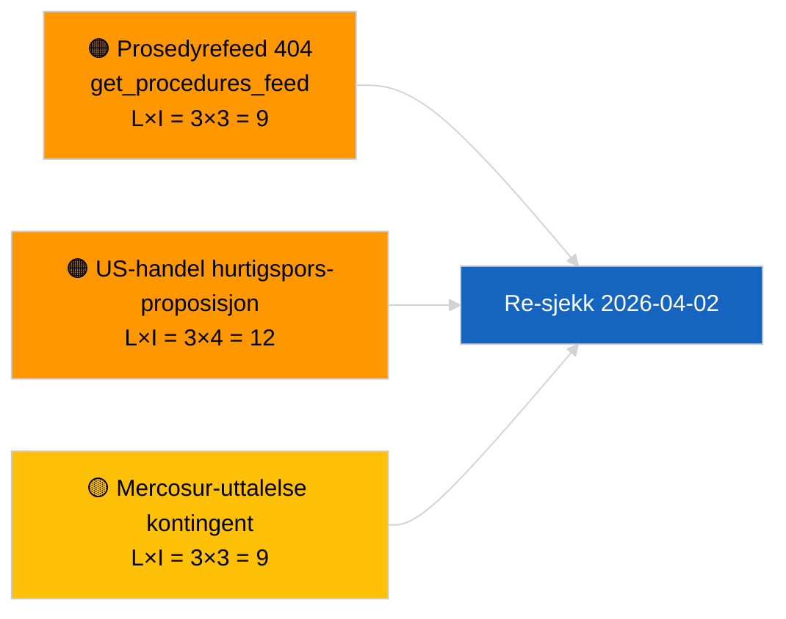
```mermaid
%%{init: {"theme":"dark"}}%%
graph LR
    R1["🟠 Prosedyrefeed 404<br/>get_procedures_feed<br/>L×I = 3×3 = 9"] --> CONS["Re-sjekk 2026-04-02"]
    R2["🟠 US-handel hurtigspors-proposisjon<br/>L×I = 3×4 = 12"] --> CONS
    R3["🟡 Mercosur-uttalelse kontingent<br/>L×I = 3×3 = 9"] --> CONS
    style R1 fill:#FF9800,color:#000000
    style R2 fill:#FF9800,color:#000000
    style R3 fill:#FFC107,color:#000000
    style CONS fill:#1565C0,color:#FFFFFF
```

| Risiko | L | I | Score | Utløser | Kilde | Admiralty |
|--------|:-:|:-:|:-----:|---------|-------|:---------:|
| `get_procedures_feed`-pålitelighet | 3 | 3 | 9 | Vedvarende 404 | Søster-breaking-kjøring | B2 |
| US-handel hurtigspors-proposisjon | 3 | 4 | 12 | US-handling utløser Kommisjonens tabelläring | TA-10-2026-0096 | A1 |
| Mercosur-uttalelse kontingent | 3 | 3 | 9 | Domstolen publiserer | TA-10-2026-0008 | A2 |
| MFF-forberedende friksjon | 3 | 4 | 12 | Kvartal-2-Kommisjons-kommunikasjon | Kommisjonskadence | B2 |

---

### 🔮 Viktigste fremoverpekende utløser

**Kommisjonens tirsdagsmøte-syklus gjenopptas 7. april 2026.** Første post-påske-Kommisjons-proposisjoner tabelleres typisk ved det tidlige april-kollegiemøtet; den aktuelle blandingen (forsvar/digitalt/handel/klima) kalibrerer kvartal-2-proposisjonsovervåkingslisten.

---

### 🛡️ Kildekvalitetsvurdering

- **Primærkilder:** EPs åpne dataportal — analyskjøring `4cf3b11a-f38e-4a3c-a81c-5c73d6eb8adc` og ekstern-dokument-beholdningen for mars.
- **Databegrensninger:** `get_procedures_feed` 404 den 2026-04-01 hindrer uavhengig korroborering av "ingen nye prosedyrer åpnet i dag".
- **Konfidens for kalender-drevet inaktivitet:** 🟢 HØY.

---

### 📎 Lenker

| Lenke | Sti |
|-------|-----|
| Artikkel | `./article.md` |
| Klassifisering (tom) | `./classification/` |
| Søsterkjøringer | `analysis/daily/2026-04-01/breaking/`, `committee-reports/`, `month-ahead/`, `motions/` |
| Manifest | `./manifest.json` |

---

### 🔄 Kryssreferanse

**Samtidige tomme mal-kjøringer:** breaking, committee-reports, month-ahead, motions for 2026-04-01 viser alle identisk tom tilstand — bekrefter systemomfattende resess + feed-API-vilkår, ikke proposisjonsspesifikk regresjon.

---

**Dokumentkontroll**
- **Mal:** `/analysis/templates/executive-brief.md`
- **Artefaktsti:** `analysis/daily/2026-04-01/propositions/executive-brief.md`
- **Klassifisering:** Offentlig
- **Retrospektiv generering:** Tilbakefyllingsøkt.

### Executive Brief Sv

### 🎯 BLUF

**Inga nya kommissionspropositioner eller EP-egna initiativärenden indexerades den 2026-04-01.** Analyskörning `4cf3b11a-f38e-4a3c-a81c-5c73d6eb8adc` returnerade **0 klassificerade aktörer** och **RUTINMÄSSIG** betydelse inom samtliga dimensioner. Europaparlamentets intersessionella recess (27 mars → 26 april) och det parallella `get_procedures_feed` 404-felet (dokumenterat i systerrapporten om aktuella händelser) förklarar dataavbrottet. Det substantiella propositionsbasläget är därför den ärvda pipelinen: HDV-utsläppskrediter 2025–2029-ramen (TA-10-2026-0084), ECB:s vice-ordförandeförfarande (TA-10-2026-0060), rapporten om bättre lagstiftning (TA-10-2026-0063) och den pågående EU-Mercosur-domstolshänvisningen (TA-10-2026-0008). **🟢 HÖG konfidensgrad** att det tomma tillståndet är kalender- och flödestillgänglighetsdrivet, inte en pipeline-regression.

---

### 🧭 3 Beslut som denna sammanfattning stöder

| # | Beslut | Beslutsfattare | Deadline | Underlag |
|:-:|--------|----------------|:--------:|---------|
| 1 | **Redaktion:** HOPPA ÖVER dagliga propositioner; skjut upp till nästa aktiva session | Redaktör | +24h | Tom körningsutdata |
| 2 | **Övervakning:** verifiera `get_procedures_feed`-hälsa nästa cykel | Datapipeline | 2026-04-02 | 404 den 2026-04-01 |
| 3 | **Framåtbevakning:** spåra kommissionens april-veckokommunikationer för nya propositioner | Analysansvarig | 2026-04-13 | Kommissionens tabelleringstakt |

---

### 📰 60-sekundersläsning

- 🔴 **Inga nya förfaranden öppnade** den 2026-04-01; `get_procedures_feed` 404 i parallell körning. (🟡 Medium — slutpunktens tillgänglighet är förbehållet)
- 🟠 **0 aktörer klassificerade**; ingen kommissionär, GD eller föredragande identifierad. (🟢 Hög)
- 🟢 **Pipeline-övertag** — HDV-utsläpp, ECB:s vice-ordförande, bättre lagstiftning, Mercosur-hänvisning kvarstår som aktivt propositionslager inför april. (🟢 Hög)
- 🟡 **Alla riskdimensioner "ingen"** — ingen akut propositionsfasrisk flaggad idag. (🟢 Hög)
- 🔵 **Ekonomiskt sammanhang:** förväntade kommissionspropositioner för kvartal 2 om AI-aktens genomförandebestämmelser, försvarsindustrins strategi och MFF-förberedande kommunikationer kvarstår på bevakningslistan. (🟡 Medium — kommissionens tabelleringstakt)
- 🟣 **Korsreferens:** syskonrapporten 2026-04-01/aktuellt dokumenterar mönstret 6/8 rådgivande flöden 404. (🟢 Hög)
- 🩷 **Störningsvektor:** amerikanskt handelstryck kan tvinga fram en snabbspårsproposition från kommissionen under april. (🟡 Medium)
- ⚪ **Överföring:** Mercosur ECJ-yttrandet är den mest impaktfulla väntande propositionsutlösaren.

---

### 🗂️ Topp-dokument / förfaranden — Propositionsbevakning

| Rang | EP-referens | Titel (kort) | Betydelse | Konfidensgrad | Status |
|:----:|-------------|--------------|:---------:|:-------------:|--------|
| 1 | — | Inga nya propositioner den 2026-04-01 | 0,0 | 🟢 HÖG | Recess + flöde 404 |
| 2 | TA-10-2026-0008 | EU-Mercosur ECJ-hänvisning (pågående) | 8,0 | 🟡 MEDIUM | Domstolsyttrande förväntat |
| 3 | TA-10-2026-0084 | HDV-utsläppskrediter 2025–2029 | 7,0 | 🟢 HÖG | Transpositionspipeline |
| 4 | TA-10-2026-0063 | Bättre lagstiftning (regulatorisk baslinje) | 6,0 | 🟢 HÖG | Övergripande ram |

---

### ⚠️ Risk- och hotbild

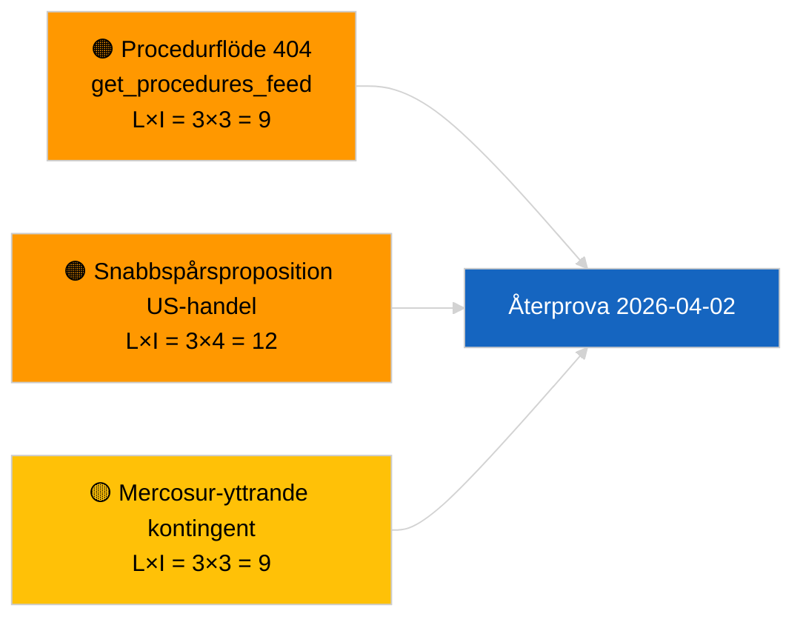
```mermaid
%%{init: {"theme":"dark"}}%%
graph LR
    R1["🟠 Procedurflöde 404<br/>get_procedures_feed<br/>L×I = 3×3 = 9"] --> CONS["Återprova 2026-04-02"]
    R2["🟠 Snabbspårsproposition US-handel<br/>L×I = 3×4 = 12"] --> CONS
    R3["🟡 Mercosur-yttrande kontingent<br/>L×I = 3×3 = 9"] --> CONS
    style R1 fill:#FF9800,color:#000000
    style R2 fill:#FF9800,color:#000000
    style R3 fill:#FFC107,color:#000000
    style CONS fill:#1565C0,color:#FFFFFF
```

| Risk | L | I | Poäng | Utlösare | Källa | Admiralty |
|------|:-:|:-:|:-----:|----------|-------|:---------:|
| `get_procedures_feed`-tillförlitlighet | 3 | 3 | 9 | Ihållande 404 | Syskonutbrottsrapport | B2 |
| Snabbspårsproposition US-handel | 3 | 4 | 12 | USA:s åtgärd utlöser kommissionens tabelläring | TA-10-2026-0096 | A1 |
| Mercosur-yttrande kontingent | 3 | 3 | 9 | Domstolen publicerar | TA-10-2026-0008 | A2 |
| MFF-förberedande friktion | 3 | 4 | 12 | Kvartal 2-kommissionsmeddelande | Kommissionstakt | B2 |

---

### 🔮 Främsta framåtutlösaren

**Kommissionens tisdagssammanträdescykel återupptas 7 april 2026.** Första post-påsk-kommissionspropositionerna tabelläras vanligtvis vid det tidiga april-kollegiemötet; den aktuella blandningen (försvar/digitalt/handel/klimat) kalibrerar kvartal 2-propositionsbevakningslistan.

---

### 🛡️ Källkvalitetsbedömning

- **Primärkällor:** EP:s öppna dataportal — analyskörning `4cf3b11a-f38e-4a3c-a81c-5c73d6eb8adc` och externdokumentinventariet för mars.
- **Databegränsningar:** `get_procedures_feed` 404 den 2026-04-01 hindrar oberoende korroborering av "inga nya förfaranden öppnade idag".
- **Konfidensgrad för kalenderdriven inaktivitet:** 🟢 HÖG.

---

### 📎 Länkar

| Länk | Sökväg |
|------|--------|
| Artikel | `./article.md` |
| Klassificering (tom) | `./classification/` |
| Systonkörningar | `analysis/daily/2026-04-01/breaking/`, `committee-reports/`, `month-ahead/`, `motions/` |
| Manifest | `./manifest.json` |

---

### 🔄 Korsreferens

**Parallella tomma mall-körningar:** breaking, committee-reports, month-ahead, motions för 2026-04-01 visar alla identiskt tomt tillstånd — bekräftar systemövergripande recess + flödes-API-villkor, inte propositionsspecifik regression.

---

**Dokumentkontroll**
- **Mall:** `/analysis/templates/executive-brief.md`
- **Artefaktsökväg:** `analysis/daily/2026-04-01/propositions/executive-brief.md`
- **Klassificering:** Offentlig
- **Retrospektiv generering:** Bakåtfyllningssession.

### Executive Brief Zh

**分类：** OSINT | 公开议会记录
**置信度：** 🟢 高（休会期结构性评估）
**生成时间：** 2026-04-01T00:00:00Z（回溯简报）
**文章类型：** 提案
**运行ID：** `4cf3b11a-f38e-4a3c-a81c-5c73d6eb8adc`
**来源：** 欧洲议会开放数据门户

---

### 🎯 BLUF

**2026-04-01 未索引任何欧盟委员会新提案或欧洲议会自主倡议文件。** 分析运行 `4cf3b11a-f38e-4a3c-a81c-5c73d6eb8adc` 返回**0 名分类行为者**及所有维度的**例行（ROUTINE）**重要性。欧洲议会会期间休会（3月27日→4月26日）以及同期 `get_procedures_feed` 404 错误（已记录于突发新闻并行运行）解释了数据空白。因此，实质性提案基准为继承管线：重型商用车排放信用额度 2025–2029 框架（TA-10-2026-0084）、欧洲央行副行长程序（TA-10-2026-0060）、更好立法报告（TA-10-2026-0063），以及进行中的欧盟-南方共同市场欧洲法院提交（TA-10-2026-0008）。**🟢 高置信度**认为空状态由日历及信息流可用性驱动，而非管线回归。

---

### 🧭 本简报支持的 3 项决策

| # | 决策 | 决策者 | 截止时间 | 依据 |
|:-:|------|-------|:-------:|------|
| 1 | **编辑：** 跳过每日提案；推迟至下次活跃会议 | 编辑 | +24小时 | 空运行输出 |
| 2 | **监控：** 在下一周期验证 `get_procedures_feed` 健康状态 | 数据管线 | 2026-04-02 | 2026-04-01 的 404 |
| 3 | **前瞻监视：** 追踪欧盟委员会四月周度通信以获取新提案 | 分析负责人 | 2026-04-13 | 欧盟委员会提交节奏 |

---

### 📰 60 秒速读

- 🔴 **2026-04-01 未开启任何新程序**；并行运行中 `get_procedures_feed` 404。（🟡 中等 — 端点可用性为警告条件）
- 🟠 **0 名行为者被分类**；未识别任何专员、总司或报告员。（🟢 高）
- 🟢 **管线延续** — 重型商用车排放、欧洲央行副行长、更好立法、南方共同市场提交仍是进入四月的活跃提案库存。（🟢 高）
- 🟡 **所有风险维度"无"** — 今日未标记提案阶段急性风险。（🟢 高）
- 🔵 **经济背景：** 预期欧盟委员会第二季度关于人工智能法实施法规、国防工业战略和多年期财务框架准备通信的提案仍在监视列表中。（🟡 中等 — 欧盟委员会提交节奏）
- 🟣 **交叉参考：** 姊妹报告 2026-04-01/breaking 记录了 6/8 咨询信息流 404 模式。（🟢 高）
- 🩷 **干扰向量：** 美国贸易压力可能在四月迫使欧盟委员会提出快速通道提案。（🟡 中等）
- ⚪ **延续：** 南方共同市场欧洲法院意见书是影响最大的待定提案触发因素。

---

### 🗂️ 顶级文件 / 程序 — 提案监视

| 排名 | EP 参考号 | 标题（简称） | 重要性 | 置信度 | 状态 |
|:---:|----------|------------|:-----:|:-----:|------|
| 1 | — | 2026-04-01 无新提案 | 0.0 | 🟢 高 | 休会 + 信息流 404 |
| 2 | TA-10-2026-0008 | 欧盟-南方共同市场欧洲法院提交（待定） | 8.0 | 🟡 中等 | 法院意见书待出 |
| 3 | TA-10-2026-0084 | 重型商用车排放信用额度 2025–2029 | 7.0 | 🟢 高 | 转置管线 |
| 4 | TA-10-2026-0063 | 更好立法（监管基准） | 6.0 | 🟢 高 | 横跨性框架 |

---

### ⚠️ 风险与威胁快照

```mermaid
%%{init: {"theme":"dark"}}%%
graph LR
    R1["🟠 程序信息流 404<br/>get_procedures_feed<br/>L×I = 3×3 = 9"] --> CONS["重新探查 2026-04-02"]
    R2["🟠 美国贸易快速通道提案<br/>L×I = 3×4 = 12"] --> CONS
    R3["🟡 南方共同市场意见书应急<br/>L×I = 3×3 = 9"] --> CONS
    style R1 fill:#FF9800,color:#000000
    style R2 fill:#FF9800,color:#000000
    style R3 fill:#FFC107,color:#000000
    style CONS fill:#1565C0,color:#FFFFFF
```

| 风险 | L | I | 评分 | 触发因素 | 来源 | Admiralty |
|------|:-:|:-:|:---:|---------|------|:---------:|
| `get_procedures_feed` 可靠性 | 3 | 3 | 9 | 持续 404 | 姊妹突发新闻运行 | B2 |
| 美国贸易快速通道提案 | 3 | 4 | 12 | 美国行动触发欧盟委员会提交 | TA-10-2026-0096 | A1 |
| 南方共同市场意见书应急 | 3 | 3 | 9 | 法院公布 | TA-10-2026-0008 | A2 |
| 多年期财务框架准备摩擦 | 3 | 4 | 12 | 第二季度欧盟委员会通信 | 欧盟委员会节奏 | B2 |

---

### 🔮 主要前瞻触发因素

**欧盟委员会周二例会周期于 2026 年 4 月 7 日恢复。** 复活节后首批欧盟委员会提案通常在四月初委员会会议上提交；主题组合（国防/数字/贸易/气候）将校准第二季度提案监视列表。

---

### 🛡️ 信息来源质量评估

- **主要来源：** 欧洲议会开放数据门户 — 分析运行 `4cf3b11a-f38e-4a3c-a81c-5c73d6eb8adc` 及三月外部文件目录。
- **数据限制：** 2026-04-01 的 `get_procedures_feed` 404 阻碍了对"今日未开启新程序"的独立核实。
- **日历驱动停滞的置信度：** 🟢 高。

---

### 📎 链接

| 链接 | 路径 |
|------|------|
| 文章 | `./article.md` |
| 分类（空） | `./classification/` |
| 姊妹运行 | `analysis/daily/2026-04-01/breaking/`, `committee-reports/`, `month-ahead/`, `motions/` |
| 清单 | `./manifest.json` |

---

### 🔄 交叉参考

**同期空模板运行：** 2026-04-01 的 breaking、committee-reports、month-ahead、motions 均呈现相同空状态 — 证实系统级休会 + 信息流 API 条件，而非提案特定回归。

---

**文件控制**
- **模板：** `/analysis/templates/executive-brief.md`
- **产物路径：** `analysis/daily/2026-04-01/propositions/executive-brief.md`
- **分类：** 公开
- **回溯生成：** 回填会话。

### Coalition Analysis

### Overview
Analysis of political group cohesion and coalition dynamics.

### Coalition Metrics
- **Overall Stability**: 0.0%
- **Forecast**: volatile
- **Patterns Analysed**: 0

### Group Analysis
- **Stable Groups**: No stable groups identified
- **Declining Groups**: No declining groups identified

### Coalition Intelligence
- **Patterns Evaluated**: 0

### Date: 2026-04-01

### Stakeholder Analysis

### Data Available for Stakeholder Assessment
| Stakeholder Group | Primary Data Sources | Data Points |
|-------------------|---------------------|-------------|
| Political Groups | Procedures, Adopted Texts, Voting Records, Coalitions | 20 |
| Civil Society | Documents, Questions, Events | 0 |
| Industry | Procedures, Adopted Texts | 20 |
| National Governments | Adopted Texts, Procedures, Coalitions | 20 |
| Citizens | Questions, MEP Updates, Events | 0 |
| EU Institutions | Events, Procedures, Adopted Texts, Voting Records | 20 |

### Data Source Summary
| Source | Count |
|--------|-------|
| patterns | 0 |
| votingRecords | 0 |
| events | 0 |
| documents | 0 |
| adoptedTexts | 20 |
| procedures | 0 |
| mepUpdates | 0 |
| plenaryDocuments | 0 |
| committeeDocuments | 0 |
| plenarySessionDocuments | 0 |
| externalDocuments | 0 |
| questions | 0 |
| declarations | 0 |
| corporateBodies | 0 |

### Date: 2026-04-01

> **Provenance & Audit**
>
> - **Article type:** `propositions`
> - **Run date:** 2026-04-01
> - **Run id:** `4cf3b11a-f38e-4a3c-a81c-5c73d6eb8adc`
> - **Gate result:** `PENDING`
> - **Analysis tree:** [analysis/daily/2026-04-01/propositions](https://github.com/Hack23/euparliamentmonitor/tree/main/analysis/daily/2026-04-01/propositions)
> - **Manifest:** [manifest.json](https://github.com/Hack23/euparliamentmonitor/blob/main/analysis/daily/2026-04-01/propositions/manifest.json)

<h2 id="aggregator-tradecraft-references">Tradecraft References</h2>

This article is produced under the [Hack23 AB](https://hack23.com) intelligence tradecraft library. Every methodology and artifact template applied to this run is linked below.

### Artifact templates

- [README](https://github.com/Hack23/euparliamentmonitor/blob/main/analysis/templates/README.md)
- [Actor Mapping](https://github.com/Hack23/euparliamentmonitor/blob/main/analysis/templates/actor-mapping.md)
- [Actor Threat Profiles](https://github.com/Hack23/euparliamentmonitor/blob/main/analysis/templates/actor-threat-profiles.md)
- [Analysis Index](https://github.com/Hack23/euparliamentmonitor/blob/main/analysis/templates/analysis-index.md)
- [Coalition Dynamics](https://github.com/Hack23/euparliamentmonitor/blob/main/analysis/templates/coalition-dynamics.md)
- [Coalition Mathematics](https://github.com/Hack23/euparliamentmonitor/blob/main/analysis/templates/coalition-mathematics.md)
- [Commission Wp Alignment](https://github.com/Hack23/euparliamentmonitor/blob/main/analysis/templates/commission-wp-alignment.md)
- [Comparative International](https://github.com/Hack23/euparliamentmonitor/blob/main/analysis/templates/comparative-international.md)
- [Consequence Trees](https://github.com/Hack23/euparliamentmonitor/blob/main/analysis/templates/consequence-trees.md)
- [Cross Reference Map](https://github.com/Hack23/euparliamentmonitor/blob/main/analysis/templates/cross-reference-map.md)
- [Cross Run Diff](https://github.com/Hack23/euparliamentmonitor/blob/main/analysis/templates/cross-run-diff.md)
- [Cross Session Intelligence](https://github.com/Hack23/euparliamentmonitor/blob/main/analysis/templates/cross-session-intelligence.md)
- [Data Availability Assessment](https://github.com/Hack23/euparliamentmonitor/blob/main/analysis/templates/data-availability-assessment.md)
- [Data Download Manifest](https://github.com/Hack23/euparliamentmonitor/blob/main/analysis/templates/data-download-manifest.md)
- [Deep Analysis](https://github.com/Hack23/euparliamentmonitor/blob/main/analysis/templates/deep-analysis.md)
- [Devils Advocate Analysis](https://github.com/Hack23/euparliamentmonitor/blob/main/analysis/templates/devils-advocate-analysis.md)
- [Economic Context](https://github.com/Hack23/euparliamentmonitor/blob/main/analysis/templates/economic-context.md)
- [Executive Brief](https://github.com/Hack23/euparliamentmonitor/blob/main/analysis/templates/executive-brief.md)
- [Forces Analysis](https://github.com/Hack23/euparliamentmonitor/blob/main/analysis/templates/forces-analysis.md)
- [Forward Indicators](https://github.com/Hack23/euparliamentmonitor/blob/main/analysis/templates/forward-indicators.md)
- [Forward Projection](https://github.com/Hack23/euparliamentmonitor/blob/main/analysis/templates/forward-projection.md)
- [Historical Baseline](https://github.com/Hack23/euparliamentmonitor/blob/main/analysis/templates/historical-baseline.md)
- [Historical Parallels](https://github.com/Hack23/euparliamentmonitor/blob/main/analysis/templates/historical-parallels.md)
- [Imf Vintage Audit](https://github.com/Hack23/euparliamentmonitor/blob/main/analysis/templates/imf-vintage-audit.md)
- [Impact Matrix](https://github.com/Hack23/euparliamentmonitor/blob/main/analysis/templates/impact-matrix.md)
- [Implementation Feasibility](https://github.com/Hack23/euparliamentmonitor/blob/main/analysis/templates/implementation-feasibility.md)
- [Intelligence Assessment](https://github.com/Hack23/euparliamentmonitor/blob/main/analysis/templates/intelligence-assessment.md)
- [Legislative Disruption](https://github.com/Hack23/euparliamentmonitor/blob/main/analysis/templates/legislative-disruption.md)
- [Legislative Pipeline Forecast](https://github.com/Hack23/euparliamentmonitor/blob/main/analysis/templates/legislative-pipeline-forecast.md)
- [Legislative Velocity Risk](https://github.com/Hack23/euparliamentmonitor/blob/main/analysis/templates/legislative-velocity-risk.md)
- [Mandate Fulfilment Scorecard](https://github.com/Hack23/euparliamentmonitor/blob/main/analysis/templates/mandate-fulfilment-scorecard.md)
- [Mcp Reliability Audit](https://github.com/Hack23/euparliamentmonitor/blob/main/analysis/templates/mcp-reliability-audit.md)
- [Media Framing Analysis](https://github.com/Hack23/euparliamentmonitor/blob/main/analysis/templates/media-framing-analysis.md)
- [Methodology Reflection](https://github.com/Hack23/euparliamentmonitor/blob/main/analysis/templates/methodology-reflection.md)
- [Parliamentary Calendar Projection](https://github.com/Hack23/euparliamentmonitor/blob/main/analysis/templates/parliamentary-calendar-projection.md)
- [Per File Political Intelligence](https://github.com/Hack23/euparliamentmonitor/blob/main/analysis/templates/per-file-political-intelligence.md)
- [Pestle Analysis](https://github.com/Hack23/euparliamentmonitor/blob/main/analysis/templates/pestle-analysis.md)
- [Political Capital Risk](https://github.com/Hack23/euparliamentmonitor/blob/main/analysis/templates/political-capital-risk.md)
- [Political Classification](https://github.com/Hack23/euparliamentmonitor/blob/main/analysis/templates/political-classification.md)
- [Political Threat Landscape](https://github.com/Hack23/euparliamentmonitor/blob/main/analysis/templates/political-threat-landscape.md)
- [Presidency Trio Context](https://github.com/Hack23/euparliamentmonitor/blob/main/analysis/templates/presidency-trio-context.md)
- [Quantitative Swot](https://github.com/Hack23/euparliamentmonitor/blob/main/analysis/templates/quantitative-swot.md)
- [Reference Analysis Quality](https://github.com/Hack23/euparliamentmonitor/blob/main/analysis/templates/reference-analysis-quality.md)
- [Risk Assessment](https://github.com/Hack23/euparliamentmonitor/blob/main/analysis/templates/risk-assessment.md)
- [Risk Matrix](https://github.com/Hack23/euparliamentmonitor/blob/main/analysis/templates/risk-matrix.md)
- [Scenario Forecast](https://github.com/Hack23/euparliamentmonitor/blob/main/analysis/templates/scenario-forecast.md)
- [Seat Projection](https://github.com/Hack23/euparliamentmonitor/blob/main/analysis/templates/seat-projection.md)
- [Session Baseline](https://github.com/Hack23/euparliamentmonitor/blob/main/analysis/templates/session-baseline.md)
- [Significance Classification](https://github.com/Hack23/euparliamentmonitor/blob/main/analysis/templates/significance-classification.md)
- [Significance Scoring](https://github.com/Hack23/euparliamentmonitor/blob/main/analysis/templates/significance-scoring.md)
- [Stakeholder Impact](https://github.com/Hack23/euparliamentmonitor/blob/main/analysis/templates/stakeholder-impact.md)
- [Stakeholder Map](https://github.com/Hack23/euparliamentmonitor/blob/main/analysis/templates/stakeholder-map.md)
- [Swot Analysis](https://github.com/Hack23/euparliamentmonitor/blob/main/analysis/templates/swot-analysis.md)
- [Synthesis Summary](https://github.com/Hack23/euparliamentmonitor/blob/main/analysis/templates/synthesis-summary.md)
- [Term Arc](https://github.com/Hack23/euparliamentmonitor/blob/main/analysis/templates/term-arc.md)
- [Threat Analysis](https://github.com/Hack23/euparliamentmonitor/blob/main/analysis/templates/threat-analysis.md)
- [Threat Model](https://github.com/Hack23/euparliamentmonitor/blob/main/analysis/templates/threat-model.md)
- [Voter Segmentation](https://github.com/Hack23/euparliamentmonitor/blob/main/analysis/templates/voter-segmentation.md)
- [Voting Patterns](https://github.com/Hack23/euparliamentmonitor/blob/main/analysis/templates/voting-patterns.md)
- [Wildcards Blackswans](https://github.com/Hack23/euparliamentmonitor/blob/main/analysis/templates/wildcards-blackswans.md)
- [Workflow Audit](https://github.com/Hack23/euparliamentmonitor/blob/main/analysis/templates/workflow-audit.md)

### Methodologies

- [README](https://github.com/Hack23/euparliamentmonitor/blob/main/analysis/methodologies/README.md)
- [Ai Driven Analysis Guide](https://github.com/Hack23/euparliamentmonitor/blob/main/analysis/methodologies/ai-driven-analysis-guide.md)
- [Analytical Supplementary Methodology](https://github.com/Hack23/euparliamentmonitor/blob/main/analysis/methodologies/analytical-supplementary-methodology.md)
- [Artifact Catalog](https://github.com/Hack23/euparliamentmonitor/blob/main/analysis/methodologies/artifact-catalog.md)
- [Confidence Calibration](https://github.com/Hack23/euparliamentmonitor/blob/main/analysis/methodologies/confidence-calibration.md)
- [Electoral Cycle Methodology](https://github.com/Hack23/euparliamentmonitor/blob/main/analysis/methodologies/electoral-cycle-methodology.md)
- [Electoral Domain Methodology](https://github.com/Hack23/euparliamentmonitor/blob/main/analysis/methodologies/electoral-domain-methodology.md)
- [Forward Projection Methodology](https://github.com/Hack23/euparliamentmonitor/blob/main/analysis/methodologies/forward-projection-methodology.md)
- [Imf Indicator Mapping](https://github.com/Hack23/euparliamentmonitor/blob/main/analysis/methodologies/imf-indicator-mapping.md)
- [Osint Tradecraft Standards](https://github.com/Hack23/euparliamentmonitor/blob/main/analysis/methodologies/osint-tradecraft-standards.md)
- [Per Artifact Methodologies](https://github.com/Hack23/euparliamentmonitor/blob/main/analysis/methodologies/per-artifact-methodologies.md)
- [Per Document Methodology](https://github.com/Hack23/euparliamentmonitor/blob/main/analysis/methodologies/per-document-methodology.md)
- [Political Classification Guide](https://github.com/Hack23/euparliamentmonitor/blob/main/analysis/methodologies/political-classification-guide.md)
- [Political Risk Methodology](https://github.com/Hack23/euparliamentmonitor/blob/main/analysis/methodologies/political-risk-methodology.md)
- [Political Style Guide](https://github.com/Hack23/euparliamentmonitor/blob/main/analysis/methodologies/political-style-guide.md)
- [Political Swot Framework](https://github.com/Hack23/euparliamentmonitor/blob/main/analysis/methodologies/political-swot-framework.md)
- [Political Threat Framework](https://github.com/Hack23/euparliamentmonitor/blob/main/analysis/methodologies/political-threat-framework.md)
- [Seo Headers Policy](https://github.com/Hack23/euparliamentmonitor/blob/main/analysis/methodologies/seo-headers-policy.md)
- [Source Triangulation](https://github.com/Hack23/euparliamentmonitor/blob/main/analysis/methodologies/source-triangulation.md)
- [Strategic Extensions Methodology](https://github.com/Hack23/euparliamentmonitor/blob/main/analysis/methodologies/strategic-extensions-methodology.md)
- [Structural Metadata Methodology](https://github.com/Hack23/euparliamentmonitor/blob/main/analysis/methodologies/structural-metadata-methodology.md)
- [Synthesis Methodology](https://github.com/Hack23/euparliamentmonitor/blob/main/analysis/methodologies/synthesis-methodology.md)
- [Voter Segmentation Methodology](https://github.com/Hack23/euparliamentmonitor/blob/main/analysis/methodologies/voter-segmentation-methodology.md)
- [Worldbank Indicator Mapping](https://github.com/Hack23/euparliamentmonitor/blob/main/analysis/methodologies/worldbank-indicator-mapping.md)

<h2 id="aggregator-analysis-index">Analysis Index</h2>

Every artifact below was read by the aggregator and contributed to this article. The raw [manifest.json](https://github.com/Hack23/euparliamentmonitor/blob/main/analysis/daily/2026-04-01/propositions/manifest.json) carries the full machine-readable list, including gate-result history.

| Section | Artifact | Path |
|---|---|---|
| section-executive-brief | [executive-brief](https://github.com/Hack23/euparliamentmonitor/blob/main/analysis/daily/2026-04-01/propositions/executive-brief.md) | `executive-brief.md` |
| section-actors-forces | [actor-mapping](https://github.com/Hack23/euparliamentmonitor/blob/main/analysis/daily/2026-04-01/propositions/classification/actor-mapping.md) | `classification/actor-mapping.md` |
| section-actors-forces | [forces-analysis](https://github.com/Hack23/euparliamentmonitor/blob/main/analysis/daily/2026-04-01/propositions/classification/forces-analysis.md) | `classification/forces-analysis.md` |
| section-actors-forces | [impact-matrix](https://github.com/Hack23/euparliamentmonitor/blob/main/analysis/daily/2026-04-01/propositions/classification/impact-matrix.md) | `classification/impact-matrix.md` |
| section-actors-forces | [significance-assessment](https://github.com/Hack23/euparliamentmonitor/blob/main/analysis/daily/2026-04-01/propositions/classification/significance-assessment.md) | `classification/significance-assessment.md` |
| section-coalitions-voting | [voting-patterns](https://github.com/Hack23/euparliamentmonitor/blob/main/analysis/daily/2026-04-01/propositions/existing/voting-patterns.md) | `existing/voting-patterns.md` |
| section-risk | [risk-matrix](https://github.com/Hack23/euparliamentmonitor/blob/main/analysis/daily/2026-04-01/propositions/risk-scoring/risk-matrix.md) | `risk-scoring/risk-matrix.md` |
| section-risk | [quantitative-swot](https://github.com/Hack23/euparliamentmonitor/blob/main/analysis/daily/2026-04-01/propositions/risk-scoring/quantitative-swot.md) | `risk-scoring/quantitative-swot.md` |
| section-risk | [political-capital-risk](https://github.com/Hack23/euparliamentmonitor/blob/main/analysis/daily/2026-04-01/propositions/risk-scoring/political-capital-risk.md) | `risk-scoring/political-capital-risk.md` |
| section-risk | [legislative-velocity-risk](https://github.com/Hack23/euparliamentmonitor/blob/main/analysis/daily/2026-04-01/propositions/risk-scoring/legislative-velocity-risk.md) | `risk-scoring/legislative-velocity-risk.md` |
| section-risk | [agent-risk-workflow](https://github.com/Hack23/euparliamentmonitor/blob/main/analysis/daily/2026-04-01/propositions/risk-scoring/agent-risk-workflow.md) | `risk-scoring/agent-risk-workflow.md` |
| section-threat | [actor-threat-profiles](https://github.com/Hack23/euparliamentmonitor/blob/main/analysis/daily/2026-04-01/propositions/threat-assessment/actor-threat-profiles.md) | `threat-assessment/actor-threat-profiles.md` |
| section-threat | [consequence-trees](https://github.com/Hack23/euparliamentmonitor/blob/main/analysis/daily/2026-04-01/propositions/threat-assessment/consequence-trees.md) | `threat-assessment/consequence-trees.md` |
| section-threat | [legislative-disruption](https://github.com/Hack23/euparliamentmonitor/blob/main/analysis/daily/2026-04-01/propositions/threat-assessment/legislative-disruption.md) | `threat-assessment/legislative-disruption.md` |
| section-threat | [political-threat-landscape](https://github.com/Hack23/euparliamentmonitor/blob/main/analysis/daily/2026-04-01/propositions/threat-assessment/political-threat-landscape.md) | `threat-assessment/political-threat-landscape.md` |
| section-continuity | [cross-session-intelligence](https://github.com/Hack23/euparliamentmonitor/blob/main/analysis/daily/2026-04-01/propositions/existing/cross-session-intelligence.md) | `existing/cross-session-intelligence.md` |
| section-deep-analysis | [deep-analysis](https://github.com/Hack23/euparliamentmonitor/blob/main/analysis/daily/2026-04-01/propositions/existing/deep-analysis.md) | `existing/deep-analysis.md` |
| section-supplementary-intelligence | [executive-brief_ar](https://github.com/Hack23/euparliamentmonitor/blob/main/analysis/daily/2026-04-01/propositions/executive-brief_ar.md) | `executive-brief_ar.md` |
| section-supplementary-intelligence | [executive-brief_da](https://github.com/Hack23/euparliamentmonitor/blob/main/analysis/daily/2026-04-01/propositions/executive-brief_da.md) | `executive-brief_da.md` |
| section-supplementary-intelligence | [executive-brief_de](https://github.com/Hack23/euparliamentmonitor/blob/main/analysis/daily/2026-04-01/propositions/executive-brief_de.md) | `executive-brief_de.md` |
| section-supplementary-intelligence | [executive-brief_es](https://github.com/Hack23/euparliamentmonitor/blob/main/analysis/daily/2026-04-01/propositions/executive-brief_es.md) | `executive-brief_es.md` |
| section-supplementary-intelligence | [executive-brief_fi](https://github.com/Hack23/euparliamentmonitor/blob/main/analysis/daily/2026-04-01/propositions/executive-brief_fi.md) | `executive-brief_fi.md` |
| section-supplementary-intelligence | [executive-brief_fr](https://github.com/Hack23/euparliamentmonitor/blob/main/analysis/daily/2026-04-01/propositions/executive-brief_fr.md) | `executive-brief_fr.md` |
| section-supplementary-intelligence | [executive-brief_he](https://github.com/Hack23/euparliamentmonitor/blob/main/analysis/daily/2026-04-01/propositions/executive-brief_he.md) | `executive-brief_he.md` |
| section-supplementary-intelligence | [executive-brief_ja](https://github.com/Hack23/euparliamentmonitor/blob/main/analysis/daily/2026-04-01/propositions/executive-brief_ja.md) | `executive-brief_ja.md` |
| section-supplementary-intelligence | [executive-brief_ko](https://github.com/Hack23/euparliamentmonitor/blob/main/analysis/daily/2026-04-01/propositions/executive-brief_ko.md) | `executive-brief_ko.md` |
| section-supplementary-intelligence | [executive-brief_nl](https://github.com/Hack23/euparliamentmonitor/blob/main/analysis/daily/2026-04-01/propositions/executive-brief_nl.md) | `executive-brief_nl.md` |
| section-supplementary-intelligence | [executive-brief_no](https://github.com/Hack23/euparliamentmonitor/blob/main/analysis/daily/2026-04-01/propositions/executive-brief_no.md) | `executive-brief_no.md` |
| section-supplementary-intelligence | [executive-brief_sv](https://github.com/Hack23/euparliamentmonitor/blob/main/analysis/daily/2026-04-01/propositions/executive-brief_sv.md) | `executive-brief_sv.md` |
| section-supplementary-intelligence | [executive-brief_zh](https://github.com/Hack23/euparliamentmonitor/blob/main/analysis/daily/2026-04-01/propositions/executive-brief_zh.md) | `executive-brief_zh.md` |
| section-supplementary-intelligence | [coalition-analysis](https://github.com/Hack23/euparliamentmonitor/blob/main/analysis/daily/2026-04-01/propositions/existing/coalition-analysis.md) | `existing/coalition-analysis.md` |
| section-supplementary-intelligence | [stakeholder-analysis](https://github.com/Hack23/euparliamentmonitor/blob/main/analysis/daily/2026-04-01/propositions/existing/stakeholder-analysis.md) | `existing/stakeholder-analysis.md` |

