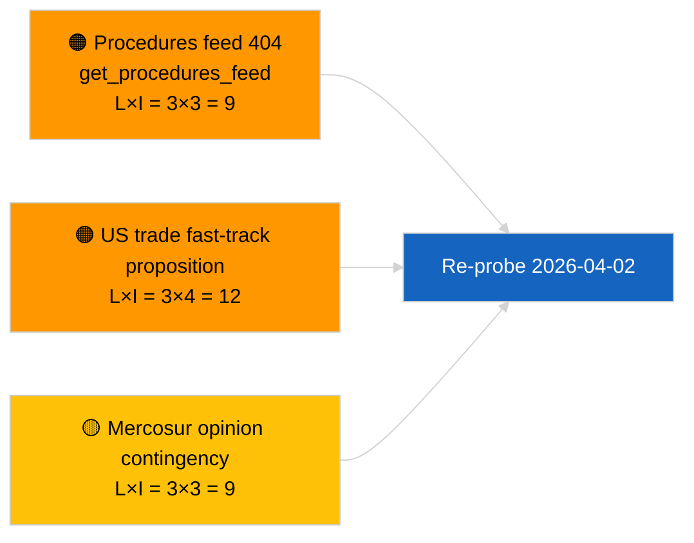

<!-- SPDX-FileCopyrightText: 2026 Hack23 AB -->
<!-- SPDX-License-Identifier: Apache-2.0 -->

# Executive Brief — Propositions | 2026-04-01

**Classification:** OSINT | Public Parliamentary Record
**Confidence:** 🟢 High (recess-period structural assessment)
**Generated:** 2026-04-01T00:00:00Z (retrospective brief)
**Article Type:** Propositions
**Run ID:** `4cf3b11a-f38e-4a3c-a81c-5c73d6eb8adc`
**Source:** European Parliament Open Data Portal

---

## 🎯 BLUF

**No new Commission propositions or EP own-initiative dossiers indexed on 2026-04-01.** Analysis run `4cf3b11a-f38e-4a3c-a81c-5c73d6eb8adc` returned **0 classified actors** and **ROUTINE** significance across all dimensions. Inter-sessional EP recess (27 March → 26 April) and concurrent `get_procedures_feed` 404 (logged in sibling breaking run) explain the data void. The substantive propositions baseline is therefore the inherited pipeline: HDV emission-credits 2025-2029 framework (TA-10-2026-0084), ECB Vice-President procedure (TA-10-2026-0060), Better Law-Making report (TA-10-2026-0063), and the live EU-Mercosur Court-of-Justice referral (TA-10-2026-0008). **🟢 HIGH confidence** the empty state is calendar- and feed-availability-driven, not a pipeline regression.

---

## 🧭 3 Decisions This Brief Supports

| # | Decision | Who Decides | Deadline | Evidence |
|:-:|----------|-------------|:--------:|----------|
| 1 | **Editorial:** SKIP propositions daily; defer until next active session | Editor | +24h | Empty run output |
| 2 | **Monitoring:** verify `get_procedures_feed` health next cycle | Data pipeline | 2026-04-02 | 404 on 2026-04-01 |
| 3 | **Forward-watch:** track Commission April-week communications for new propositions | Analysis lead | 2026-04-13 | Commission tabling cadence |

---

## 📰 60-Second Read

- 🔴 **No new procedures opened** on 2026-04-01; `get_procedures_feed` 404 in concurrent run. (🟡 Medium — endpoint availability is the caveat)
- 🟠 **0 actors classified**; no Commissioner, DG, or rapporteur identified. (🟢 High)
- 🟢 **Pipeline carry-over** — HDV emissions, ECB Vice-President, Better Law-Making, Mercosur referral remain the active propositions inventory entering April. (🟢 High)
- 🟡 **Risk dimensions all "none"** — no acute proposition-stage risk flagged today. (🟢 High)
- 🔵 **Economic context:** anticipated Commission Q2 propositions on AI Act implementing regulations, Defence Industrial Strategy, and MFF preparatory communications remain on the watch board. (🟡 Medium — Commission tabling cadence)
- 🟣 **Cross-reference:** sibling 2026-04-01/breaking documents the 6/8 advisory-feed 404 pattern. (🟢 High)
- 🩷 **Disruption vector:** US trade pressure may force fast-track Commission proposition during April. (🟡 Medium)
- ⚪ **Carry-forward:** Mercosur ECJ opinion is the highest-impact pending propositions trigger.

---

## 🗂️ Top Documents / Procedures — Propositions Watch

| Rank | EP reference | Title (short) | Significance | Confidence | Status |
|:----:|--------------|---------------|:------------:|:----------:|--------|
| 1 | — | No new propositions on 2026-04-01 | 0.0 | 🟢 HIGH | Recess + feed 404 |
| 2 | TA-10-2026-0008 | EU-Mercosur ECJ referral (pending) | 8.0 | 🟡 MEDIUM | Court opinion expected |
| 3 | TA-10-2026-0084 | HDV emission credits 2025-2029 | 7.0 | 🟢 HIGH | Transposition pipeline |
| 4 | TA-10-2026-0063 | Better Law-Making (regulatory baseline) | 6.0 | 🟢 HIGH | Cross-cutting frame |

---

## ⚠️ Risk & Threat Snapshot

| Risk | L | I | Score | Trigger | Source | Admiralty |
|------|:-:|:-:|:-----:|---------|--------|:---------:|
| `get_procedures_feed` reliability | 3 | 3 | 9 | Sustained 404 | Sibling breaking run | B2 |
| US trade fast-track proposition | 3 | 4 | 12 | US action triggers Commission tabling | TA-10-2026-0096 | A1 |
| Mercosur opinion contingency | 3 | 3 | 9 | Court releases | TA-10-2026-0008 | A2 |
| MFF preparatory friction | 3 | 4 | 12 | Q2 Commission communication | Commission cadence | B2 |

---

## 🔮 Top Forward Trigger

**Commission Tuesday meeting cycle resumes 7 April 2026.** First post-Easter Commission propositions are typically tabled at the early-April college meeting; topical mix (defence / digital / trade / climate) will calibrate the Q2 propositions watch list.

---

## 🛡️ Source Quality Assessment

- **Primary sources:** EP Open Data Portal — analysis run `4cf3b11a-f38e-4a3c-a81c-5c73d6eb8adc` and external-documents inventory for March.
- **Data limitations:** `get_procedures_feed` 404 on 2026-04-01 prevents independent corroboration of "no new procedures opened" today.
- **Confidence on calendar-driven inactivity:** 🟢 HIGH.

---

## 📎 Links

| Link | Path |
|------|------|
| Article | `./article.md` |
| Classification (empty) | `./classification/` |
| Sibling runs | `analysis/daily/2026-04-01/breaking/`, `committee-reports/`, `month-ahead/`, `motions/` |
| Manifest | `./manifest.json` |

---

## 🔄 Cross-Reference

**Concurrent empty-template runs:** breaking, committee-reports, month-ahead, motions for 2026-04-01 all show identical empty state — confirms system-wide recess + feed-API conditions, not propositions-specific regression.

---

**Document Control**
- **Template:** `/analysis/templates/executive-brief.md`
- **Artifact path:** `analysis/daily/2026-04-01/propositions/executive-brief.md`
- **Classification:** Public
- **Retrospective generation:** Back-fill session.
