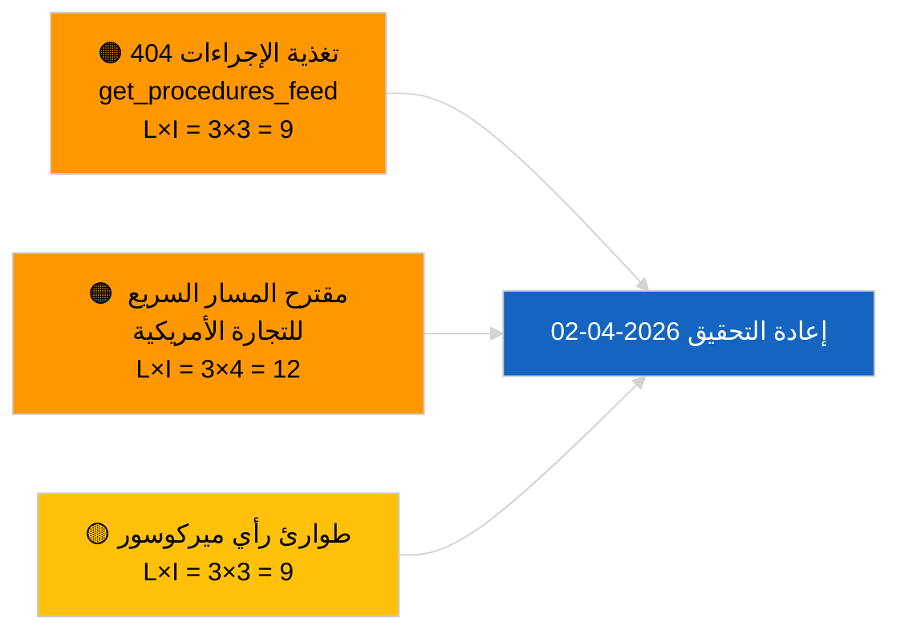

<!-- SPDX-FileCopyrightText: 2026 Hack23 AB -->
<!-- SPDX-License-Identifier: Apache-2.0 -->

# موجز تنفيذي — المقترحات | 2026-04-01

**التصنيف:** OSINT | سجل برلماني عام
**مستوى الثقة:** 🟢 مرتفع (تقييم هيكلي في فترة الاستراحة)
**تاريخ الإنشاء:** 2026-04-01T00:00:00Z (موجز استعادي)
**نوع المقال:** مقترحات
**معرّف الجلسة:** `4cf3b11a-f38e-4a3c-a81c-5c73d6eb8adc`
**المصدر:** بوابة البيانات المفتوحة للبرلمان الأوروبي

---

## 🎯 BLUF

**لم تُفهرَس أي مقترحات جديدة للمفوضية أو ملفات مبادرة ذاتية للبرلمان الأوروبي بتاريخ 2026-04-01.** أسفرت جلسة التحليل `4cf3b11a-f38e-4a3c-a81c-5c73d6eb8adc` عن **0 جهة مصنّفة** وأهمية **روتينية** في جميع الأبعاد. يُفسَّر الفراغ المعلوماتي بالعطلة البرلمانية بين الدورتين (27 مارس → 26 أبريل) وخطأ `get_procedures_feed` 404 المتزامن (الموثّق في تقرير الأخبار العاجلة المصاحب). وبالتالي فإن خط الأساس الفعلي للمقترحات هو البنية التحتية الموروثة: إطار أرصدة انبعاثات المركبات ثقيلة الحمولة 2025–2029 (TA-10-2026-0084)، إجراءات نائب رئيس البنك المركزي الأوروبي (TA-10-2026-0060)، تقرير التشريع الأفضل (TA-10-2026-0063)، والإحالة الجارية لاتفاقية الاتحاد الأوروبي-ميركوسور إلى محكمة العدل (TA-10-2026-0008). **🟢 ثقة مرتفعة** في أن الحالة الفارغة مدفوعة بالتقويم وتوافر البيانات وليست انحداراً في البنية التحتية.

---

## 🧭 3 قرارات يدعمها هذا الموجز

| # | القرار | صاحب القرار | الموعد النهائي | الأدلة |
|:-:|--------|------------|:--------------:|--------|
| 1 | **تحريري:** تخطّي المقترحات اليومية؛ تأجيل حتى الجلسة النشطة التالية | المحرر | +24 ساعة | مخرجات التشغيل الفارغة |
| 2 | **المراقبة:** التحقق من صحة `get_procedures_feed` في الدورة التالية | البنية التحتية للبيانات | 2026-04-02 | 404 بتاريخ 2026-04-01 |
| 3 | **المراقبة الاستشرافية:** تتبع مراسلات أسبوع أبريل للمفوضية بحثاً عن مقترحات جديدة | قائد التحليل | 2026-04-13 | إيقاع إدراج المفوضية |

---

## 📰 قراءة من 60 ثانية

- 🔴 **لم تُفتتَح إجراءات جديدة** بتاريخ 2026-04-01؛ `get_procedures_feed` 404 في تشغيل موازٍ. (🟡 متوسط — توافر نقطة النهاية هو التحفظ)
- 🟠 **0 جهات مصنّفة**؛ لم يُحدَّد أي مفوض أو مديرية عامة أو مقرر. (🟢 مرتفع)
- 🟢 **ترحيل البنية التحتية** — انبعاثات المركبات الثقيلة، نائب رئيس البنك المركزي الأوروبي، التشريع الأفضل، إحالة ميركوسور تبقى المخزون النشط للمقترحات الداخلة في أبريل. (🟢 مرتفع)
- 🟡 **جميع أبعاد المخاطر "لا شيء"** — لم تُرصَد مخاطر حادة في مرحلة المقترحات اليوم. (🟢 مرتفع)
- 🔵 **السياق الاقتصادي:** تبقى مقترحات المفوضية للربع الثاني المتوقعة بشأن لوائح تنفيذ قانون الذكاء الاصطناعي واستراتيجية الصناعة الدفاعية والمراسلات التحضيرية للإطار المالي متعدد السنوات على قائمة المراقبة. (🟡 متوسط — إيقاع إدراج المفوضية)
- 🟣 **الإسناد المتقاطع:** يوثّق التقرير المصاحب 2026-04-01/breaking نمط 6/8 من تغذيات 404 الاستشارية. (🟢 مرتفع)
- 🩷 **ناقل الاضطراب:** قد يجبر الضغط التجاري الأمريكي على تقديم مقترح بمسار سريع من المفوضية في أبريل. (🟡 متوسط)
- ⚪ **الترحيل:** رأي محكمة العدل الأوروبية بشأن ميركوسور هو أعلى المشغّلات المنتظرة تأثيراً في المقترحات.

---

## 🗂️ أبرز الوثائق / الإجراءات — مراقبة المقترحات

| الترتيب | المرجع البرلماني | العنوان (مختصر) | الأهمية | الثقة | الحالة |
|:-------:|-----------------|-----------------|:-------:|:-----:|--------|
| 1 | — | لا مقترحات جديدة بتاريخ 2026-04-01 | 0.0 | 🟢 مرتفعة | استراحة + تغذية 404 |
| 2 | TA-10-2026-0008 | إحالة EU-Mercosur إلى محكمة العدل (معلّقة) | 8.0 | 🟡 متوسطة | رأي المحكمة متوقع |
| 3 | TA-10-2026-0084 | أرصدة انبعاثات المركبات الثقيلة 2025–2029 | 7.0 | 🟢 مرتفعة | بنية تحتية للنقل |
| 4 | TA-10-2026-0063 | التشريع الأفضل (الخط الأساسي التنظيمي) | 6.0 | 🟢 مرتفعة | إطار شامل |

---

## ⚠️ لقطة المخاطر والتهديدات

| المخاطرة | L | I | النتيجة | المشغّل | المصدر | Admiralty |
|---------|:-:|:-:|:-------:|---------|--------|:---------:|
| موثوقية `get_procedures_feed` | 3 | 3 | 9 | استمرار 404 | تقرير الأخبار العاجلة المصاحب | B2 |
| مقترح المسار السريع للتجارة الأمريكية | 3 | 4 | 12 | إجراء أمريكي يُفعّل إدراج المفوضية | TA-10-2026-0096 | A1 |
| طوارئ رأي ميركوسور | 3 | 3 | 9 | نشر المحكمة | TA-10-2026-0008 | A2 |
| احتكاك الاستعداد للإطار المالي | 3 | 4 | 12 | مراسلة المفوضية للربع الثاني | إيقاع المفوضية | B2 |

---

## 🔮 أبرز المشغّلات المستقبلية

**تستأنف دورة اجتماعات يوم الثلاثاء للمفوضية في 7 أبريل 2026.** تُدرَج أولى مقترحات المفوضية ما بعد عيد الفصح عادةً في اجتماع الكوليجيوم مطلع أبريل؛ ويُعيّن المزيج الموضوعي (دفاع/رقمي/تجارة/مناخ) قائمة مراقبة مقترحات الربع الثاني.

---

## 🛡️ تقييم جودة المصادر

- **المصادر الأولية:** بوابة البيانات المفتوحة للبرلمان الأوروبي — جلسة التحليل `4cf3b11a-f38e-4a3c-a81c-5c73d6eb8adc` ومخزون الوثائق الخارجية لشهر مارس.
- **قيود البيانات:** `get_procedures_feed` 404 بتاريخ 2026-04-01 يحول دون التحقق المستقل من "عدم افتتاح إجراءات جديدة اليوم".
- **الثقة في حالة الخمول المرتبطة بالتقويم:** 🟢 مرتفعة.

---

## 📎 الروابط

| الرابط | المسار |
|--------|--------|
| المقال | `./article.md` |
| التصنيف (فارغ) | `./classification/` |
| التشغيلات المصاحبة | `analysis/daily/2026-04-01/breaking/`, `committee-reports/`, `month-ahead/`, `motions/` |
| الجرد | `./manifest.json` |

---

## 🔄 الإسناد المتقاطع

**تشغيلات قوالب فارغة متزامنة:** breaking وcommittee-reports وmonth-ahead وmotions لتاريخ 2026-04-01 جميعها تُظهر حالة فارغة متطابقة — مما يؤكد ظروف الاستراحة الشاملة للنظام + شروط API التغذية، وليس انحداراً خاصاً بالمقترحات.

---

**التحكم في الوثيقة**
- **القالب:** `/analysis/templates/executive-brief.md`
- **مسار المنتج:** `analysis/daily/2026-04-01/propositions/executive-brief.md`
- **التصنيف:** عام
- **الإنشاء الاستعادي:** جلسة ملء استعادية.
