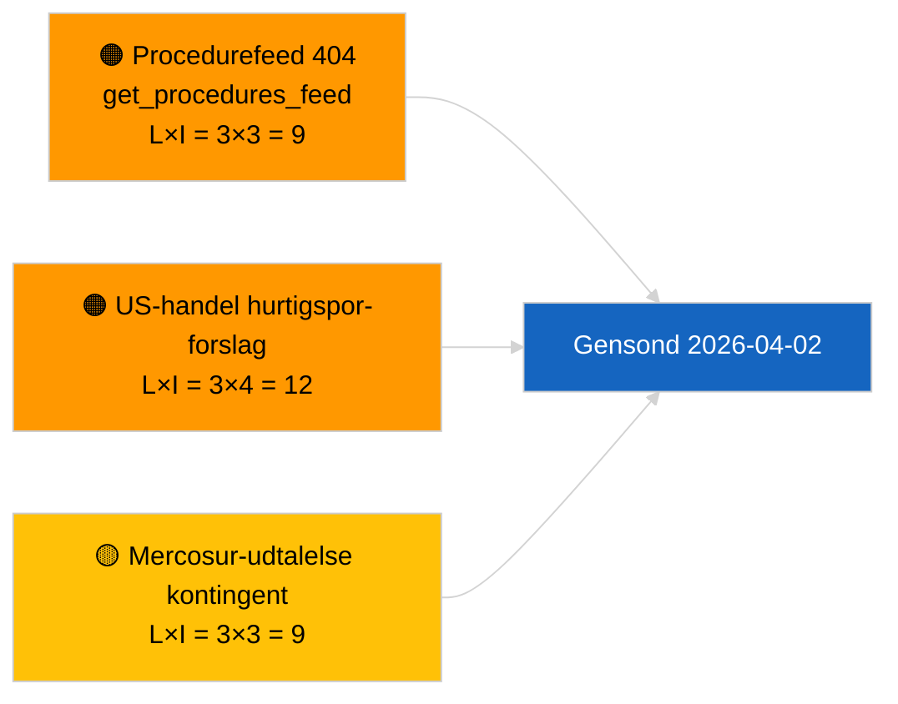

<!-- SPDX-FileCopyrightText: 2026 Hack23 AB -->
<!-- SPDX-License-Identifier: Apache-2.0 -->

# Ledelsesresumé — Forslag | 2026-04-01

**Klassifikation:** OSINT | Offentlig parlamentarisk registrering
**Konfidensniveau:** 🟢 Høj (strukturel vurdering i recessperiode)
**Genereret:** 2026-04-01T00:00:00Z (retrospektiv resumé)
**Artikeltype:** Forslag
**Kørsels-ID:** `4cf3b11a-f38e-4a3c-a81c-5c73d6eb8adc`
**Kilde:** Europa-Parlamentets åbne dataportal

---

## 🎯 BLUF

**Ingen nye Kommissions-forslag eller EP-egne initiativsager indekseret den 2026-04-01.** Analyskørsel `4cf3b11a-f38e-4a3c-a81c-5c73d6eb8adc` returnerede **0 klassificerede aktører** og **RUTINE**-betydning på tværs af alle dimensioner. EP's intersessionelle recess (27. marts → 26. april) og den samtidige `get_procedures_feed` 404-fejl (dokumenteret i søsterkørslen om seneste nyheder) forklarer datatomrummet. Det substantielle forslagsbaseline er derfor den arvede pipeline: HDV-emissionskreditter 2025–2029-ramme (TA-10-2026-0084), ECB-næstformandsprocedure (TA-10-2026-0060), rapport om bedre lovgivning (TA-10-2026-0063) og den igangværende EU-Mercosur-domstolshenvisning (TA-10-2026-0008). **🟢 HØJ konfidens** om at den tomme tilstand er kalender- og feedtilgængeligheds-drevet, ikke en pipeline-regression.

---

## 🧭 3 Beslutninger som denne resumé understøtter

| # | Beslutning | Beslutningstagere | Deadline | Dokumentation |
|:-:|------------|------------------|:--------:|--------------|
| 1 | **Redaktion:** SPRING daglige forslag over; udskyd til næste aktive session | Redaktør | +24t | Tom kørselsoutput |
| 2 | **Overvågning:** verificer `get_procedures_feed`-sundhed i næste cyklus | Datapipeline | 2026-04-02 | 404 den 2026-04-01 |
| 3 | **Fremadrettet bevakning:** spor Kommissionens april-uge-kommunikationer for nye forslag | Analyseansvarlig | 2026-04-13 | Kommissionens tabellerings-kadence |

---

## 📰 60-sekunders læsning

- 🔴 **Ingen nye procedurer åbnet** den 2026-04-01; `get_procedures_feed` 404 i parallel kørsel. (🟡 Medium — endepunkttilgængelighed er forbeholdet)
- 🟠 **0 aktører klassificeret**; ingen kommissær, GD eller rapportør identificeret. (🟢 Høj)
- 🟢 **Pipeline-videreførelse** — HDV-emissioner, ECB-næstformand, bedre lovgivning, Mercosur-henvisning forbliver den aktive forslags-beholdning i april. (🟢 Høj)
- 🟡 **Alle risikodimensioner "ingen"** — ingen akut forslagsfase-risiko markeret i dag. (🟢 Høj)
- 🔵 **Økonomisk sammenhæng:** forventede Kommissions-kvartal-2-forslag om AI-lovens gennemførelsesforordninger, strategi for forsvarsindustri og MFF-forberedende kommunikationer forbliver på bevakningslisten. (🟡 Medium — Kommissionens tabellerings-kadence)
- 🟣 **Krydshenvisning:** søsterrapporten 2026-04-01/breaking dokumenterer mønstret 6/8 rådgivende feeds 404. (🟢 Høj)
- 🩷 **Forstyrrelsesvektorer:** US-handelspres kan tvinge hurtigsporet Kommissions-forslag frem i april. (🟡 Medium)
- ⚪ **Overføring:** Mercosur ECJ-udtalelse er den højest-impact afventende forslagsudløser.

---

## 🗂️ Top-dokumenter / procedurer — Forslagsbevakning

| Rang | EP-reference | Titel (kort) | Betydning | Konfidens | Status |
|:----:|--------------|--------------|:---------:|:---------:|--------|
| 1 | — | Ingen nye forslag den 2026-04-01 | 0,0 | 🟢 HØJ | Recess + feed 404 |
| 2 | TA-10-2026-0008 | EU-Mercosur ECJ-henvisning (afventende) | 8,0 | 🟡 MEDIUM | Domstolsudtalelse forventet |
| 3 | TA-10-2026-0084 | HDV-emissionskreditter 2025–2029 | 7,0 | 🟢 HØJ | Transpositionspipeline |
| 4 | TA-10-2026-0063 | Bedre lovgivning (regulatorisk baseline) | 6,0 | 🟢 HØJ | Tværgående ramme |

---

## ⚠️ Risiko- og trusselsbillede

| Risiko | L | I | Score | Udløser | Kilde | Admiralty |
|--------|:-:|:-:|:-----:|---------|-------|:---------:|
| `get_procedures_feed`-pålidelighed | 3 | 3 | 9 | Vedvarende 404 | Søster-breaking-kørsel | B2 |
| US-handel hurtigspor-forslag | 3 | 4 | 12 | US-handling udløser Kommissions-tabelläring | TA-10-2026-0096 | A1 |
| Mercosur-udtalelse kontingent | 3 | 3 | 9 | Domstolen offentliggør | TA-10-2026-0008 | A2 |
| MFF-forberedende friktion | 3 | 4 | 12 | Kvartal-2 Kommissions-kommunikation | Kommissions-kadence | B2 |

---

## 🔮 Vigtigste fremadrettede udløser

**Kommissionens tirsdagsmøde-cyklus genoptages 7. april 2026.** Første post-påske-Kommissions-forslag tabelläres typisk ved det tidlige april-kollegiemøde; den aktuelle blanding (forsvar/digitalt/handel/klima) kalibrerer kvartal-2-forslagsbevaknlisten.

---

## 🛡️ Kildekvalitetsvurdering

- **Primære kilder:** EP's åbne dataportal — analyskørsel `4cf3b11a-f38e-4a3c-a81c-5c73d6eb8adc` og ekstern-dokument-beholdningen for marts.
- **Databegrænsninger:** `get_procedures_feed` 404 den 2026-04-01 forhindrer uafhængig korroboration af "ingen nye procedurer åbnet i dag".
- **Konfidens for kalender-drevet inaktivitet:** 🟢 HØJ.

---

## 📎 Links

| Link | Sti |
|------|-----|
| Artikel | `./article.md` |
| Klassifikation (tom) | `./classification/` |
| Søsterkørsler | `analysis/daily/2026-04-01/breaking/`, `committee-reports/`, `month-ahead/`, `motions/` |
| Manifest | `./manifest.json` |

---

## 🔄 Krydshenvisning

**Samtidige tomme skabelon-kørsler:** breaking, committee-reports, month-ahead, motions for 2026-04-01 viser alle identisk tom tilstand — bekræfter systemdækkende recess + feed-API-vilkår, ikke forslags-specifik regression.

---

**Dokumentstyring**
- **Skabelon:** `/analysis/templates/executive-brief.md`
- **Artefaktsti:** `analysis/daily/2026-04-01/propositions/executive-brief.md`
- **Klassifikation:** Offentlig
- **Retrospektiv generering:** Tilbage-fyldningssession.
