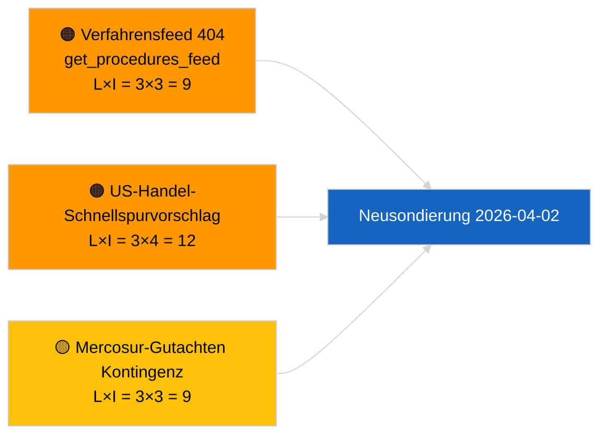

<!-- SPDX-FileCopyrightText: 2026 Hack23 AB -->
<!-- SPDX-License-Identifier: Apache-2.0 -->

# Kurzinformation — Vorschläge | 2026-04-01

**Klassifizierung:** OSINT | Öffentliche parlamentarische Aufzeichnung
**Konfidenzniveau:** 🟢 Hoch (strukturelle Bewertung in der Recessperiode)
**Erstellt:** 2026-04-01T00:00:00Z (retrospektive Zusammenfassung)
**Artikeltyp:** Vorschläge
**Lauf-ID:** `4cf3b11a-f38e-4a3c-a81c-5c73d6eb8adc`
**Quelle:** Datenportal des Europäischen Parlaments

---

## 🎯 BLUF

**Keine neuen Kommissionsvorschläge oder EP-Eigeninitiativdossiers am 2026-04-01 indiziert.** Analyselauf `4cf3b11a-f38e-4a3c-a81c-5c73d6eb8adc` lieferte **0 klassifizierte Akteure** und **ROUTINE**-Bedeutung in allen Dimensionen. Die intersessionelle EP-Pause (27. März → 26. April) und der gleichzeitige `get_procedures_feed` 404-Fehler (im Parallelreport zu aktuellen Meldungen dokumentiert) erklären die Datenlücke. Die inhaltliche Vorschlagsbaseline ist daher die übernommene Pipeline: HDV-Emissionskredite 2025–2029-Rahmen (TA-10-2026-0084), EZB-Vizepräsidentenverfahren (TA-10-2026-0060), Bericht über bessere Rechtsetzung (TA-10-2026-0063) und die laufende EU-Mercosur-Gerichtsverweisung (TA-10-2026-0008). **🟢 HOHE Konfidenz**, dass der leere Zustand kalender- und feedverfügbarkeitsbedingt ist, keine Pipeline-Regression.

---

## 🧭 3 Entscheidungen, die diese Kurzinformation unterstützt

| # | Entscheidung | Entscheider | Frist | Belege |
|:-:|--------------|-------------|:-----:|--------|
| 1 | **Redaktion:** ÜBERSPRINGEN täglich Vorschläge; Verschiebung bis zur nächsten aktiven Sitzung | Redakteur | +24h | Leere Laufausgabe |
| 2 | **Überwachung:** `get_procedures_feed`-Gesundheit beim nächsten Zyklus prüfen | Datenpipeline | 2026-04-02 | 404 am 2026-04-01 |
| 3 | **Vorausschau:** Kommissions-April-Wochenkommunikationen auf neue Vorschläge beobachten | Analyseleitung | 2026-04-13 | Kommissions-Tabellierkadenz |

---

## 📰 60-Sekunden-Lesestoff

- 🔴 **Keine neuen Verfahren eröffnet** am 2026-04-01; `get_procedures_feed` 404 im Parallellauf. (🟡 Mittel — Endpunktverfügbarkeit ist der Vorbehalt)
- 🟠 **0 Akteure klassifiziert**; kein Kommissar, GD oder Berichterstatter identifiziert. (🟢 Hoch)
- 🟢 **Pipeline-Übertrag** — HDV-Emissionen, EZB-Vizepräsident, bessere Rechtsetzung, Mercosur-Verweisung bleiben der aktive Vorschlagsbestand für April. (🟢 Hoch)
- 🟡 **Alle Risikodimensionen „keine"** — kein akutes Vorschlagsphasenrisiko heute markiert. (🟢 Hoch)
- 🔵 **Wirtschaftlicher Kontext:** erwartete Kommissions-Q2-Vorschläge zu KI-Gesetz-Durchführungsverordnungen, Verteidigungsindustriestrategie und MFF-Vorbereitungsmitteilungen bleiben auf der Beobachtungsliste. (🟡 Mittel — Kommissions-Tabellierkadenz)
- 🟣 **Querverweis:** Schwesterbericht 2026-04-01/breaking dokumentiert das Muster 6/8 beratender Feeds 404. (🟢 Hoch)
- 🩷 **Störungsvektor:** US-Handelsdruck könnte im April einen Schnellspurvorschlag der Kommission erzwingen. (🟡 Mittel)
- ⚪ **Übertrag:** Mercosur-EuGH-Gutachten ist der hochwertigste ausstehende Vorschlagsauslöser.

---

## 🗂️ Top-Dokumente / Verfahren — Vorschlagsüberwachung

| Rang | EP-Referenz | Titel (kurz) | Bedeutung | Konfidenz | Status |
|:----:|-------------|--------------|:---------:|:---------:|--------|
| 1 | — | Keine neuen Vorschläge am 2026-04-01 | 0,0 | 🟢 HOCH | Pause + Feed 404 |
| 2 | TA-10-2026-0008 | EU-Mercosur-EuGH-Verweisung (ausstehend) | 8,0 | 🟡 MITTEL | Gerichtsgutachten erwartet |
| 3 | TA-10-2026-0084 | HDV-Emissionskredite 2025–2029 | 7,0 | 🟢 HOCH | Transpositionspipeline |
| 4 | TA-10-2026-0063 | Bessere Rechtsetzung (regulatorische Basislinie) | 6,0 | 🟢 HOCH | Querschnittsrahmen |

---

## ⚠️ Risiko- und Bedrohungsübersicht

| Risiko | L | I | Wertung | Auslöser | Quelle | Admiralty |
|--------|:-:|:-:|:-------:|----------|--------|:---------:|
| `get_procedures_feed`-Zuverlässigkeit | 3 | 3 | 9 | Anhaltender 404 | Schwesterbericht breaking | B2 |
| US-Handel-Schnellspurvorschlag | 3 | 4 | 12 | US-Maßnahme löst Kommissionstabellieru ng aus | TA-10-2026-0096 | A1 |
| Mercosur-Gutachten Kontingenz | 3 | 3 | 9 | Gericht veröffentlicht | TA-10-2026-0008 | A2 |
| MFF-Vorbereitungsreibung | 3 | 4 | 12 | Q2-Kommissionsmitteilung | Kommissionskadenz | B2 |

---

## 🔮 Wichtigster Vorausauslöser

**Kommissionsdienstagssitzungszyklus wird am 7. April 2026 wieder aufgenommen.** Erste Post-Oster-Kommissionsvorschläge werden typischerweise beim frühen April-Kollegiumstreffen tabelliert; der thematische Mix (Verteidigung/Digital/Handel/Klima) kalibriert die Q2-Vorschlagsbeobachtungsliste.

---

## 🛡️ Quellqualitätsbewertung

- **Primärquellen:** EP-Datenportal — Analyselauf `4cf3b11a-f38e-4a3c-a81c-5c73d6eb8adc` und Externe-Dokumente-Inventar für März.
- **Datenbeschränkungen:** `get_procedures_feed` 404 am 2026-04-01 verhindert unabhängige Bestätigung von „heute keine neuen Verfahren eröffnet".
- **Konfidenz für kalenderbedingte Inaktivität:** 🟢 HOCH.

---

## 📎 Links

| Link | Pfad |
|------|------|
| Artikel | `./article.md` |
| Klassifizierung (leer) | `./classification/` |
| Schwesterkäufe | `analysis/daily/2026-04-01/breaking/`, `committee-reports/`, `month-ahead/`, `motions/` |
| Manifest | `./manifest.json` |

---

## 🔄 Querverweis

**Gleichzeitige leere Vorlagenläufe:** breaking, committee-reports, month-ahead, motions für 2026-04-01 zeigen alle identischen Leerzustand — bestätigt systemweite Pause- + Feed-API-Bedingungen, keine vorschlagsspezifische Regression.

---

**Dokumentenkontrolle**
- **Vorlage:** `/analysis/templates/executive-brief.md`
- **Artefaktpfad:** `analysis/daily/2026-04-01/propositions/executive-brief.md`
- **Klassifizierung:** Öffentlich
- **Retrospektive Erstellung:** Rückwirkende Auffüllsitzung.
