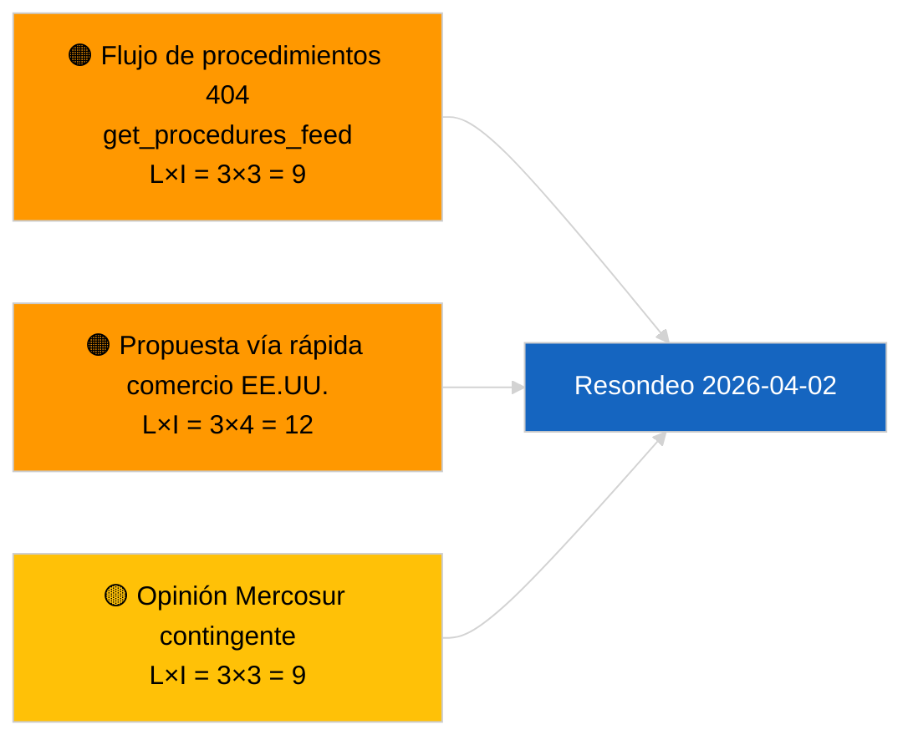

<!-- SPDX-FileCopyrightText: 2026 Hack23 AB -->
<!-- SPDX-License-Identifier: Apache-2.0 -->

# Resumen Ejecutivo — Proposiciones | 2026-04-01

**Clasificación:** OSINT | Registro parlamentario público
**Nivel de confianza:** 🟢 Alto (evaluación estructural en periodo de receso)
**Generado:** 2026-04-01T00:00:00Z (resumen retrospectivo)
**Tipo de artículo:** Proposiciones
**ID de ejecución:** `4cf3b11a-f38e-4a3c-a81c-5c73d6eb8adc`
**Fuente:** Portal de datos abiertos del Parlamento Europeo

---

## 🎯 BLUF

**No se indexaron nuevas propuestas de la Comisión ni expedientes de iniciativa propia del PE el 2026-04-01.** La ejecución de análisis `4cf3b11a-f38e-4a3c-a81c-5c73d6eb8adc` devolvió **0 actores clasificados** y significación **RUTINARIA** en todas las dimensiones. El receso intersesional del PE (27 de marzo → 26 de abril) y el error `get_procedures_feed` 404 simultáneo (documentado en la ejecución paralela de últimas noticias) explican el vacío de datos. La base sustantiva de proposiciones es, por tanto, la canalización heredada: marco de créditos de emisiones HDV 2025–2029 (TA-10-2026-0084), procedimiento del vicepresidente del BCE (TA-10-2026-0060), informe de mejora legislativa (TA-10-2026-0063) y la remisión pendiente EU-Mercosur ante el Tribunal de Justicia (TA-10-2026-0008). **🟢 ALTA confianza** en que el estado vacío es consecuencia del calendario y la disponibilidad del flujo, no de una regresión de la canalización.

---

## 🧭 3 Decisiones que apoya este resumen

| # | Decisión | Responsable | Plazo | Evidencia |
|:-:|----------|------------|:-----:|-----------|
| 1 | **Editorial:** OMITIR proposiciones diarias; posponer a la próxima sesión activa | Editor | +24h | Salida de ejecución vacía |
| 2 | **Supervisión:** verificar el estado de `get_procedures_feed` en el próximo ciclo | Tubería de datos | 2026-04-02 | 404 el 2026-04-01 |
| 3 | **Vigilancia prospectiva:** rastrear las comunicaciones semanales de abril de la Comisión para nuevas propuestas | Responsable de análisis | 2026-04-13 | Cadencia de tabulación de la Comisión |

---

## 📰 Lectura de 60 segundos

- 🔴 **No se abrieron nuevos procedimientos** el 2026-04-01; `get_procedures_feed` 404 en ejecución paralela. (🟡 Medio — la disponibilidad del punto final es la salvedad)
- 🟠 **0 actores clasificados**; ningún comisario, DG ni ponente identificado. (🟢 Alto)
- 🟢 **Traslado de canalización** — emisiones HDV, vicepresidente BCE, mejora legislativa, remisión Mercosur siguen siendo el inventario activo de proposiciones en abril. (🟢 Alto)
- 🟡 **Todas las dimensiones de riesgo "ninguna"** — ningún riesgo agudo en la fase de proposiciones marcado hoy. (🟢 Alto)
- 🔵 **Contexto económico:** las propuestas de la Comisión T2 previstas sobre reglamentos de ejecución de la Ley de IA, la Estrategia Industrial de Defensa y las comunicaciones preparatorias del MFF siguen en la lista de seguimiento. (🟡 Medio — cadencia de tabulación de la Comisión)
- 🟣 **Referencia cruzada:** el informe paralelo 2026-04-01/breaking documenta el patrón 6/8 de flujos consultivos 404. (🟢 Alto)
- 🩷 **Vector de perturbación:** la presión comercial de EE. UU. podría forzar una propuesta de vía rápida de la Comisión en abril. (🟡 Medio)
- ⚪ **Traslado:** la opinión del TJUE sobre Mercosur es el desencadenante pendiente de mayor impacto en proposiciones.

---

## 🗂️ Principales documentos / procedimientos — Seguimiento de proposiciones

| Rango | Referencia PE | Título (abreviado) | Importancia | Confianza | Estado |
|:-----:|---------------|-------------------|:-----------:|:---------:|--------|
| 1 | — | No hay nuevas proposiciones el 2026-04-01 | 0,0 | 🟢 ALTA | Receso + flujo 404 |
| 2 | TA-10-2026-0008 | Remisión EU-Mercosur ante el TJUE (pendiente) | 8,0 | 🟡 MEDIA | Opinión del Tribunal esperada |
| 3 | TA-10-2026-0084 | Créditos de emisiones HDV 2025–2029 | 7,0 | 🟢 ALTA | Canalización de transposición |
| 4 | TA-10-2026-0063 | Mejora legislativa (base regulatoria) | 6,0 | 🟢 ALTA | Marco transversal |

---

## ⚠️ Instantánea de riesgos y amenazas

| Riesgo | L | I | Puntuación | Desencadenante | Fuente | Admiralty |
|--------|:-:|:-:|:----------:|----------------|--------|:---------:|
| Fiabilidad `get_procedures_feed` | 3 | 3 | 9 | 404 persistente | Informe sœur breaking | B2 |
| Propuesta vía rápida comercio EE.UU. | 3 | 4 | 12 | Acción EE.UU. activa tabulación Comisión | TA-10-2026-0096 | A1 |
| Opinión Mercosur contingente | 3 | 3 | 9 | Tribunal publica | TA-10-2026-0008 | A2 |
| Fricción preparatoria MFF | 3 | 4 | 12 | Comunicación Comisión T2 | Cadencia Comisión | B2 |

---

## 🔮 Principal desencadenante prospectivo

**El ciclo de reuniones de los martes de la Comisión se reanuda el 7 de abril de 2026.** Las primeras propuestas post-Semana Santa de la Comisión se suelen tabular en la reunión del Colegio de principios de abril; el mix temático (defensa/digital/comercio/clima) calibra la lista de seguimiento de proposiciones del T2.

---

## 🛡️ Evaluación de la calidad de las fuentes

- **Fuentes primarias:** Portal de datos abiertos del PE — ejecución de análisis `4cf3b11a-f38e-4a3c-a81c-5c73d6eb8adc` e inventario de documentos externos de marzo.
- **Limitaciones de datos:** `get_procedures_feed` 404 el 2026-04-01 impide la corroboración independiente de "no se abrieron nuevos procedimientos hoy".
- **Confianza en la inactividad por motivos de calendario:** 🟢 ALTA.

---

## 📎 Enlaces

| Enlace | Ruta |
|--------|------|
| Artículo | `./article.md` |
| Clasificación (vacía) | `./classification/` |
| Ejecuciones hermanas | `analysis/daily/2026-04-01/breaking/`, `committee-reports/`, `month-ahead/`, `motions/` |
| Manifiesto | `./manifest.json` |

---

## 🔄 Referencia cruzada

**Ejecuciones de plantillas vacías simultáneas:** breaking, committee-reports, month-ahead, motions del 2026-04-01 muestran todas un estado vacío idéntico — confirma condiciones de receso a nivel de sistema + API de flujo, sin regresión específica de proposiciones.

---

**Control del documento**
- **Plantilla:** `/analysis/templates/executive-brief.md`
- **Ruta del artefacto:** `analysis/daily/2026-04-01/propositions/executive-brief.md`
- **Clasificación:** Pública
- **Generación retrospectiva:** Sesión de relleno retroactivo.
