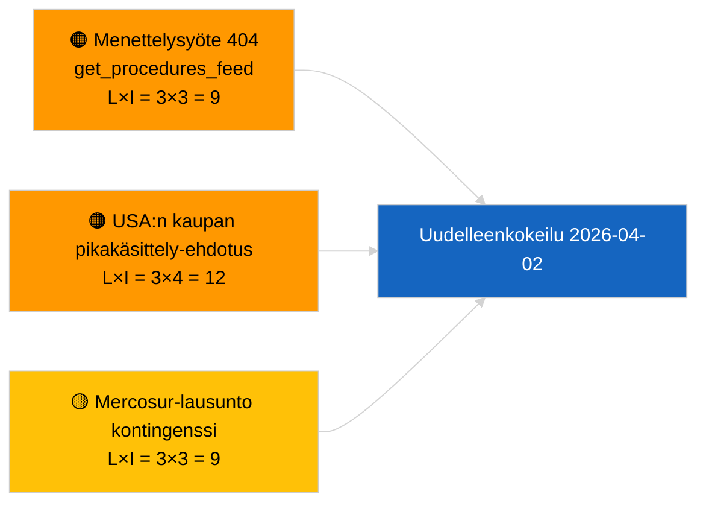

<!-- SPDX-FileCopyrightText: 2026 Hack23 AB -->
<!-- SPDX-License-Identifier: Apache-2.0 -->

# Johdon yhteenveto — Ehdotukset | 2026-04-01

**Luokitus:** OSINT | Julkinen parlamentaarinen asiakirja
**Luotettavuus:** 🟢 Korkea (rakenteellinen arviointi istuntotauon aikana)
**Luotu:** 2026-04-01T00:00:00Z (takautuva yhteenveto)
**Artikkelityyppi:** Ehdotukset
**Ajoidentifikaattori:** `4cf3b11a-f38e-4a3c-a81c-5c73d6eb8adc`
**Lähde:** Euroopan parlamentin avoin dataportti

---

## 🎯 BLUF

**Uusia komission ehdotuksia tai EP:n omia aloitekäsittelyjä ei indeksoitu 2026-04-01.** Analyysiajoitus `4cf3b11a-f38e-4a3c-a81c-5c73d6eb8adc` palautti **0 luokiteltua toimijaa** ja **RUTIINITASON** merkityksen kaikissa ulottuvuuksissa. EP:n istuntojen välinen tauko (27. maaliskuuta → 26. huhtikuuta) ja samanaikainen `get_procedures_feed` 404-virhe (dokumentoitu rinnakkaisessa breaking-ajossa) selittävät datavajeen. Substantiaalinen ehdotusten peruslinja on siksi peritty putkisto: HDV-päästöhyvitykset 2025–2029-kehys (TA-10-2026-0084), EKP:n varapuheenjohtajamenettely (TA-10-2026-0060), paremman lainsäädännön raportti (TA-10-2026-0063) ja käynnissä oleva EU:n ja Mercosur-maiden tuomioistuinviittaus (TA-10-2026-0008). **🟢 KORKEA luotettavuus** siitä, että tyhjä tila johtuu kalenterista ja syötteiden saatavuudesta, ei putkiston regressiosta.

---

## 🧭 3 Päätöstä, joita tämä yhteenveto tukee

| # | Päätös | Päätöksentekijä | Määräaika | Näyttö |
|:-:|--------|----------------|:---------:|--------|
| 1 | **Toimituksellinen:** OHITA päivittäiset ehdotukset; lykkää seuraavaan aktiiviseen istuntoon | Toimittaja | +24h | Tyhjä ajotulos |
| 2 | **Seuranta:** varmista `get_procedures_feed`-terveys seuraavalla syklillä | Dataputkisto | 2026-04-02 | 404 päivänä 2026-04-01 |
| 3 | **Eteenpäin katsova seuranta:** seuraa komission huhtikuun viikkotiedotteita uusien ehdotusten varalta | Analyysipäällikkö | 2026-04-13 | Komission taulukointi-kadenssi |

---

## 📰 60 sekunnin lukeminen

- 🔴 **Uusia menettelyjä ei avattu** 2026-04-01; `get_procedures_feed` 404 rinnakkaisajossa. (🟡 Keskitaso — päätepisteiden saatavuus on varaus)
- 🟠 **0 toimijaa luokiteltu**; yhtään komissaaria, pääosastoa tai esittelijää ei tunnistettu. (🟢 Korkea)
- 🟢 **Putkiston siirtymä** — HDV-päästöt, EKP:n varapuheenjohtaja, parempi lainsäädäntö, Mercosur-viittaus pysyvät aktiivisena ehdotusten varastona huhtikuulle. (🟢 Korkea)
- 🟡 **Kaikki riskin ulottuvuudet "ei mitään"** — yhtään akuuttia ehdotusvaiheen riskiä ei merkitty tänään. (🟢 Korkea)
- 🔵 **Taloudellinen konteksti:** odotetut komission 2. neljänneksen ehdotukset tekoälylain täytäntöönpanosäädöksistä, puolustusteollisuuden strategiasta ja MFF-valmisteluviesteistä pysyvät seurantalistalla. (🟡 Keskitaso — komission taulukointi-kadenssi)
- 🟣 **Ristiviittaus:** sisarjulkaisu 2026-04-01/breaking dokumentoi 6/8 neuvoa-antavien syötteiden 404-mallin. (🟢 Korkea)
- 🩷 **Häiriövektori:** yhdysvaltalainen kauppapaine voi pakottaa komission pikakäsittely-ehdotuksen huhtikuussa. (🟡 Keskitaso)
- ⚪ **Siirtymä:** Mercosur EYT-lausunto on korkein vaikutteinen odottava ehdotusten käynnistin.

---

## 🗂️ Huippuasiakirjat / menettelyt — Ehdotusten seuranta

| Sija | EP-viite | Otsikko (lyhyt) | Merkitys | Luotettavuus | Tila |
|:----:|----------|-----------------|:--------:|:------------:|------|
| 1 | — | Ei uusia ehdotuksia 2026-04-01 | 0,0 | 🟢 KORKEA | Tauko + syöte 404 |
| 2 | TA-10-2026-0008 | EU:n ja Mercosur-maiden EYT-viittaus (odottava) | 8,0 | 🟡 KESKITASO | Tuomioistuinlausunto odotetaan |
| 3 | TA-10-2026-0084 | HDV-päästöhyvitykset 2025–2029 | 7,0 | 🟢 KORKEA | Täytäntöönpanoputkisto |
| 4 | TA-10-2026-0063 | Parempi lainsäädäntö (sääntelypohja) | 6,0 | 🟢 KORKEA | Läpileikkaava kehys |

---

## ⚠️ Riski- ja uhka-arvio

| Riski | L | I | Pistemäärä | Käynnistin | Lähde | Admiralty |
|-------|:-:|:-:|:----------:|------------|-------|:---------:|
| `get_procedures_feed`-luotettavuus | 3 | 3 | 9 | Jatkuva 404 | Sisarjulkaisu breaking-ajo | B2 |
| USA:n kaupan pikakäsittely-ehdotus | 3 | 4 | 12 | USA:n toimet käynnistävät komission taulukoinnin | TA-10-2026-0096 | A1 |
| Mercosur-lausunto kontingenssi | 3 | 3 | 9 | Tuomioistuin julkaisee | TA-10-2026-0008 | A2 |
| MFF-valmistelun kitka | 3 | 4 | 12 | 2. neljänneksen komission tiedote | Komission kadenssi | B2 |

---

## 🔮 Tärkein eteenpäin katsova käynnistin

**Komission tiistaikokousten sykli jatkuu 7. huhtikuuta 2026.** Ensimmäiset pääsiäisen jälkeiset komission ehdotukset taulukoidaan tyypillisesti huhtikuun alussa pidettävässä kollegiokokouksessa; aihejakauma (puolustus/digitaalisuus/kauppa/ilmasto) kalibroi 2. neljänneksen ehdotusten seurantalistan.

---

## 🛡️ Lähdekvaliteettiarvio

- **Ensisijaiset lähteet:** EP:n avoin dataportti — analyysiajoitus `4cf3b11a-f38e-4a3c-a81c-5c73d6eb8adc` ja ulkoisten asiakirjojen varasto maaliskuulta.
- **Datarajoitukset:** `get_procedures_feed` 404 päivänä 2026-04-01 estää riippumattoman vahvistuksen "uusia menettelyjä ei avattu tänään".
- **Luotettavuus kalenteriohjatusta passiivisuudesta:** 🟢 KORKEA.

---

## 📎 Linkit

| Linkki | Polku |
|--------|-------|
| Artikkeli | `./article.md` |
| Luokitus (tyhjä) | `./classification/` |
| Sisarajot | `analysis/daily/2026-04-01/breaking/`, `committee-reports/`, `month-ahead/`, `motions/` |
| Manifesti | `./manifest.json` |

---

## 🔄 Ristiviittaus

**Samanaikaiset tyhjät malliajoitukset:** breaking, committee-reports, month-ahead, motions 2026-04-01 osoittavat kaikki identtisen tyhjän tilan — vahvistaa järjestelmänlaajuiset tauko- ja syöte-API-olosuhteet, ei ehdotuskohtaista regressiota.

---

**Asiakirjan hallinta**
- **Malli:** `/analysis/templates/executive-brief.md`
- **Artefaktipolku:** `analysis/daily/2026-04-01/propositions/executive-brief.md`
- **Luokitus:** Julkinen
- **Takautuva luonti:** Täyttöistunto.
