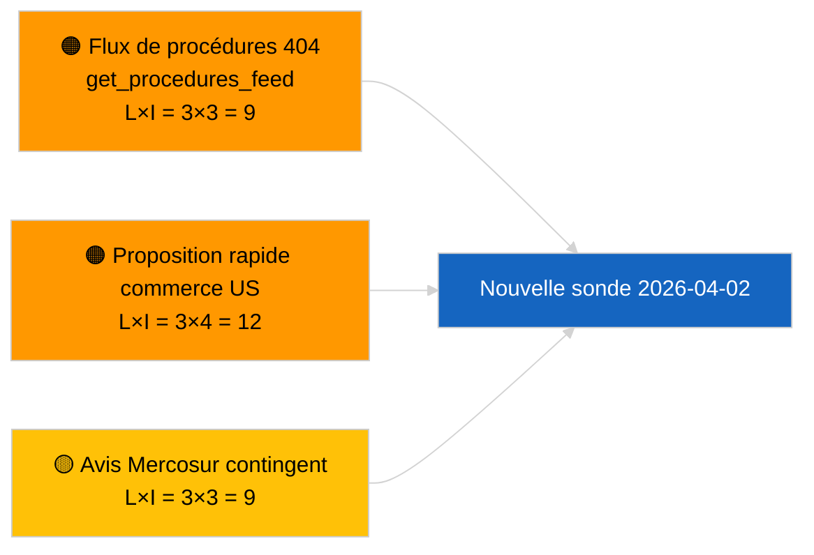

<!-- SPDX-FileCopyrightText: 2026 Hack23 AB -->
<!-- SPDX-License-Identifier: Apache-2.0 -->

# Note de synthèse — Propositions | 2026-04-01

**Classification :** OSINT | Document parlementaire public
**Niveau de confiance :** 🟢 Élevé (évaluation structurelle en période de recess)
**Généré :** 2026-04-01T00:00:00Z (synthèse rétrospective)
**Type d'article :** Propositions
**ID de session :** `4cf3b11a-f38e-4a3c-a81c-5c73d6eb8adc`
**Source :** Portail de données ouvert du Parlement européen

---

## 🎯 BLUF

**Aucune nouvelle proposition de la Commission ni dossier d'initiative propre du PE n'a été indexé le 2026-04-01.** La session d'analyse `4cf3b11a-f38e-4a3c-a81c-5c73d6eb8adc` a renvoyé **0 acteur classifié** et un niveau de signification **ROUTINIER** dans toutes les dimensions. La session intersessionnelle du PE (27 mars → 26 avril) et l'erreur `get_procedures_feed` 404 simultanée (consignée dans l'exécution sœur relative aux informations en cours) expliquent le vide de données. La base substantielle des propositions est donc la pipeline héritée : cadre de crédits d'émissions HDV 2025–2029 (TA-10-2026-0084), procédure du vice-président de la BCE (TA-10-2026-0060), rapport Mieux légiférer (TA-10-2026-0063) et le renvoi en cours EU-Mercosur devant la Cour de justice (TA-10-2026-0008). **🟢 Confiance ÉLEVÉE** que l'état vide est lié au calendrier et à la disponibilité du flux, et non à une régression de la pipeline.

---

## 🧭 3 Décisions que cette synthèse soutient

| # | Décision | Décideur | Échéance | Éléments de preuve |
|:-:|----------|----------|:--------:|-------------------|
| 1 | **Éditorial :** IGNORER les propositions quotidiennes ; reporter à la prochaine session active | Éditeur | +24h | Sortie d'exécution vide |
| 2 | **Surveillance :** vérifier la santé de `get_procedures_feed` au prochain cycle | Pipeline de données | 2026-04-02 | 404 le 2026-04-01 |
| 3 | **Veille prospective :** suivre les communications hebdomadaires d'avril de la Commission pour de nouvelles propositions | Responsable analyse | 2026-04-13 | Cadence de tabellarisation de la Commission |

---

## 📰 Lecture de 60 secondes

- 🔴 **Aucune nouvelle procédure ouverte** le 2026-04-01 ; `get_procedures_feed` 404 lors de l'exécution parallèle. (🟡 Moyen — la disponibilité du point de terminaison est le caveat)
- 🟠 **0 acteur classifié** ; aucun commissaire, DG ou rapporteur identifié. (🟢 Élevé)
- 🟢 **Report de pipeline** — émissions HDV, vice-président BCE, Mieux légiférer, renvoi Mercosur constituent le stock actif de propositions entrant en avril. (🟢 Élevé)
- 🟡 **Toutes les dimensions de risque « aucune »** — aucun risque aigu au stade des propositions signalé aujourd'hui. (🟢 Élevé)
- 🔵 **Contexte économique :** les propositions attendues de la Commission au T2 concernant les règlements d'application de l'IA Act, la Stratégie industrielle de défense et les communications préparatoires au CFP restent dans la liste de surveillance. (🟡 Moyen — cadence de tabellarisation de la Commission)
- 🟣 **Référence croisée :** le rapport sœur 2026-04-01/breaking documente le schéma 6/8 flux consultatifs 404. (🟢 Élevé)
- 🩷 **Vecteur de perturbation :** la pression commerciale américaine pourrait forcer une proposition rapide de la Commission en avril. (🟡 Moyen)
- ⚪ **Report :** l'avis Mercosur de la CJE est le déclencheur de propositions en attente à impact le plus élevé.

---

## 🗂️ Principaux documents / procédures — Veille des propositions

| Rang | Référence PE | Titre (court) | Signification | Confiance | Statut |
|:----:|--------------|---------------|:-------------:|:---------:|--------|
| 1 | — | Aucune nouvelle proposition le 2026-04-01 | 0,0 | 🟢 ÉLEVÉE | Recess + flux 404 |
| 2 | TA-10-2026-0008 | Renvoi EU-Mercosur devant la CJE (en attente) | 8,0 | 🟡 MOYEN | Avis de la Cour attendu |
| 3 | TA-10-2026-0084 | Crédits d'émissions HDV 2025–2029 | 7,0 | 🟢 ÉLEVÉE | Pipeline de transposition |
| 4 | TA-10-2026-0063 | Mieux légiférer (base réglementaire) | 6,0 | 🟢 ÉLEVÉE | Cadre transversal |

---

## ⚠️ Tableau des risques et menaces

| Risque | L | I | Score | Déclencheur | Source | Admiralty |
|--------|:-:|:-:|:-----:|-------------|--------|:---------:|
| Fiabilité `get_procedures_feed` | 3 | 3 | 9 | 404 persistant | Rapport sœur breaking | B2 |
| Proposition rapide commerce US | 3 | 4 | 12 | Action US déclenche la tabellarisation Commission | TA-10-2026-0096 | A1 |
| Avis Mercosur contingent | 3 | 3 | 9 | La Cour publie | TA-10-2026-0008 | A2 |
| Friction préparatoire CFP | 3 | 4 | 12 | Communication Commission T2 | Cadence Commission | B2 |

---

## 🔮 Principal déclencheur prospectif

**Le cycle de réunions du mardi de la Commission reprend le 7 avril 2026.** Les premières propositions post-Pâques de la Commission sont généralement tabellarisées lors de la réunion du collège de début avril ; le mix thématique (défense/numérique/commerce/climat) calibre la liste de surveillance des propositions T2.

---

## 🛡️ Évaluation de la qualité des sources

- **Sources primaires :** Portail de données ouvert du PE — session d'analyse `4cf3b11a-f38e-4a3c-a81c-5c73d6eb8adc` et inventaire des documents externes pour mars.
- **Limites des données :** `get_procedures_feed` 404 le 2026-04-01 empêche la corroboration indépendante de « aucune nouvelle procédure ouverte aujourd'hui ».
- **Confiance pour l'inactivité due au calendrier :** 🟢 ÉLEVÉE.

---

## 📎 Liens

| Lien | Chemin |
|------|--------|
| Article | `./article.md` |
| Classification (vide) | `./classification/` |
| Exécutions sœurs | `analysis/daily/2026-04-01/breaking/`, `committee-reports/`, `month-ahead/`, `motions/` |
| Manifeste | `./manifest.json` |

---

## 🔄 Référence croisée

**Exécutions de modèles vides simultanées :** breaking, committee-reports, month-ahead, motions pour le 2026-04-01 affichent tous un état vide identique — confirme les conditions de recess à l'échelle du système + API de flux, pas de régression spécifique aux propositions.

---

**Contrôle du document**
- **Modèle :** `/analysis/templates/executive-brief.md`
- **Chemin d'artefact :** `analysis/daily/2026-04-01/propositions/executive-brief.md`
- **Classification :** Publique
- **Génération rétrospective :** Session de remplissage rétroactif.
