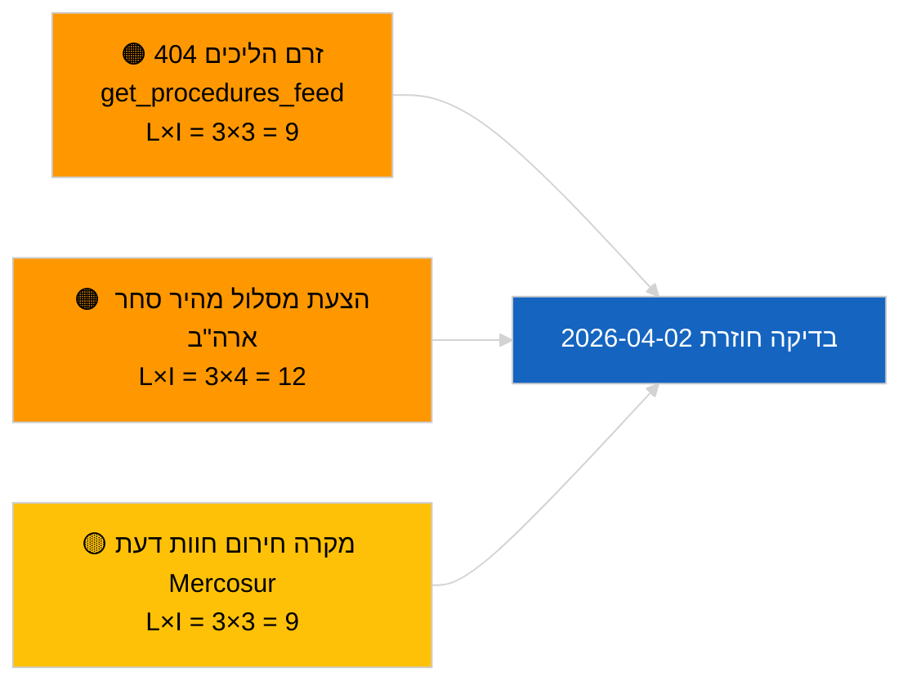

<!-- SPDX-FileCopyrightText: 2026 Hack23 AB -->
<!-- SPDX-License-Identifier: Apache-2.0 -->

# תקציר מנהלים — הצעות | 2026-04-01

**סיווג:** OSINT | רשומה פרלמנטרית ציבורית
**רמת אמינות:** 🟢 גבוהה (הערכה מבנית בתקופת הפגרה)
**נוצר:** 2026-04-01T00:00:00Z (תקציר רטרואקטיבי)
**סוג המאמר:** הצעות
**מזהה ריצה:** `4cf3b11a-f38e-4a3c-a81c-5c73d6eb8adc`
**מקור:** פורטל הנתונים הפתוח של הפרלמנט האירופי

---

## 🎯 BLUF

**לא נוספו הצעות חדשות של הנציבות או תיקים ביוזמה עצמאית של הפרלמנט האירופי בתאריך 2026-04-01.** ריצת הניתוח `4cf3b11a-f38e-4a3c-a81c-5c73d6eb8adc` החזירה **0 שחקנים מסווגים** ומשמעות **שגרתית** בכל הממדים. פגרת הפרלמנט בין-מושבית (27 במרץ → 26 באפריל) והשגיאה המקבילה `get_procedures_feed` 404 (מתועדת בדוח האחים על חדשות שוטפות) מסבירים את ריק הנתונים. בסיס ההצעות המהותי הוא לפיכך הצינור הירוש: מסגרת זיכויי פליטות רכבים כבדים 2025–2029 (TA-10-2026-0084), הליך סגן נשיא הבנק המרכזי האירופי (TA-10-2026-0060), דוח חקיקה טובה יותר (TA-10-2026-0063) והפנייה הפעילה לבית המשפט EU-Mercosur (TA-10-2026-0008). **🟢 אמינות גבוהה** שהמצב הריק נובע מלוח זמנים ותפקוד הזרם, לא מנסיגה בצינור.

---

## 🧭 3 החלטות שתקציר זה תומך בהן

| # | החלטה | מקבל ההחלטה | מועד אחרון | ראיות |
|:-:|-------|------------|:-----------:|------|
| 1 | **עריכה:** דלג על הצעות יומיות; דחה למושב הפעיל הבא | עורך | +24 שעות | פלט ריצה ריק |
| 2 | **ניטור:** אמת את תקינות `get_procedures_feed` במחזור הבא | צינור נתונים | 2026-04-02 | 404 ב-2026-04-01 |
| 3 | **מעקב צופה פני עתיד:** עקוב אחר תקשורת שבוע אפריל של הנציבות להצעות חדשות | ראש ניתוח | 2026-04-13 | קצב הטבלה של הנציבות |

---

## 📰 קריאה של 60 שניות

- 🔴 **לא נפתחו הליכים חדשים** ב-2026-04-01; `get_procedures_feed` 404 בריצה מקבילה. (🟡 בינוני — זמינות נקודת הקצה היא ההסתייגות)
- 🟠 **0 שחקנים מסווגים**; לא זוהו נציב, מנכ"ל או מדווח. (🟢 גבוה)
- 🟢 **העברת צינור** — פליטות רכבים כבדים, סגן נשיא הבנק המרכזי האירופי, חקיקה טובה יותר, הפנייה Mercosur נשארים המלאי הפעיל של ההצעות לאפריל. (🟢 גבוה)
- 🟡 **כל ממדי הסיכון "אין"** — לא סומן סיכון חריף בשלב ההצעות היום. (🟢 גבוה)
- 🔵 **הקשר כלכלי:** הצעות רבעון 2 הצפויות של הנציבות לגבי תקנות יישום חוק הבינה המלאכותית, אסטרטגיית התעשייה הביטחונית ותקשורת ההכנה ל-MFF נותרות ברשימת המעקב. (🟡 בינוני — קצב הטבלה של הנציבות)
- 🟣 **הפניה צולבת:** הדוח האחים 2026-04-01/breaking מתעד את תבנית 6/8 של זרמי 404 ייעוציים. (🟢 גבוה)
- 🩷 **וקטור שיבוש:** לחץ סחר אמריקאי עלול לאלץ הצעה במסלול מהיר מהנציבות באפריל. (🟡 בינוני)
- ⚪ **העברה:** חוות דעת בית המשפט האירופי בנושא Mercosur היא ה-Trigger המצפה בעל ההשפעה הגבוהה ביותר על ההצעות.

---

## 🗂️ מסמכים מובילים / הליכים — מעקב הצעות

| דירוג | אסמכתא לפרלמנט | כותרת (קצרה) | חשיבות | אמינות | סטטוס |
|:------:|----------------|--------------|:------:|:------:|-------|
| 1 | — | אין הצעות חדשות ב-2026-04-01 | 0.0 | 🟢 גבוהה | פגרה + זרם 404 |
| 2 | TA-10-2026-0008 | הפנייה EU-Mercosur לבית המשפט (ממתינה) | 8.0 | 🟡 בינונית | חוות דעת המשפט מצופה |
| 3 | TA-10-2026-0084 | זיכויי פליטות רכבים כבדים 2025–2029 | 7.0 | 🟢 גבוהה | צינור טרנספוזיציה |
| 4 | TA-10-2026-0063 | חקיקה טובה יותר (בסיס רגולטורי) | 6.0 | 🟢 גבוהה | מסגרת חוצת-נושאים |

---

## ⚠️ תמונת מצב סיכונים ואיומים

| סיכון | L | I | ציון | טריגר | מקור | Admiralty |
|------|:-:|:-:|:----:|-------|------|:---------:|
| אמינות `get_procedures_feed` | 3 | 3 | 9 | 404 מתמשך | דוח אחים breaking | B2 |
| הצעת מסלול מהיר סחר ארה"ב | 3 | 4 | 12 | פעולה אמריקאית מפעילה טבלה של הנציבות | TA-10-2026-0096 | A1 |
| מקרה חירום חוות דעת Mercosur | 3 | 3 | 9 | בית המשפט פרסם | TA-10-2026-0008 | A2 |
| חיכוך הכנה ל-MFF | 3 | 4 | 12 | תקשורת נציבות רבעון 2 | קצב הנציבות | B2 |

---

## 🔮 הטריגר העתידי הראשי

**מחזור ישיבות יום שלישי של הנציבות מתחדש ב-7 באפריל 2026.** ההצעות הראשונות של הנציבות לאחר חג הפסחא מוטבלות בדרך כלל בישיבת הקולגיום של תחילת אפריל; המיקס הנושאי (ביטחון/דיגיטלי/סחר/אקלים) מכייל את רשימת מעקב הצעות רבעון 2.

---

## 🛡️ הערכת איכות המקורות

- **מקורות ראשוניים:** פורטל הנתונים הפתוח של הפרלמנט האירופי — ריצת ניתוח `4cf3b11a-f38e-4a3c-a81c-5c73d6eb8adc` ומלאי מסמכים חיצוניים לחודש מרץ.
- **מגבלות נתונים:** `get_procedures_feed` 404 ב-2026-04-01 מונע אימות עצמאי של "לא נפתחו הליכים חדשים היום".
- **אמינות לחוסר פעילות מונע לוח זמנים:** 🟢 גבוהה.

---

## 📎 קישורים

| קישור | נתיב |
|-------|------|
| מאמר | `./article.md` |
| סיווג (ריק) | `./classification/` |
| ריצות אחים | `analysis/daily/2026-04-01/breaking/`, `committee-reports/`, `month-ahead/`, `motions/` |
| מניפסט | `./manifest.json` |

---

## 🔄 הפניה צולבת

**ריצות תבנית ריקות בו-זמניות:** breaking, committee-reports, month-ahead, motions ל-2026-04-01 כולן מציגות מצב ריק זהה — מאשש תנאי פגרה ו-API זרם ברמת המערכת, לא נסיגה ספציפית להצעות.

---

**בקרת מסמכים**
- **תבנית:** `/analysis/templates/executive-brief.md`
- **נתיב תוצר:** `analysis/daily/2026-04-01/propositions/executive-brief.md`
- **סיווג:** ציבורי
- **יצירה רטרואקטיבית:** מושב מילוי לאחור.
