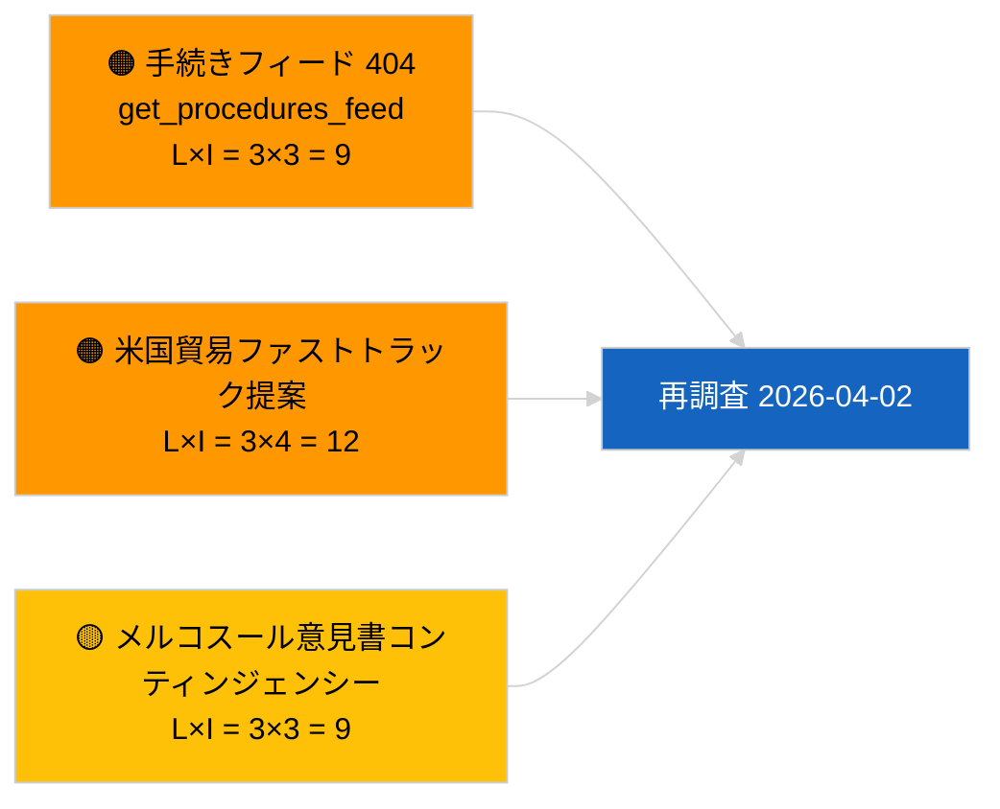

<!-- SPDX-FileCopyrightText: 2026 Hack23 AB -->
<!-- SPDX-License-Identifier: Apache-2.0 -->

# エグゼクティブ・ブリーフ — 提案 | 2026-04-01

**分類：** OSINT | 公開議会記録
**信頼度：** 🟢 高（休会期間の構造的評価）
**作成日：** 2026-04-01T00:00:00Z（遡及ブリーフ）
**記事種別：** 提案
**実行ID：** `4cf3b11a-f38e-4a3c-a81c-5c73d6eb8adc`
**出典：** 欧州議会オープンデータポータル

---

## 🎯 BLUF

**2026-04-01 付けで欧州委員会の新規提案および欧州議会独自イニシアティブ案件はインデックスされませんでした。** 分析実行 `4cf3b11a-f38e-4a3c-a81c-5c73d6eb8adc` は**分類済み主体 0 件**、全次元にわたる**定型的（ROUTINE）**重要度を返しました。欧州議会の会期間休会（3月27日→4月26日）および並行実行中の `get_procedures_feed` 404 エラー（関連する速報実行に記録済み）がデータ空白を説明しています。したがって、実質的な提案ベースラインは引き継がれたパイプライン、すなわち HDV 排出クレジット 2025–2029 フレームワーク（TA-10-2026-0084）、ECB 副総裁手続き（TA-10-2026-0060）、より良い法律作りレポート（TA-10-2026-0063）、および進行中の EU-メルコスール欧州司法裁判所付託（TA-10-2026-0008）です。空の状態がカレンダーとフィード可用性に起因し、パイプライン後退ではないことについての**🟢 高い信頼度**があります。

---

## 🧭 このブリーフが支援する 3 つの意思決定

| # | 意思決定 | 決定者 | 期限 | 根拠 |
|:-:|---------|-------|:----:|------|
| 1 | **編集：** 日次提案をスキップ；次の活動会期まで延期 | 編集者 | +24時間 | 空の実行出力 |
| 2 | **監視：** 次サイクルで `get_procedures_feed` の健全性を検証 | データパイプライン | 2026-04-02 | 2026-04-01 の 404 |
| 3 | **前向き監視：** 新提案について欧州委員会の4月週次通信を追跡 | 分析リード | 2026-04-13 | 欧州委員会の提出ケイデンス |

---

## 📰 60 秒の要約

- 🔴 **2026-04-01 に新規手続き開始なし**；並行実行で `get_procedures_feed` 404 発生。（🟡 中 — エンドポイント可用性が注意事項）
- 🟠 **分類済み主体 0 件**；委員、DG、報告者いずれも特定されず。（🟢 高）
- 🟢 **パイプライン持ち越し** — HDV 排出、ECB 副総裁、より良い法律作り、メルコスール付託は4月に向けたアクティブな提案在庫のまま。（🟢 高）
- 🟡 **すべてのリスク次元「なし」** — 本日、提案フェーズでの急性リスクなし。（🟢 高）
- 🔵 **経済的文脈：** AI 法実施規則、防衛産業戦略、MFF 準備通信に関する欧州委員会 Q2 提案（予定）はウォッチリストに残存。（🟡 中 — 欧州委員会の提出ケイデンス）
- 🟣 **クロスリファレンス：** 関連レポート 2026-04-01/breaking が 6/8 の諮問フィード 404 パターンを記録。（🟢 高）
- 🩷 **混乱ベクター：** 米国の貿易圧力が4月中に欧州委員会の迅速提案を強制する可能性あり。（🟡 中）
- ⚪ **持ち越し：** メルコスール欧州司法裁判所意見書は最も影響の大きい保留中の提案トリガー。

---

## 🗂️ 主要文書 / 手続き — 提案ウォッチ

| 順位 | EP 参照 | 表題（略称） | 重要度 | 信頼度 | 状況 |
|:---:|---------|------------|:-----:|:-----:|------|
| 1 | — | 2026-04-01 に新規提案なし | 0.0 | 🟢 高 | 休会＋フィード 404 |
| 2 | TA-10-2026-0008 | EU-メルコスール ECJ 付託（保留中） | 8.0 | 🟡 中 | 裁判所意見書待ち |
| 3 | TA-10-2026-0084 | HDV 排出クレジット 2025–2029 | 7.0 | 🟢 高 | 転置パイプライン |
| 4 | TA-10-2026-0063 | より良い法律作り（規制ベースライン） | 6.0 | 🟢 高 | 横断的フレームワーク |

---

## ⚠️ リスク・脅威スナップショット

| リスク | L | I | スコア | トリガー | 出典 | Admiralty |
|--------|:-:|:-:|:------:|---------|------|:---------:|
| `get_procedures_feed` 信頼性 | 3 | 3 | 9 | 持続的 404 | 関連速報実行 | B2 |
| 米国貿易ファストトラック提案 | 3 | 4 | 12 | 米国の行動が欧州委員会の提出を引き起こす | TA-10-2026-0096 | A1 |
| メルコスール意見書コンティンジェンシー | 3 | 3 | 9 | 裁判所が公表 | TA-10-2026-0008 | A2 |
| MFF 準備摩擦 | 3 | 4 | 12 | Q2 欧州委員会通信 | 欧州委員会ケイデンス | B2 |

---

## 🔮 主要な先行トリガー

**欧州委員会の火曜日会議サイクルが 2026年4月7日に再開。** 復活祭後最初の欧州委員会提案は通常4月上旬のコレジウム会議で提出される；テーマの組み合わせ（防衛/デジタル/貿易/気候）が Q2 提案ウォッチリストを較正する。

---

## 🛡️ 情報源品質評価

- **一次情報源：** 欧州議会オープンデータポータル — 分析実行 `4cf3b11a-f38e-4a3c-a81c-5c73d6eb8adc` と3月の外部文書在庫。
- **データ制限：** 2026-04-01 の `get_procedures_feed` 404 により「本日、新規手続き開始なし」の独立確認が不可能。
- **カレンダー起因の不活動に関する信頼度：** 🟢 高。

---

## 📎 リンク

| リンク | パス |
|--------|------|
| 記事 | `./article.md` |
| 分類（空） | `./classification/` |
| 関連実行 | `analysis/daily/2026-04-01/breaking/`, `committee-reports/`, `month-ahead/`, `motions/` |
| マニフェスト | `./manifest.json` |

---

## 🔄 クロスリファレンス

**同時発生の空テンプレート実行：** 2026-04-01 の breaking、committee-reports、month-ahead、motions はすべて同一の空の状態を示す — システム全体の休会＋フィード API 状況を確認、提案固有の後退ではない。

---

**文書管理**
- **テンプレート：** `/analysis/templates/executive-brief.md`
- **成果物パス：** `analysis/daily/2026-04-01/propositions/executive-brief.md`
- **分類：** 公開
- **遡及生成：** バックフィルセッション。
