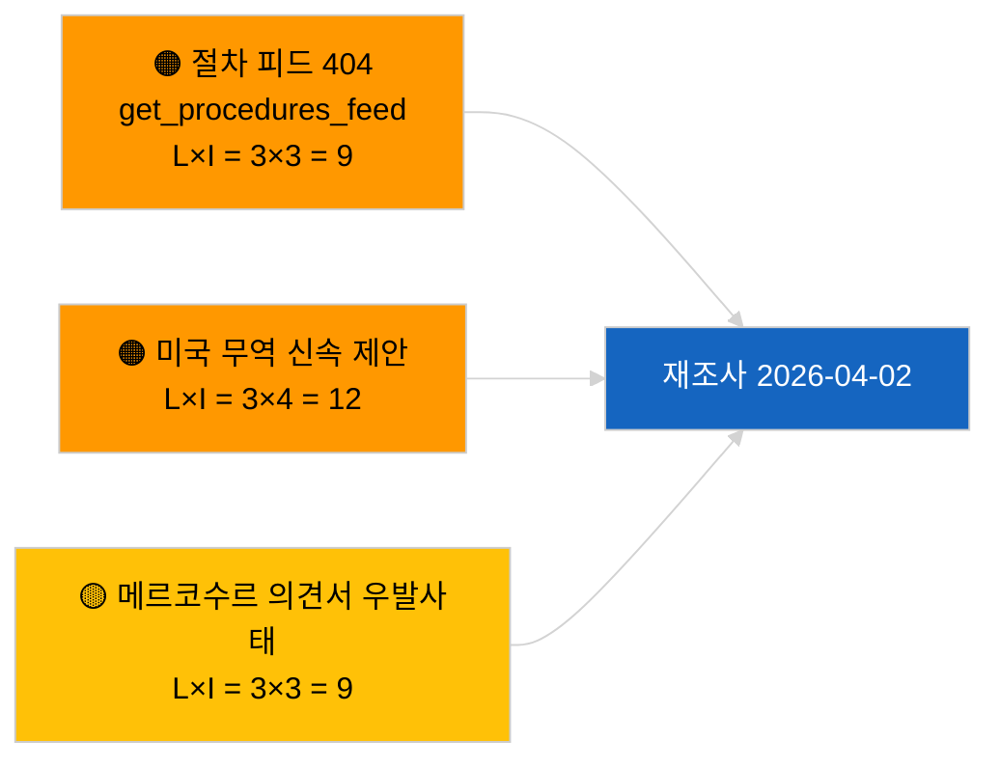

<!-- SPDX-FileCopyrightText: 2026 Hack23 AB -->
<!-- SPDX-License-Identifier: Apache-2.0 -->

# 집행 브리핑 — 제안 | 2026-04-01

**분류:** OSINT | 공개 의회 기록
**신뢰도:** 🟢 높음 (휴회 기간 구조적 평가)
**생성일:** 2026-04-01T00:00:00Z (소급 브리핑)
**기사 유형:** 제안
**실행 ID:** `4cf3b11a-f38e-4a3c-a81c-5c73d6eb8adc`
**출처:** 유럽의회 오픈 데이터 포털

---

## 🎯 BLUF

**2026-04-01 기준으로 새로운 집행위원회 제안 또는 유럽의회 자체 이니셔티브 파일이 인덱스되지 않았습니다.** 분석 실행 `4cf3b11a-f38e-4a3c-a81c-5c73d6eb8adc`는 **분류된 행위자 0명**, 모든 차원에서 **일상적(ROUTINE)** 중요도를 반환했습니다. 유럽의회 회기 간 휴회(3월 27일→4월 26일)와 동시 발생한 `get_procedures_feed` 404 오류(속보 병행 실행에 기록됨)가 데이터 공백을 설명합니다. 실질적인 제안 기준선은 따라서 승계된 파이프라인, 즉 HDV 배출 크레딧 2025–2029 프레임워크(TA-10-2026-0084), ECB 부총재 절차(TA-10-2026-0060), 더 나은 입법 보고서(TA-10-2026-0063), 진행 중인 EU-메르코수르 유럽사법재판소 회부(TA-10-2026-0008)입니다. 빈 상태가 달력 및 피드 가용성에 기인하며 파이프라인 회귀가 아니라는 **🟢 높은 신뢰도**가 있습니다.

---

## 🧭 이 브리핑이 지원하는 3가지 의사결정

| # | 결정 | 결정자 | 기한 | 근거 |
|:-:|------|-------|:----:|------|
| 1 | **편집:** 일일 제안 건너뜀; 다음 활성 회의까지 연기 | 편집자 | +24시간 | 빈 실행 출력 |
| 2 | **모니터링:** 다음 주기에 `get_procedures_feed` 상태 확인 | 데이터 파이프라인 | 2026-04-02 | 2026-04-01의 404 |
| 3 | **전향적 감시:** 새 제안에 대한 집행위원회 4월 주간 통신 추적 | 분석 리드 | 2026-04-13 | 집행위원회 상정 케이던스 |

---

## 📰 60초 요약

- 🔴 **2026-04-01에 새 절차 미개시**; 병행 실행에서 `get_procedures_feed` 404 발생. (🟡 중간 — 엔드포인트 가용성이 주의 사항)
- 🟠 **분류된 행위자 0명**; 집행위원, DG, 보고관 누구도 미파악. (🟢 높음)
- 🟢 **파이프라인 이월** — HDV 배출, ECB 부총재, 더 나은 입법, 메르코수르 회부가 4월 기준 활성 제안 재고로 유지. (🟢 높음)
- 🟡 **모든 위험 차원 "없음"** — 오늘 제안 단계의 급박한 위험 없음. (🟢 높음)
- 🔵 **경제적 맥락:** AI법 시행 규정, 방산 전략, MFF 준비 통신에 관한 집행위원회 2분기 제안(예정)이 감시 목록에 유지. (🟡 중간 — 집행위원회 상정 케이던스)
- 🟣 **교차 참조:** 자매 보고서 2026-04-01/breaking이 6/8 자문 피드 404 패턴을 기록. (🟢 높음)
- 🩷 **혼란 벡터:** 미국 무역 압력이 4월에 집행위원회 신속 제안을 강제할 수 있음. (🟡 중간)
- ⚪ **이월:** 메르코수르 ECJ 의견서는 영향력이 가장 높은 대기 중인 제안 트리거.

---

## 🗂️ 주요 문서 / 절차 — 제안 감시

| 순위 | EP 참조 | 제목 (약칭) | 중요도 | 신뢰도 | 상태 |
|:---:|---------|-----------|:-----:|:-----:|------|
| 1 | — | 2026-04-01에 새 제안 없음 | 0.0 | 🟢 높음 | 휴회＋피드 404 |
| 2 | TA-10-2026-0008 | EU-메르코수르 ECJ 회부 (대기 중) | 8.0 | 🟡 중간 | 재판소 의견서 대기 |
| 3 | TA-10-2026-0084 | HDV 배출 크레딧 2025–2029 | 7.0 | 🟢 높음 | 전치 파이프라인 |
| 4 | TA-10-2026-0063 | 더 나은 입법 (규제 기준선) | 6.0 | 🟢 높음 | 횡단적 프레임워크 |

---

## ⚠️ 위험·위협 스냅샷

| 위험 | L | I | 점수 | 트리거 | 출처 | Admiralty |
|-----|:-:|:-:|:---:|-------|------|:---------:|
| `get_procedures_feed` 신뢰성 | 3 | 3 | 9 | 지속적 404 | 자매 속보 실행 | B2 |
| 미국 무역 신속 제안 | 3 | 4 | 12 | 미국 조치가 집행위원회 상정 유발 | TA-10-2026-0096 | A1 |
| 메르코수르 의견서 우발사태 | 3 | 3 | 9 | 재판소 발표 | TA-10-2026-0008 | A2 |
| MFF 준비 마찰 | 3 | 4 | 12 | 2분기 집행위원회 통신 | 집행위원회 케이던스 | B2 |

---

## 🔮 주요 전향적 트리거

**집행위원회 화요일 회의 주기가 2026년 4월 7일 재개.** 부활절 이후 첫 집행위원회 제안은 통상 4월 초 대학 회의에서 상정됨; 주제 조합(방산/디지털/무역/기후)이 2분기 제안 감시 목록을 보정합니다.

---

## 🛡️ 출처 품질 평가

- **1차 출처:** 유럽의회 오픈 데이터 포털 — 분석 실행 `4cf3b11a-f38e-4a3c-a81c-5c73d6eb8adc`와 3월 외부 문서 목록.
- **데이터 한계:** 2026-04-01의 `get_procedures_feed` 404로 "오늘 새 절차 미개시"에 대한 독립 확인 불가.
- **달력 기인 비활성에 대한 신뢰도:** 🟢 높음.

---

## 📎 링크

| 링크 | 경로 |
|------|------|
| 기사 | `./article.md` |
| 분류 (비어 있음) | `./classification/` |
| 자매 실행 | `analysis/daily/2026-04-01/breaking/`, `committee-reports/`, `month-ahead/`, `motions/` |
| 매니페스트 | `./manifest.json` |

---

## 🔄 교차 참조

**동시 빈 템플릿 실행:** 2026-04-01의 breaking, committee-reports, month-ahead, motions 모두 동일한 빈 상태 표시 — 시스템 전반의 휴회＋피드 API 조건을 확인, 제안 특정 회귀 아님.

---

**문서 관리**
- **템플릿:** `/analysis/templates/executive-brief.md`
- **산출물 경로:** `analysis/daily/2026-04-01/propositions/executive-brief.md`
- **분류:** 공개
- **소급 생성:** 소급 채움 세션.
