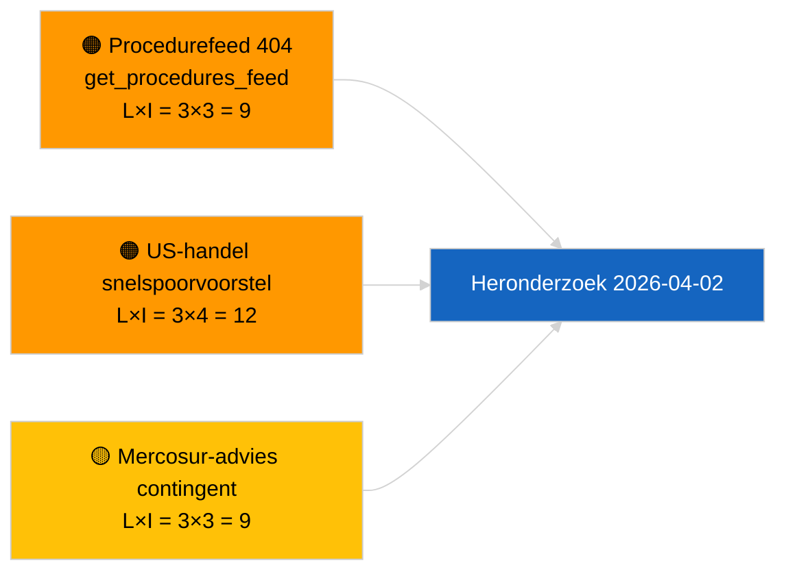

<!-- SPDX-FileCopyrightText: 2026 Hack23 AB -->
<!-- SPDX-License-Identifier: Apache-2.0 -->

# Bestuurlijk Overzicht — Voorstellen | 2026-04-01

**Classificatie:** OSINT | Openbaar parlementair register
**Betrouwbaarheidsniveau:** 🟢 Hoog (structurele beoordeling in recessperiode)
**Gegenereerd:** 2026-04-01T00:00:00Z (retrospectief overzicht)
**Artikeltype:** Voorstellen
**Sessie-ID:** `4cf3b11a-f38e-4a3c-a81c-5c73d6eb8adc`
**Bron:** Open dataportaal van het Europees Parlement

---

## 🎯 BLUF

**Geen nieuwe Commissievoorstellen of EP-eigen-initiatiefbestanden geïndexeerd op 2026-04-01.** Analyserun `4cf3b11a-f38e-4a3c-a81c-5c73d6eb8adc` retourneerde **0 geclassificeerde actoren** en **ROUTINEMATIGE** betekenis in alle dimensies. Het intersessionele EP-reces (27 maart → 26 april) en de gelijktijdige `get_procedures_feed` 404-fout (gedocumenteerd in de nevenrun over nieuws) verklaren het datalek. De substantiële voorstellenbaseline is daarom de geërfde pijplijn: HDV-emissiekredieten 2025–2029-raamwerk (TA-10-2026-0084), ECB-vicepresident-procedure (TA-10-2026-0060), Beter wetgeven-rapport (TA-10-2026-0063) en de lopende EU-Mercosur-rechtbankverwijzing (TA-10-2026-0008). **🟢 HOGE betrouwbaarheid** dat de lege toestand kalender- en feed-beschikbaarheidsgedreven is, geen pipeline-regressie.

---

## 🧭 3 Beslissingen die dit overzicht ondersteunt

| # | Beslissing | Beslisser | Deadline | Bewijs |
|:-:|------------|----------|:--------:|--------|
| 1 | **Redactie:** SLAAG OVER dagelijkse voorstellen; uitstellen tot volgende actieve sessie | Redacteur | +24u | Lege runoutput |
| 2 | **Monitoring:** verifieer `get_procedures_feed`-gezondheid bij volgende cyclus | Datapijplijn | 2026-04-02 | 404 op 2026-04-01 |
| 3 | **Vooruitziende bewaking:** volg Commissie-april-weekcommunicaties op nieuwe voorstellen | Analyselead | 2026-04-13 | Commissie-tabelleringskadentie |

---

## 📰 60-secondenlezing

- 🔴 **Geen nieuwe procedures geopend** op 2026-04-01; `get_procedures_feed` 404 in parallelle run. (🟡 Gemiddeld — eindpunt-beschikbaarheid is het voorbehoud)
- 🟠 **0 actoren geclassificeerd**; geen commissaris, DG of rapporteur geïdentificeerd. (🟢 Hoog)
- 🟢 **Pijplijn-overdracht** — HDV-emissies, ECB-vicepresident, Beter wetgeven, Mercosur-verwijzing blijven de actieve voorraad voorstellen voor april. (🟢 Hoog)
- 🟡 **Alle risicondimensies "geen"** — geen acuut voorstellenfase-risico vandaag gemarkeerd. (🟢 Hoog)
- 🔵 **Economische context:** verwachte Commissie-Q2-voorstellen over AI-verordening-uitvoeringsbepalingen, Defensie-industriestrategie en MFF-voorbereidende communicaties blijven op de bewakingslijst. (🟡 Gemiddeld — Commissie-tabelleringskadentie)
- 🟣 **Kruisreferentie:** nevenrapport 2026-04-01/breaking documenteert het patroon 6/8 adviserende feeds 404. (🟢 Hoog)
- 🩷 **Verstoringsvector:** US-handelsdruk kan een snelspoor-Commissievoorstel in april forceren. (🟡 Gemiddeld)
- ⚪ **Overdracht:** Mercosur ECJ-advies is de hoogst-impact wachtende voorstellen-trigger.

---

## 🗂️ Topdocumenten / procedures — Voorstellenbewaking

| Rang | EP-referentie | Titel (kort) | Betekenis | Betrouwbaarheid | Status |
|:----:|---------------|--------------|:---------:|:---------------:|--------|
| 1 | — | Geen nieuwe voorstellen op 2026-04-01 | 0,0 | 🟢 HOOG | Reces + feed 404 |
| 2 | TA-10-2026-0008 | EU-Mercosur ECJ-verwijzing (hangende) | 8,0 | 🟡 GEMIDDELD | Hof advies verwacht |
| 3 | TA-10-2026-0084 | HDV-emissiekredieten 2025–2029 | 7,0 | 🟢 HOOG | Transpositiepijplijn |
| 4 | TA-10-2026-0063 | Beter wetgeven (regulatoire basislijn) | 6,0 | 🟢 HOOG | Transversaal kader |

---

## ⚠️ Risico- en dreigingsoverzicht

| Risico | L | I | Score | Trigger | Bron | Admiralty |
|--------|:-:|:-:|:-----:|---------|------|:---------:|
| `get_procedures_feed`-betrouwbaarheid | 3 | 3 | 9 | Aanhoudende 404 | Nevenrapport breaking | B2 |
| US-handel snelspoorvoorstel | 3 | 4 | 12 | US-actie triggert Commissie-tabelläring | TA-10-2026-0096 | A1 |
| Mercosur-advies contingent | 3 | 3 | 9 | Hof publiceert | TA-10-2026-0008 | A2 |
| MFF-voorbereidende wrijving | 3 | 4 | 12 | Q2-Commissie-communicatie | Commissie-kadentie | B2 |

---

## 🔮 Voornaamste vooruitziende trigger

**Commissie-dinsdagvergaderingscyclus hervat op 7 april 2026.** Eerste post-Pasen-Commissievoorstellen worden doorgaans getabelleerd bij de vroeg-april-collegezitting; de thematische mix (defensie/digitaal/handel/klimaat) kalibreert de Q2-voorstellenbewakingslijst.

---

## 🛡️ Bronkwaliteitsbeoordeling

- **Primaire bronnen:** EP-open dataportaal — analyserun `4cf3b11a-f38e-4a3c-a81c-5c73d6eb8adc` en externe-documenteninventaris voor maart.
- **Databeperkingen:** `get_procedures_feed` 404 op 2026-04-01 verhindert onafhankelijke corroboratie van "vandaag geen nieuwe procedures geopend".
- **Betrouwbaarheid voor kalendergedreven inactiviteit:** 🟢 HOOG.

---

## 📎 Links

| Link | Pad |
|------|-----|
| Artikel | `./article.md` |
| Classificatie (leeg) | `./classification/` |
| Nevenruns | `analysis/daily/2026-04-01/breaking/`, `committee-reports/`, `month-ahead/`, `motions/` |
| Manifest | `./manifest.json` |

---

## 🔄 Kruisreferentie

**Gelijktijdige lege sjabloonruns:** breaking, committee-reports, month-ahead, motions voor 2026-04-01 tonen alle identieke lege toestand — bevestigt systeembrede reces + feed-API-omstandigheden, geen voorstellen-specifieke regressie.

---

**Documentbeheer**
- **Sjabloon:** `/analysis/templates/executive-brief.md`
- **Artefactpad:** `analysis/daily/2026-04-01/propositions/executive-brief.md`
- **Classificatie:** Openbaar
- **Retrospectieve generatie:** Terugvulsessie.
