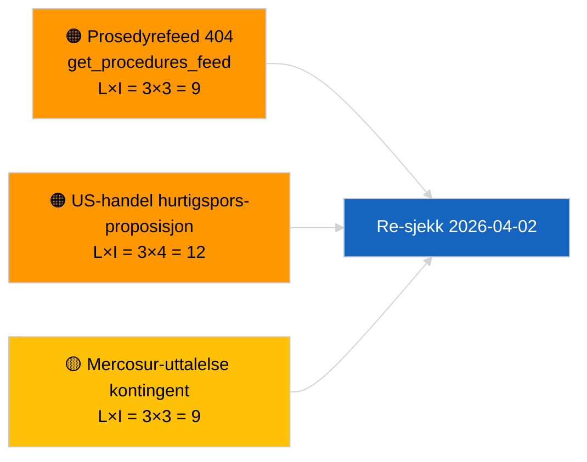

<!-- SPDX-FileCopyrightText: 2026 Hack23 AB -->
<!-- SPDX-License-Identifier: Apache-2.0 -->

# Ledersammendrag — Proposisjoner | 2026-04-01

**Klassifisering:** OSINT | Offentlig parlamentarisk registrering
**Konfidensnivå:** 🟢 Høy (strukturell vurdering i resessperiode)
**Generert:** 2026-04-01T00:00:00Z (retrospektivt sammendrag)
**Artikkeltype:** Proposisjoner
**Kjørings-ID:** `4cf3b11a-f38e-4a3c-a81c-5c73d6eb8adc`
**Kilde:** Europaparlamentets åpne dataportal

---

## 🎯 BLUF

**Ingen nye Kommisjonsproposisjoner eller EP-egne initiativsaker indeksert den 2026-04-01.** Analyskjøring `4cf3b11a-f38e-4a3c-a81c-5c73d6eb8adc` returnerte **0 klassifiserte aktører** og **RUTINE**-betydning på tvers av alle dimensjoner. EPs intersesjonelle resess (27. mars → 26. april) og den samtidige `get_procedures_feed` 404-feilen (dokumentert i søsterkjøringen om siste nytt) forklarer datatomrommet. Det substantielle proposisjonsbaseline er derfor den arvede pipelinen: HDV-utslippskreditter 2025–2029-rammeverk (TA-10-2026-0084), ECB-visepresidentprosedyre (TA-10-2026-0060), rapport om bedre lovgivning (TA-10-2026-0063) og den pågående EU-Mercosur-domstolshenvisningen (TA-10-2026-0008). **🟢 HØY konfidens** om at den tomme tilstanden er kalender- og feedtilgjengelighets-drevet, ikke en pipeline-regresjon.

---

## 🧭 3 Beslutninger dette sammendraget støtter

| # | Beslutning | Beslutningstaker | Frist | Dokumentasjon |
|:-:|------------|-----------------|:-----:|--------------|
| 1 | **Redaksjon:** HOPP OVER daglige proposisjoner; utsett til neste aktive sesjon | Redaktør | +24t | Tom kjøringsutdata |
| 2 | **Overvåking:** verifiser `get_procedures_feed`-helse i neste syklus | Datapipeline | 2026-04-02 | 404 den 2026-04-01 |
| 3 | **Fremover-overvåking:** spor Kommisjonens april-uke-kommunikasjoner for nye proposisjoner | Analyseansvarlig | 2026-04-13 | Kommisjonens tabellerings-kadence |

---

## 📰 60-sekunders lesning

- 🔴 **Ingen nye prosedyrer åpnet** den 2026-04-01; `get_procedures_feed` 404 i parallell kjøring. (🟡 Medium — endepunkttilgjengelighet er forbeholdet)
- 🟠 **0 aktører klassifisert**; ingen kommissær, GD eller rapportør identifisert. (🟢 Høy)
- 🟢 **Pipeline-videreføring** — HDV-utslipp, ECB-visepresident, bedre lovgivning, Mercosur-henvisning forblir den aktive proposisjonsbeholdningen inn i april. (🟢 Høy)
- 🟡 **Alle risikodimensjoner "ingen"** — ingen akutt proposisjonsfase-risiko flagget i dag. (🟢 Høy)
- 🔵 **Økonomisk sammenheng:** forventede Kommisjons-kvartal-2-proposisjoner om AI-lovens gjennomføringsforordninger, strategi for forsvarsindustri og MFF-forberedende kommunikasjoner forblir på overvåkingslisten. (🟡 Medium — Kommisjonens tabellerings-kadence)
- 🟣 **Kryssreferanse:** søsterrapporten 2026-04-01/breaking dokumenterer mønstret 6/8 rådgivende feeds 404. (🟢 Høy)
- 🩷 **Forstyrrelsesvektor:** US-handelstrykk kan tvinge frem en hurtigspors-Kommisjons-proposisjon i april. (🟡 Medium)
- ⚪ **Videreføring:** Mercosur ECJ-uttalelse er den høyest-impact ventende proposisjonsutløseren.

---

## 🗂️ Topp-dokumenter / prosedyrer — Proposisjonsovervåking

| Rang | EP-referanse | Tittel (kort) | Betydning | Konfidens | Status |
|:----:|--------------|---------------|:---------:|:---------:|--------|
| 1 | — | Ingen nye proposisjoner den 2026-04-01 | 0,0 | 🟢 HØY | Resess + feed 404 |
| 2 | TA-10-2026-0008 | EU-Mercosur ECJ-henvisning (ventende) | 8,0 | 🟡 MEDIUM | Domstolsuttalelse forventet |
| 3 | TA-10-2026-0084 | HDV-utslippskreditter 2025–2029 | 7,0 | 🟢 HØY | Transponeringspipeline |
| 4 | TA-10-2026-0063 | Bedre lovgivning (regulatorisk baseline) | 6,0 | 🟢 HØY | Tverrgående ramme |

---

## ⚠️ Risiko- og trusselbilde

| Risiko | L | I | Score | Utløser | Kilde | Admiralty |
|--------|:-:|:-:|:-----:|---------|-------|:---------:|
| `get_procedures_feed`-pålitelighet | 3 | 3 | 9 | Vedvarende 404 | Søster-breaking-kjøring | B2 |
| US-handel hurtigspors-proposisjon | 3 | 4 | 12 | US-handling utløser Kommisjonens tabelläring | TA-10-2026-0096 | A1 |
| Mercosur-uttalelse kontingent | 3 | 3 | 9 | Domstolen publiserer | TA-10-2026-0008 | A2 |
| MFF-forberedende friksjon | 3 | 4 | 12 | Kvartal-2-Kommisjons-kommunikasjon | Kommisjonskadence | B2 |

---

## 🔮 Viktigste fremoverpekende utløser

**Kommisjonens tirsdagsmøte-syklus gjenopptas 7. april 2026.** Første post-påske-Kommisjons-proposisjoner tabelleres typisk ved det tidlige april-kollegiemøtet; den aktuelle blandingen (forsvar/digitalt/handel/klima) kalibrerer kvartal-2-proposisjonsovervåkingslisten.

---

## 🛡️ Kildekvalitetsvurdering

- **Primærkilder:** EPs åpne dataportal — analyskjøring `4cf3b11a-f38e-4a3c-a81c-5c73d6eb8adc` og ekstern-dokument-beholdningen for mars.
- **Databegrensninger:** `get_procedures_feed` 404 den 2026-04-01 hindrer uavhengig korroborering av "ingen nye prosedyrer åpnet i dag".
- **Konfidens for kalender-drevet inaktivitet:** 🟢 HØY.

---

## 📎 Lenker

| Lenke | Sti |
|-------|-----|
| Artikkel | `./article.md` |
| Klassifisering (tom) | `./classification/` |
| Søsterkjøringer | `analysis/daily/2026-04-01/breaking/`, `committee-reports/`, `month-ahead/`, `motions/` |
| Manifest | `./manifest.json` |

---

## 🔄 Kryssreferanse

**Samtidige tomme mal-kjøringer:** breaking, committee-reports, month-ahead, motions for 2026-04-01 viser alle identisk tom tilstand — bekrefter systemomfattende resess + feed-API-vilkår, ikke proposisjonsspesifikk regresjon.

---

**Dokumentkontroll**
- **Mal:** `/analysis/templates/executive-brief.md`
- **Artefaktsti:** `analysis/daily/2026-04-01/propositions/executive-brief.md`
- **Klassifisering:** Offentlig
- **Retrospektiv generering:** Tilbakefyllingsøkt.
