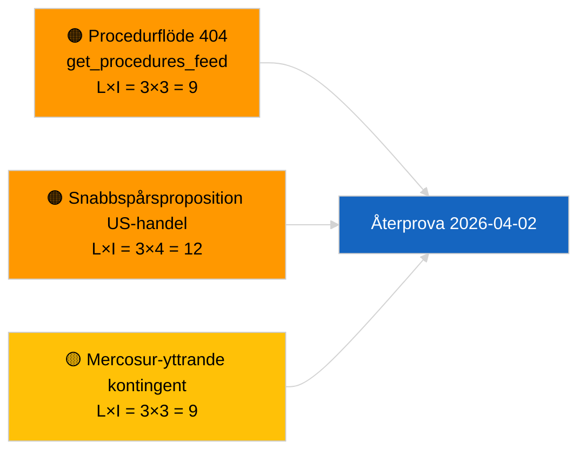

<!-- SPDX-FileCopyrightText: 2026 Hack23 AB -->
<!-- SPDX-License-Identifier: Apache-2.0 -->

# Verkställande sammanfattning — Propositioner | 2026-04-01

**Klassificering:** OSINT | Offentligt parlamentariskt register
**Konfidensgrad:** 🟢 Hög (strukturell bedömning under recessen)
**Genererad:** 2026-04-01T00:00:00Z (retrospektiv sammanfattning)
**Artikeltyp:** Propositioner
**Körnings-ID:** `4cf3b11a-f38e-4a3c-a81c-5c73d6eb8adc`
**Källa:** Europaparlamentets öppna dataportal

---

## 🎯 BLUF

**Inga nya kommissionspropositioner eller EP-egna initiativärenden indexerades den 2026-04-01.** Analyskörning `4cf3b11a-f38e-4a3c-a81c-5c73d6eb8adc` returnerade **0 klassificerade aktörer** och **RUTINMÄSSIG** betydelse inom samtliga dimensioner. Europaparlamentets intersessionella recess (27 mars → 26 april) och det parallella `get_procedures_feed` 404-felet (dokumenterat i systerrapporten om aktuella händelser) förklarar dataavbrottet. Det substantiella propositionsbasläget är därför den ärvda pipelinen: HDV-utsläppskrediter 2025–2029-ramen (TA-10-2026-0084), ECB:s vice-ordförandeförfarande (TA-10-2026-0060), rapporten om bättre lagstiftning (TA-10-2026-0063) och den pågående EU-Mercosur-domstolshänvisningen (TA-10-2026-0008). **🟢 HÖG konfidensgrad** att det tomma tillståndet är kalender- och flödestillgänglighetsdrivet, inte en pipeline-regression.

---

## 🧭 3 Beslut som denna sammanfattning stöder

| # | Beslut | Beslutsfattare | Deadline | Underlag |
|:-:|--------|----------------|:--------:|---------|
| 1 | **Redaktion:** HOPPA ÖVER dagliga propositioner; skjut upp till nästa aktiva session | Redaktör | +24h | Tom körningsutdata |
| 2 | **Övervakning:** verifiera `get_procedures_feed`-hälsa nästa cykel | Datapipeline | 2026-04-02 | 404 den 2026-04-01 |
| 3 | **Framåtbevakning:** spåra kommissionens april-veckokommunikationer för nya propositioner | Analysansvarig | 2026-04-13 | Kommissionens tabelleringstakt |

---

## 📰 60-sekundersläsning

- 🔴 **Inga nya förfaranden öppnade** den 2026-04-01; `get_procedures_feed` 404 i parallell körning. (🟡 Medium — slutpunktens tillgänglighet är förbehållet)
- 🟠 **0 aktörer klassificerade**; ingen kommissionär, GD eller föredragande identifierad. (🟢 Hög)
- 🟢 **Pipeline-övertag** — HDV-utsläpp, ECB:s vice-ordförande, bättre lagstiftning, Mercosur-hänvisning kvarstår som aktivt propositionslager inför april. (🟢 Hög)
- 🟡 **Alla riskdimensioner "ingen"** — ingen akut propositionsfasrisk flaggad idag. (🟢 Hög)
- 🔵 **Ekonomiskt sammanhang:** förväntade kommissionspropositioner för kvartal 2 om AI-aktens genomförandebestämmelser, försvarsindustrins strategi och MFF-förberedande kommunikationer kvarstår på bevakningslistan. (🟡 Medium — kommissionens tabelleringstakt)
- 🟣 **Korsreferens:** syskonrapporten 2026-04-01/aktuellt dokumenterar mönstret 6/8 rådgivande flöden 404. (🟢 Hög)
- 🩷 **Störningsvektor:** amerikanskt handelstryck kan tvinga fram en snabbspårsproposition från kommissionen under april. (🟡 Medium)
- ⚪ **Överföring:** Mercosur ECJ-yttrandet är den mest impaktfulla väntande propositionsutlösaren.

---

## 🗂️ Topp-dokument / förfaranden — Propositionsbevakning

| Rang | EP-referens | Titel (kort) | Betydelse | Konfidensgrad | Status |
|:----:|-------------|--------------|:---------:|:-------------:|--------|
| 1 | — | Inga nya propositioner den 2026-04-01 | 0,0 | 🟢 HÖG | Recess + flöde 404 |
| 2 | TA-10-2026-0008 | EU-Mercosur ECJ-hänvisning (pågående) | 8,0 | 🟡 MEDIUM | Domstolsyttrande förväntat |
| 3 | TA-10-2026-0084 | HDV-utsläppskrediter 2025–2029 | 7,0 | 🟢 HÖG | Transpositionspipeline |
| 4 | TA-10-2026-0063 | Bättre lagstiftning (regulatorisk baslinje) | 6,0 | 🟢 HÖG | Övergripande ram |

---

## ⚠️ Risk- och hotbild

| Risk | L | I | Poäng | Utlösare | Källa | Admiralty |
|------|:-:|:-:|:-----:|----------|-------|:---------:|
| `get_procedures_feed`-tillförlitlighet | 3 | 3 | 9 | Ihållande 404 | Syskonutbrottsrapport | B2 |
| Snabbspårsproposition US-handel | 3 | 4 | 12 | USA:s åtgärd utlöser kommissionens tabelläring | TA-10-2026-0096 | A1 |
| Mercosur-yttrande kontingent | 3 | 3 | 9 | Domstolen publicerar | TA-10-2026-0008 | A2 |
| MFF-förberedande friktion | 3 | 4 | 12 | Kvartal 2-kommissionsmeddelande | Kommissionstakt | B2 |

---

## 🔮 Främsta framåtutlösaren

**Kommissionens tisdagssammanträdescykel återupptas 7 april 2026.** Första post-påsk-kommissionspropositionerna tabelläras vanligtvis vid det tidiga april-kollegiemötet; den aktuella blandningen (försvar/digitalt/handel/klimat) kalibrerar kvartal 2-propositionsbevakningslistan.

---

## 🛡️ Källkvalitetsbedömning

- **Primärkällor:** EP:s öppna dataportal — analyskörning `4cf3b11a-f38e-4a3c-a81c-5c73d6eb8adc` och externdokumentinventariet för mars.
- **Databegränsningar:** `get_procedures_feed` 404 den 2026-04-01 hindrar oberoende korroborering av "inga nya förfaranden öppnade idag".
- **Konfidensgrad för kalenderdriven inaktivitet:** 🟢 HÖG.

---

## 📎 Länkar

| Länk | Sökväg |
|------|--------|
| Artikel | `./article.md` |
| Klassificering (tom) | `./classification/` |
| Systonkörningar | `analysis/daily/2026-04-01/breaking/`, `committee-reports/`, `month-ahead/`, `motions/` |
| Manifest | `./manifest.json` |

---

## 🔄 Korsreferens

**Parallella tomma mall-körningar:** breaking, committee-reports, month-ahead, motions för 2026-04-01 visar alla identiskt tomt tillstånd — bekräftar systemövergripande recess + flödes-API-villkor, inte propositionsspecifik regression.

---

**Dokumentkontroll**
- **Mall:** `/analysis/templates/executive-brief.md`
- **Artefaktsökväg:** `analysis/daily/2026-04-01/propositions/executive-brief.md`
- **Klassificering:** Offentlig
- **Retrospektiv generering:** Bakåtfyllningssession.
