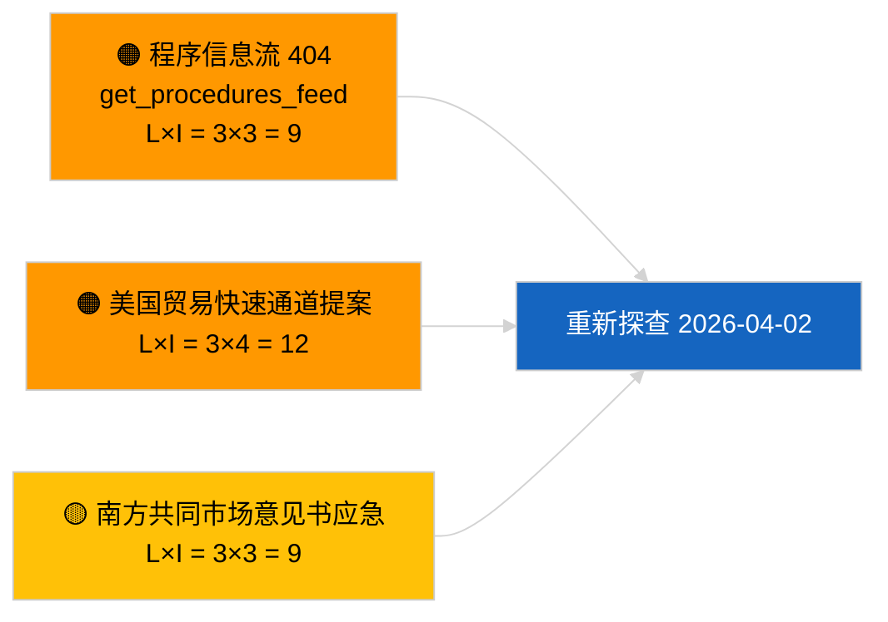

<!-- SPDX-FileCopyrightText: 2026 Hack23 AB -->
<!-- SPDX-License-Identifier: Apache-2.0 -->

# 执行简报 — 提案 | 2026-04-01

**分类：** OSINT | 公开议会记录
**置信度：** 🟢 高（休会期结构性评估）
**生成时间：** 2026-04-01T00:00:00Z（回溯简报）
**文章类型：** 提案
**运行ID：** `4cf3b11a-f38e-4a3c-a81c-5c73d6eb8adc`
**来源：** 欧洲议会开放数据门户

---

## 🎯 BLUF

**2026-04-01 未索引任何欧盟委员会新提案或欧洲议会自主倡议文件。** 分析运行 `4cf3b11a-f38e-4a3c-a81c-5c73d6eb8adc` 返回**0 名分类行为者**及所有维度的**例行（ROUTINE）**重要性。欧洲议会会期间休会（3月27日→4月26日）以及同期 `get_procedures_feed` 404 错误（已记录于突发新闻并行运行）解释了数据空白。因此，实质性提案基准为继承管线：重型商用车排放信用额度 2025–2029 框架（TA-10-2026-0084）、欧洲央行副行长程序（TA-10-2026-0060）、更好立法报告（TA-10-2026-0063），以及进行中的欧盟-南方共同市场欧洲法院提交（TA-10-2026-0008）。**🟢 高置信度**认为空状态由日历及信息流可用性驱动，而非管线回归。

---

## 🧭 本简报支持的 3 项决策

| # | 决策 | 决策者 | 截止时间 | 依据 |
|:-:|------|-------|:-------:|------|
| 1 | **编辑：** 跳过每日提案；推迟至下次活跃会议 | 编辑 | +24小时 | 空运行输出 |
| 2 | **监控：** 在下一周期验证 `get_procedures_feed` 健康状态 | 数据管线 | 2026-04-02 | 2026-04-01 的 404 |
| 3 | **前瞻监视：** 追踪欧盟委员会四月周度通信以获取新提案 | 分析负责人 | 2026-04-13 | 欧盟委员会提交节奏 |

---

## 📰 60 秒速读

- 🔴 **2026-04-01 未开启任何新程序**；并行运行中 `get_procedures_feed` 404。（🟡 中等 — 端点可用性为警告条件）
- 🟠 **0 名行为者被分类**；未识别任何专员、总司或报告员。（🟢 高）
- 🟢 **管线延续** — 重型商用车排放、欧洲央行副行长、更好立法、南方共同市场提交仍是进入四月的活跃提案库存。（🟢 高）
- 🟡 **所有风险维度"无"** — 今日未标记提案阶段急性风险。（🟢 高）
- 🔵 **经济背景：** 预期欧盟委员会第二季度关于人工智能法实施法规、国防工业战略和多年期财务框架准备通信的提案仍在监视列表中。（🟡 中等 — 欧盟委员会提交节奏）
- 🟣 **交叉参考：** 姊妹报告 2026-04-01/breaking 记录了 6/8 咨询信息流 404 模式。（🟢 高）
- 🩷 **干扰向量：** 美国贸易压力可能在四月迫使欧盟委员会提出快速通道提案。（🟡 中等）
- ⚪ **延续：** 南方共同市场欧洲法院意见书是影响最大的待定提案触发因素。

---

## 🗂️ 顶级文件 / 程序 — 提案监视

| 排名 | EP 参考号 | 标题（简称） | 重要性 | 置信度 | 状态 |
|:---:|----------|------------|:-----:|:-----:|------|
| 1 | — | 2026-04-01 无新提案 | 0.0 | 🟢 高 | 休会 + 信息流 404 |
| 2 | TA-10-2026-0008 | 欧盟-南方共同市场欧洲法院提交（待定） | 8.0 | 🟡 中等 | 法院意见书待出 |
| 3 | TA-10-2026-0084 | 重型商用车排放信用额度 2025–2029 | 7.0 | 🟢 高 | 转置管线 |
| 4 | TA-10-2026-0063 | 更好立法（监管基准） | 6.0 | 🟢 高 | 横跨性框架 |

---

## ⚠️ 风险与威胁快照

| 风险 | L | I | 评分 | 触发因素 | 来源 | Admiralty |
|------|:-:|:-:|:---:|---------|------|:---------:|
| `get_procedures_feed` 可靠性 | 3 | 3 | 9 | 持续 404 | 姊妹突发新闻运行 | B2 |
| 美国贸易快速通道提案 | 3 | 4 | 12 | 美国行动触发欧盟委员会提交 | TA-10-2026-0096 | A1 |
| 南方共同市场意见书应急 | 3 | 3 | 9 | 法院公布 | TA-10-2026-0008 | A2 |
| 多年期财务框架准备摩擦 | 3 | 4 | 12 | 第二季度欧盟委员会通信 | 欧盟委员会节奏 | B2 |

---

## 🔮 主要前瞻触发因素

**欧盟委员会周二例会周期于 2026 年 4 月 7 日恢复。** 复活节后首批欧盟委员会提案通常在四月初委员会会议上提交；主题组合（国防/数字/贸易/气候）将校准第二季度提案监视列表。

---

## 🛡️ 信息来源质量评估

- **主要来源：** 欧洲议会开放数据门户 — 分析运行 `4cf3b11a-f38e-4a3c-a81c-5c73d6eb8adc` 及三月外部文件目录。
- **数据限制：** 2026-04-01 的 `get_procedures_feed` 404 阻碍了对"今日未开启新程序"的独立核实。
- **日历驱动停滞的置信度：** 🟢 高。

---

## 📎 链接

| 链接 | 路径 |
|------|------|
| 文章 | `./article.md` |
| 分类（空） | `./classification/` |
| 姊妹运行 | `analysis/daily/2026-04-01/breaking/`, `committee-reports/`, `month-ahead/`, `motions/` |
| 清单 | `./manifest.json` |

---

## 🔄 交叉参考

**同期空模板运行：** 2026-04-01 的 breaking、committee-reports、month-ahead、motions 均呈现相同空状态 — 证实系统级休会 + 信息流 API 条件，而非提案特定回归。

---

**文件控制**
- **模板：** `/analysis/templates/executive-brief.md`
- **产物路径：** `analysis/daily/2026-04-01/propositions/executive-brief.md`
- **分类：** 公开
- **回溯生成：** 回填会话。
