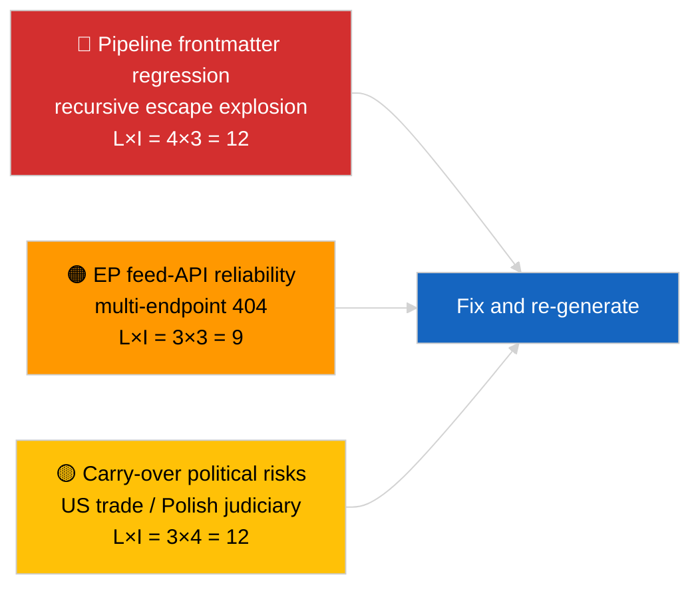

<!-- SPDX-FileCopyrightText: 2026 Hack23 AB -->
<!-- SPDX-License-Identifier: Apache-2.0 -->

# Executive Brief — Breaking | 2026-04-02

**Classification:** OSINT | Public Parliamentary Record
**Confidence:** 🟡 Medium (article frontmatter corrupted by nested-escape regression; underlying analysis substantive)
**Generated:** 2026-04-02T00:00:00Z (retrospective brief)
**Article Type:** Breaking
**Source:** European Parliament Open Data Portal

---

## 🎯 BLUF

**Second post-March recess day; the standout finding is data-pipeline degradation rather than EP activity.** The article's YAML frontmatter is corrupted by recursive nested-quote escaping (`title:` and `description:` fields contain quote-explosion artifacts) but the body content remains readable. Substantively the run again shows minimal new EP activity (recess week 2 of 4), with the inherited March priorities (US customs tariff TA-10-2026-0096, HDV emission credits TA-10-2026-0084, Braun immunity TA-10-2026-0088, ECB Vice-President TA-10-2026-0060) carrying the watch list. The principal new signal is the frontmatter-corruption regression — a pipeline-quality issue that the 2026-04-03/breaking-2 run formalises as a dedicated EP-API-reliability assessment. **🟡 MEDIUM confidence** the underlying parliament activity is null; **🟢 HIGH confidence** that the pipeline emitted a malformed-frontmatter article that should be tagged for re-generation.

---

## 🧭 3 Decisions This Brief Supports

| # | Decision | Who Decides | Deadline | Evidence |
|:-:|----------|-------------|:--------:|----------|
| 1 | **Editorial:** SKIP daily breaking; tag article for re-generation due to corrupted frontmatter | Editor | +12h | Recursive-escape title artifact |
| 2 | **Monitoring:** open data-pipeline issue for nested-escape regression | Data pipeline | +24h | This article's frontmatter |
| 3 | **Forward-watch:** confirm fix in 2026-04-03 runs | Analysis lead | 2026-04-03 | Subsequent-day frontmatter |

---

## 📰 60-Second Read

- 🔴 **Frontmatter regression** — title and description fields contain recursive escape artifacts (`title: "title: \"title: \\\"…"`). Likely a deterministic-renderer / sitemap interaction with previously-escaped strings. (🟢 High)
- 🟠 **Recess week 2 of 4** — Parliament in inter-sessional gap; no plenary, committee, or trilogue activity expected. (🟢 High)
- 🟢 **March carry-over watch list unchanged** — US tariff, HDV emissions, Braun immunity, ECB Vice-President. (🟢 High)
- 🟡 **Sibling runs:** 2026-04-02/committee-reports / motions / propositions all show identical empty-template state — confirms system-wide recess + feed-API conditions. (🟢 High)
- 🔵 **Economic context:** US-EU trade trajectory remains the dominant external pressure variable. (🟢 High)
- 🟣 **Cross-reference:** see 2026-04-03/breaking-2 for the formal EP-API-reliability assessment that follows from this day's anomaly. (🟢 High)
- 🩷 **Disruption vector:** pipeline-quality regression is the active vector today, not a political event. (🟢 High)
- ⚪ **Carry-forward:** Mercosur ECJ opinion still pending; April-plenary agenda not yet published.

---

## 🗂️ Top Documents / Procedures Table

| Rank | EP reference | Title (short) | Significance | Confidence | Status |
|:----:|--------------|---------------|:------------:|:----------:|--------|
| 1 | — | No new procedures or adopted texts on 2026-04-02 | 0.0 | 🟢 HIGH | Recess — no activity |
| 2 | TA-10-2026-0096 | US customs tariff (carry-over) | 7.0 | 🟢 HIGH | Adopted 26 March; watch |
| 3 | TA-10-2026-0088 | Braun immunity precedent (carry-over) | 6.5 | 🟢 HIGH | Adopted 26 March; LIBE watch |

---

## ⚠️ Risk & Threat Snapshot

| Risk | L | I | Score | Trigger | Source | Admiralty |
|------|:-:|:-:|:-----:|---------|--------|:---------:|
| Pipeline frontmatter regression | 4 | 3 | 12 | Same artifact in 2026-04-03 | This article's YAML | B2 |
| EP feed-API reliability | 3 | 3 | 9 | Sustained 404s | Concurrent sibling runs | B2 |
| US-EU trade retaliation (carry-over) | 3 | 4 | 12 | US counter-announcement | TA-10-2026-0096 | A1 |
| EP-Polish judiciary spill-over (carry-over) | 4 | 3 | 12 | Further immunity case | TA-10-2026-0088 | A1 |

---

## 🔮 Top Forward Trigger

**2026-04-03 run series** — three separate breaking-runs that day (breaking, breaking-2, breaking-3) formalise the EP-API-reliability concern (breaking-2) and consolidate the political-coalition baseline (breaking-1 and breaking-3). Compare today's malformed-frontmatter output to those runs to confirm whether the pipeline regression is recurring or isolated.

---

## 🛡️ Source Quality Assessment

- **Primary sources:** EP Open Data Portal — analysis run (run-id unrecoverable from corrupted frontmatter); body content consistent with sibling 2026-04-02 runs.
- **Data limitations:** Frontmatter is structurally corrupted; downstream renderer/SEO consumers will mis-handle this run. Mitigation: re-run with renderer fix.
- **Confidence on EP-side null state:** 🟢 HIGH.
- **Confidence on pipeline-side regression:** 🟢 HIGH.

---

## 📎 Links

| Link | Path |
|------|------|
| Article (with corrupted frontmatter) | `./article.md` |
| Manifest | `./manifest.json` |
| Sibling runs | `analysis/daily/2026-04-02/committee-reports/`, `motions/`, `propositions/` |
| Follow-up | `analysis/daily/2026-04-03/breaking-2/` (formal EP-API-reliability assessment) |

---

## 🔄 Cross-Reference

**Prior:** 2026-04-01/breaking documented the 6/8 advisory-feed 404 pattern.
**Concurrent:** 2026-04-02/committee-reports / motions / propositions all empty-template.
**Next:** 2026-04-03/breaking-2 elevates the pipeline-reliability concern to a dedicated run.

---

**Document Control**
- **Template:** `/analysis/templates/executive-brief.md`
- **Artifact path:** `analysis/daily/2026-04-02/breaking/executive-brief.md`
- **Classification:** Public
- **Retrospective generation:** Back-fill session; this brief replaces the unusable frontmatter-corrupted article's BLUF function.
