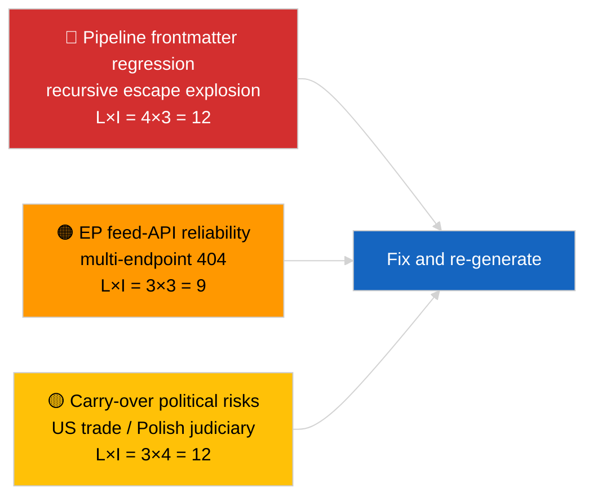

<!-- SPDX-FileCopyrightText: 2026 Hack23 AB -->
<!-- SPDX-License-Identifier: Apache-2.0 -->

# الموجز التنفيذي — آخر الأخبار | 2026-04-02

**التصنيف:** OSINT | وثيقة برلمانية عامة
**مستوى الثقة:** 🟡 متوسط (البيانات الوصفية للمقال تالفة بسبب انحدار التهريب المتداخل؛ التحليل الأساسي ذو محتوى جوهري)
**تاريخ الإنشاء:** 2026-04-02T00:00:00Z (وثيقة استرجاعية)
**نوع المقال:** عاجل
**المصدر:** بوابة البيانات المفتوحة للبرلمان الأوروبي

---

## 🎯 الخلاصة

**اليوم الثاني بعد استراحة مارس؛ الاكتشاف البارز هو تدهور خط أنابيب البيانات لا نشاط البرلمان الأوروبي.** يعاني frontmatter YAML للمقال من تلف بسبب تسلسل تهريب الاقتباسات المتداخل بشكل متكرر (الحقول `title:` و`description:` تحتوي على بقايا انفجار اقتباسات)، إلا أن محتوى نص المقال قابل للقراءة. من الناحية الموضوعية، تُظهر الجلسة مرةً أخرى نشاطاً جديداً ضئيلاً للبرلمان الأوروبي (أسبوع الاستراحة 2 من 4)، مع الأولويات الموروثة من مارس (التعريفة الجمركية الأمريكية TA-10-2026-0096، اعتمادات الانبعاثات للمركبات الثقيلة TA-10-2026-0084، حصانة براون TA-10-2026-0088، نائب رئيس البنك المركزي الأوروبي TA-10-2026-0060) على قائمة المراقبة. الإشارة الجديدة الأهم هي انحدار تلف frontmatter — مشكلة جودة البيانات التي تُشكّل جلسة 2026-04-03/breaking-2 تقييماً مخصصاً لموثوقية واجهة برمجة التطبيقات للبرلمان الأوروبي. **🟡 مستوى ثقة متوسط** بأن النشاط البرلماني الأساسي صفري؛ **🟢 مستوى ثقة عالٍ** بأن خط الأنابيب أصدر مقالاً بـfrontmatter مشوه ينبغي تصنيفه لإعادة التوليد.

---

## 🧭 3 قرارات تدعمها هذه الوثيقة

| # | القرار | صاحب القرار | الموعد النهائي | الدليل |
|:-:|--------|-------------|:--------------:|--------|
| 1 | **تحريري:** تجاوز الأخبار اليومية؛ تصنيف المقال لإعادة التوليد بسبب frontmatter تالف | المحرر | +12 ساعة | بقية الاقتباس المتكررة في العنوان |
| 2 | **مراقبة:** فتح تذكرة في خط أنابيب البيانات لانحدار التهريب المتداخل | خط الأنابيب | +24 ساعة | frontmatter المقال |
| 3 | **رصد مستقبلي:** التحقق من الإصلاح في جلسات 2026-04-03 | مسؤول التحليل | 2026-04-03 | frontmatter اليوم التالي |

---

## 📰 القراءة في 60 ثانية

- 🔴 **انحدار frontmatter** — تحتوي حقول العنوان والوصف على بقايا تهريب متكررة (`title: "title: \"title: \\\"…"`). على الأرجح تفاعل محدد بين المُصيّر وخريطة الموقع مع سلاسل سبق تهريبها. (🟢 عالٍ)
- 🟠 **أسبوع استراحة 2 من 4** — البرلمان في إيقاف بين الدورات؛ لا يُتوقع أي نشاط في الجلسة العامة أو اللجنة أو المفاوضات الثلاثية. (🟢 عالٍ)
- 🟢 **قائمة مراقبة مارس دون تغيير** — الرسوم الجمركية الأمريكية، انبعاثات المركبات الثقيلة، حصانة براون، نائب رئيس البنك المركزي الأوروبي. (🟢 عالٍ)
- 🟡 **الجلسات الشقيقة:** جميع جلسات 2026-04-02/committee-reports و/motions و/propositions تُظهر حالة فارغة متطابقة — يؤكد الإيقاف الشامل وظروف واجهة برمجة تطبيقات التغذية. (🟢 عالٍ)
- 🔵 **السياق الاقتصادي:** يظل مسار التجارة الأمريكي-الأوروبي المتغير الضغط الخارجي السائد. (🟢 عالٍ)
- 🟣 **المرجع المتقاطع:** انظر 2026-04-03/breaking-2 للتقييم الرسمي لموثوقية واجهة برمجة التطبيقات المستمد من شذوذ اليوم. (🟢 عالٍ)
- 🩷 **متجه الاضطراب:** انحدار جودة البيانات هو المتجه النشط اليوم — لا حدث سياسي. (🟢 عالٍ)
- ⚪ **المستقبل:** رأي محكمة العدل الأوروبية حول ميركوسور لا يزال منتظراً؛ جدول أعمال الجلسة العامة لأبريل لم يُنشر بعد.

---

## 🗂️ جدول الوثائق والإجراءات الأبرز

| الترتيب | مرجع البرلمان | العنوان (مختصر) | الأهمية | الثقة | الحالة |
|:-------:|--------------|----------------|:-------:|:-----:|--------|
| 1 | — | لا إجراءات ولا نصوص معتمدة في 2026-04-02 | 0.0 | 🟢 عالية | استراحة — لا نشاط |
| 2 | TA-10-2026-0096 | التعريفة الجمركية الأمريكية (منقول) | 7.0 | 🟢 عالية | اعتُمد 26 مارس؛ رصد |
| 3 | TA-10-2026-0088 | سابقة حصانة براون (منقول) | 6.5 | 🟢 عالية | اعتُمد 26 مارس؛ LIBE ترصد |

---

## ⚠️ لمحة عن المخاطر والتهديدات

| الخطر | ل | ت | الدرجة | المحفز | المصدر | مجلس الأدميرال |
|-------|:-:|:-:|:------:|--------|--------|:--------------:|
| انحدار frontmatter في خط الأنابيب | 4 | 3 | 12 | نفس البقية في 2026-04-03 | YAML المقال | B2 |
| موثوقية واجهة تطبيقات تغذية البرلمان | 3 | 3 | 9 | أخطاء 404 مستمرة | الجلسات الشقيقة المتزامنة | B2 |
| الانتقام التجاري الأمريكي-الأوروبي (منقول) | 3 | 4 | 12 | تدبير أمريكي مضاد | TA-10-2026-0096 | A1 |
| انتشار الأزمة القضائية الأوروبية-البولندية (منقول) | 4 | 3 | 12 | قضايا حصانة جديدة | TA-10-2026-0088 | A1 |

---

## 🔮 أبرز المحفزات المستقبلية

**سلسلة جلسات 2026-04-03** — ثلاث جلسات عاجلة مستقلة في ذلك اليوم (breaking وbreaking-2 وbreaking-3) تُرسّخ إشكالية موثوقية واجهة برمجة تطبيقات البرلمان (breaking-2) وتُوطّد الخط الأساسي للتحالف السياسي (breaking-1 وbreaking-3). مقارنة مخرجات frontmatter المشوهة اليوم بتلك الجلسات لتأكيد ما إذا كان انحدار خط الأنابيب متكرراً أم معزولاً.

---

## 🛡️ تقييم جودة المصادر

- **المصادر الأولية:** بوابة البيانات المفتوحة للبرلمان الأوروبي — جلسة التحليل (معرّف الجلسة غير قابل للاسترداد من frontmatter التالف)؛ محتوى النص متسق مع الجلسات الشقيقة للتاريخ 2026-04-02.
- **قيود البيانات:** frontmatter تالف هيكلياً؛ المعالجات والمستهلكون من مُحسّنات محركات البحث المتلقون في المراحل التالية سيتعاملون مع هذه الجلسة بشكل خاطئ. الإجراء التصحيحي: إعادة التشغيل مع إصلاح المُصيّر.
- **مستوى الثقة في الحالة الصفرية لجانب البرلمان:** 🟢 عالٍ.
- **مستوى الثقة في انحدار خط الأنابيب:** 🟢 عالٍ.

---

## 📎 الروابط

| الرابط | المسار |
|--------|--------|
| المقال (مع frontmatter تالف) | `./article.md` |
| البيان | `./manifest.json` |
| الجلسات الشقيقة | `analysis/daily/2026-04-02/committee-reports/`، `motions/`، `propositions/` |
| المتابعة | `analysis/daily/2026-04-03/breaking-2/` (تقييم رسمي لموثوقية واجهة برمجة تطبيقات البرلمان) |

---

## 🔄 المرجع المتقاطع

**السابق:** وثّقت جلسة 2026-04-01/breaking نمط 404 لـ 6 من 8 تغذيات الاستشارات.
**المتوازي:** جميع جلسات 2026-04-02/committee-reports وmotions وpropositions نماذج فارغة.
**التالي:** جلسة 2026-04-03/breaking-2 ترفع إشكالية موثوقية خط الأنابيب إلى جلسة مخصصة.

---

**ضبط الوثيقة**
- **النموذج:** `/analysis/templates/executive-brief.md`
- **مسار الأداة:** `analysis/daily/2026-04-02/breaking/executive-brief.md`
- **التصنيف:** عام
- **الإنشاء الاسترجاعي:** جلسة إعادة ملء؛ هذه الوثيقة تحل محل وظيفة BLUF للمقال غير القابل للاستخدام ذي frontmatter التالف.
