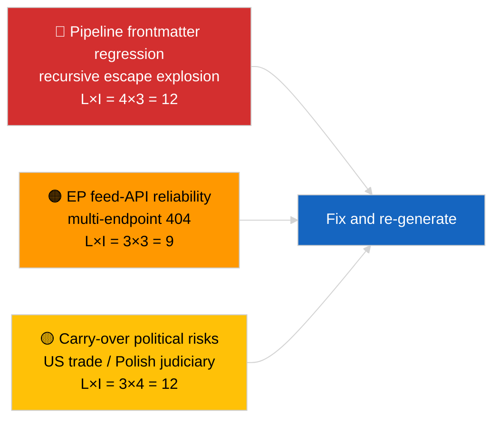

<!-- SPDX-FileCopyrightText: 2026 Hack23 AB -->
<!-- SPDX-License-Identifier: Apache-2.0 -->

# Ledelsesorientering — Seneste nyheder | 2026-04-02

**Klassificering:** OSINT | Offentlig parlamentarisk optegnelse
**Konfidensgrad:** 🟡 Medium (artikelens frontmatter er korrupt på grund af regression med indlejret escape; underliggende analyse er substantiel)
**Genereret:** 2026-04-02T00:00:00Z (retrospektivt orienteringsdokument)
**Artikeltype:** Breaking
**Kilde:** Europa-Parlamentets åbne dataportal

---

## 🎯 BLUF

**Anden dag efter marsferien; det fremhævede fund er datapipeline-forringelse snarere end EP-aktivitet.** Artikelens YAML-frontmatter er korrupt på grund af rekursiv indlejret citerings-escape (`title:`- og `description:`-felterne indeholder citationseksplosionsartefakter), men brødtekstens indhold er læsbart. Substantielt viser kørslen igen minimal ny EP-aktivitet (ferieuge 2 af 4), med nedarvede marsprioriteter (US toldtarif TA-10-2026-0096, HDV-emissionskreditter TA-10-2026-0084, Braun-immunitet TA-10-2026-0088, ECB's vicepræsident TA-10-2026-0060) på overvågningslisten. Det vigtigste nye signal er frontmatter-korruptionsregressionen — et datakvalitetsproblem som kørslen 2026-04-03/breaking-2 formaliserer som en dedikeret EP-API-pålidelighedsvurdering. **🟡 MEDIUM konfidensgrad** om at den underliggende parlamentariske aktivitet er nul; **🟢 HØJ konfidensgrad** om at pipelinen udsendte en fejlformateret frontmatter-artikel, der bør tagges til regenerering.

---

## 🧭 3 beslutninger dette dokument understøtter

| # | Beslutning | Hvem beslutter | Frist | Evidens |
|:-:|-----------|----------------|:-----:|---------|
| 1 | **Redaktionelt:** SPRING daglige nyheder over; tag artikel til regenerering på grund af korrupt frontmatter | Redaktør | +12h | Rekursiv citationsartefakt i titel |
| 2 | **Overvågning:** åbn datapipeline-issue for regression med indlejret escape | Datapipeline | +24h | Artikelens frontmatter |
| 3 | **Fremadrettet overvågning:** bekræft rettelse i 2026-04-03-kørslerne | Analyseleder | 2026-04-03 | Den følgende dags frontmatter |

---

## 📰 60-Second Read

- 🔴 **Frontmatter-regression** — titel- og beskrivelsesfelter indeholder rekursive escape-artefakter (`title: "title: \"title: \\\"…"`). Sandsynligvis en deterministisk renderer / sitemap-interaktion med tidligere escaped strenge. (🟢 Høj)
- 🟠 **Ferieuge 2 af 4** — Parlamentet er i intersessionel pause; ingen plenar-, udvalgs- eller trilogaktivitet forventes. (🟢 Høj)
- 🟢 **Marses overvågningsliste uændret** — US-told, HDV-emissioner, Braun-immunitet, ECB's vicepræsident. (🟢 Høj)
- 🟡 **Søskende-kørslerne:** 2026-04-02/committee-reports / motions / propositions viser alle identisk tomt tilstand — bekræfter systemomfattende ferie + feed-API-forhold. (🟢 Høj)
- 🔵 **Økonomisk kontekst:** US-EU-handels­trajektori forbliver den dominerende eksterne tryksvariabel. (🟢 Høj)
- 🟣 **Krydshenvisning:** se 2026-04-03/breaking-2 for den formelle EP-API-pålidelighedsvurdering, der følger af denne dags anomali. (🟢 Høj)
- 🩷 **Forstyrrelsesvektoren:** datakvalitetsregression er den aktive vektor i dag, ikke en politisk begivenhed. (🟢 Høj)
- ⚪ **Fremover:** Mercosur ECJ-udtalelse stadig afventende; aprilplenarens dagsorden endnu ikke offentliggjort.

---

## 🗂️ Tabel over topdokumenter / procedurer

| Rang | EP-reference | Titel (kort) | Betydning | Konfidensgrad | Status |
|:----:|--------------|-------------|:---------:|:-------------:|--------|
| 1 | — | Ingen nye procedurer eller vedtagne tekster den 2026-04-02 | 0,0 | 🟢 HØJ | Ferie — ingen aktivitet |
| 2 | TA-10-2026-0096 | US toldtarif (overfort) | 7,0 | 🟢 HØJ | Vedtaget 26. marts; overvåg |
| 3 | TA-10-2026-0088 | Braun-immunitetspræcedens (overfort) | 6,5 | 🟢 HØJ | Vedtaget 26. marts; LIBE overvåg |

---

## ⚠️ Risiko- og trusselsrapport

| Risiko | L | I | Score | Udløser | Kilde | Admiralitet |
|--------|:-:|:-:|:-----:|---------|-------|:-----------:|
| Pipeline frontmatter-regression | 4 | 3 | 12 | Samme artefakt i 2026-04-03 | Artikelens YAML | B2 |
| EP feed-API pålidelighed | 3 | 3 | 9 | Vedvarende 404'er | Samtidige søsterkørsler | B2 |
| US-EU handelsretaliation (overfort) | 3 | 4 | 12 | US modforanstaltning | TA-10-2026-0096 | A1 |
| EP-polsk retsvæsens spredning (overfort) | 4 | 3 | 12 | Yderligere immunitetstilfælde | TA-10-2026-0088 | A1 |

---

## 🔮 Vigtigste fremtidige udløser

**2026-04-03-kørselsserien** — tre separate breaking-kørslerne den dag (breaking, breaking-2, breaking-3) formaliserer EP-API-pålideligheds­bekymringen (breaking-2) og konsoliderer den politiske koalitionsbasislinje (breaking-1 og breaking-3). Sammenlign dagens fejlformaterede frontmatter-output med de kørslerne for at bekræfte, om pipeline-regressionen er tilbagevendende eller isoleret.

---

## 🛡️ Vurdering af kildekvalitet

- **Primærkilder:** EP's åbne dataportal — analysekørsel (løbs-ID uopretteligt fra korrupt frontmatter); brødtekstindhold konsistent med søskende for 2026-04-02.
- **Databegrænsninger:** Frontmatter er strukturelt korrupt; downstream renderer/SEO-forbrugere vil håndtere denne kørsel fejlagtigt. Afhjælpning: kør igen med renderer-rettelse.
- **Konfidensgrad for EP-sidens nulltilstand:** 🟢 HØJ.
- **Konfidensgrad for pipeline-regressionen:** 🟢 HØJ.

---

## 📎 Links

| Link | Sti |
|------|-----|
| Artikel (med korrupt frontmatter) | `./article.md` |
| Manifest | `./manifest.json` |
| Søsterkørslerne | `analysis/daily/2026-04-02/committee-reports/`, `motions/`, `propositions/` |
| Opfølgning | `analysis/daily/2026-04-03/breaking-2/` (formel EP-API-pålidelighedsvurdering) |

---

## 🔄 Krydshenvisning

**Foregående:** 2026-04-01/breaking dokumenterede 6/8 rådgivningsfeeds 404-mønsteret.
**Sideløbende:** 2026-04-02/committee-reports / motions / propositions alle tomme skabeloner.
**Næste:** 2026-04-03/breaking-2 eskalerer pipeline-pålideligheds­bekymringen til en dedikeret kørsel.

---

**Dokumentkontrol**
- **Skabelon:** `/analysis/templates/executive-brief.md`
- **Artefaktsti:** `analysis/daily/2026-04-02/breaking/executive-brief.md`
- **Klassificering:** Offentlig
- **Retrospektiv generering:** Bagfyldningssession; dette dokument erstatter den uanvendelige frontmatter-korrupte artikels BLUF-funktion.
