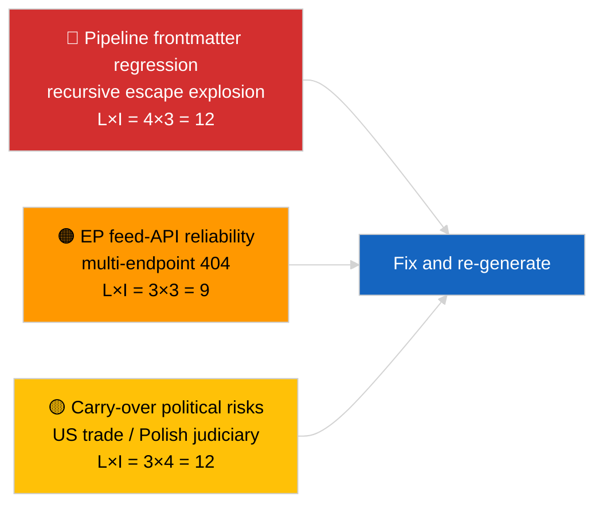

<!-- SPDX-FileCopyrightText: 2026 Hack23 AB -->
<!-- SPDX-License-Identifier: Apache-2.0 -->

# Führungslagebericht — Aktuelle Meldungen | 2026-04-02

**Einstufung:** OSINT | Öffentliche parlamentarische Dokumentation
**Konfidenzniveau:** 🟡 Mittel (der Frontmatter des Artikels ist durch eine Nested-Escape-Regression beschädigt; die zugrunde liegende Analyse ist jedoch substanziell)
**Erstellt:** 2026-04-02T00:00:00Z (retrospektives Orientierungsdokument)
**Artikeltyp:** Breaking
**Quelle:** Offenes Datenportal des Europäischen Parlaments

---

## 🎯 BLUF

**Zweiter Tag nach der Märzpause; der hervorstechende Befund ist die Datenpipeline-Degradation, nicht die EP-Aktivität.** Der YAML-Frontmatter des Artikels ist durch rekursive verschachtelte Anführungszeichen-Escape-Artefakte beschädigt (die `title:`- und `description:`-Felder enthalten Anführungszeichen-Explosionsartefakte), der Fließtextinhalt ist jedoch lesbar. Inhaltlich zeigt der Lauf erneut minimale neue EP-Aktivität (Unterbrechungswoche 2 von 4), mit den übertragenen Märzprioritäten (US-Zolltarif TA-10-2026-0096, Emissionskredite für schwere Nutzfahrzeuge TA-10-2026-0084, Braun-Immunität TA-10-2026-0088, EZB-Vizepräsident TA-10-2026-0060) auf der Beobachtungsliste. Das wichtigste neue Signal ist die Frontmatter-Korruptionsregression — ein Datenkvalitätsproblem, das der Lauf 2026-04-03/breaking-2 als dedizierte EP-API-Zuverlässigkeitsbewertung formalisiert. **🟡 MITTLERES Konfidenzniveau**, dass die zugrunde liegende parlamentarische Aktivität null ist; **🟢 HOHES Konfidenzniveau**, dass die Pipeline einen fehlformatierten Frontmatter-Artikel ausgesandt hat, der zur Regenerierung markiert werden sollte.

---

## 🧭 3 Entscheidungen, die dieses Dokument unterstützt

| # | Entscheidung | Entscheidungsträger | Frist | Beleg |
|:-:|-------------|--------------------:|:-----:|-------|
| 1 | **Redaktionell:** Tägliche News ÜBERSPRINGEN; Artikel zur Regenerierung aufgrund von korruptem Frontmatter markieren | Redakteur | +12h | Rekursives Anführungszeichen-Artefakt im Titel |
| 2 | **Monitoring:** Datenpipeline-Issue für Nested-Escape-Regression eröffnen | Datenpipeline | +24h | Frontmatter des Artikels |
| 3 | **Vorausschau:** Korrektur in den 2026-04-03-Läufen bestätigen | Analyseleitung | 2026-04-03 | Frontmatter des Folgetages |

---

## 📰 60-Second Read

- 🔴 **Frontmatter-Regression** — Titel- und Beschreibungsfelder enthalten rekursive Escape-Artefakte (`title: "title: \"title: \\\"…"`). Wahrscheinlich eine deterministische Renderer-/Sitemap-Interaktion mit vorherigen escaped Zeichenketten. (🟢 Hoch)
- 🟠 **Unterbrechungswoche 2 von 4** — Das Parlament befindet sich in intersessioneller Pause; keine Plenar-, Ausschuss- oder Trilog-Aktivität erwartet. (🟢 Hoch)
- 🟢 **März-Beobachtungsliste unverändert** — US-Zölle, HDV-Emissionen, Braun-Immunität, EZB-Vizepräsident. (🟢 Hoch)
- 🟡 **Schwester-Läufe:** 2026-04-02/committee-reports / motions / propositions zeigen alle identischen Leerzustand — bestätigt systemweite Pause + Feed-API-Verhältnisse. (🟢 Hoch)
- 🔵 **Wirtschaftlicher Kontext:** US-EU-Handels­trajektorie bleibt die dominante externe Druckvariable. (🟢 Hoch)
- 🟣 **Querverweise:** Siehe 2026-04-03/breaking-2 für die formelle EP-API-Zuverlässigkeitsbewertung, die aus der heutigen Anomalie folgt. (🟢 Hoch)
- 🩷 **Störungsvektor:** Datenkvalitätsregression ist heute der aktive Vektor — kein politisches Ereignis. (🟢 Hoch)
- ⚪ **Ausblick:** Mercosur EuGH-Gutachten noch ausstehend; April-Plenarum-Tagesordnung noch nicht veröffentlicht.

---

## 🗂️ Top-Dokumente / Verfahren Tabelle

| Rang | EP-Referenz | Titel (kurz) | Bedeutung | Konfidenzniveau | Status |
|:----:|-------------|-------------|:---------:|:---------------:|--------|
| 1 | — | Keine neuen Verfahren oder angenommenen Texte am 2026-04-02 | 0,0 | 🟢 HOCH | Pause — keine Aktivität |
| 2 | TA-10-2026-0096 | US-Zolltarif (übertragen) | 7,0 | 🟢 HOCH | Angenommen 26. März; beobachten |
| 3 | TA-10-2026-0088 | Braun-Immunitätspräzedenz (übertragen) | 6,5 | 🟢 HOCH | Angenommen 26. März; LIBE beobachten |

---

## ⚠️ Risiko- und Bedrohungsanalyse

| Risiko | L | I | Wert | Auslöser | Quelle | Admiralität |
|--------|:-:|:-:|:----:|----------|--------|:-----------:|
| Pipeline-Frontmatter-Regression | 4 | 3 | 12 | Gleicher Artefakt in 2026-04-03 | Artikel-YAML | B2 |
| EP-Feed-API-Zuverlässigkeit | 3 | 3 | 9 | Anhaltende 404-Fehler | Gleichzeitige Schwester-Läufe | B2 |
| US-EU-Handelsvergeltung (übertragen) | 3 | 4 | 12 | US-Gegenmaßnahme | TA-10-2026-0096 | A1 |
| EP-polnische Justiz-Ausbreitung (übertragen) | 4 | 3 | 12 | Weitere Immunitätsfälle | TA-10-2026-0088 | A1 |

---

## 🔮 Wichtigster zukünftiger Auslöser

**2026-04-03-Laufserie** — drei separate Breaking-Läufe an jenem Tag (breaking, breaking-2, breaking-3) formalisieren das EP-API-Zuverlässigkeitsproblem (breaking-2) und konsolidieren die politische Koalitionsbasis (breaking-1 und breaking-3). Der heutige fehlformatierte Frontmatter-Output sollte mit jenen Läufen verglichen werden, um zu bestätigen, ob die Pipeline-Regression wiederkehrend oder isoliert ist.

---

## 🛡️ Bewertung der Quellqualität

- **Primärquellen:** Offenes Datenportal des EP — Analyselauf (Lauf-ID aus korruptem Frontmatter nicht wiederherstellbar); Fließtextinhalt konsistent mit Geschwister-Analysen für 2026-04-02.
- **Datenbeschränkungen:** Frontmatter ist strukturell beschädigt; nachgelagerte Renderer-/SEO-Verbraucher werden diesen Lauf fehlerhaft verarbeiten. Abhilfe: erneut ausführen mit Renderer-Fix.
- **Konfidenzniveau für EP-seitigen Null-Zustand:** 🟢 HOCH.
- **Konfidenzniveau für Pipeline-Regression:** 🟢 HOCH.

---

## 📎 Links

| Link | Pfad |
|------|------|
| Artikel (mit korruptem Frontmatter) | `./article.md` |
| Manifest | `./manifest.json` |
| Schwester-Läufe | `analysis/daily/2026-04-02/committee-reports/`, `motions/`, `propositions/` |
| Folgemaßnahmen | `analysis/daily/2026-04-03/breaking-2/` (formelle EP-API-Zuverlässigkeitsbewertung) |

---

## 🔄 Querverweise

**Vorgänger:** 2026-04-01/breaking dokumentierte das 6/8-Feed-404-Muster.
**Parallel:** 2026-04-02/committee-reports / motions / propositions alle leere Vorlagen.
**Nachfolger:** 2026-04-03/breaking-2 eskaliert die Pipeline-Zuverlässigkeitsproblematik zu einem dedizierten Lauf.

---

**Dokumentkontrolle**
- **Vorlage:** `/analysis/templates/executive-brief.md`
- **Artefaktpfad:** `analysis/daily/2026-04-02/breaking/executive-brief.md`
- **Einstufung:** Öffentlich
- **Retrospektive Erstellung:** Backfill-Sitzung; dieses Dokument ersetzt die BLUF-Funktion des unbrauchbaren Frontmatter-beschädigten Artikels.
