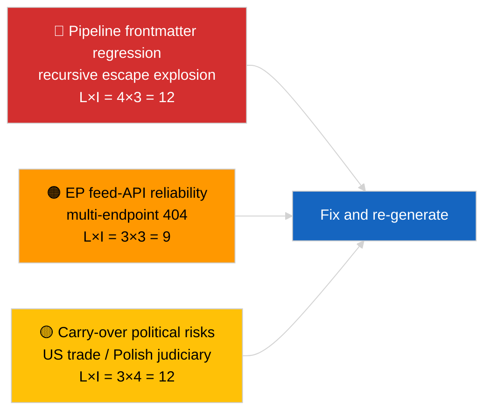

<!-- SPDX-FileCopyrightText: 2026 Hack23 AB -->
<!-- SPDX-License-Identifier: Apache-2.0 -->

# Informe ejecutivo — Últimas noticias | 2026-04-02

**Clasificación:** OSINT | Documento parlamentario público
**Nivel de confianza:** 🟡 Medio (el frontmatter del artículo está corrompido por una regresión de escape anidado; el análisis subyacente es sustancial)
**Generado:** 2026-04-02T00:00:00Z (documento retrospectivo)
**Tipo de artículo:** Breaking
**Fuente:** Portal de datos abiertos del Parlamento Europeo

---

## 🎯 BLUF

**Segundo día tras el receso de marzo; el hallazgo destacado es la degradación del pipeline de datos y no la actividad del PE.** El frontmatter YAML del artículo está corrompido por artefactos de escape anidado de comillas recursivo (los campos `title:` y `description:` contienen artefactos de explosión de comillas), pero el contenido del cuerpo del texto es legible. En cuanto al fondo, la sesión muestra de nuevo actividad nueva mínima del PE (semana de interrupción 2 de 4), con las prioridades heredadas de marzo (arancel aduanero de EE. UU. TA-10-2026-0096, créditos de emisiones para vehículos pesados TA-10-2026-0084, inmunidad Braun TA-10-2026-0088, vicepresidente del BCE TA-10-2026-0060) en la lista de seguimiento. La señal nueva más importante es la regresión de corrupción del frontmatter — un problema de calidad de datos que la sesión 2026-04-03/breaking-2 formaliza como una evaluación dedicada de fiabilidad de la API del PE. **🟡 NIVEL DE CONFIANZA MEDIO** respecto a que la actividad parlamentaria subyacente es nula; **🟢 NIVEL DE CONFIANZA ALTO** respecto a que el pipeline emitió un artículo con frontmatter malformado que debe etiquetarse para regeneración.

---

## 🧭 3 decisiones que este documento apoya

| # | Decisión | Responsable | Plazo | Evidencia |
|:-:|---------|------------|:-----:|-----------|
| 1 | **Editorial:** OMITIR noticias diarias; etiquetar artículo para regeneración por frontmatter corrompido | Editor | +12h | Artefacto recursivo de comillas en el título |
| 2 | **Supervisión:** abrir incidencia en el pipeline de datos por regresión de escape anidado | Pipeline de datos | +24h | Frontmatter del artículo |
| 3 | **Vigilancia prospectiva:** confirmar corrección en las sesiones del 2026-04-03 | Responsable de análisis | 2026-04-03 | Frontmatter del día siguiente |

---

## 📰 Lectura de 60 segundos

- 🔴 **Regresión del frontmatter** — Los campos de título y descripción contienen artefactos de escape recursivos (`title: "title: \"title: \\\"…"`). Probablemente una interacción determinista renderer/mapa del sitio con cadenas previamente escapadas. (🟢 Alto)
- 🟠 **Semana de interrupción 2 de 4** — El Parlamento está en pausa intersesional; no se espera actividad plenaria, en comisión ni de trílogo. (🟢 Alto)
- 🟢 **Lista de seguimiento de marzo sin cambios** — Aranceles de EE. UU., emisiones de vehículos pesados, inmunidad Braun, vicepresidente del BCE. (🟢 Alto)
- 🟡 **Sesiones hermanas:** 2026-04-02/committee-reports / motions / propositions muestran todas el mismo estado vacío — confirma la pausa generalizada y las condiciones de la API de feeds. (🟢 Alto)
- 🔵 **Contexto económico:** La trayectoria comercial EE. UU.-UE sigue siendo la variable de presión externa dominante. (🟢 Alto)
- 🟣 **Referencia cruzada:** ver 2026-04-03/breaking-2 para la evaluación formal de la fiabilidad de la API del PE derivada de la anomalía de hoy. (🟢 Alto)
- 🩷 **Vector de perturbación:** La regresión de la calidad de datos es el vector activo hoy — no un evento político. (🟢 Alto)
- ⚪ **Perspectivas:** Dictamen del TJUE sobre Mercosur todavía pendiente; orden del día de la sesión plenaria de abril aún sin publicar.

---

## 🗂️ Tabla de documentos y procedimientos principales

| Rango | Referencia PE | Título (breve) | Relevancia | Confianza | Estado |
|:-----:|--------------|---------------|:----------:|:---------:|--------|
| 1 | — | Ningún procedimiento ni texto adoptado el 2026-04-02 | 0,0 | 🟢 ALTA | Pausa — sin actividad |
| 2 | TA-10-2026-0096 | Arancel aduanero de EE. UU. (transferido) | 7,0 | 🟢 ALTA | Adoptado el 26 de marzo; seguimiento |
| 3 | TA-10-2026-0088 | Precedente de inmunidad Braun (transferido) | 6,5 | 🟢 ALTA | Adoptado el 26 de marzo; LIBE en seguimiento |

---

## ⚠️ Instantánea de riesgos y amenazas

| Riesgo | L | I | Puntuación | Detonante | Fuente | Almirantazgo |
|--------|:-:|:-:|:----------:|-----------|--------|:------------:|
| Regresión frontmatter del pipeline | 4 | 3 | 12 | Mismo artefacto el 2026-04-03 | YAML del artículo | B2 |
| Fiabilidad API de feeds del PE | 3 | 3 | 9 | Errores 404 persistentes | Sesiones hermanas simultáneas | B2 |
| Represalia comercial EE. UU.-UE (transferido) | 3 | 4 | 12 | Contramedida de EE. UU. | TA-10-2026-0096 | A1 |
| Contagio judicial PE-Polonia (transferido) | 4 | 3 | 12 | Nuevos casos de inmunidad | TA-10-2026-0088 | A1 |

---

## 🔮 Principal disparador futuro

**Serie de sesiones 2026-04-03** — tres sesiones breaking distintas ese día (breaking, breaking-2, breaking-3) formalizan la problemática de fiabilidad de la API del PE (breaking-2) y consolidan la línea de base de la coalición política (breaking-1 y breaking-3). Comparar la salida de frontmatter malformado de hoy con esas sesiones para confirmar si la regresión del pipeline es recurrente o aislada.

---

## 🛡️ Evaluación de la calidad de las fuentes

- **Fuentes primarias:** Portal de datos abiertos del PE — sesión de análisis (identificador de sesión irrecuperable desde el frontmatter corrompido); el contenido del cuerpo del texto es coherente con los análisis hermanos del 2026-04-02.
- **Limitaciones de los datos:** El frontmatter está estructuralmente corrompido; los renderers/consumidores SEO en la cadena descendente procesarán esta sesión incorrectamente. Medida correctiva: volver a ejecutar con corrección del renderer.
- **Confianza en el estado nulo en el lado del PE:** 🟢 ALTA.
- **Confianza en la regresión del pipeline:** 🟢 ALTA.

---

## 📎 Enlaces

| Enlace | Ruta |
|--------|------|
| Artículo (con frontmatter corrompido) | `./article.md` |
| Manifiesto | `./manifest.json` |
| Sesiones hermanas | `analysis/daily/2026-04-02/committee-reports/`, `motions/`, `propositions/` |
| Seguimiento | `analysis/daily/2026-04-03/breaking-2/` (evaluación formal de la fiabilidad de la API del PE) |

---

## 🔄 Referencia cruzada

**Anterior:** 2026-04-01/breaking documentó el patrón 404 de 6/8 feeds de asesoramiento.
**En paralelo:** 2026-04-02/committee-reports / motions / propositions — todas plantillas vacías.
**Siguiente:** 2026-04-03/breaking-2 escala la problemática de fiabilidad del pipeline a una sesión dedicada.

---

**Control del documento**
- **Plantilla:** `/analysis/templates/executive-brief.md`
- **Ruta del artefacto:** `analysis/daily/2026-04-02/breaking/executive-brief.md`
- **Clasificación:** Público
- **Generación retrospectiva:** Sesión de relleno; este documento reemplaza la función BLUF del artículo inutilizable con frontmatter corrompido.
