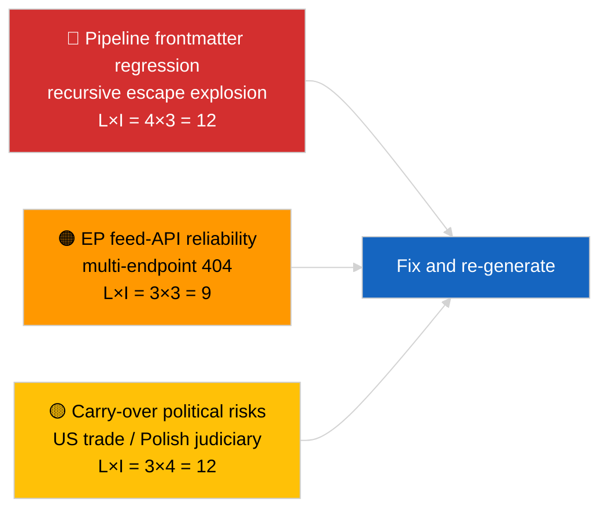

<!-- SPDX-FileCopyrightText: 2026 Hack23 AB -->
<!-- SPDX-License-Identifier: Apache-2.0 -->

# Johtotiivistelmä — Uusimmat uutiset | 2026-04-02

**Luokitus:** OSINT | Julkinen parlamentaarinen asiakirja
**Luottamustaso:** 🟡 Kohtalainen (artikkelin etusivu on vioittunut sisäkkäisten escape-merkkien regressiosta johtuen; taustalla oleva analyysi on kuitenkin sisällöllisesti pätevä)
**Luotu:** 2026-04-02T00:00:00Z (retrospektiivinen tausta-asiakirja)
**Artikkelityyppi:** Breaking
**Lähde:** Euroopan parlamentin avoin dataportti

---

## 🎯 BLUF

**Toinen päivä maaliskuun istuntotauon jälkeen; merkittävin havainto on tietopipelinen heikkeneminen eikä EP:n varsinainen toiminta.** Artikkelin YAML-etusivu on vioittunut rekursiivisten sisäkkäisten lainausmerkkipakojen vuoksi (`title:`- ja `description:`-kentät sisältävät lainausmerkkiräjähdysten artefakteja), mutta varsinainen tekstisisältö on luettavissa. Sisällöllisesti koodiajo osoittaa jälleen minimaalista uutta EP-toimintaa (taukuviikko 2/4), ja maaliskuun prioriteetit (Yhdysvaltojen tullitarifi TA-10-2026-0096, raskaiden ajoneuvojen päästöhyvitykset TA-10-2026-0084, Braun-immuniteetti TA-10-2026-0088, EKP:n varapresidentti TA-10-2026-0060) pysyvät seurantalistalla. Tärkein uusi signaali on etusivun korruptioregressio — datalaatua koskeva ongelma, jonka koodiajo 2026-04-03/breaking-2 muotoilee omaksi EP API -luotettavuusarviokseen. **🟡 KOHTALAINEN luottamustaso** siihen, että taustalla oleva parlamentaarinen toiminta on nolla; **🟢 KORKEA luottamustaso** siihen, että pipeline lähetti virheellisesti muotoillun etusivun artikkelin, joka tulee merkitä uudelleengeneraatiota varten.

---

## 🧭 3 päätöstä, joita tämä asiakirja tukee

| # | Päätös | Päätöksentekijä | Määräaika | Näyttö |
|:-:|--------|----------------|:---------:|--------|
| 1 | **Toimituksellinen:** ÄLÄ julkaise päivittäisiä uutisia; merkitse artikkeli uudelleengeneraatiota varten vioittuneen etusivun vuoksi | Toimittaja | +12h | Rekursiivinen lainausmerkkiartefakti otsikossa |
| 2 | **Seuranta:** avaa tietopipeline-ongelma sisäkkäisten escape-merkkien regressiosta | Datapipeline | +24h | Artikkelin etusivu |
| 3 | **Ennakkoseuranta:** vahvista korjaus 2026-04-03-ajoja varten | Analyysipäällikkö | 2026-04-03 | Seuraavan päivän etusivu |

---

## 📰 60-Second Read

- 🔴 **Etusivun regressio** — otsikko- ja kuvailukentät sisältävät rekursiivisia escape-artefakteja (`title: "title: \"title: \\\"…"`). Todennäköisesti deterministinen renderöijä / sivustokartta-vuorovaikutus aiemmin paettujen merkkijonojen kanssa. (🟢 Korkea)
- 🟠 **Taukuviikko 2/4** — Parlamentti on istuntovälissä; ei täysistunto-, valiokunta- eikä trilogitoimintaa. (🟢 Korkea)
- 🟢 **Maaliskuun seurantalista muuttumaton** — Yhdysvaltojen tullitarifit, raskaiden ajoneuvojen päästöt, Braun-immuniteetti, EKP:n varapresidentti. (🟢 Korkea)
- 🟡 **Sisaruusajot:** 2026-04-02/committee-reports / motions / propositions näyttävät kaikki täsmälleen saman tyhjän tilan — vahvistaa koko järjestelmän tauon ja feed-API-tilannetta. (🟢 Korkea)
- 🔵 **Taloudellinen konteksti:** Yhdysvaltojen ja EU:n välinen kauppakehitys on edelleen hallitsevin ulkoinen painetekijä. (🟢 Korkea)
- 🟣 **Ristiriitaistuminen:** katso 2026-04-03/breaking-2 virallista EP API -luotettavuusarviota varten, joka seuraa tämän päivän poikkeamasta. (🟢 Korkea)
- 🩷 **Häiriövektori:** datalaaturegressio on tänään aktiivinen vektori — ei poliittinen tapahtuma. (🟢 Korkea)
- ⚪ **Eteenpäin:** Mercosur ECJ -lausunto vielä odottaa; huhtikuun täysistunnon esityslista ei vielä julkaistu.

---

## 🗂️ Tärkeimmät asiakirjat / menettelyt

| Sija | EP-viite | Otsikko (lyhyt) | Merkitys | Luottamustaso | Status |
|:----:|----------|----------------|:--------:|:-------------:|--------|
| 1 | — | Ei uusia menettelyjä tai hyväksyttyjä tekstejä 2026-04-02 | 0,0 | 🟢 KORKEA | Tauko — ei toimintaa |
| 2 | TA-10-2026-0096 | Yhdysvaltojen tullitarifi (siirretty) | 7,0 | 🟢 KORKEA | Hyväksytty 26.3.; seuraa |
| 3 | TA-10-2026-0088 | Braun-immuniteettienprecedentti (siirretty) | 6,5 | 🟢 KORKEA | Hyväksytty 26.3.; LIBE seuraa |

---

## ⚠️ Riski- ja uhkakuva

| Riski | L | I | Pisteet | Laukaisu | Lähde | Amiraalisto |
|-------|:-:|:-:|:-------:|----------|-------|:-----------:|
| Pipeline-etusivun regressio | 4 | 3 | 12 | Sama artefakti 2026-04-03:ssa | Artikkelin YAML | B2 |
| EP feed-API luotettavuus | 3 | 3 | 9 | Jatkuvat 404-virheet | Samanaikaiset sisaruusajot | B2 |
| Yhdysvaltojen–EU:n kaupan kosto (siirretty) | 3 | 4 | 12 | Yhdysvaltojen vastatoimet | TA-10-2026-0096 | A1 |
| EP:n–Puolan oikeusvaltioleviäminen (siirretty) | 4 | 3 | 12 | Lisää immuniteettiasioita | TA-10-2026-0088 | A1 |

---

## 🔮 Tärkein tulevaisuuden laukaisin

**2026-04-03-ajojen sarja** — kolme erillistä breaking-ajoa sinä päivänä (breaking, breaking-2, breaking-3) muotoilevat EP API -luotettavuushuolen (breaking-2) ja konsolidoivat poliittisen koalitiolähtötason (breaking-1 ja breaking-3). Vertaa tämän päivän virheellisesti muotoiltua etusivutuotosta näihin ajoihin varmistaaksesi, onko pipeline-regressio toistuva vai eristetty.

---

## 🛡️ Lähdelajatun arviointi

- **Ensisijainen lähde:** EP:n avoin dataportti — analyysikoodiajo (ajo-tunnus ei palautettavissa vioittuneesta etusivusta); tekstisisältö johdonmukainen 2026-04-02-sisaruuksien kanssa.
- **Tietorajoitukset:** Etusivu on rakenteellisesti vioittunut; alavirtaan sijaitsevat renderöijät/SEO-kuluttajat käsittelevät tämän ajon virheellisesti. Korjaustoimenpide: käynnistä uudelleen renderöijän korjauksella.
- **EP-sivuston nollatilan luottamustaso:** 🟢 KORKEA.
- **Pipeline-regressioiden luottamustaso:** 🟢 KORKEA.

---

## 📎 Linkit

| Linkki | Polku |
|--------|-------|
| Artikkeli (vioittuneella etusivulla) | `./article.md` |
| Manifest | `./manifest.json` |
| Sisaruusajot | `analysis/daily/2026-04-02/committee-reports/`, `motions/`, `propositions/` |
| Jatkotoimenpiteet | `analysis/daily/2026-04-03/breaking-2/` (virallinen EP API -luotettavuusarviointi) |

---

## 🔄 Ristiriitaistuminen

**Edellinen:** 2026-04-01/breaking dokumentoi 6/8 neuvonantajasyötteiden 404-kuvion.
**Rinnakkaiset:** 2026-04-02/committee-reports / motions / propositions — kaikki tyhjiä malleja.
**Seuraava:** 2026-04-03/breaking-2 nostaa pipeline-luotettavuushuolen omaksi yksiköidyksi ajokseen.

---

**Asiakirjavalvonta**
- **Malli:** `/analysis/templates/executive-brief.md`
- **Artefaktipolku:** `analysis/daily/2026-04-02/breaking/executive-brief.md`
- **Luokitus:** Julkinen
- **Retrospektiivinen generointi:** Täyttöistunto; tämä asiakirja korvaa käyttökelvottoman etusivun vioittuneen artikkelin BLUF-toiminnon.
