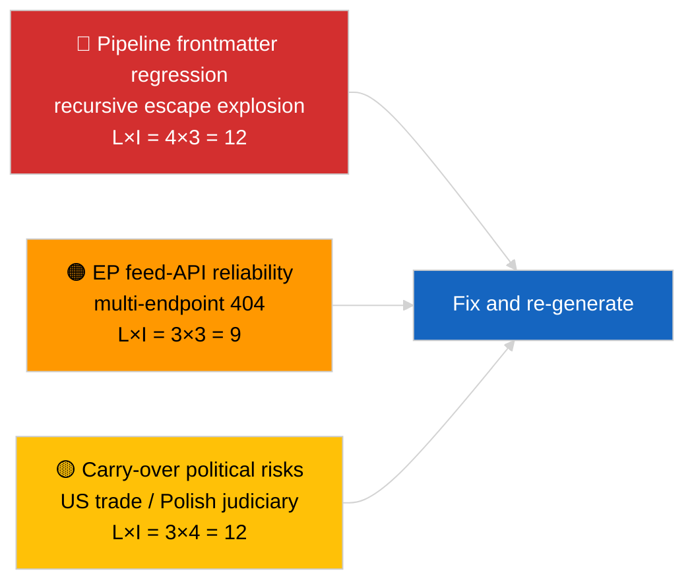

<!-- SPDX-FileCopyrightText: 2026 Hack23 AB -->
<!-- SPDX-License-Identifier: Apache-2.0 -->

# Note de synthèse — Dernières informations | 2026-04-02

**Classification :** OSINT | Document parlementaire public
**Niveau de confiance :** 🟡 Moyen (le frontmatter de l'article est corrompu en raison d'une régression d'échappement imbriqué ; l'analyse sous-jacente est néanmoins substantielle)
**Généré :** 2026-04-02T00:00:00Z (document rétrospectif)
**Type d'article :** Breaking
**Source :** Portail de données ouvertes du Parlement européen

---

## 🎯 BLUF

**Deuxième jour après la pause de mars ; la constatation marquante est la dégradation du pipeline de données plutôt que l'activité du PE.** Le frontmatter YAML de l'article est corrompu par des artefacts récursifs d'échappement imbriqué de guillemets (les champs `title:` et `description:` contiennent des artefacts d'explosion de guillemets), mais le contenu du corps du texte est lisible. Sur le fond, la session montre à nouveau une activité neue minimale du PE (semaine d'interruption 2 sur 4), avec les priorités héritées de mars (tarif douanier US TA-10-2026-0096, crédits d'émission pour les poids lourds TA-10-2026-0084, immunité Braun TA-10-2026-0088, vice-président de la BCE TA-10-2026-0060) sur la liste de surveillance. Le signal nouveau le plus important est la régression de corruption du frontmatter — un problème de qualité des données que la session 2026-04-03/breaking-2 formalisera en une évaluation dédiée de la fiabilité de l'API EP. **🟡 NIVEAU DE CONFIANCE MOYEN** quant à l'activité parlementaire sous-jacente nulle ; **🟢 NIVEAU DE CONFIANCE ÉLEVÉ** quant au fait que le pipeline a émis un article au frontmatter malformé qui doit être marqué pour régénération.

---

## 🧭 3 décisions que ce document soutient

| # | Décision | Décideur | Échéance | Preuve |
|:-:|---------|---------|:--------:|--------|
| 1 | **Éditorial :** IGNORER les actualités quotidiennes ; marquer l'article pour régénération en raison d'un frontmatter corrompu | Éditeur | +12h | Artefact récursif de guillemets dans le titre |
| 2 | **Surveillance :** ouvrir un ticket de pipeline de données pour la régression d'échappement imbriqué | Pipeline de données | +24h | Frontmatter de l'article |
| 3 | **Veille prospective :** confirmer la correction dans les sessions 2026-04-03 | Responsable analyse | 2026-04-03 | Frontmatter du lendemain |

---

## 📰 Lecture de 60 secondes

- 🔴 **Régression du frontmatter** — Les champs titre et description contiennent des artefacts récursifs d'échappement (`title: "title: \"title: \\\"…"`). Probablement une interaction déterministe renderer/sitemap avec des chaînes précédemment échappées. (🟢 Élevé)
- 🟠 **Semaine d'interruption 2 sur 4** — Le Parlement est en pause intersessionnelle ; aucune activité plénière, en commission ou de trilogue attendue. (🟢 Élevé)
- 🟢 **Liste de surveillance de mars inchangée** — Droits de douane US, émissions des PL, immunité Braun, vice-président de la BCE. (🟢 Élevé)
- 🟡 **Sessions sœurs :** 2026-04-02/committee-reports / motions / propositions affichent toutes un état vide identique — confirme la pause générale et les conditions de l'API de flux. (🟢 Élevé)
- 🔵 **Contexte économique :** La trajectoire commerciale UE-États-Unis reste la variable de pression externe dominante. (🟢 Élevé)
- 🟣 **Référence croisée :** voir 2026-04-03/breaking-2 pour l'évaluation formelle de la fiabilité de l'API EP découlant de l'anomalie d'aujourd'hui. (🟢 Élevé)
- 🩷 **Vecteur de perturbation :** La régression de la qualité des données est le vecteur actif aujourd'hui — non un événement politique. (🟢 Élevé)
- ⚪ **Perspectives :** Avis de la CJUE sur le Mercosur toujours en attente ; ordre du jour de la plénière d'avril pas encore publié.

---

## 🗂️ Tableau des principaux documents / procédures

| Rang | Référence PE | Titre (court) | Importance | Confiance | Statut |
|:----:|-------------|--------------|:----------:|:---------:|--------|
| 1 | — | Aucune procédure ou texte adopté le 2026-04-02 | 0,0 | 🟢 ÉLEVÉE | Pause — aucune activité |
| 2 | TA-10-2026-0096 | Tarif douanier US (reporté) | 7,0 | 🟢 ÉLEVÉE | Adopté le 26 mars ; surveiller |
| 3 | TA-10-2026-0088 | Précédent immunité Braun (reporté) | 6,5 | 🟢 ÉLEVÉE | Adopté le 26 mars ; LIBE surveille |

---

## ⚠️ Tableau des risques et menaces

| Risque | L | I | Score | Déclencheur | Source | Admirauté |
|--------|:-:|:-:|:-----:|-------------|--------|:---------:|
| Régression frontmatter du pipeline | 4 | 3 | 12 | Même artefact le 2026-04-03 | YAML de l'article | B2 |
| Fiabilité de l'API flux PE | 3 | 3 | 9 | Erreurs 404 persistantes | Sessions sœurs simultanées | B2 |
| Rétorsion commerciale US-UE (reporté) | 3 | 4 | 12 | Contre-mesures US | TA-10-2026-0096 | A1 |
| Diffusion judiciaire EP-Pologne (reporté) | 4 | 3 | 12 | Nouveaux cas d'immunité | TA-10-2026-0088 | A1 |

---

## 🔮 Principal déclencheur prospectif

**Série de sessions 2026-04-03** — trois sessions breaking distinctes ce jour-là (breaking, breaking-2, breaking-3) formalisent la problématique de fiabilité de l'API EP (breaking-2) et consolident la ligne de base de la coalition politique (breaking-1 et breaking-3). Comparer les sorties de frontmatter malformées d'aujourd'hui avec ces sessions pour confirmer si la régression du pipeline est récurrente ou isolée.

---

## 🛡️ Évaluation de la qualité des sources

- **Sources primaires :** Portail de données ouvertes du PE — session d'analyse (identifiant de session irrécupérable depuis le frontmatter corrompu) ; le contenu du corps du texte est cohérent avec les analyses sœurs du 2026-04-02.
- **Limites des données :** Le frontmatter est structurellement corrompu ; les renderers/consommateurs SEO en aval traiteront cette session incorrectement. Mesure corrective : relancer avec un correctif du renderer.
- **Confiance pour l'état zéro côté PE :** 🟢 ÉLEVÉE.
- **Confiance pour la régression du pipeline :** 🟢 ÉLEVÉE.

---

## 📎 Liens

| Lien | Chemin |
|------|--------|
| Article (avec frontmatter corrompu) | `./article.md` |
| Manifeste | `./manifest.json` |
| Sessions sœurs | `analysis/daily/2026-04-02/committee-reports/`, `motions/`, `propositions/` |
| Suite | `analysis/daily/2026-04-03/breaking-2/` (évaluation formelle de la fiabilité de l'API EP) |

---

## 🔄 Référence croisée

**Précédent :** 2026-04-01/breaking a documenté le schéma 404 de 6/8 flux de conseil.
**En parallèle :** 2026-04-02/committee-reports / motions / propositions — tous des modèles vides.
**Suivant :** 2026-04-03/breaking-2 élève la problématique de fiabilité du pipeline en session dédiée.

---

**Contrôle du document**
- **Modèle :** `/analysis/templates/executive-brief.md`
- **Chemin d'artefact :** `analysis/daily/2026-04-02/breaking/executive-brief.md`
- **Classification :** Public
- **Génération rétrospective :** Session de remplissage ; ce document remplace la fonction BLUF de l'article inutilisable au frontmatter corrompu.
