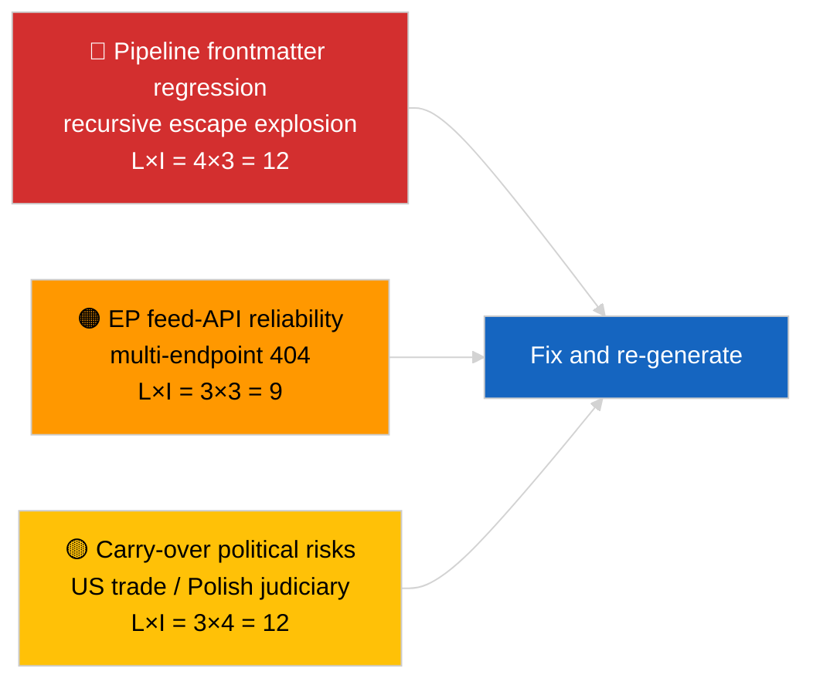

<!-- SPDX-FileCopyrightText: 2026 Hack23 AB -->
<!-- SPDX-License-Identifier: Apache-2.0 -->

# תקציר מנהלים — חדשות אחרונות | 2026-04-02

**סיווג:** OSINT | מסמך פרלמנטרי ציבורי
**רמת אמינות:** 🟡 בינונית (ה-frontmatter של הכתבה פגוע עקב רגרסיית escape מקונן; הניתוח הבסיסי הוא מהותי)
**נוצר:** 2026-04-02T00:00:00Z (מסמך רטרוספקטיבי)
**סוג כתבה:** עדכון שוטף
**מקור:** פורטל הנתונים הפתוח של הפרלמנט האירופי

---

## 🎯 BLUF

**יום שני לאחר הפסקת מרץ; הממצא הבולט הוא התדרדרות צינור הנתונים ולא פעילות הפרלמנט האירופי.** ה-YAML frontmatter של הכתבה פגוע עקב ארטיפקטים של escape מרובת רמות (".`title:` ו-`description:` מכילים ארטיפקטים של פיצוץ מרכאות), אך תוכן גוף הטקסט קריא. מבחינה מהותית, ריצת הניתוח מציגה שוב פעילות PE חדשה מינימלית (שבוע הפסקה 2 מתוך 4), עם עדיפויות מרץ שנגררו (מכסי ה-US TA-10-2026-0096, זיכויי פליטות לכלי רכב כבדים TA-10-2026-0084, חסינות Braun TA-10-2026-0088, סגן נשיא ה-ECB TA-10-2026-0060) ברשימת המעקב. האות החדש החשוב ביותר הוא רגרסיית פגיעת ה-frontmatter — בעיית איכות נתונים שריצת 2026-04-03/breaking-2 מגבשת כהערכת אמינות ייעודית ל-API של הפרלמנט. **🟡 רמת אמינות בינונית** שפעילות פרלמנטרית בסיסית היא אפס; **🟢 רמת אמינות גבוהה** שצינור הנתונים שלח כתבה עם frontmatter פגום שיש לסמן לצורך יצירה מחדש.

---

## 🧭 3 החלטות שמסמך זה תומך בהן

| # | החלטה | מקבל ההחלטה | מועד אחרון | ראיה |
|:-:|-------|------------|:-----------:|------|
| 1 | **מערכתי:** לדלג על חדשות יומיות; לסמן כתבה לשחזור עקב frontmatter פגום | עורך | +12 שעות | ארטיפקט מרכאות רקורסיבי בכותרת |
| 2 | **מעקב:** פתיחת פנייה בצינור הנתונים עבור רגרסיית escape מקונן | צינור הנתונים | +24 שעות | frontmatter הכתבה |
| 3 | **ניטור עתידי:** לאשר תיקון בריצות 2026-04-03 | אחראי ניתוח | 2026-04-03 | frontmatter של היום הבא |

---

## 📰 קריאה של 60 שניות

- 🔴 **רגרסיית frontmatter** — שדות כותרת ותיאור מכילים ארטיפקטים רקורסיביים של escape (`title: "title: \"title: \\\"…"`). ככל הנראה אינטראקציה דטרמיניסטית בין renderer/מפת האתר למחרוזות שנגרמו escape. (🟢 גבוה)
- 🟠 **שבוע הפסקה 2 מתוך 4** — הפרלמנט בהפסקה בין-מושבית; לא צפויה פעילות מליאה, ועדה, או טרילוג. (🟢 גבוה)
- 🟢 **רשימת מעקב מרץ ללא שינוי** — מכסי US, פליטות כלי רכב כבדים, חסינות Braun, סגן נשיא ECB. (🟢 גבוה)
- 🟡 **ריצות אחיות:** 2026-04-02/committee-reports / motions / propositions כולן מציגות מצב ריק זהה — מאשרות הפסקה כלל-מערכתית וכשלי API של הזנת נתונים. (🟢 גבוה)
- 🔵 **הקשר כלכלי:** מסלול הסחר US-EU נשאר משתנה הלחץ החיצוני הדומיננטי. (🟢 גבוה)
- 🟣 **הפניה צולבת:** ראו 2026-04-03/breaking-2 להערכת האמינות הרשמית של API הפרלמנט הנגזרת מהחריגה של היום. (🟢 גבוה)
- 🩷 **וקטור שיבוש:** רגרסיית איכות הנתונים היא הוקטור הפעיל היום — לא אירוע פוליטי. (🟢 גבוה)
- ⚪ **מבט קדימה:** חוות דעת ה-ECJ בעניין Mercosur עדיין ממתינה; סדר יום מליאת אפריל טרם פורסם.

---

## 🗂️ טבלת מסמכים ונהלים עיקריים

| דירוג | מרשם PE | כותרת (קצר) | חשיבות | אמינות | סטטוס |
|:-----:|---------|------------|:------:|:------:|-------|
| 1 | — | אין נהלים או טקסטים שאומצו ב-2026-04-02 | 0.0 | 🟢 גבוהה | הפסקה — ללא פעילות |
| 2 | TA-10-2026-0096 | מכס US (מועבר) | 7.0 | 🟢 גבוהה | אומץ 26 מרץ; מעקב |
| 3 | TA-10-2026-0088 | תקדים חסינות Braun (מועבר) | 6.5 | 🟢 גבוהה | אומץ 26 מרץ; LIBE עוקבת |

---

## ⚠️ תמונת מצב של סיכונים ואיומים

| סיכון | ל | ה | ציון | טריגר | מקור | אדמירליות |
|-------|:-:|:-:|:----:|--------|------|:----------:|
| רגרסיית frontmatter בצינור | 4 | 3 | 12 | אותו ארטיפקט ב-2026-04-03 | YAML הכתבה | B2 |
| אמינות API הזנת PE | 3 | 3 | 9 | שגיאות 404 מתמשכות | ריצות אחיות מקבילות | B2 |
| תגמול סחרי US-EU (מועבר) | 3 | 4 | 12 | צעד נגד אמריקאי | TA-10-2026-0096 | A1 |
| התפשטות משפטית EP-פולין (מועבר) | 4 | 3 | 12 | תביעות חסינות נוספות | TA-10-2026-0088 | A1 |

---

## 🔮 הטריגר העתידי המרכזי

**סדרת ריצות 2026-04-03** — שלוש ריצות breaking נפרדות ביום ההוא (breaking, breaking-2, breaking-3) מגבשות את בעיית אמינות ה-API של הפרלמנט (breaking-2) ומאחדות את קו הבסיס של הקואליציה הפוליטית (breaking-1 ו-breaking-3). יש להשוות את פלט ה-frontmatter הפגום של היום עם אותן ריצות כדי לאשר אם רגרסיית הצינור חוזרת או מבודדת.

---

## 🛡️ הערכת איכות המקורות

- **מקורות ראשוניים:** פורטל הנתונים הפתוח של הפרלמנט האירופי — ריצת ניתוח (מזהה ריצה אינו ניתן לשחזור מ-frontmatter פגום); תוכן גוף הטקסט עקבי עם ניתוחים אחיים לתאריך 2026-04-02.
- **מגבלות נתונים:** frontmatter פגום מבנית; מעבדי ה-renderer וצרכני SEO ב-downstream יטפלו בריצה זו בצורה שגויה. פעולה מתקנת: הפעל מחדש עם תיקון renderer.
- **אמינות למצב אפס בצד הפרלמנט:** 🟢 גבוהה.
- **אמינות לרגרסיית הצינור:** 🟢 גבוהה.

---

## 📎 קישורים

| קישור | נתיב |
|-------|------|
| כתבה (עם frontmatter פגום) | `./article.md` |
| מניפסט | `./manifest.json` |
| ריצות אחיות | `analysis/daily/2026-04-02/committee-reports/`، `motions/`، `propositions/` |
| המשך | `analysis/daily/2026-04-03/breaking-2/` (הערכת אמינות API רשמית) |

---

## 🔄 הפניה צולבת

**קודם:** 2026-04-01/breaking תיעד את דפוס ה-404 של 6/8 הזנות ייעוץ.
**מקביל:** כל ריצות 2026-04-02/committee-reports ו-motions ו-propositions — תבניות ריקות.
**הבא:** 2026-04-03/breaking-2 מעלה את בעיית אמינות הצינור לריצה ייעודית.

---

**בקרת מסמכים**
- **תבנית:** `/analysis/templates/executive-brief.md`
- **נתיב ארטיפקט:** `analysis/daily/2026-04-02/breaking/executive-brief.md`
- **סיווג:** ציבורי
- **יצירה רטרוספקטיבית:** מפגש מילוי לאחור; מסמך זה מחליף את תפקיד ה-BLUF של הכתבה הבלתי שמישה עם frontmatter פגום.
