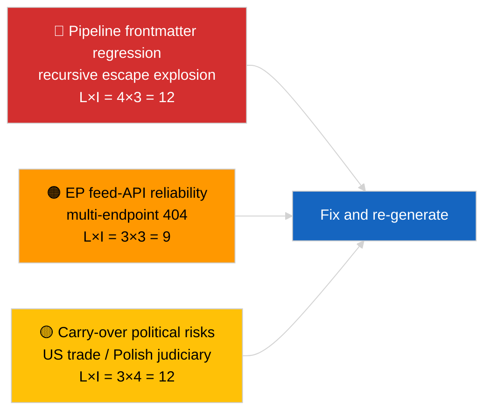

<!-- SPDX-FileCopyrightText: 2026 Hack23 AB -->
<!-- SPDX-License-Identifier: Apache-2.0 -->

# エグゼクティブ・ブリーフィング — 最新ニュース | 2026-04-02

**分類:** OSINT | 公開議会文書
**信頼度:** 🟡 中程度（記事のフロントマターはネストされたエスケープ処理の不具合により破損しているが、基盤となる分析は実質的な内容を有する）
**作成日:** 2026-04-02T00:00:00Z（回顧的補完文書）
**記事タイプ:** 速報
**情報源:** 欧州議会オープンデータポータル

---

## 🎯 BLUF（要点）

**3月の休会後2日目。注目すべき発見はEPの活動ではなく、データパイプラインの劣化である。** 記事のYAML フロントマターは、再帰的なネスト引用符エスケープの連鎖（`title:` および `description:` フィールドに引用符爆発の残留物が含まれる）によって破損しているが、本文の内容は読み取り可能である。実質的に、今回の実行は再び最小限の新規EP活動（休会第2週 / 4週）を示しており、3月から引き継がれた優先事項（米国関税 TA-10-2026-0096、重量車両排出クレジット TA-10-2026-0084、ブラウン免責 TA-10-2026-0088、ECB副総裁 TA-10-2026-0060）が監視リストに残っている。最重要の新たなシグナルはフロントマター破損のリグレッションであり、2026-04-03/breaking-2の実行がEP API信頼性評価として正式化するデータ品質問題である。**🟡 中程度の信頼度**：議会活動がゼロであること；**🟢 高い信頼度**：パイプラインが不正フォーマットのフロントマター記事を出力したこと（再生成マークを要す）。

---

## 🧭 この文書が支援する3つの意思決定

| # | 決定事項 | 決定者 | 期限 | 根拠 |
|:-:|---------|-------|:----:|------|
| 1 | **編集上の決定:** 日次ニュースをスキップ；フロントマター破損のため記事を再生成用にマーク | 編集者 | +12時間 | タイトル内の再帰的引用符残留物 |
| 2 | **監視:** ネストエスケープリグレッションのためデータパイプラインのissueを開設 | データパイプライン | +24時間 | 記事のフロントマター |
| 3 | **先行監視:** 2026-04-03の実行で修正を確認 | 分析責任者 | 2026-04-03 | 翌日のフロントマター |

---

## 📰 60秒で読む要約

- 🔴 **フロントマター リグレッション** — タイトルと説明フィールドに再帰的なエスケープ残留物（`title: "title: \"title: \\\"…"`）が含まれている。以前エスケープされた文字列とのレンダラー / サイトマップの決定論的な相互作用と思われる。（🟢 高）
- 🟠 **休会第2週 / 4週** — 議会は会期間休暇中；本会議・委員会・三部会のいずれの活動も予定されていない。（🟢 高）
- 🟢 **3月の監視リスト変更なし** — 米国関税、重量車両排出量、ブラウン免責、ECB副総裁。（🟢 高）
- 🟡 **姉妹実行:** 2026-04-02/committee-reports / motions / propositions のすべてが同一の空の状態を示す — システム全体の休会とフィードAPIの状況を確認。（🟢 高）
- 🔵 **経済的文脈:** 米国-EUの貿易軌跡は支配的な外部圧力変数であり続ける。（🟢 高）
- 🟣 **相互参照:** 本日の異常から生じるEP APIの正式な信頼性評価については2026-04-03/breaking-2を参照。（🟢 高）
- 🩷 **混乱ベクトル:** 本日の活発なベクトルはデータ品質リグレッションであり、政治的出来事ではない。（🟢 高）
- ⚪ **今後の見通し:** メルコスールに関するECJの意見は依然として待機中；4月本会議の議題はまだ公表されていない。

---

## 🗂️ 主要文書・手続き一覧表

| 順位 | EP参照 | タイトル（短縮） | 重要度 | 信頼度 | 状態 |
|:---:|--------|----------------|:-----:|:-----:|------|
| 1 | — | 2026-04-02に新たな手続きも採択テキストもなし | 0.0 | 🟢 高 | 休会 — 活動なし |
| 2 | TA-10-2026-0096 | 米国関税（引継） | 7.0 | 🟢 高 | 3月26日採択；監視継続 |
| 3 | TA-10-2026-0088 | ブラウン免責先例（引継） | 6.5 | 🟢 高 | 3月26日採択；LIBE監視中 |

---

## ⚠️ リスク・脅威のスナップショット

| リスク | L | I | スコア | トリガー | 情報源 | 提督評価 |
|-------|:-:|:-:|:-----:|---------|--------|:-------:|
| パイプラインフロントマターリグレッション | 4 | 3 | 12 | 2026-04-03に同じ残留物 | 記事のYAML | B2 |
| EP フィードAPI 信頼性 | 3 | 3 | 9 | 継続的な404エラー | 同時進行の姉妹実行 | B2 |
| 米国-EU貿易報復（引継） | 3 | 4 | 12 | 米国の対抗措置 | TA-10-2026-0096 | A1 |
| EP-ポーランド司法波及（引継） | 4 | 3 | 12 | さらなる免責事件 | TA-10-2026-0088 | A1 |

---

## 🔮 最重要の将来トリガー

**2026-04-03の実行シリーズ** — その日に3つの独立した速報実行（breaking、breaking-2、breaking-3）がEP APIの信頼性問題を正式化し（breaking-2）、政治的連立のベースラインを統合する（breaking-1とbreaking-3）。本日の不正フォーマットのフロントマター出力をそれらの実行と比較して、パイプラインリグレッションが繰り返しか孤立しているかを確認すること。

---

## 🛡️ 情報源品質評価

- **一次情報源:** 欧州議会オープンデータポータル — 分析実行（破損したフロントマターから実行IDは復元不可能）；本文内容は2026-04-02の姉妹分析と一致。
- **データの制限:** フロントマターは構造的に破損しており、ダウンストリームのレンダラー/SEOコンシューマーはこの実行を誤処理する。是正措置：レンダラー修正で再実行。
- **EP側のゼロ状態に対する信頼度:** 🟢 高。
- **パイプラインリグレッションに対する信頼度:** 🟢 高。

---

## 📎 リンク

| リンク | パス |
|-------|------|
| 記事（破損したフロントマター付き） | `./article.md` |
| マニフェスト | `./manifest.json` |
| 姉妹実行 | `analysis/daily/2026-04-02/committee-reports/`、`motions/`、`propositions/` |
| フォローアップ | `analysis/daily/2026-04-03/breaking-2/`（EP API正式信頼性評価） |

---

## 🔄 相互参照

**前回:** 2026-04-01/breakingが6/8アドバイザリーフィードの404パターンを文書化。
**並行:** 2026-04-02/committee-reports / motions / propositions — すべて空のテンプレート。
**次回:** 2026-04-03/breaking-2がパイプライン信頼性問題を専用実行として昇格。

---

**文書管理**
- **テンプレート:** `/analysis/templates/executive-brief.md`
- **成果物パス:** `analysis/daily/2026-04-02/breaking/executive-brief.md`
- **分類:** 公開
- **回顧的生成:** バックフィルセッション；この文書は使用不能なフロントマター破損記事のBLUF機能を代替する。
