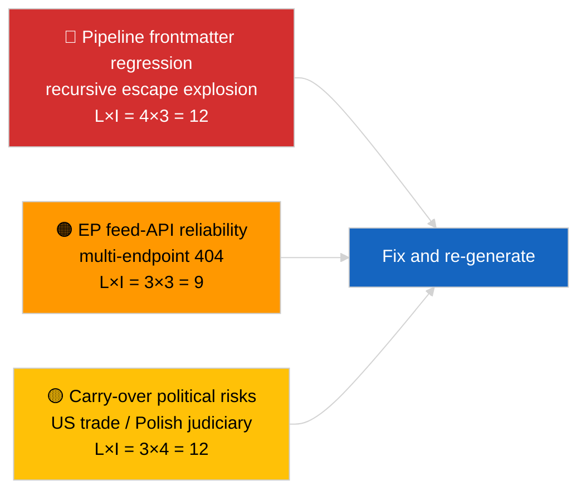

<!-- SPDX-FileCopyrightText: 2026 Hack23 AB -->
<!-- SPDX-License-Identifier: Apache-2.0 -->

# 경영진 브리핑 — 최신 뉴스 | 2026-04-02

**분류:** OSINT | 공개 의회 문서
**신뢰도:** 🟡 중간 (기사의 프론트매터가 중첩 이스케이프 회귀로 손상됨; 기초 분석은 내용적으로 실질적임)
**작성일:** 2026-04-02T00:00:00Z (소급 보완 문서)
**기사 유형:** 속보
**출처:** 유럽의회 공개 데이터 포털

---

## 🎯 BLUF (핵심 요약)

**3월 휴회 후 이틀째; 주요 발견은 EP 활동이 아닌 데이터 파이프라인 저하입니다.** 기사의 YAML 프론트매터는 재귀적인 중첩 인용 이스케이프(`title:` 및 `description:` 필드에 인용 폭발 잔재 포함)로 손상되었으나, 본문 내용은 읽을 수 있습니다. 실질적으로, 이번 실행은 다시 최소한의 새로운 EP 활동(휴회 2주차/4주차)을 보여주며, 3월의 이월 우선순위(미국 관세 TA-10-2026-0096, 중량 차량 배출 크레딧 TA-10-2026-0084, 브라운 면책 TA-10-2026-0088, ECB 부총재 TA-10-2026-0060)가 감시 목록에 남아 있습니다. 가장 중요한 새 신호는 프론트매터 손상 회귀로, 2026-04-03/breaking-2 실행이 전용 EP API 신뢰성 평가로 공식화하는 데이터 품질 문제입니다. **🟡 중간 신뢰도**: 기초 의회 활동이 제로임; **🟢 높은 신뢰도**: 파이프라인이 잘못 형식화된 프론트매터 기사를 출력했으며 재생성 표시가 필요함.

---

## 🧭 이 문서가 지원하는 3가지 결정

| # | 결정 사항 | 결정권자 | 기한 | 근거 |
|:-:|---------|--------|:----:|------|
| 1 | **편집적 결정:** 일일 뉴스 건너뜀; 손상된 프론트매터로 인해 기사를 재생성 표시 | 편집자 | +12시간 | 제목의 재귀적 인용 잔재 |
| 2 | **모니터링:** 중첩 이스케이프 회귀를 위한 데이터 파이프라인 이슈 개설 | 데이터 파이프라인 | +24시간 | 기사 프론트매터 |
| 3 | **사전 모니터링:** 2026-04-03 실행에서 수정 확인 | 분석 책임자 | 2026-04-03 | 다음 날 프론트매터 |

---

## 📰 60초 요약

- 🔴 **프론트매터 회귀** — 제목과 설명 필드에 재귀적 이스케이프 잔재(`title: "title: \"title: \\\"…"`)가 포함됨. 이전에 이스케이프된 문자열과의 결정론적 렌더러/사이트맵 상호작용으로 보임. (🟢 높음)
- 🟠 **휴회 2주차/4주차** — 의회는 회기 간 휴식 중; 본회의·위원회·삼자 회의 활동 없음. (🟢 높음)
- 🟢 **3월 감시 목록 변동 없음** — 미국 관세, 중량 차량 배출량, 브라운 면책, ECB 부총재. (🟢 높음)
- 🟡 **자매 실행:** 2026-04-02/committee-reports / motions / propositions 모두 동일한 빈 상태를 표시 — 시스템 전체의 휴회 및 피드 API 조건 확인. (🟢 높음)
- 🔵 **경제적 맥락:** 미국-EU 무역 궤적이 지배적인 외부 압력 변수로 남음. (🟢 높음)
- 🟣 **상호 참조:** 오늘의 이상에서 비롯된 EP API 공식 신뢰성 평가는 2026-04-03/breaking-2 참조. (🟢 높음)
- 🩷 **혼란 벡터:** 데이터 품질 회귀가 오늘의 활성 벡터 — 정치적 사건 아님. (🟢 높음)
- ⚪ **전망:** 메르코수르에 관한 ECJ 의견 대기 중; 4월 본회의 의제 아직 미공개.

---

## 🗂️ 주요 문서/절차 목록표

| 순위 | EP 참조 | 제목 (약칭) | 중요도 | 신뢰도 | 상태 |
|:---:|--------|-----------|:-----:|:-----:|------|
| 1 | — | 2026-04-02에 새로운 절차나 채택 텍스트 없음 | 0.0 | 🟢 높음 | 휴회 — 활동 없음 |
| 2 | TA-10-2026-0096 | 미국 관세 (이월) | 7.0 | 🟢 높음 | 3월 26일 채택; 모니터링 |
| 3 | TA-10-2026-0088 | 브라운 면책 선례 (이월) | 6.5 | 🟢 높음 | 3월 26일 채택; LIBE 모니터링 중 |

---

## ⚠️ 위험 및 위협 스냅샷

| 위험 | 가 | 영 | 점수 | 트리거 | 출처 | 제독 평가 |
|-----|:-:|:-:|:---:|--------|------|:--------:|
| 파이프라인 프론트매터 회귀 | 4 | 3 | 12 | 2026-04-03에 동일한 잔재 | 기사 YAML | B2 |
| EP 피드 API 신뢰성 | 3 | 3 | 9 | 지속적인 404 오류 | 동시 자매 실행 | B2 |
| 미국-EU 무역 보복 (이월) | 3 | 4 | 12 | 미국의 대응 조치 | TA-10-2026-0096 | A1 |
| EP-폴란드 사법부 확산 (이월) | 4 | 3 | 12 | 추가 면책 사건 | TA-10-2026-0088 | A1 |

---

## 🔮 핵심 미래 트리거

**2026-04-03 실행 시리즈** — 그날 세 개의 독립적인 속보 실행(breaking, breaking-2, breaking-3)이 EP API 신뢰성 문제를 공식화하고(breaking-2), 정치적 연립 기준선을 통합합니다(breaking-1 및 breaking-3). 오늘의 잘못 형식화된 프론트매터 출력을 해당 실행들과 비교하여 파이프라인 회귀가 반복적인지 또는 고립적인지 확인하십시오.

---

## 🛡️ 출처 품질 평가

- **1차 출처:** 유럽의회 공개 데이터 포털 — 분석 실행 (손상된 프론트매터에서 실행 ID 복구 불가); 본문 내용이 2026-04-02 자매 분석과 일치함.
- **데이터 제한:** 프론트매터가 구조적으로 손상됨; 다운스트림 렌더러/SEO 소비자가 이 실행을 잘못 처리함. 수정 조치: 렌더러 수정으로 재실행.
- **EP 측 제로 상태 신뢰도:** 🟢 높음.
- **파이프라인 회귀 신뢰도:** 🟢 높음.

---

## 📎 링크

| 링크 | 경로 |
|------|------|
| 기사 (손상된 프론트매터 포함) | `./article.md` |
| 매니페스트 | `./manifest.json` |
| 자매 실행 | `analysis/daily/2026-04-02/committee-reports/`、`motions/`、`propositions/` |
| 후속 조치 | `analysis/daily/2026-04-03/breaking-2/` (EP API 공식 신뢰성 평가) |

---

## 🔄 상호 참조

**이전:** 2026-04-01/breaking이 6/8 자문 피드의 404 패턴을 문서화함.
**병행:** 2026-04-02/committee-reports / motions / propositions — 모두 빈 템플릿.
**다음:** 2026-04-03/breaking-2가 파이프라인 신뢰성 문제를 전용 실행으로 격상.

---

**문서 관리**
- **템플릿:** `/analysis/templates/executive-brief.md`
- **아티팩트 경로:** `analysis/daily/2026-04-02/breaking/executive-brief.md`
- **분류:** 공개
- **소급 생성:** 백필 세션; 이 문서는 사용 불가능한 프론트매터 손상 기사의 BLUF 기능을 대체함.
