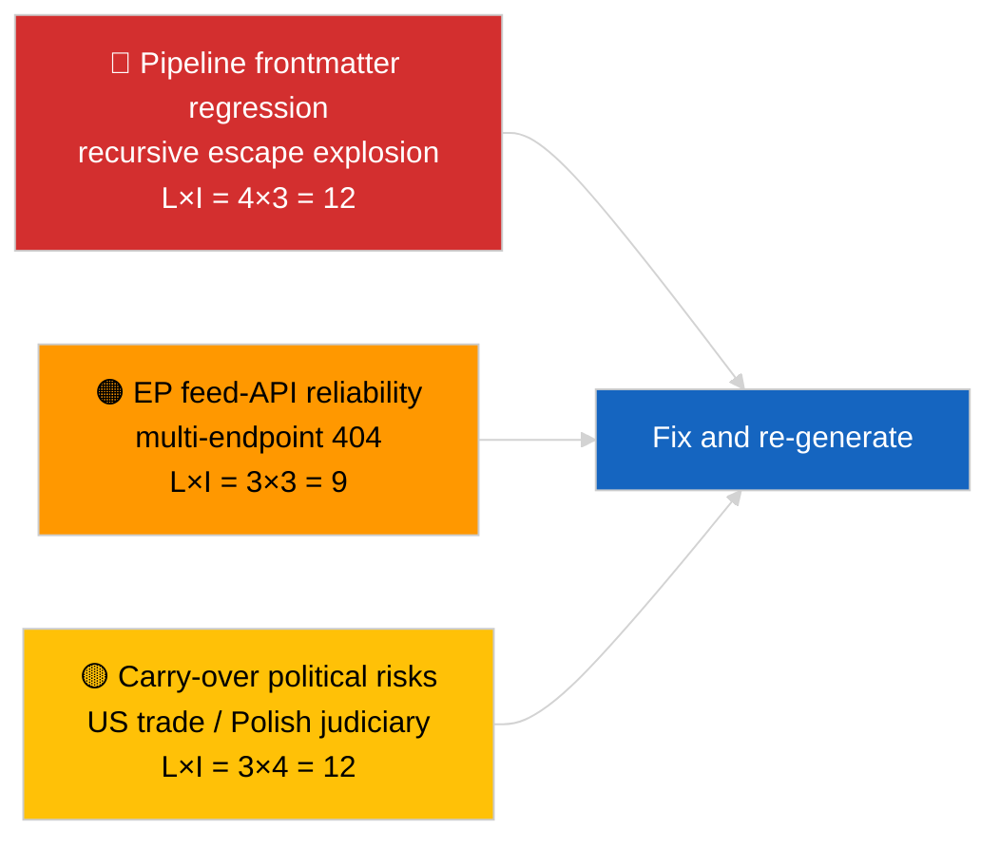

<!-- SPDX-FileCopyrightText: 2026 Hack23 AB -->
<!-- SPDX-License-Identifier: Apache-2.0 -->

# Uitvoerend briefing — Laatste nieuws | 2026-04-02

**Classificatie:** OSINT | Openbaar parlementair document
**Betrouwbaarheidsniveau:** 🟡 Gemiddeld (de frontmatter van het artikel is beschadigd door een geneste escape-regressie; de onderliggende analyse is inhoudelijk substantieel)
**Gegenereerd:** 2026-04-02T00:00:00Z (retrospectief oriëntatiedocument)
**Artikeltype:** Breaking
**Bron:** Open dataportaal van het Europees Parlement

---

## 🎯 BLUF

**Tweede dag na de marsreces; de meest opvallende bevinding is de degradatie van de datapipeline, niet de EP-activiteit.** De YAML-frontmatter van het artikel is beschadigd door recursieve geneste aanhalingstekens-escape-artefacten (de velden `title:` en `description:` bevatten aanhalingstekens-explosie-artefacten), maar de inhoud van de lopende tekst is leesbaar. Inhoudelijk laat de sessie opnieuw minimale nieuwe EP-activiteit zien (onderbrekingsweek 2 van 4), met de overgenomen maarsprioritieiten (US tolltarief TA-10-2026-0096, emissiekortingen voor zware voertuigen TA-10-2026-0084, immuniteit Braun TA-10-2026-0088, vicepresident ECB TA-10-2026-0060) op de observatielijst. Het belangrijkste nieuwe signaal is de frontmatter-corruptieregressie — een datakwaliteitsprobleem dat sessie 2026-04-03/breaking-2 formaliseert als een toegewijde EP-API-betrouwbaarheidsbeoordeling. **🟡 GEMIDDELD betrouwbaarheidsniveau** dat de onderliggende parlementaire activiteit nul is; **🟢 HOOG betrouwbaarheidsniveau** dat de pipeline een slecht geformatteerd frontmatter-artikel heeft uitgestuurd dat gemarkeerd moet worden voor regeneratie.

---

## 🧭 3 beslissingen die dit document ondersteunt

| # | Beslissing | Beslisser | Deadline | Bewijs |
|:-:|-----------|----------|:--------:|--------|
| 1 | **Redactioneel:** dagelijkse berichten OVERSLAAN; artikel markeren voor regeneratie wegens beschadigde frontmatter | Redacteur | +12u | Recursief aanhalingstekenartefact in titel |
| 2 | **Monitoring:** datapipeline-issue openen voor geneste escape-regressie | Datapipeline | +24u | Frontmatter van het artikel |
| 3 | **Vooruitkijkend:** bevestig correctie in sessies van 2026-04-03 | Analyseleider | 2026-04-03 | Frontmatter van de volgende dag |

---

## 📰 60-seconden samenvatting

- 🔴 **Frontmatter-regressie** — Titel- en beschrijvingsvelden bevatten recursieve escape-artefacten (`title: "title: \"title: \\\"…"`). Waarschijnlijk een deterministische renderer-/sitemap-interactie met eerder escaped strings. (🟢 Hoog)
- 🟠 **Onderbrekingsweek 2 van 4** — Het Parlement is in intersessionele pauze; geen plenaire, commissie- of trilogactiviteit verwacht. (🟢 Hoog)
- 🟢 **Marsobservatielijst ongewijzigd** — Amerikaanse douanetarieven, emissies zware voertuigen, immuniteit Braun, vicepresident ECB. (🟢 Hoog)
- 🟡 **Zustersessies:** 2026-04-02/committee-reports / motions / propositions tonen alle identiek lege status — bevestigt systeembrede pauze en feed-API-omstandigheden. (🟢 Hoog)
- 🔵 **Economische context:** De US-EU-handels­trajectorie blijft de dominante externe druksvariabele. (🟢 Hoog)
- 🟣 **Kruisverwijzing:** zie 2026-04-03/breaking-2 voor de formele EP-API-betrouwbaarheidsbeoordeling voortvloeiend uit de anomalie van vandaag. (🟢 Hoog)
- 🩷 **Verstoringsvektor:** Datakwaliteitsregressie is de actieve vector vandaag — geen politieke gebeurtenis. (🟢 Hoog)
- ⚪ **Vooruitblik:** Mercosur HvJ-advies nog in afwachting; agenda aprilplenaire vergadering nog niet gepubliceerd.

---

## 🗂️ Tabel van topdocumenten / procedures

| Rang | EP-referentie | Titel (kort) | Betekenis | Betrouwbaarheid | Status |
|:----:|--------------|-------------|:---------:|:---------------:|--------|
| 1 | — | Geen nieuwe procedures of aangenomen teksten op 2026-04-02 | 0,0 | 🟢 HOOG | Reces — geen activiteit |
| 2 | TA-10-2026-0096 | US tolltarief (overgedragen) | 7,0 | 🟢 HOOG | Aangenomen 26 maart; in de gaten houden |
| 3 | TA-10-2026-0088 | Braun-immuniteitsprecedent (overgedragen) | 6,5 | 🟢 HOOG | Aangenomen 26 maart; LIBE volgt |

---

## ⚠️ Risico- en dreigingsoverzicht

| Risico | L | I | Score | Trigger | Bron | Admiraliteit |
|--------|:-:|:-:|:-----:|---------|------|:------------:|
| Pipeline frontmatter-regressie | 4 | 3 | 12 | Hetzelfde artefact op 2026-04-03 | YAML van het artikel | B2 |
| EP feed-API-betrouwbaarheid | 3 | 3 | 9 | Aanhoudende 404-fouten | Gelijktijdige zustersessies | B2 |
| US-EU handelsvergelding (overgedragen) | 3 | 4 | 12 | US-tegenmaatregel | TA-10-2026-0096 | A1 |
| EP-Poolse rechtsstaatspread (overgedragen) | 4 | 3 | 12 | Nieuwe immuniteitszaken | TA-10-2026-0088 | A1 |

---

## 🔮 Belangrijkste toekomstige trigger

**Sessieserie 2026-04-03** — drie afzonderlijke breaking-sessies die dag (breaking, breaking-2, breaking-3) formaliseren de EP-API-betrouwbaarheidsproblematiek (breaking-2) en consolideren de politieke coalitie-basislijn (breaking-1 en breaking-3). Vergelijk de slecht geformatteerde frontmatter-output van vandaag met die sessies om te bevestigen of de pipeline-regressie terugkerend of geïsoleerd is.

---

## 🛡️ Beoordeling van de bronkwaliteit

- **Primaire bronnen:** Open dataportaal van het EP — analysesessie (sessie-ID niet herstelbaar uit beschadigde frontmatter); lopende-tekstinhoud consistent met zustersessies voor 2026-04-02.
- **Databeperkingen:** Frontmatter is structureel beschadigd; downstream renderers/SEO-consumenten zullen deze sessie fout verwerken. Corrigerende maatregel: opnieuw uitvoeren met renderer-fix.
- **Betrouwbaarheid voor EP-zijdig nultoestand:** 🟢 HOOG.
- **Betrouwbaarheid voor pipeline-regressie:** 🟢 HOOG.

---

## 📎 Links

| Link | Pad |
|------|-----|
| Artikel (met beschadigde frontmatter) | `./article.md` |
| Manifest | `./manifest.json` |
| Zustersessies | `analysis/daily/2026-04-02/committee-reports/`, `motions/`, `propositions/` |
| Vervolgactie | `analysis/daily/2026-04-03/breaking-2/` (formele EP-API-betrouwbaarheidsbeoordeling) |

---

## 🔄 Kruisverwijzing

**Voorgaande:** 2026-04-01/breaking documenteerde het 6/8 adviessfeeds-404-patroon.
**Parallel:** 2026-04-02/committee-reports / motions / propositions alle lege sjablonen.
**Volgend:** 2026-04-03/breaking-2 escaleert de pipeline-betrouwbaarheidsproblematiek naar een toegewijde sessie.

---

**Documentbeheer**
- **Sjabloon:** `/analysis/templates/executive-brief.md`
- **Artefactpad:** `analysis/daily/2026-04-02/breaking/executive-brief.md`
- **Classificatie:** Openbaar
- **Retrospectieve generatie:** Backfill-sessie; dit document vervangt de BLUF-functie van het onbruikbare artikel met beschadigde frontmatter.
